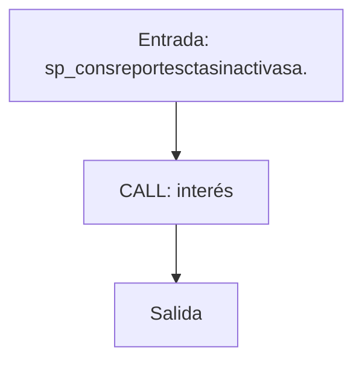
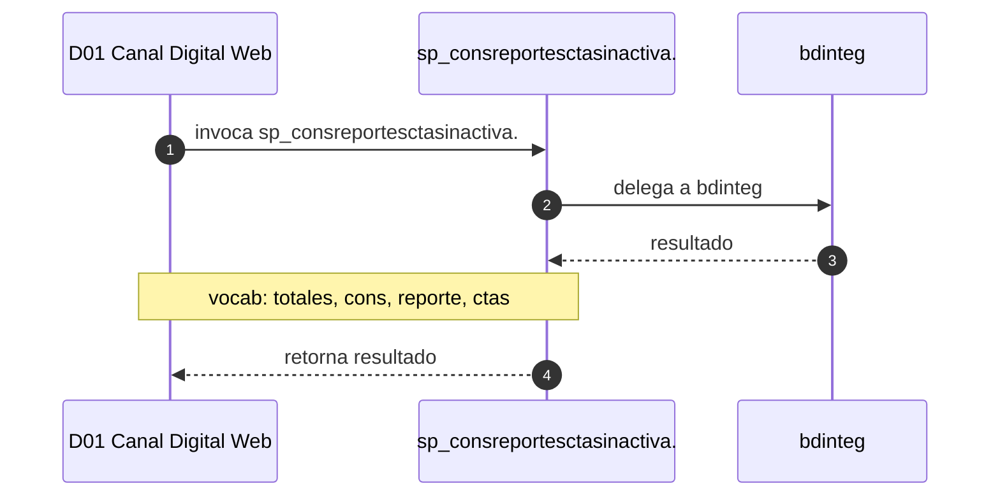

# SP Profile: `sp_consreportesctasinactivasart61_totales`

> **Base de datos**: `bdicnweb` · Dominio D01 — Canal Digital Web
> **Tipo de artefacto**: Perfil funcional · Gemelo Cognitivo — Capa 4: Intencion
> **Ultima actualizacion**: 2026-08-03
> **Estado**: ACTIVO · 0 callers en produccion

---

## Historia Funcional

El SP `sp_consreportesctasinactivasart61_totales` implementa la logica de consulta reportes cuentas inactivas (totales) · Art. 61 LIC en el dominio Canal Digital Web (base de datos `bdicnweb`). Comprende 49,912 lineas de codigo, 1 tablas consultadas. Delega logica a: `bdinteg`.

---

## Relaciones en la KB

| Tipo de relacion | Documento |
|-----------------|-----------|
| Cross-reference de reglas y vocabulario | [../cross-reference/sp-rules-vocab-map.md](../cross-reference/sp-rules-vocab-map.md) |
| Dependencias del dominio D01 | [../D01-bdicnweb/07-dependencies.md](../D01-bdicnweb/07-dependencies.md) |
| Reglas globales del sistema | [../rules/business-rules-bcop.md](../rules/business-rules-bcop.md) |
| Vocabulario del sistema | [../vocabulary/vocabulary-knowledge-base-bcop.md](../vocabulary/vocabulary-knowledge-base-bcop.md) |
| Vista HTML interactiva | [../../portal/sp-detail/sp-detail-sp_consreportesctasinactivasart61_totales.html](../../portal/sp-detail/sp-detail-sp_consreportesctasinactivasart61_totales.html) |

---

## Metricas del Gemelo Cognitivo

| Metrica | Valor |
|---------|-------|
| Fan-in (callers) | **0** |
| Fan-out (callees) | **124** |
| Callees principales | `bdinteg` |
| LOC | **49,912** |
| Tablas consultadas | 1 |
| Reglas de negocio activas | **0** |
| Autores historicos | 0 |

---

## Flujo de Decision

---

## Diagrama de Secuencia con Reglas y Vocabulario

---

## Reglas de Negocio Activas

_No se detectaron reglas de negocio para este proceso._

---

## Vocabulario Clave

| Termino | Categoria | Nivel | Significado |
|---------|-----------|-------|-------------|
| `totales` | MODIF | ALTA | totales |
| `cons` | ACCION | ALTA | consulta |
| `reporte` | ENTIDAD | ALTA | reporte |
| `ctas` | ENTIDAD | ALTA | cuentas |
| `total` | MODIF | ALTA | total |
| `reportes` | ENTIDAD | ALTA | reportes |
| `consreportes` | ACCION | ALTA | consulta reportes |
| `art61` | REG | ALTA | Art. 61 LIC (cuentas inactivas cuyos saldos, tras años sin movimiento, prescriben a favor de la beneficencia pública) |

---

## Nota de Migracion

Sin restricciones regulatorias criticas identificadas en el codigo fuente. Verificar en parallel-run que el comportamiento sea equivalente al del sistema legado.

Ver registro completo de riesgos: [migration-risk-register.md](../migration-risk-register.md).
