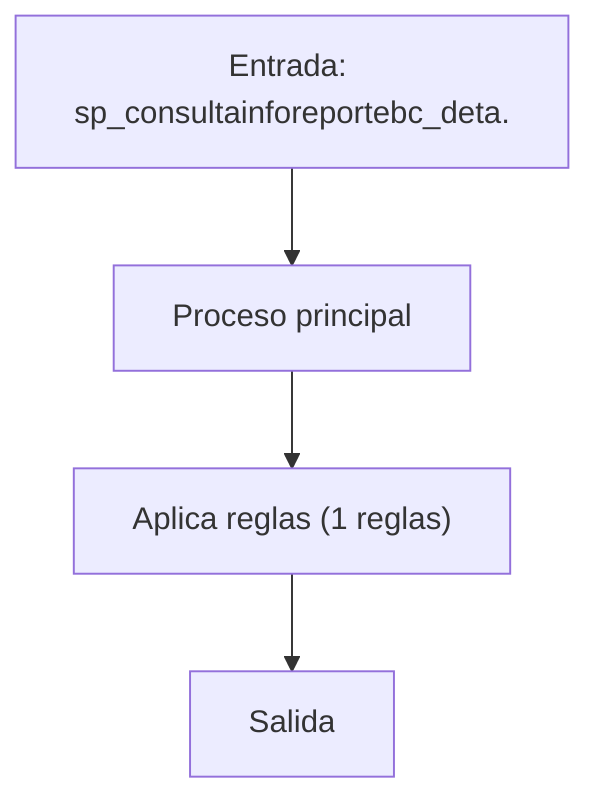
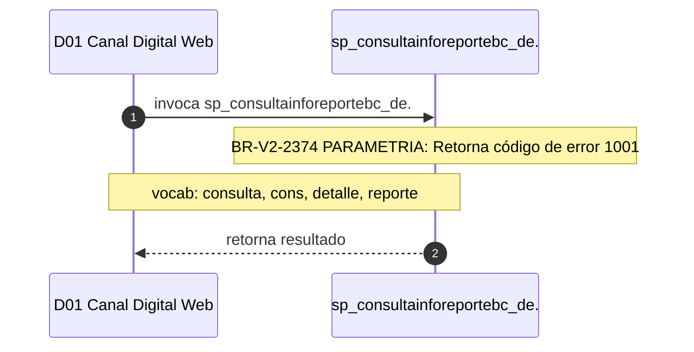

# SP Profile: `sp_consultainforeportebc_detalleconsultas`

> **Base de datos**: `bdicnweb` · Dominio D01 — Canal Digital Web
> **Tipo de artefacto**: Perfil funcional · Gemelo Cognitivo — Capa 4: Intencion
> **Ultima actualizacion**: 2026-08-03
> **Estado**: ACTIVO · 0 callers en produccion

---

## Historia Funcional

El SP `sp_consultainforeportebc_detalleconsultas` implementa la logica de consulta información, reporte y detalle en el dominio Canal Digital Web (base de datos `bdicnweb`). Comprende 50,524 lineas de codigo, 1 tablas consultadas. 

---

## Relaciones en la KB

| Tipo de relacion | Documento |
|-----------------|-----------|
| Cross-reference de reglas y vocabulario | [../cross-reference/sp-rules-vocab-map.md](../cross-reference/sp-rules-vocab-map.md) |
| Dependencias del dominio D01 | [../D01-bdicnweb/07-dependencies.md](../D01-bdicnweb/07-dependencies.md) |
| Reglas globales del sistema | [../rules/business-rules-bcop.md](../rules/business-rules-bcop.md) |
| Vocabulario del sistema | [../vocabulary/vocabulary-knowledge-base-bcop.md](../vocabulary/vocabulary-knowledge-base-bcop.md) |
| Vista HTML interactiva | [../../portal/sp-detail/sp-detail-sp_consultainforeportebc_detalleconsultas.html](../../portal/sp-detail/sp-detail-sp_consultainforeportebc_detalleconsultas.html) |

---

## Metricas del Gemelo Cognitivo

| Metrica | Valor |
|---------|-------|
| Fan-in (callers) | **0** |
| Fan-out (callees) | **124** |
| Callees principales | — |
| LOC | **50,524** |
| Tablas consultadas | 1 |
| Reglas de negocio activas | **1** |
| Autores historicos | 0 |

---

## Flujo de Decision

---

## Diagrama de Secuencia con Reglas y Vocabulario

---

## Reglas de Negocio Activas

| ID | Tipo | Categoria | Linea | Codigo | Referencia |
|----|------|-----------|-------|--------|------------|
| BR-V2-2374 | VALIDACIÓN | PARAMETRIA | 91 | `LET cCodRet = '1001'` | — |

---

## Vocabulario Clave

| Termino | Categoria | Nivel | Significado |
|---------|-----------|-------|-------------|
| `consulta` | ACCION | ALTA | consulta / lee |
| `cons` | ACCION | ALTA | consulta |
| `detalle` | ENTIDAD | ALTA | detalle |
| `reporte` | ENTIDAD | ALTA | reporte |
| `info` | ENTIDAD | ALTA | información |

---

## Nota de Migracion

El nombre contiene tokens sinteticos (`?bc_`, `?s`), lo que indica que el alcance original fue parcialmente documentado por el equipo historico.

Ver registro completo de riesgos: [migration-risk-register.md](../migration-risk-register.md).
