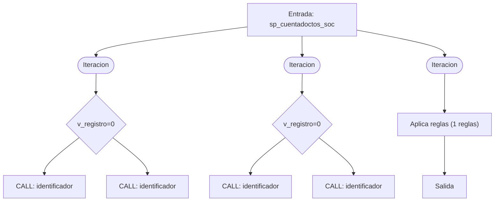
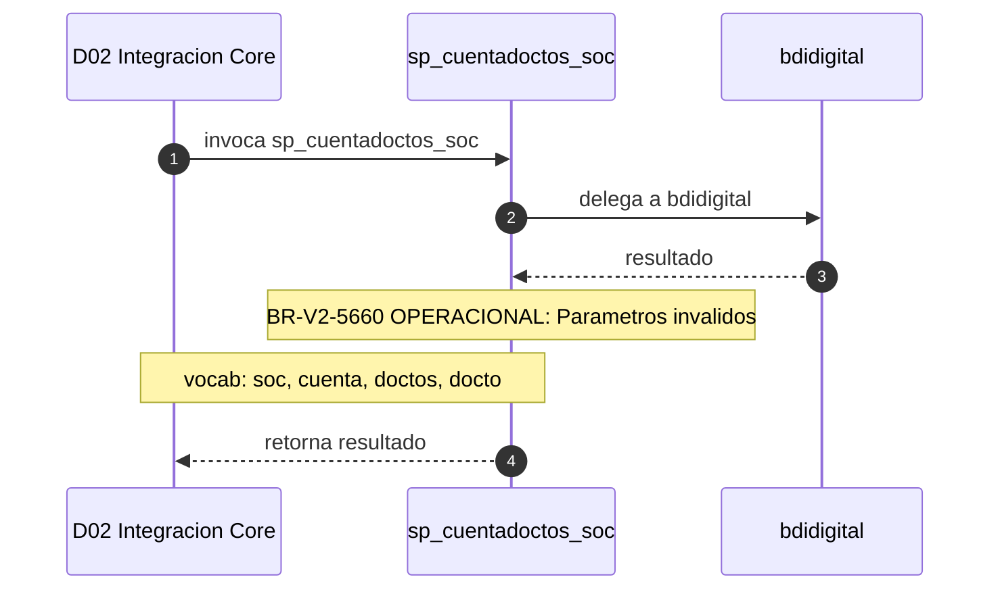

# SP Profile: `sp_cuentadoctos_soc`

> **Base de datos**: `bdinteg` · Dominio D02 — Integracion Core
> **Tipo de artefacto**: Perfil funcional · Gemelo Cognitivo — Capa 4: Intencion
> **Ultima actualizacion**: 2026-08-03
> **Estado**: ACTIVO · 354 callers en produccion

---

## Historia Funcional

El SP `sp_cuentadoctos_soc` implementa la logica de cuenta, documentos y Sistema Operativo Central en el dominio Integracion Core (base de datos `bdinteg`). Comprende 656 lineas de codigo, 7 tablas consultadas. Es invocado por 354 callers en el sistema, lo que lo convierte en un componente de alta dependencia. Delega logica a: `bdidigital`.

---

## Relaciones en la KB

| Tipo de relacion | Documento |
|-----------------|-----------|
| Cross-reference de reglas y vocabulario | [../cross-reference/sp-rules-vocab-map.md](../cross-reference/sp-rules-vocab-map.md) |
| Dependencias del dominio D02 | [../D02-bdinteg/07-dependencies.md](../D02-bdinteg/07-dependencies.md) |
| Reglas globales del sistema | [../rules/business-rules-bcop.md](../rules/business-rules-bcop.md) |
| Vocabulario del sistema | [../vocabulary/vocabulary-knowledge-base-bcop.md](../vocabulary/vocabulary-knowledge-base-bcop.md) |
| Vista HTML interactiva | [../../portal/sp-detail/sp-detail-sp_cuentadoctos_soc.html](../../portal/sp-detail/sp-detail-sp_cuentadoctos_soc.html) |

---

## Metricas del Gemelo Cognitivo

| Metrica | Valor |
|---------|-------|
| Fan-in (callers) | **354** |
| Fan-out (callees) | **2** |
| Callees principales | `bdidigital` |
| LOC | **656** |
| Tablas consultadas | 7 |
| Reglas de negocio activas | **1** |
| Autores historicos | 0 |

---

## Flujo de Decision

---

## Diagrama de Secuencia con Reglas y Vocabulario

---

## Reglas de Negocio Activas

| ID | Tipo | Categoria | Linea | Codigo | Referencia |
|----|------|-----------|-------|--------|------------|
| BR-V2-5660 | VALIDACIÓN | OPERACIONAL | 51 | `LET vc_CodRet = "99999"` | — |

---

## Vocabulario Clave

| Termino | Categoria | Nivel | Significado |
|---------|-----------|-------|-------------|
| `soc` | ENTIDAD | ALTA | Sistema Operativo Central (SOC) — confirmado SME |
| `cuenta` | ENTIDAD | ALTA | cuenta |
| `doctos` | ENTIDAD | ALTA | documentos |
| `docto` | ENTIDAD | ALTA | documento |

---

## Nota de Migracion

Sin restricciones regulatorias criticas identificadas en el codigo fuente. Verificar en parallel-run que el comportamiento sea equivalente al del sistema legado.

Ver registro completo de riesgos: [migration-risk-register.md](../migration-risk-register.md).
