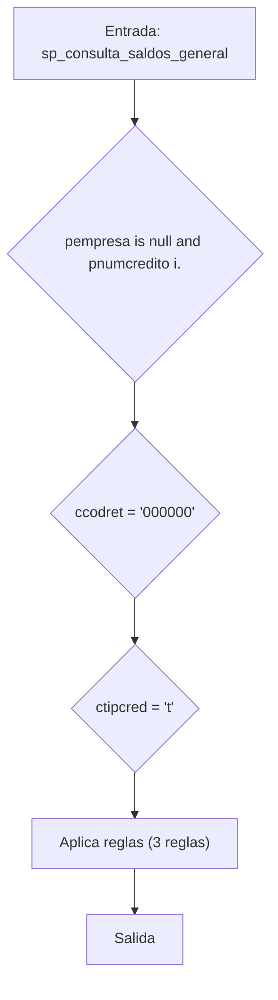
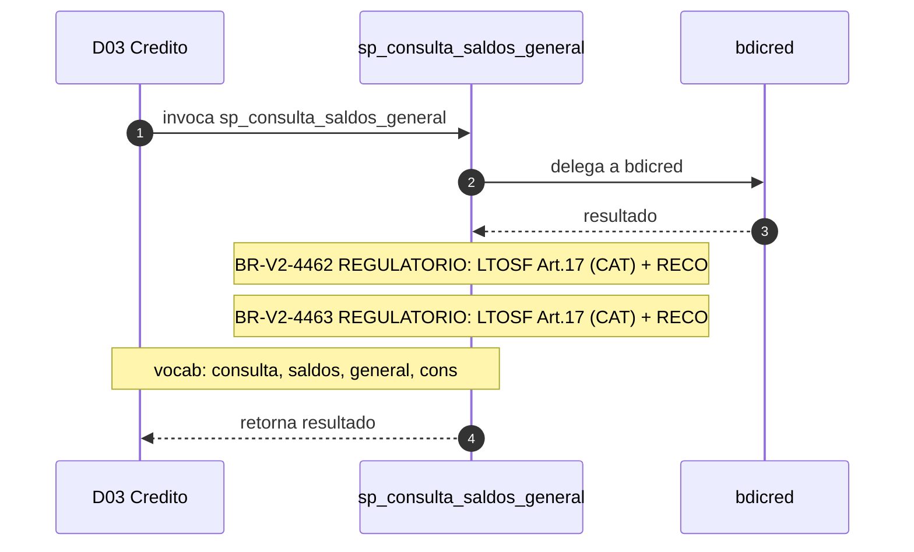

# SP Profile: `sp_consulta_saldos_general`

> **Base de datos**: `bdicred` · Dominio D03 — Credito
> **Tipo de artefacto**: Perfil funcional · Gemelo Cognitivo — Capa 4: Intencion
> **Ultima actualizacion**: 2026-08-03
> **Estado**: ACTIVO · 435 callers en produccion

---

## Historia Funcional

El SP `sp_consulta_saldos_general` implementa la logica de consulta saldos (general) en el dominio Credito (base de datos `bdicred`). Comprende 815 lineas de codigo, 20 tablas consultadas, 4 autores historicos. Es invocado por 435 callers en el sistema, lo que lo convierte en un componente de alta dependencia. Delega logica a: `bdicred`.

---

## Relaciones en la KB

| Tipo de relacion | Documento |
|-----------------|-----------|
| Cross-reference de reglas y vocabulario | [../cross-reference/sp-rules-vocab-map.md](../cross-reference/sp-rules-vocab-map.md) |
| Dependencias del dominio D03 | [../D03-bdicred/07-dependencies.md](../D03-bdicred/07-dependencies.md) |
| Reglas globales del sistema | [../rules/business-rules-bcop.md](../rules/business-rules-bcop.md) |
| Vocabulario del sistema | [../vocabulary/vocabulary-knowledge-base-bcop.md](../vocabulary/vocabulary-knowledge-base-bcop.md) |
| Vista HTML interactiva | [../../portal/sp-detail/sp-detail-sp_consulta_saldos_general.html](../../portal/sp-detail/sp-detail-sp_consulta_saldos_general.html) |

---

## Metricas del Gemelo Cognitivo

| Metrica | Valor |
|---------|-------|
| Fan-in (callers) | **435** |
| Fan-out (callees) | **4** |
| Callees principales | `bdicred` |
| LOC | **815** |
| Tablas consultadas | 20 |
| Reglas de negocio activas | **3** |
| Autores historicos | 4 |

---

## Flujo de Decision

---

## Diagrama de Secuencia con Reglas y Vocabulario

---

## Reglas de Negocio Activas

| ID | Tipo | Categoria | Linea | Codigo | Referencia |
|----|------|-----------|-------|--------|------------|
| BR-V2-4462 | FÓRMULA | REGULATORIO | 507 | `dComPend = dSdoActCap * dFactorComision` | LTOSF Art.17 (CAT) + RECO — comisión debe estar registrada en CONDUSEF |
| BR-V2-4463 | FÓRMULA | REGULATORIO | 509 | `dComPend = dLineaOtorgada * dFactorComision` | LTOSF Art.17 (CAT) + RECO — comisión debe estar registrada en CONDUSEF |
| BR-V2-4464 | FÓRMULA | CALCULO_FINANCIERO | 511 | `dIvaCom = dComPend * dIvaSuc` | — |

---

## Vocabulario Clave

| Termino | Categoria | Nivel | Significado |
|---------|-----------|-------|-------------|
| `consulta` | ACCION | ALTA | consulta / lee |
| `saldos` | ENTIDAD | ALTA | saldos |
| `general` | MODIF | ALTA | general |
| `cons` | ACCION | ALTA | consulta |
| `genera` | ACCION | ALTA | genera / produce |
| `saldo` | ENTIDAD | ALTA | saldo |

---

## Nota de Migracion

Las 2 reglas con categoria REGULATORIO son las mas sensibles en la migracion y deben ser validadas por el SME de Industry Banking Accounting contra el CUB vigente.

Ver registro completo de riesgos: [migration-risk-register.md](../migration-risk-register.md).
