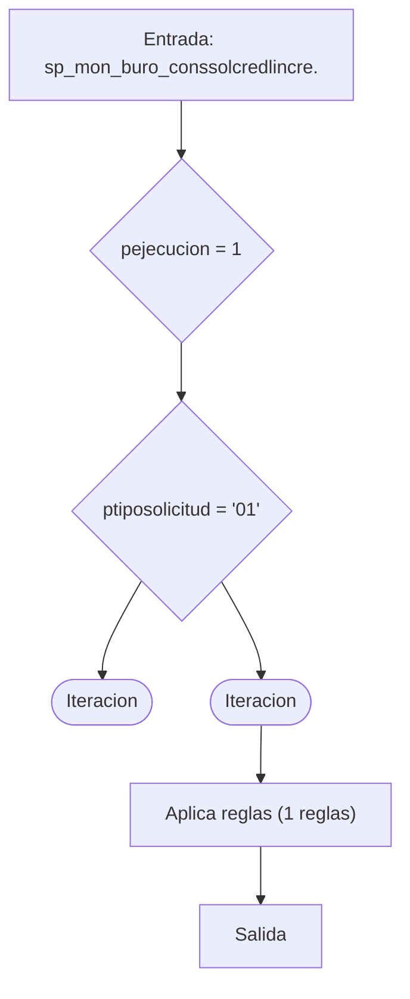
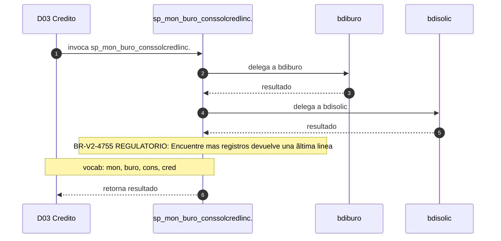

# SP Profile: `sp_mon_buro_conssolcredlincred2`

> **Base de datos**: `bdicred` · Dominio D03 — Credito
> **Tipo de artefacto**: Perfil funcional · Gemelo Cognitivo — Capa 4: Intencion
> **Ultima actualizacion**: 2026-08-03
> **Estado**: ACTIVO · 325 callers en produccion

---

## Historia Funcional

El SP `sp_mon_buro_conssolcredlincred2` implementa la logica de consulta Buró de Crédito, solicitud, crédito y línea de crédito en el dominio Credito (base de datos `bdicred`). Comprende 2,622 lineas de codigo, 18 tablas consultadas. Es invocado por 325 callers en el sistema, lo que lo convierte en un componente de alta dependencia. Delega logica a: `bdiburo`, `bdisolic`.

---

## Relaciones en la KB

| Tipo de relacion | Documento |
|-----------------|-----------|
| Cross-reference de reglas y vocabulario | [../cross-reference/sp-rules-vocab-map.md](../cross-reference/sp-rules-vocab-map.md) |
| Dependencias del dominio D03 | [../D03-bdicred/07-dependencies.md](../D03-bdicred/07-dependencies.md) |
| Reglas globales del sistema | [../rules/business-rules-bcop.md](../rules/business-rules-bcop.md) |
| Vocabulario del sistema | [../vocabulary/vocabulary-knowledge-base-bcop.md](../vocabulary/vocabulary-knowledge-base-bcop.md) |
| Vista HTML interactiva | [../../portal/sp-detail/sp-detail-sp_mon_buro_conssolcredlincred2.html](../../portal/sp-detail/sp-detail-sp_mon_buro_conssolcredlincred2.html) |

---

## Metricas del Gemelo Cognitivo

| Metrica | Valor |
|---------|-------|
| Fan-in (callers) | **325** |
| Fan-out (callees) | **6** |
| Callees principales | `bdiburo`, `bdisolic` |
| LOC | **2,622** |
| Tablas consultadas | 18 |
| Reglas de negocio activas | **1** |
| Autores historicos | 0 |

---

## Flujo de Decision

---

## Diagrama de Secuencia con Reglas y Vocabulario

---

## Reglas de Negocio Activas

| ID | Tipo | Categoria | Linea | Codigo | Referencia |
|----|------|-----------|-------|--------|------------|
| BR-V2-4755 | VALIDACIÓN | REGULATORIO | 641 | `LET cCodret = 'TOTAL'` | LRSIC — Buró de Crédito; evaluación crediticia |

---

## Vocabulario Clave

| Termino | Categoria | Nivel | Significado |
|---------|-----------|-------|-------------|
| `mon` | PREFIJO | MEDIA | monitor / módulo |
| `buro` | ENTIDAD | ALTA | Buró de Crédito |
| `cons` | ACCION | ALTA | consulta |
| `cred` | ENTIDAD | ALTA | crédito |
| `lincred` | ENTIDAD | ALTA | línea de crédito |

---

## Nota de Migracion

Las 1 reglas con categoria REGULATORIO son las mas sensibles en la migracion y deben ser validadas por el SME de Industry Banking Accounting contra el CUB vigente.
El nombre contiene tokens sinteticos (`?2`), lo que indica que el alcance original fue parcialmente documentado por el equipo historico.

Ver registro completo de riesgos: [migration-risk-register.md](../migration-risk-register.md).
