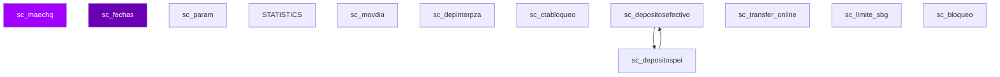

# D04 · Cheques / Cuentas — Modelo Entidad-Relación (Inferido)

> **Componente:** Informix · SPE-AM-001 · Etapa 1
> **Base de datos:** `bdicheq` · IBM Informix IDS 14.10 / POWER-AIX
> **Wave:** Wave 4 · Riesgo: **CRÍTICO**
> **Última actualización:** 2026-07-03

---
**SME responsable:**
- Specialist — Informix SPL Analysis (análisis estático, code extraction)
- DBA — IBM Informix IDS (schema real vía syscolumns — Etapa 2) ← NUEVO
- Industry Banking + Domain Expert BanCoppel (validación funcional)
- Cybersecurity (riesgos PII, regulación CNBV/LFPDPPP)
- QA Lead — Equivalencia Funcional (estrategia de pruebas) ← NUEVO
- Cloud Architect AWS Banking (arquitectura target) ← NUEVO
> [SME-PENDING] = requiere sesión de validación antes de Etapa 2.
---

## Metodología

Tablas inferidas de análisis estático de **70 archivos SQL** (`FROM`, `INSERT INTO`, `UPDATE`, `DELETE FROM`).
Columnas inferidas de listas `INSERT INTO tbl (col1, col2, ...)`.
Relaciones inferidas del conocimiento de dominio — Informix no declara `FOREIGN KEY` formalmente.

## Diagrama ER — tablas core (Mermaid)



> Renderizable en GitHub o VSCode con extensión Mermaid Preview.

## Inventario de entidades propias de `bdicheq` (muestra)

| Tabla | Tipo | PK inferida | Lectores | Escritores |
|-------|------|-------------|----------|------------|
| `sc_maechq` | Maestro | `[SME-PENDING]` | 33 | 17 |
| `sc_fechas` | Transaccional | `[SME-PENDING]` | 26 | 0 |
| `sc_param` | Catálogo / Config | `[SME-PENDING]` | 9 | 12 |
| `STATISTICS` | Transaccional | `[SME-PENDING]` | 0 | 16 |
| `sc_movdia` | Transaccional | `[SME-PENDING]` | 5 | 9 |
| `sc_depinterpza` | Transaccional | `[SME-PENDING]` | 6 | 4 |
| `sc_ctabloqueo` | Transaccional | `[SME-PENDING]` | 6 | 2 |
| `sc_depositosefectivo` | Transaccional | `[SME-PENDING]` | 4 | 4 |
| `sc_depositospei` | Transaccional | `clave_rastreo` | 5 | 3 |
| `sc_transfer_online` | Transaccional | `[SME-PENDING]` | 4 | 4 |
| `sc_limite_sbg` | Transaccional | `[SME-PENDING]` | 4 | 4 |
| `sc_bloqueo` | Transaccional | `[SME-PENDING]` | 7 | 0 |
| `sc_tarjeta` | Transaccional | `num_tarjeta` | 6 | 1 |
| `sc_maenoc` | Maestro | `[SME-PENDING]` | 2 | 4 |
| `sc_acummesctanvl2` | Transaccional | `[SME-PENDING]` | 3 | 3 |
| `sc_transcomis` | Transaccional | `[SME-PENDING]` | 6 | 0 |
| `sc_movhis` | Transaccional | `[SME-PENDING]` | 5 | 0 |
| `sc_sdodiarioc` | Transaccional | `[SME-PENDING]` | 3 | 2 |
| `sc_producto` | Transaccional | `[SME-PENDING]` | 5 | 0 |
| `sc_sdomensualc` | Transaccional | `[SME-PENDING]` | 3 | 1 |
| `sc_detcomis` | Transaccional | `[SME-PENDING]` | 4 | 0 |
| `sc_docret_sbc` | Transaccional | `[SME-PENDING]` | 4 | 0 |
| `sc_premio` | Transaccional | `[SME-PENDING]` | 0 | 4 |
| `sc_maeinstrucc` | Maestro | `[SME-PENDING]` | 3 | 1 |
| `sc_docret` | Transaccional | `[SME-PENDING]` | 4 | 0 |
| `Nomi_tmp_secuencia_bpi` | Reportería / Temporal | `[SME-PENDING]` | 2 | 2 |
| `nomi_tmp_bpi` | Reportería / Temporal | `[SME-PENDING]` | 2 | 2 |
| `sc_piepagina_edocta_factelect` | Transaccional | `[SME-PENDING]` | 1 | 2 |
| `sc_contch` | Transaccional | `[SME-PENDING]` | 2 | 1 |
| `sc_sdotrimestralc` | Transaccional | `[SME-PENDING]` | 1 | 2 |
| `sc_transacc_exentas_limprod` | Transaccional | `[SME-PENDING]` | 3 | 0 |
| `sc_transacc_cub` | Transaccional | `[SME-PENDING]` | 3 | 0 |
| `sc_limitedeposito` | Transaccional | `[SME-PENDING]` | 3 | 0 |
| `sc_transaccs_no_permitidas_reten_cob_auto` | Transaccional | `[SME-PENDING]` | 3 | 0 |
| `sc_limites_producto` | Transaccional | `[SME-PENDING]` | 3 | 0 |

## Tablas externas accedidas (cross-DB)

| DB externa | Tabla | Lecturas | Escrituras | Notas |
|-----------|-------|----------|-----------|-------|
| `BDICHEQ` | `sc_tarjeta` | 1 SPs | 0 SPs | Cross-DB → API interna en target |
| `BDICHEQ` | `sc_param` | 1 SPs | 0 SPs | Cross-DB → API interna en target |
| `BDICHEQ` | `sc_portacec_solicitud` | 1 SPs | 0 SPs | Cross-DB → API interna en target |
| `BDICHEQ` | `` | 1 SPs | 0 SPs | Cross-DB → API interna en target |
| `BDICHEQ` | `sc_portaarchtemp` | 1 SPs | 1 SPs | Cross-DB → API interna en target |
| `BDICRED` | `sd_maecred` | 1 SPs | 0 SPs | Cross-DB → API interna en target |
| `BDICRED` | `sd_maecredcrd` | 1 SPs | 0 SPs | Cross-DB → API interna en target |
| `BDINTEG` | `si_telefonos_actual` | 1 SPs | 0 SPs | Cross-DB → API interna en target |
| `bdiaclaracion` | `acl_aclaracion` | 4 SPs | 0 SPs | Cross-DB → API interna en target |
| `bdicheq` | `sc_nominamovimientos_bpi` | 1 SPs | 1 SPs | Cross-DB → API interna en target |
| `bdicheq` | `sc_fechas` | 5 SPs | 0 SPs | Cross-DB → API interna en target |
| `bdicheq` | `sc_tarjeta` | 4 SPs | 0 SPs | Cross-DB → API interna en target |
| `bdicheq` | `sc_maechq` | 8 SPs | 3 SPs | Cross-DB → API interna en target |
| `bdicheq` | `sc_nominaempresas` | 1 SPs | 0 SPs | Cross-DB → API interna en target |
| `bdicntchq` | `sq_param` | 1 SPs | 0 SPs | Cross-DB → API interna en target |
| `bdicred` | `sd_ctascarg` | 1 SPs | 0 SPs | Cross-DB → API interna en target |
| `bdicred` | `sd_maesdos` | 1 SPs | 0 SPs | Cross-DB → API interna en target |
| `bdicred` | `` | 3 SPs | 0 SPs | Cross-DB → API interna en target |
| `bdiedoelec` | `` | 1 SPs | 0 SPs | Cross-DB → API interna en target |
| `bdinteg` | `` | 13 SPs | 0 SPs | Cross-DB → API interna en target |
| `bdinteg` | `si_cliente` | 12 SPs | 0 SPs | Cross-DB → API interna en target |
| `bdinteg` | `si_param` | 2 SPs | 0 SPs | Cross-DB → API interna en target |
| `bdinteg` | `si_ingresos` | 1 SPs | 0 SPs | Cross-DB → API interna en target |
| `bdinteg` | `si_bpiusuarios` | 1 SPs | 0 SPs | Cross-DB → API interna en target |
| `bdinvers` | `sv_gat` | 1 SPs | 0 SPs | Cross-DB → API interna en target |
| `bdinvers` | `sv_maeinv` | 1 SPs | 0 SPs | Cross-DB → API interna en target |
| `bdisac` | `sac_movimientos` | 3 SPs | 0 SPs | Cross-DB → API interna en target |
| `bdisolic` | `ss_prestamoscoppel` | 1 SPs | 0 SPs | Cross-DB → API interna en target |
| `bdisolic` | `ss_adn_solicitudcuenta` | 1 SPs | 0 SPs | Cross-DB → API interna en target |
| `bdispei` | `tblparametros` | 5 SPs | 0 SPs | Cross-DB → API interna en target |
| `bdispei` | `` | 1 SPs | 0 SPs | Cross-DB → API interna en target |
| `bditransfer` | `tf_maecte` | 3 SPs | 0 SPs | Cross-DB → API interna en target |
| `sysmaster` | `systabnames` | 12 SPs | 0 SPs | Cross-DB → API interna en target |
| `sysmaster` | `` | 2 SPs | 0 SPs | Cross-DB → API interna en target |

## Detalle de columnas — tablas con columnas inferidas

### `sc_encabezado_edocta_factelect` — Transaccional

| Columna | Tipo Informix | Tipo PostgreSQL target | PII |
|---------|--------------|----------------------|-----|
| `ciudad_suc` | [SME-PENDING] | [SME-PENDING] |  |
| `clabe` | [SME-PENDING] | [SME-PENDING] |  |
| `confirmacion` | [SME-PENDING] | [SME-PENDING] |  |
| `correo` | VARCHAR(80) | VARCHAR(80) | ⚠️ PII |
| `cp` | [SME-PENDING] | [SME-PENDING] |  |
| `curp` | [SME-PENDING] | [SME-PENDING] | ⚠️ PII |
| `cve_ahorro` | [SME-PENDING] | [SME-PENDING] |  |
| `cve_ruta` | [SME-PENDING] | [SME-PENDING] |  |
| `direccion_col` | [SME-PENDING] | [SME-PENDING] | ⚠️ PII |
| `direccion_cte` | [SME-PENDING] | [SME-PENDING] | ⚠️ PII |
| `direccion_del` | [SME-PENDING] | [SME-PENDING] | ⚠️ PII |
| `edo_cd` | [SME-PENDING] | [SME-PENDING] |  |
| `fecha_emision` | DATE | DATE |  |
| `fechaalta` | DATE | DATE |  |
| `fechafinal` | DATE | DATE |  |

### `sc_encabezado_edocta_factelect_old` — Transaccional

| Columna | Tipo Informix | Tipo PostgreSQL target | PII |
|---------|--------------|----------------------|-----|
| `ciudad_suc` | [SME-PENDING] | [SME-PENDING] |  |
| `clabe` | [SME-PENDING] | [SME-PENDING] |  |
| `confirmacion` | [SME-PENDING] | [SME-PENDING] |  |
| `correo` | VARCHAR(80) | VARCHAR(80) | ⚠️ PII |
| `cp` | [SME-PENDING] | [SME-PENDING] |  |
| `curp` | [SME-PENDING] | [SME-PENDING] | ⚠️ PII |
| `cve_ahorro` | [SME-PENDING] | [SME-PENDING] |  |
| `cve_ruta` | [SME-PENDING] | [SME-PENDING] |  |
| `direccion_col` | [SME-PENDING] | [SME-PENDING] | ⚠️ PII |
| `direccion_cte` | [SME-PENDING] | [SME-PENDING] | ⚠️ PII |
| `direccion_del` | [SME-PENDING] | [SME-PENDING] | ⚠️ PII |
| `edo_cd` | [SME-PENDING] | [SME-PENDING] |  |
| `fecha_emision` | DATE | DATE |  |
| `fechaalta` | DATE | DATE |  |
| `fechafinal` | DATE | DATE |  |

### `sc_portacec_solicitud` — Transaccional

| Columna | Tipo Informix | Tipo PostgreSQL target | PII |
|---------|--------------|----------------------|-----|
| `bco_ordenante` | [SME-PENDING] | [SME-PENDING] |  |
| `bco_receptor` | [SME-PENDING] | [SME-PENDING] |  |
| `clave_origen` | CHAR(4) | CHAR(4) |  |
| `clave_sentido` | CHAR(4) | CHAR(4) |  |
| `cod_operacion` | CHAR(4) | CHAR(4) |  |
| `cta_ordenante` | [SME-PENDING] | [SME-PENDING] |  |
| `cta_receptora` | [SME-PENDING] | [SME-PENDING] |  |
| `empresa` | [SME-PENDING] | [SME-PENDING] |  |
| `estatus_cecoban` | CHAR(4) | CHAR(4) |  |
| `estatus_portabilidad` | CHAR(4) | CHAR(4) |  |
| `estatus_respuesta` | CHAR(4) | CHAR(4) |  |
| `fecha_estatus_cecoban` | DATE | DATE |  |
| `fecha_estatus_portabilidad` | DATE | DATE |  |
| `fecha_presentacion` | DATE | DATE |  |
| `fecha_respuesta` | DATE | DATE |  |

### `sc_riesgoscap` — Transaccional

| Columna | Tipo Informix | Tipo PostgreSQL target | PII |
|---------|--------------|----------------------|-----|
| `actividad` | [SME-PENDING] | [SME-PENDING] |  |
| `anioshab` | [SME-PENDING] | [SME-PENDING] |  |
| `ciudad` | [SME-PENDING] | [SME-PENDING] |  |
| `cuenta` | [SME-PENDING] | [SME-PENDING] |  |
| `dependientes` | [SME-PENDING] | [SME-PENDING] |  |
| `edocivil` | [SME-PENDING] | [SME-PENDING] |  |
| `empresa` | [SME-PENDING] | [SME-PENDING] |  |
| `fecaltacte` | [SME-PENDING] | [SME-PENDING] |  |
| `fecha` | DATE | DATE |  |
| `fechaaniv` | DATE | DATE |  |
| `numcte` | [SME-PENDING] | [SME-PENDING] |  |
| `ocupacion` | [SME-PENDING] | [SME-PENDING] |  |
| `plaza` | [SME-PENDING] | [SME-PENDING] |  |
| `primermov` | [SME-PENDING] | [SME-PENDING] |  |
| `producto` | [SME-PENDING] | [SME-PENDING] |  |

## Tablas core del dominio (conocimiento de dominio)

| Tabla | Tipo esperado | Notas |
|-------|--------------|-------|
| `sc_maechq` | Maestro | Confirmar existencia y esquema con DBA |
| `sc_movimiento` | Transaccional | Confirmar existencia y esquema con DBA |
| `sc_saldo` | Transaccional | Confirmar existencia y esquema con DBA |
| `sc_cuenta_telefono` | Transaccional | Confirmar existencia y esquema con DBA |
| `sc_tarjeta` | Transaccional | Confirmar existencia y esquema con DBA |
| `sd_fechas` | Transaccional | Confirmar existencia y esquema con DBA |

## Pendientes Etapa 2

```sql
-- Ejecutar en instancia Informix `bdicheq` para obtener schema real:
SELECT t.tabname, c.colname, c.coltype, c.collength, c.colno
FROM systables t JOIN syscolumns c ON t.tabid = c.tabid
WHERE t.owner = 'informix'
ORDER BY t.tabname, c.colno;
```

- [ ] Confirmar política de retención por tabla (especialmente tablas `_his`)
- [ ] Identificar todos los campos PII — datos sujetos a LFPDPPP
- [ ] Verificar si tablas `_tmp` / `_temp` se crean dinámicamente o son permanentes
- [ ] Confirmar cardinalidades reales en producción
- [ ] Validar relaciones implícitas (FK lógicas sin constraint formal)


---
*Generado por: Specialist — Informix SPL Analysis · 2026-07-03 · Evidencia: source/informix/bdicheq_*.sql (análisis estático de 70 archivos SQL) · análisis estático de archivos SQL*
