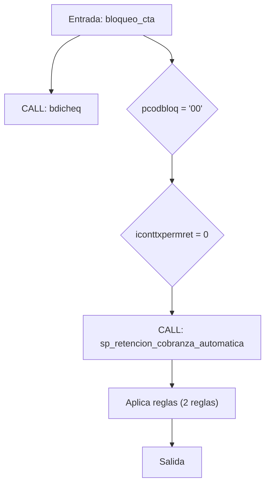
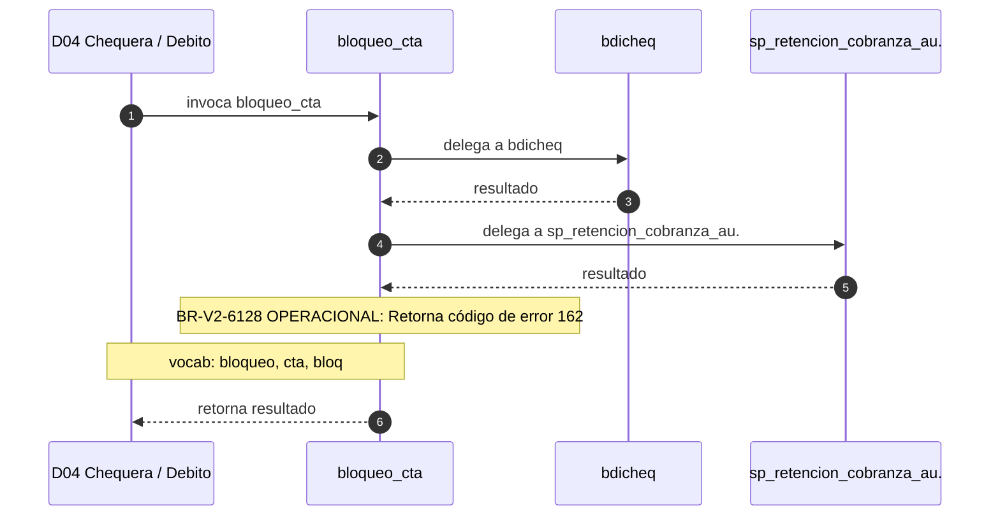

# SP Profile: `bloqueo_cta`

> **Base de datos**: `bdicheq` · Dominio D04 — Chequera / Debito
> **Tipo de artefacto**: Perfil funcional · Gemelo Cognitivo — Capa 4: Intencion
> **Ultima actualizacion**: 2026-08-03
> **Estado**: ACTIVO · 184 callers en produccion

---

## Historia Funcional

El SP `bloqueo_cta` implementa la logica de bloquea cuenta cuenta en el dominio Chequera / Debito (base de datos `bdicheq`). Comprende 6,014 lineas de codigo, 14 tablas consultadas. Es invocado por 184 callers en el sistema, lo que lo convierte en un componente de alta dependencia. Delega logica a: `bdicheq`, `sp_retencion_cobranza_automatica`.

---

## Relaciones en la KB

| Tipo de relacion | Documento |
|-----------------|-----------|
| Cross-reference de reglas y vocabulario | [../cross-reference/sp-rules-vocab-map.md](../cross-reference/sp-rules-vocab-map.md) |
| Dependencias del dominio D04 | [../D04-bdicheq/07-dependencies.md](../D04-bdicheq/07-dependencies.md) |
| Reglas globales del sistema | [../rules/business-rules-bcop.md](../rules/business-rules-bcop.md) |
| Vocabulario del sistema | [../vocabulary/vocabulary-knowledge-base-bcop.md](../vocabulary/vocabulary-knowledge-base-bcop.md) |
| Vista HTML interactiva | [../../portal/sp-detail/sp-detail-bloqueo_cta.html](../../portal/sp-detail/sp-detail-bloqueo_cta.html) |

---

## Metricas del Gemelo Cognitivo

| Metrica | Valor |
|---------|-------|
| Fan-in (callers) | **184** |
| Fan-out (callees) | **14** |
| Callees principales | `bdicheq`, `sp_retencion_cobranza_automatica` |
| LOC | **6,014** |
| Tablas consultadas | 14 |
| Reglas de negocio activas | **2** |
| Autores historicos | 0 |

---

## Flujo de Decision

---

## Diagrama de Secuencia con Reglas y Vocabulario

---

## Reglas de Negocio Activas

| ID | Tipo | Categoria | Linea | Codigo | Referencia |
|----|------|-----------|-------|--------|------------|
| BR-V2-0516 | FÓRMULA | CALCULO_FINANCIERO | 223 | `vmonto_cong = pmonto * -1` | — |
| BR-V2-6128 | VALIDACIÓN | OPERACIONAL | 58 | `let vcodret = "162"` | — |

---

## Vocabulario Clave

| Termino | Categoria | Nivel | Significado |
|---------|-----------|-------|-------------|
| `bloqueo` | ACCION | ALTA | bloquea cuenta |
| `cta` | ENTIDAD | ALTA | cuenta |
| `bloq` | ACCION | MEDIA | bloqueo |

---

## Nota de Migracion

Sin restricciones regulatorias criticas identificadas en el codigo fuente. Verificar en parallel-run que el comportamiento sea equivalente al del sistema legado.

Ver registro completo de riesgos: [migration-risk-register.md](../migration-risk-register.md).
