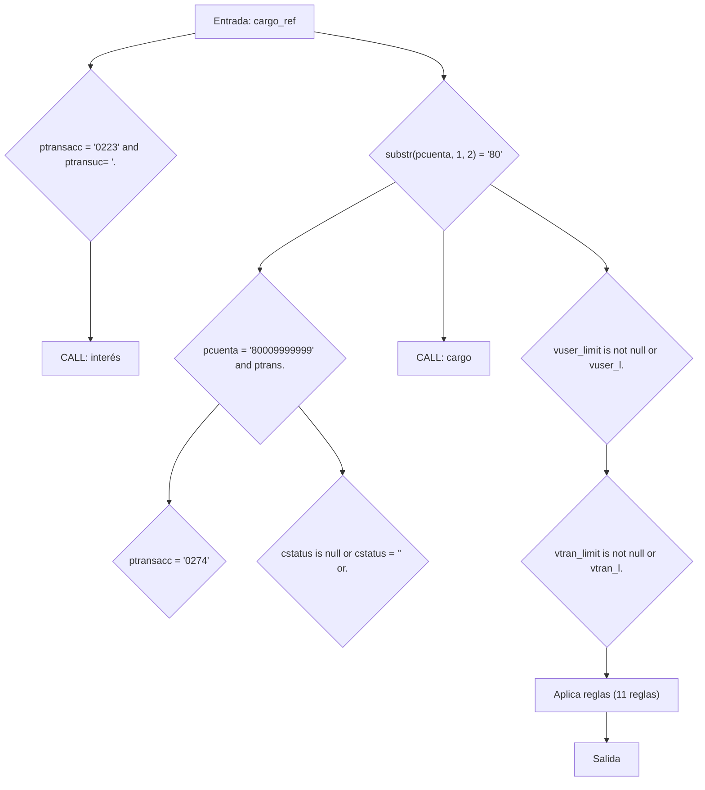
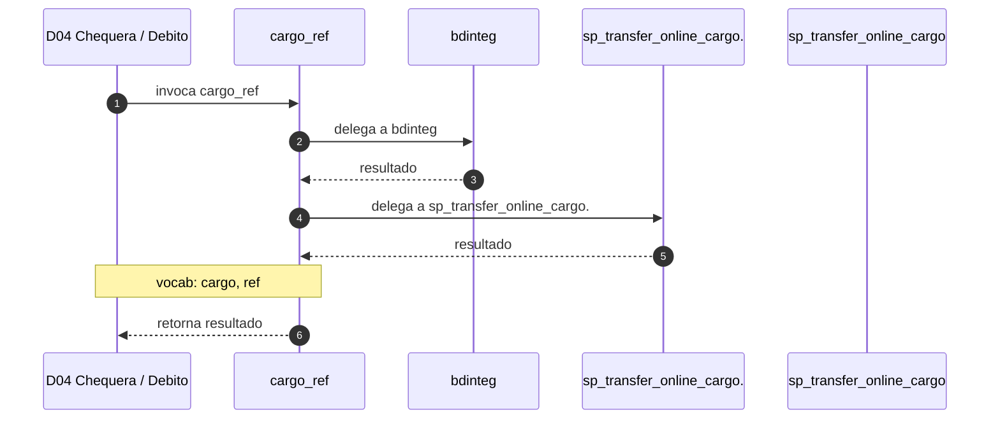

# SP Profile: `cargo_ref`

> **Base de datos**: `bdicheq` · Dominio D04 — Chequera / Debito
> **Tipo de artefacto**: Perfil funcional · Gemelo Cognitivo — Capa 4: Intencion
> **Ultima actualizacion**: 2026-08-03
> **Estado**: ACTIVO · 561 callers en produccion

---

## Historia Funcional

El SP `cargo_ref` implementa la logica de cargo en el dominio Chequera / Debito (base de datos `bdicheq`). Comprende 5,790 lineas de codigo, 16 tablas consultadas. Es invocado por 561 callers en el sistema, lo que lo convierte en un componente de alta dependencia. Delega logica a: `bdinteg`, `sp_transfer_online_cargospei`, `sp_transfer_online_cargo`.

---

## Relaciones en la KB

| Tipo de relacion | Documento |
|-----------------|-----------|
| Cross-reference de reglas y vocabulario | [../cross-reference/sp-rules-vocab-map.md](../cross-reference/sp-rules-vocab-map.md) |
| Dependencias del dominio D04 | [../D04-bdicheq/07-dependencies.md](../D04-bdicheq/07-dependencies.md) |
| Reglas globales del sistema | [../rules/business-rules-bcop.md](../rules/business-rules-bcop.md) |
| Vocabulario del sistema | [../vocabulary/vocabulary-knowledge-base-bcop.md](../vocabulary/vocabulary-knowledge-base-bcop.md) |
| Vista HTML interactiva | [../../portal/sp-detail/sp-detail-cargo_ref.html](../../portal/sp-detail/sp-detail-cargo_ref.html) |

---

## Metricas del Gemelo Cognitivo

| Metrica | Valor |
|---------|-------|
| Fan-in (callers) | **561** |
| Fan-out (callees) | **27** |
| Callees principales | `bdinteg`, `sp_transfer_online_cargospei`, `sp_transfer_online_cargo` |
| LOC | **5,790** |
| Tablas consultadas | 16 |
| Reglas de negocio activas | **11** |
| Autores historicos | 0 |

---

## Flujo de Decision

---

## Diagrama de Secuencia con Reglas y Vocabulario

---

## Reglas de Negocio Activas

| ID | Tipo | Categoria | Linea | Codigo | Referencia |
|----|------|-----------|-------|--------|------------|
| BR-V2-0587 | VALIDACIÓN | OPERACIONAL | 162 | `LET vcodret = '100'` | — |
| BR-V2-0588 | VALIDACIÓN | OPERACIONAL | 178 | `LET vcodret = "999"` | — |
| BR-V2-0589 | VALIDACIÓN | OPERACIONAL | 434 | `let vcodret = '307'` | — |
| BR-V2-0590 | FÓRMULA | CALCULO_FINANCIERO | 441 | `vsdo_retenido = vsdo_retenido * -1` | — |
| BR-V2-0591 | FÓRMULA | CALCULO_FINANCIERO | 445 | `vsdo_cong = vsdo_cong * -1` | — |
| BR-V2-0592 | FÓRMULA | CALCULO_FINANCIERO | 454 | `mSaldoSbc = mSaldoSbc * -1` | — |
| BR-V2-0593 | VALIDACIÓN | OPERACIONAL | 458 | `let vcodret = "962"` | — |
| BR-V2-0594 | VALIDACIÓN | OPERACIONAL | 556 | `let vcodret = "777"` | — |
| BR-V2-0595 | FÓRMULA | CALCULO_FINANCIERO | 721 | `msdo_retenido = msdo_retenido * -1` | — |
| BR-V2-0596 | FÓRMULA | CALCULO_FINANCIERO | 725 | `msdo_cong = msdo_cong * -1` | — |
| BR-V2-7434 | VALIDACIÓN | OPERACIONAL | 5 | `RETURN "00000","1234","06/01/2004",123.45,100,"00000"` | — |

---

## Vocabulario Clave

| Termino | Categoria | Nivel | Significado |
|---------|-----------|-------|-------------|
| `cargo` | ENTIDAD | ALTA | cargo / débito |
| `ref` | AMBIGUO | AMBIGUA | referencia |

---

## Nota de Migracion

Sin restricciones regulatorias criticas identificadas en el codigo fuente. Verificar en parallel-run que el comportamiento sea equivalente al del sistema legado.

Ver registro completo de riesgos: [migration-risk-register.md](../migration-risk-register.md).
