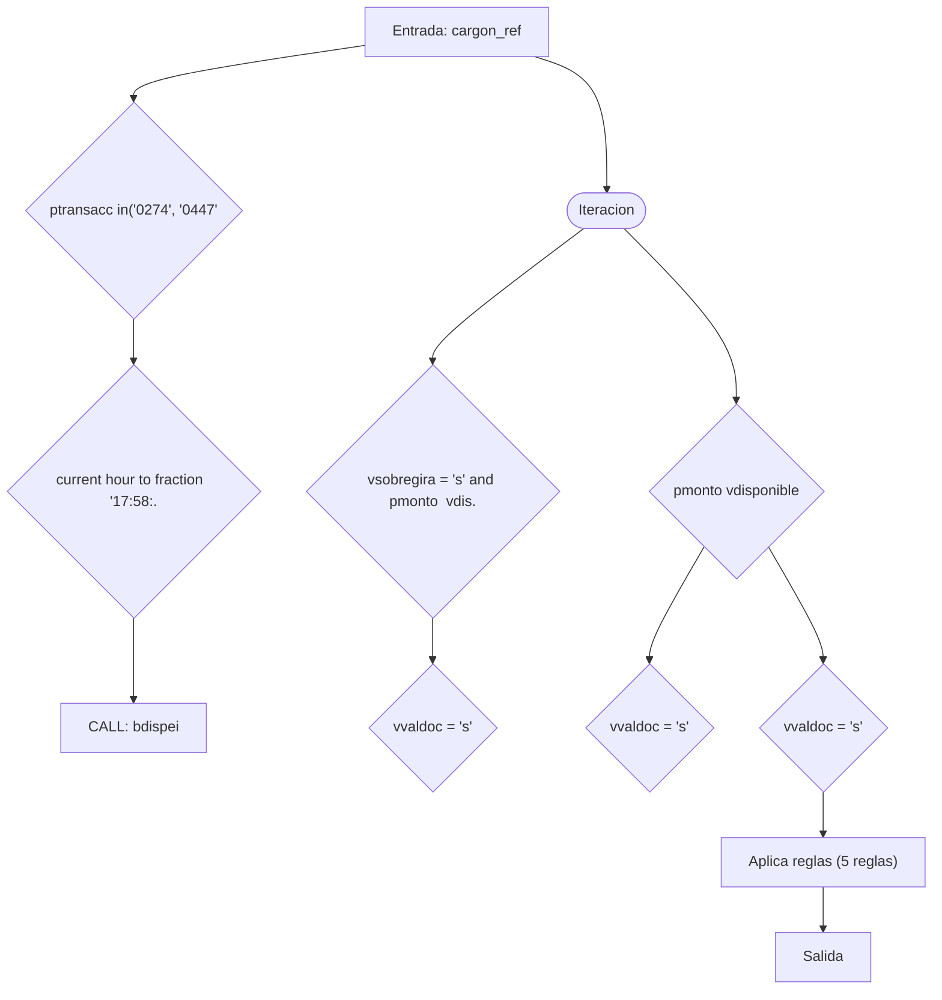
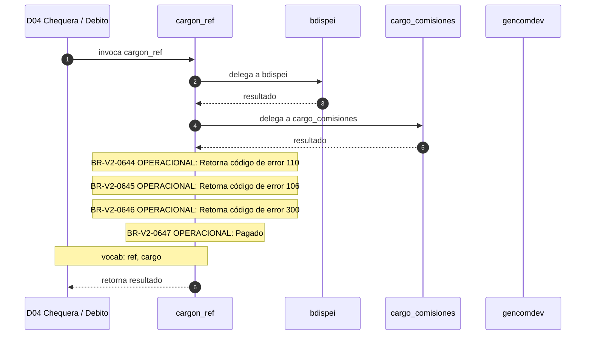

# SP Profile: `cargon_ref`

> **Base de datos**: `bdicheq` · Dominio D04 — Chequera / Debito
> **Tipo de artefacto**: Perfil funcional · Gemelo Cognitivo — Capa 4: Intencion
> **Ultima actualizacion**: 2026-08-03
> **Estado**: ACTIVO · 70 callers en produccion

---

## Historia Funcional

El SP `cargon_ref` implementa la logica de cargo en el dominio Chequera / Debito (base de datos `bdicheq`). Comprende 8,587 lineas de codigo, 22 tablas consultadas. Es invocado por 70 callers en el sistema, lo que lo convierte en un componente de alta dependencia. Delega logica a: `bdispei`, `cargo_comisiones`, `gencomdev`.

---

## Relaciones en la KB

| Tipo de relacion | Documento |
|-----------------|-----------|
| Cross-reference de reglas y vocabulario | [../cross-reference/sp-rules-vocab-map.md](../cross-reference/sp-rules-vocab-map.md) |
| Dependencias del dominio D04 | [../D04-bdicheq/07-dependencies.md](../D04-bdicheq/07-dependencies.md) |
| Reglas globales del sistema | [../rules/business-rules-bcop.md](../rules/business-rules-bcop.md) |
| Vocabulario del sistema | [../vocabulary/vocabulary-knowledge-base-bcop.md](../vocabulary/vocabulary-knowledge-base-bcop.md) |
| Vista HTML interactiva | [../../portal/sp-detail/sp-detail-cargon_ref.html](../../portal/sp-detail/sp-detail-cargon_ref.html) |

---

## Metricas del Gemelo Cognitivo

| Metrica | Valor |
|---------|-------|
| Fan-in (callers) | **70** |
| Fan-out (callees) | **24** |
| Callees principales | `bdispei`, `cargo_comisiones`, `gencomdev` |
| LOC | **8,587** |
| Tablas consultadas | 22 |
| Reglas de negocio activas | **5** |
| Autores historicos | 0 |

---

## Flujo de Decision

---

## Diagrama de Secuencia con Reglas y Vocabulario

---

## Reglas de Negocio Activas

| ID | Tipo | Categoria | Linea | Codigo | Referencia |
|----|------|-----------|-------|--------|------------|
| BR-V2-0644 | VALIDACIÓN | OPERACIONAL | 264 | `let vcodret = '110'` | — |
| BR-V2-0645 | VALIDACIÓN | OPERACIONAL | 275 | `let vcodret = "106"` | — |
| BR-V2-0646 | VALIDACIÓN | OPERACIONAL | 422 | `LET vcodret = "300"` | — |
| BR-V2-0647 | VALIDACIÓN | OPERACIONAL | 579 | `LET vcodret = '600'` | — |
| BR-V2-0648 | VALIDACIÓN | OPERACIONAL | 764 | `LET vcodret = "400"; --//Debe retornar forndos insuficientes` | — |

---

## Vocabulario Clave

| Termino | Categoria | Nivel | Significado |
|---------|-----------|-------|-------------|
| `ref` | AMBIGUO | AMBIGUA | referencia |
| `cargo` | ENTIDAD | ALTA | cargo / débito |

---

## Nota de Migracion

El nombre contiene tokens sinteticos (`?n_`), lo que indica que el alcance original fue parcialmente documentado por el equipo historico.

Ver registro completo de riesgos: [migration-risk-register.md](../migration-risk-register.md).
