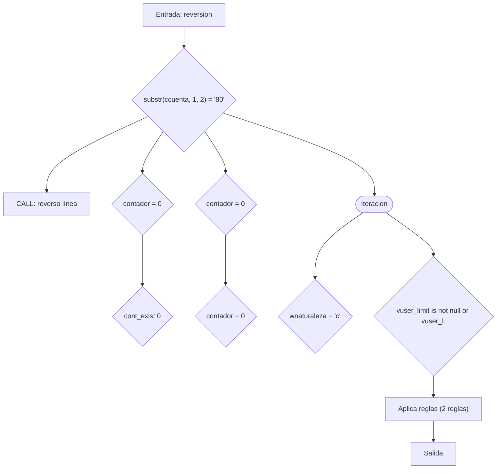
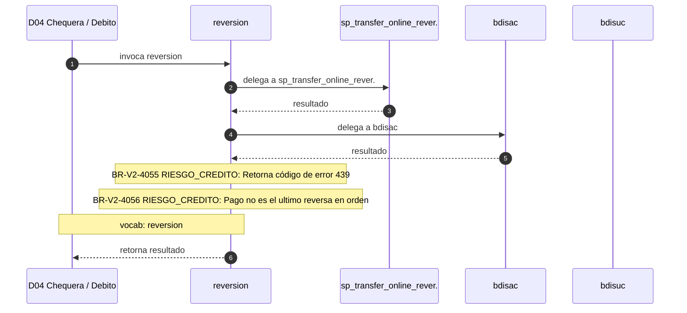

# SP Profile: `reversion`

> **Base de datos**: `bdicheq` · Dominio D04 — Chequera / Debito
> **Tipo de artefacto**: Perfil funcional · Gemelo Cognitivo — Capa 4: Intencion
> **Ultima actualizacion**: 2026-08-03
> **Estado**: ACTIVO · 377 callers en produccion

---

## Historia Funcional

El SP `reversion` implementa la logica de reversa en el dominio Chequera / Debito (base de datos `bdicheq`). Comprende 7,312 lineas de codigo, 33 tablas consultadas. Es invocado por 377 callers en el sistema, lo que lo convierte en un componente de alta dependencia. Delega logica a: `sp_transfer_online_reverso`, `bdisac`, `bdisuc`.

---

## Relaciones en la KB

| Tipo de relacion | Documento |
|-----------------|-----------|
| Cross-reference de reglas y vocabulario | [../cross-reference/sp-rules-vocab-map.md](../cross-reference/sp-rules-vocab-map.md) |
| Dependencias del dominio D04 | [../D04-bdicheq/07-dependencies.md](../D04-bdicheq/07-dependencies.md) |
| Reglas globales del sistema | [../rules/business-rules-bcop.md](../rules/business-rules-bcop.md) |
| Vocabulario del sistema | [../vocabulary/vocabulary-knowledge-base-bcop.md](../vocabulary/vocabulary-knowledge-base-bcop.md) |
| Vista HTML interactiva | [../../portal/sp-detail/sp-detail-reversion.html](../../portal/sp-detail/sp-detail-reversion.html) |

---

## Metricas del Gemelo Cognitivo

| Metrica | Valor |
|---------|-------|
| Fan-in (callers) | **377** |
| Fan-out (callees) | **18** |
| Callees principales | `sp_transfer_online_reverso`, `bdisac`, `bdisuc` |
| LOC | **7,312** |
| Tablas consultadas | 33 |
| Reglas de negocio activas | **2** |
| Autores historicos | 0 |

---

## Flujo de Decision

---

## Diagrama de Secuencia con Reglas y Vocabulario

---

## Reglas de Negocio Activas

| ID | Tipo | Categoria | Linea | Codigo | Referencia |
|----|------|-----------|-------|--------|------------|
| BR-V2-4055 | VALIDACIÓN | RIESGO_CREDITO | 345 | `LET v_codret = "439"` | — |
| BR-V2-4056 | VALIDACIÓN | RIESGO_CREDITO | 421 | `LET v_codret = "431"; -- PAGO NO ES EL ULTIMO REVERSA EN ORD` | — |

---

## Vocabulario Clave

| Termino | Categoria | Nivel | Significado |
|---------|-----------|-------|-------------|
| `reversion` | ACCION | ALTA | reversa / rollback |

---

## Nota de Migracion

Sin restricciones regulatorias criticas identificadas en el codigo fuente. Verificar en parallel-run que el comportamiento sea equivalente al del sistema legado.

Ver registro completo de riesgos: [migration-risk-register.md](../migration-risk-register.md).
