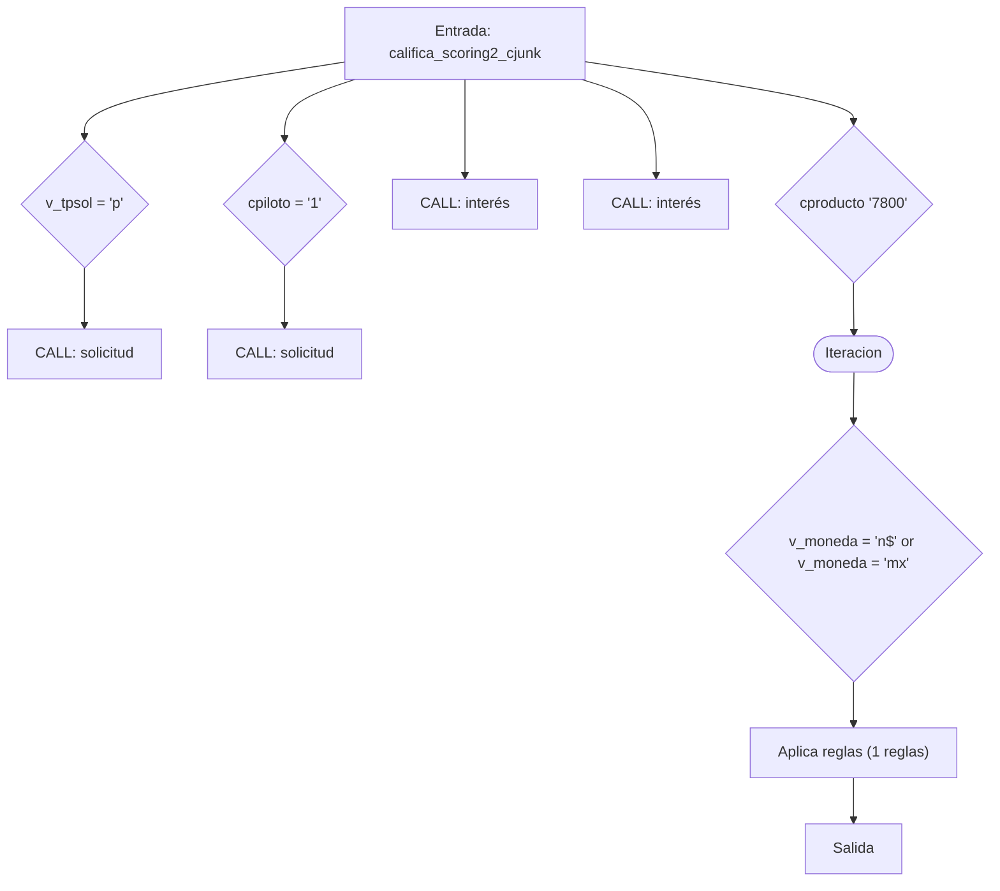
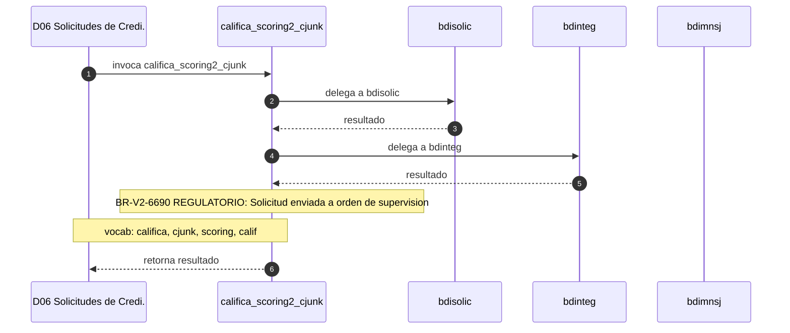

# SP Profile: `califica_scoring2_cjunk`

> **Base de datos**: `bdisolic` · Dominio D06 — Solicitudes de Credito
> **Tipo de artefacto**: Perfil funcional · Gemelo Cognitivo — Capa 4: Intencion
> **Ultima actualizacion**: 2026-08-03
> **Estado**: ACTIVO · 167 callers en produccion

---

## Historia Funcional

El SP `califica_scoring2_cjunk` implementa la logica de califica scoring crediticio en el dominio Solicitudes de Credito (base de datos `bdisolic`). Comprende 3,068 lineas de codigo, 73 tablas consultadas, 20 autores historicos. Es invocado por 167 callers en el sistema, lo que lo convierte en un componente de alta dependencia. Delega logica a: `bdisolic`, `bdinteg`, `bdimnsj`.

---

## Relaciones en la KB

| Tipo de relacion | Documento |
|-----------------|-----------|
| Cross-reference de reglas y vocabulario | [../cross-reference/sp-rules-vocab-map.md](../cross-reference/sp-rules-vocab-map.md) |
| Dependencias del dominio D06 | [../D06-bdisolic/07-dependencies.md](../D06-bdisolic/07-dependencies.md) |
| Reglas globales del sistema | [../rules/business-rules-bcop.md](../rules/business-rules-bcop.md) |
| Vocabulario del sistema | [../vocabulary/vocabulary-knowledge-base-bcop.md](../vocabulary/vocabulary-knowledge-base-bcop.md) |
| Vista HTML interactiva | [../../portal/sp-detail/sp-detail-califica_scoring2_cjunk.html](../../portal/sp-detail/sp-detail-califica_scoring2_cjunk.html) |

---

## Metricas del Gemelo Cognitivo

| Metrica | Valor |
|---------|-------|
| Fan-in (callers) | **167** |
| Fan-out (callees) | **19** |
| Callees principales | `bdisolic`, `bdinteg`, `bdimnsj` |
| LOC | **3,068** |
| Tablas consultadas | 73 |
| Reglas de negocio activas | **1** |
| Autores historicos | 20 |

---

## Flujo de Decision

---

## Diagrama de Secuencia con Reglas y Vocabulario

---

## Reglas de Negocio Activas

| ID | Tipo | Categoria | Linea | Codigo | Referencia |
|----|------|-----------|-------|--------|------------|
| BR-V2-6690 | FÓRMULA | REGULATORIO | 2190 | `vMensajeStatus = 'Solicitud Enviada a Orden de Supervision';` | LRSIC — Buró de Crédito; evaluación crediticia |

---

## Vocabulario Clave

| Termino | Categoria | Nivel | Significado |
|---------|-----------|-------|-------------|
| `califica` | ACCION | ALTA | califica / evalúa (scoring) |
| `cjunk` | AMBIGUO | AMBIGUA | variable temporal (ruido de código, se ignora) |
| `scoring` | ENTIDAD | ALTA | scoring crediticio |
| `calif` | ENTIDAD | MEDIA | calificación |

---

## Nota de Migracion

Las 1 reglas con categoria REGULATORIO son las mas sensibles en la migracion y deben ser validadas por el SME de Industry Banking Accounting contra el CUB vigente.
El nombre contiene tokens sinteticos (`?2_`, `cjunk`), lo que indica que el alcance original fue parcialmente documentado por el equipo historico.

Ver registro completo de riesgos: [migration-risk-register.md](../migration-risk-register.md).
