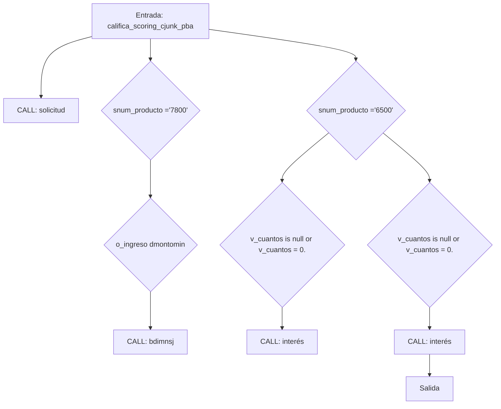
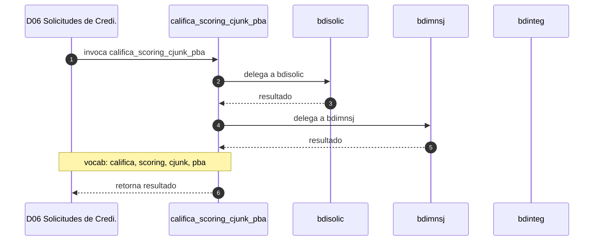

# SP Profile: `califica_scoring_cjunk_pba`

> **Base de datos**: `bdisolic` · Dominio D06 — Solicitudes de Credito
> **Tipo de artefacto**: Perfil funcional · Gemelo Cognitivo — Capa 4: Intencion
> **Ultima actualizacion**: 2026-08-03
> **Estado**: ACTIVO · 0 callers en produccion

---

## Historia Funcional

El SP `califica_scoring_cjunk_pba` implementa la logica de califica scoring crediticio en el dominio Solicitudes de Credito (base de datos `bdisolic`). Comprende 2,251 lineas de codigo, 52 tablas consultadas, 17 autores historicos. Delega logica a: `bdisolic`, `bdimnsj`, `bdinteg`.

---

## Relaciones en la KB

| Tipo de relacion | Documento |
|-----------------|-----------|
| Cross-reference de reglas y vocabulario | [../cross-reference/sp-rules-vocab-map.md](../cross-reference/sp-rules-vocab-map.md) |
| Dependencias del dominio D06 | [../D06-bdisolic/07-dependencies.md](../D06-bdisolic/07-dependencies.md) |
| Reglas globales del sistema | [../rules/business-rules-bcop.md](../rules/business-rules-bcop.md) |
| Vocabulario del sistema | [../vocabulary/vocabulary-knowledge-base-bcop.md](../vocabulary/vocabulary-knowledge-base-bcop.md) |
| Vista HTML interactiva | [../../portal/sp-detail/sp-detail-califica_scoring_cjunk_pba.html](../../portal/sp-detail/sp-detail-califica_scoring_cjunk_pba.html) |

---

## Metricas del Gemelo Cognitivo

| Metrica | Valor |
|---------|-------|
| Fan-in (callers) | **0** |
| Fan-out (callees) | **14** |
| Callees principales | `bdisolic`, `bdimnsj`, `bdinteg` |
| LOC | **2,251** |
| Tablas consultadas | 52 |
| Reglas de negocio activas | **0** |
| Autores historicos | 17 |

---

## Flujo de Decision

---

## Diagrama de Secuencia con Reglas y Vocabulario

---

## Reglas de Negocio Activas

_No se detectaron reglas de negocio para este proceso._

---

## Vocabulario Clave

| Termino | Categoria | Nivel | Significado |
|---------|-----------|-------|-------------|
| `califica` | ACCION | ALTA | califica / evalúa (scoring) |
| `scoring` | ENTIDAD | ALTA | scoring crediticio |
| `cjunk` | AMBIGUO | AMBIGUA | variable temporal (ruido de código, se ignora) |
| `pba` | MODIF | ALTA | PBA — sufijo de SPs para Pruebas; confirmado por SME (Guerra, Alejandro, 2026-07-09) |
| `calif` | ENTIDAD | MEDIA | calificación |

---

## Nota de Migracion

El nombre contiene tokens sinteticos (`cjunk`), lo que indica que el alcance original fue parcialmente documentado por el equipo historico.

Ver registro completo de riesgos: [migration-risk-register.md](../migration-risk-register.md).
