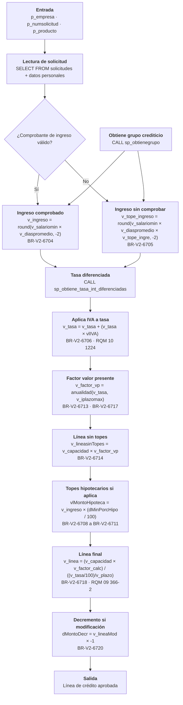
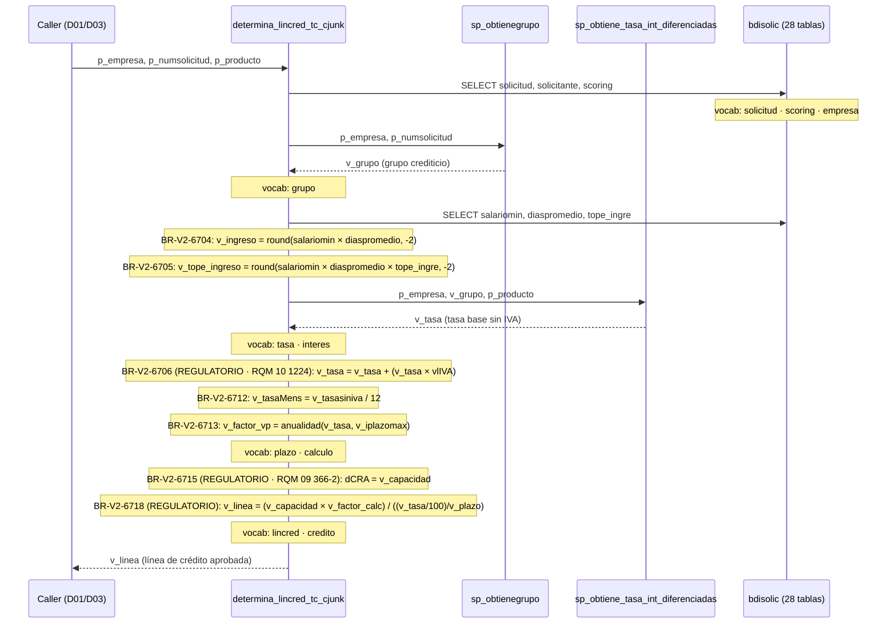

# SP Profile: `determina_lincred_tc_cjunk`

> **Base de datos**: `bdisolic` · Dominio D06 — Solicitudes  
> **Tipo de artefacto**: Perfil funcional profundo · Gemelo Cognitivo — Capa 4: Intención  
> **Última actualización**: 2026-08-02  
> **Estado**: ACTIVO · 208 callers en producción

---

## Historia Funcional

El SP `determina_lincred_tc_cjunk` es el motor de decisión crediticia del flujo de solicitudes de tarjeta de crédito en BanCoppel. Recibe como entrada la empresa emisora, el número de solicitud y los parámetros del producto; lee el historial del solicitante, consulta el grupo crediticio vía `sp_obtienegrupo`, obtiene la tasa diferenciada vía `sp_obtiene_tasa_int_diferenciadas`, aplica IVA (RQM 10 1224), calcula el factor de valor presente conforme a la fórmula de anualidad regulatoria (RQM 09 366-2), y produce la línea de crédito aprobada.

Su amplitud — 1,832 líneas, 28 tablas consultadas, 15 autores históricos — refleja que concentra lógica que en una arquitectura modernizada debería distribuirse en al menos tres servicios independientes: evaluación de capacidad de pago, cálculo de línea, y asignación de tasa. Los 208 callers provienen principalmente del dominio D01 (`bdicnweb`) — el front de solicitudes web — y de D03 (`bdicred`) en flujos de reestructura. Esta posición central lo convierte en candidato de alto riesgo de equivalencia funcional en cualquier plan de migración.

---

## Relaciones en la KB

| Tipo de relación | Documento |
|-----------------|-----------|
| Cross-reference de reglas y vocabulario | [../cross-reference/sp-rules-vocab-map.md](../cross-reference/sp-rules-vocab-map.md) |
| Índice regulatorio CNBV | [../cross-reference/regulatory-sp-index.md](../cross-reference/regulatory-sp-index.md) |
| Cobertura de vocabulario | [../cross-reference/vocab-sp-coverage.md](../cross-reference/vocab-sp-coverage.md) |
| Callers desde D01 bdicnweb | [../D01-bdicnweb/07-dependencies.md](../D01-bdicnweb/07-dependencies.md) |
| Callers desde D03 bdicred | [../D03-bdicred/07-dependencies.md](../D03-bdicred/07-dependencies.md) |
| Reglas globales del sistema | [../rules/business-rules-bcop.md](../rules/business-rules-bcop.md) |
| Vocabulario del sistema | [../vocabulary/vocabulary-knowledge-base-bcop.md](../vocabulary/vocabulary-knowledge-base-bcop.md) |
| Riesgos de migración | [../migration-risk-register.md](../migration-risk-register.md) |
| Vista HTML interactiva | [../../portal/sp-detail/sp-detail-determina_lincred_tc_cjunk.html](../../portal/sp-detail/sp-detail-determina_lincred_tc_cjunk.html) |

---

## Métricas del Gemelo Cognitivo

| Métrica | Valor |
|---------|-------|
| Fan-in (callers) | **208** |
| Fan-out (callees) | **6** |
| Callees principales | `sp_obtienegrupo`, `sp_obtiene_tasa_int_diferenciadas`, `sp_valida_comprobante` |
| LOC | **1,832** |
| Tablas consultadas | 28 |
| Reglas de negocio activas | **18** (BR-V2-6703 a BR-V2-6720) |
| Autores históricos | 15 |
| Categorías de reglas | CALCULO_FINANCIERO (10), REGULATORIO (8) |
| Riesgo de equivalencia | Alto — lógica financiero-regulatoria concentrada |

---

## Flujo de Decisión

---

## Diagrama de Secuencia con Reglas y Vocabulario

---

## Reglas de Negocio Activas (BR-V2-6703 a BR-V2-6720)

| ID | Tipo | Categoría | Línea | Código | Referencia regulatoria |
|----|------|-----------|-------|--------|------------------------|
| BR-V2-6703 | FÓRMULA | CÁLCULO_FINANCIERO | 841 | `v_compteorico = (v_lintienda * .10)` | — |
| BR-V2-6704 | FÓRMULA | CÁLCULO_FINANCIERO | 952 | `v_ingreso = round(v_salariomin * v_diaspromedio,-2)` | Ingreso comprobado con redondeo |
| BR-V2-6705 | FÓRMULA | CÁLCULO_FINANCIERO | 1063 | `v_tope_ingreso = round(v_salariomin * v_diaspromedio * v_tope_ingre,-2)` | Ingreso sin comprobar |
| BR-V2-6706 | FÓRMULA | REGULATORIO | 1148 | `v_tasa = (v_tasa) + (v_tasa * vlIVA)` | **RQM 10 1224** |
| BR-V2-6707 | FÓRMULA | CÁLCULO_FINANCIERO | 1152 | `iISM = v_ingreso / (v_salariomin * v_diaspromedio)` | Índice salarial mínimo |
| BR-V2-6708 | FÓRMULA | CÁLCULO_FINANCIERO | 1334 | `vlMontoHipoteca = v_ingreso * (dMinPorcHipo / 100)` | Tope hipotecario mínimo |
| BR-V2-6709 | FÓRMULA | CÁLCULO_FINANCIERO | 1335 | `vlMontoHipoteca2 = v_ingreso * (dMinPorcHipo / 100)` | — |
| BR-V2-6710 | FÓRMULA | CÁLCULO_FINANCIERO | 1344 | `vlMontoHipoteca = v_ingreso * (dMaxPorcHipo / 100)` | Tope hipotecario máximo |
| BR-V2-6711 | FÓRMULA | CÁLCULO_FINANCIERO | 1345 | `vlMontoHipoteca2 = v_ingreso * (dMaxPorcHipo / 100)` | — |
| BR-V2-6712 | FÓRMULA | REGULATORIO | 1531 | `v_tasaMens = v_tasasiniva / 12` | Tasa mensual sin IVA |
| BR-V2-6713 | FÓRMULA | REGULATORIO | 1534 | `v_factor_vp = 1*(1-(POW(ROUND(...,10),(v_iplazomax*-1))))/(v_tasa/100/12)` | Anualidad — cálculo anual (conservar a 12) |
| BR-V2-6714 | FÓRMULA | CÁLCULO_FINANCIERO | 1536 | `v_lineasinTopes = (v_capacidad * v_factor_vp)` | Línea sin restricciones de tope |
| BR-V2-6715 | FÓRMULA | REGULATORIO | 1598 | `dCRA = v_capacidad; v_tasaMens = v_tasasiniva / 12` | **RQM 09 366-2** |
| BR-V2-6716 | FÓRMULA | REGULATORIO | 1599 | `v_factor_calc = POW(ROUND(((v_tasa/100)/v_plazo)+1,10),(v_iplazomax*-1))` | Factor de cálculo por plazo |
| BR-V2-6717 | FÓRMULA | REGULATORIO | 1601 | `v_factor_vp = v_factor_calc / ((v_tasa/100)/v_plazo)` | Factor VP — conserva cálculo anual |
| BR-V2-6718 | FÓRMULA | REGULATORIO | 1602 | `v_linea = (v_capacidad * v_factor_calc) / ((v_tasa/100)/v_plazo)` | **Cálculo de línea final** |
| BR-V2-6719 | FÓRMULA | REGULATORIO | 1606 | `v_tasaMens = v_tasasiniva / v_plazo` | Tasa mensual por plazo variable |
| BR-V2-6720 | FÓRMULA | CÁLCULO_FINANCIERO | 1722 | `dMontoDecr = v_lineaMod * -1` | Decremento en modificaciones |

---

## Vocabulario Clave

| Término | Categoría | Nivel | Significado |
|---------|-----------|-------|-------------|
| `lincred` | ACCIÓN | ALTA | Línea de crédito — proceso de incremento del límite crediticio |
| `solicitud` | ENTIDAD | ALTA | Solicitud de crédito |
| `tasa` | ENTIDAD | ALTA | Tasa de interés |
| `ingreso` | ENTIDAD | ALTA | Ingreso del solicitante |
| `scoring` | ENTIDAD | ALTA | Scoring crediticio |
| `grupo` | ENTIDAD | ALTA | Grupo crediticio (para segmentación de tasa) |
| `plazo` | ENTIDAD | ALTA | Plazo del crédito |
| `calculo` | ENTIDAD | ALTA | Cálculo financiero |

---

## Nota de Migración

Las reglas con categoría REGULATORIO (BR-V2-6706, BR-V2-6712 a BR-V2-6719) son las más sensibles: aplican criterios de tasa más IVA anclados a RQM 10 1224 y el cálculo de anualidad crediticia de RQM 09 366-2. Cualquier refactoring debe ser validado por el SME de Industry Banking Accounting contra el CUB vigente antes de que el equivalence-check cierre.

El SP tiene un token sintético (`cjunk`) en su nombre — señal de que el propósito original fue parcialmente documentado por el equipo histórico. Los 15 autores distintos y los comentarios `--CONSERVAR` en el código confirman que ha acumulado capas de lógica en iteraciones sucesivas sin refactoring unificador.

Ver registro completo de riesgos: [migration-risk-register.md](../migration-risk-register.md).
