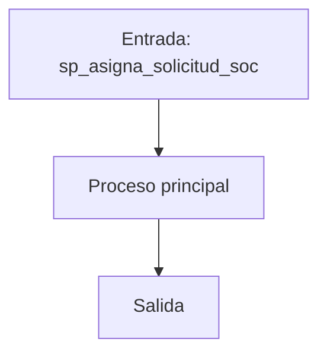
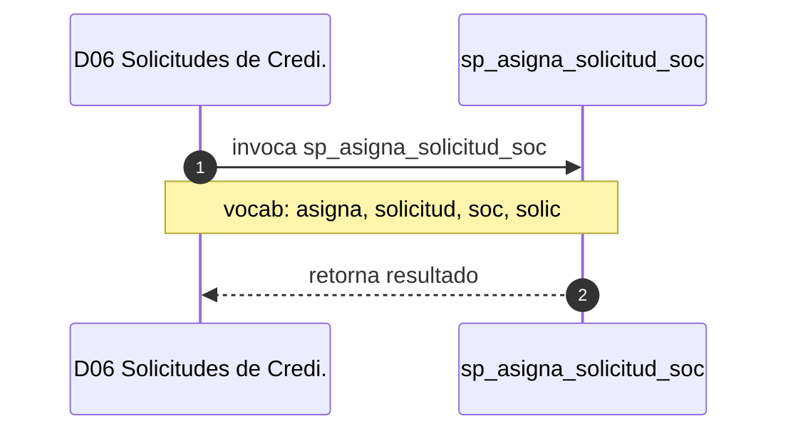

# SP Profile: `sp_asigna_solicitud_soc`

> **Base de datos**: `bdisolic` · Dominio D06 — Solicitudes de Credito
> **Tipo de artefacto**: Perfil funcional · Gemelo Cognitivo — Capa 4: Intencion
> **Ultima actualizacion**: 2026-08-03
> **Estado**: ACTIVO · 236 callers en produccion

---

## Historia Funcional

El SP `sp_asigna_solicitud_soc` implementa la logica de asigna solicitud y Sistema Operativo Central en el dominio Solicitudes de Credito (base de datos `bdisolic`). Comprende 571 lineas de codigo, 16 tablas consultadas, 3 autores historicos. Es invocado por 236 callers en el sistema, lo que lo convierte en un componente de alta dependencia. 

---

## Relaciones en la KB

| Tipo de relacion | Documento |
|-----------------|-----------|
| Cross-reference de reglas y vocabulario | [../cross-reference/sp-rules-vocab-map.md](../cross-reference/sp-rules-vocab-map.md) |
| Dependencias del dominio D06 | [../D06-bdisolic/07-dependencies.md](../D06-bdisolic/07-dependencies.md) |
| Reglas globales del sistema | [../rules/business-rules-bcop.md](../rules/business-rules-bcop.md) |
| Vocabulario del sistema | [../vocabulary/vocabulary-knowledge-base-bcop.md](../vocabulary/vocabulary-knowledge-base-bcop.md) |
| Vista HTML interactiva | [../../portal/sp-detail/sp-detail-sp_asigna_solicitud_soc.html](../../portal/sp-detail/sp-detail-sp_asigna_solicitud_soc.html) |

---

## Metricas del Gemelo Cognitivo

| Metrica | Valor |
|---------|-------|
| Fan-in (callers) | **236** |
| Fan-out (callees) | **236** |
| Callees principales | — |
| LOC | **571** |
| Tablas consultadas | 16 |
| Reglas de negocio activas | **0** |
| Autores historicos | 3 |

---

## Flujo de Decision

---

## Diagrama de Secuencia con Reglas y Vocabulario

---

## Reglas de Negocio Activas

_No se detectaron reglas de negocio para este proceso._

---

## Vocabulario Clave

| Termino | Categoria | Nivel | Significado |
|---------|-----------|-------|-------------|
| `asigna` | ACCION | ALTA | asigna |
| `solicitud` | ENTIDAD | ALTA | solicitud |
| `soc` | ENTIDAD | ALTA | Sistema Operativo Central (SOC) — confirmado SME |
| `solic` | ENTIDAD | ALTA | solicitud |

---

## Nota de Migracion

Sin restricciones regulatorias criticas identificadas en el codigo fuente. Verificar en parallel-run que el comportamiento sea equivalente al del sistema legado.

Ver registro completo de riesgos: [migration-risk-register.md](../migration-risk-register.md).
