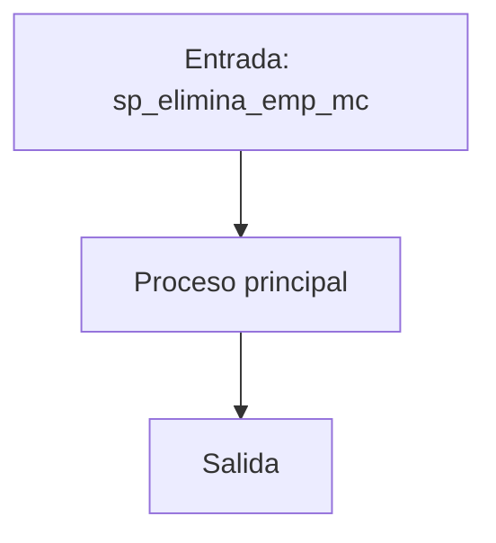
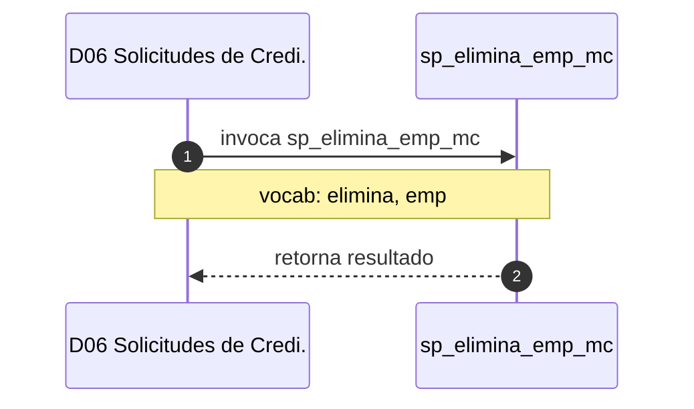

# SP Profile: `sp_elimina_emp_mc`

> **Base de datos**: `bdisolic` · Dominio D06 — Solicitudes de Credito
> **Tipo de artefacto**: Perfil funcional · Gemelo Cognitivo — Capa 4: Intencion
> **Ultima actualizacion**: 2026-08-03
> **Estado**: ACTIVO · 144 callers en produccion

---

## Historia Funcional

El SP `sp_elimina_emp_mc` implementa la logica de elimina en el dominio Solicitudes de Credito (base de datos `bdisolic`). Comprende 26 lineas de codigo, 2 tablas consultadas. Es invocado por 144 callers en el sistema, lo que lo convierte en un componente de alta dependencia. 

---

## Relaciones en la KB

| Tipo de relacion | Documento |
|-----------------|-----------|
| Cross-reference de reglas y vocabulario | [../cross-reference/sp-rules-vocab-map.md](../cross-reference/sp-rules-vocab-map.md) |
| Dependencias del dominio D06 | [../D06-bdisolic/07-dependencies.md](../D06-bdisolic/07-dependencies.md) |
| Reglas globales del sistema | [../rules/business-rules-bcop.md](../rules/business-rules-bcop.md) |
| Vocabulario del sistema | [../vocabulary/vocabulary-knowledge-base-bcop.md](../vocabulary/vocabulary-knowledge-base-bcop.md) |
| Vista HTML interactiva | [../../portal/sp-detail/sp-detail-sp_elimina_emp_mc.html](../../portal/sp-detail/sp-detail-sp_elimina_emp_mc.html) |

---

## Metricas del Gemelo Cognitivo

| Metrica | Valor |
|---------|-------|
| Fan-in (callers) | **144** |
| Fan-out (callees) | **144** |
| Callees principales | — |
| LOC | **26** |
| Tablas consultadas | 2 |
| Reglas de negocio activas | **0** |
| Autores historicos | 0 |

---

## Flujo de Decision

---

## Diagrama de Secuencia con Reglas y Vocabulario

---

## Reglas de Negocio Activas

_No se detectaron reglas de negocio para este proceso._

---

## Vocabulario Clave

| Termino | Categoria | Nivel | Significado |
|---------|-----------|-------|-------------|
| `elimina` | ACCION | ALTA | elimina |
| `emp` | ENTIDAD | ALTA | Empresa — empleadora del cliente; vinculada a crédito de nómina (ADN); SPs: sp_consulta_datos_emp_bei (phone+address), sp_genera_emp_gc (Grupo Coppel), inserta_rel_cte_emp |

---

## Nota de Migracion

Sin restricciones regulatorias criticas identificadas en el codigo fuente. Verificar en parallel-run que el comportamiento sea equivalente al del sistema legado.

Ver registro completo de riesgos: [migration-risk-register.md](../migration-risk-register.md).
