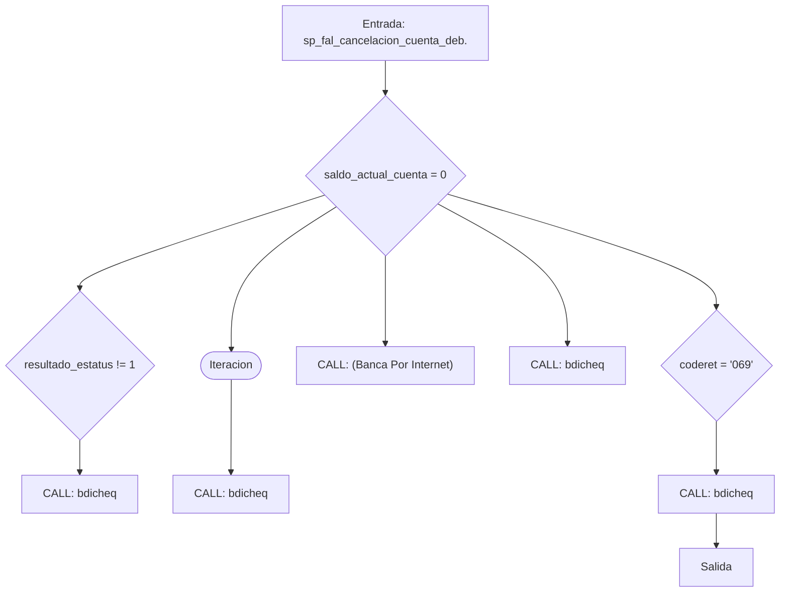
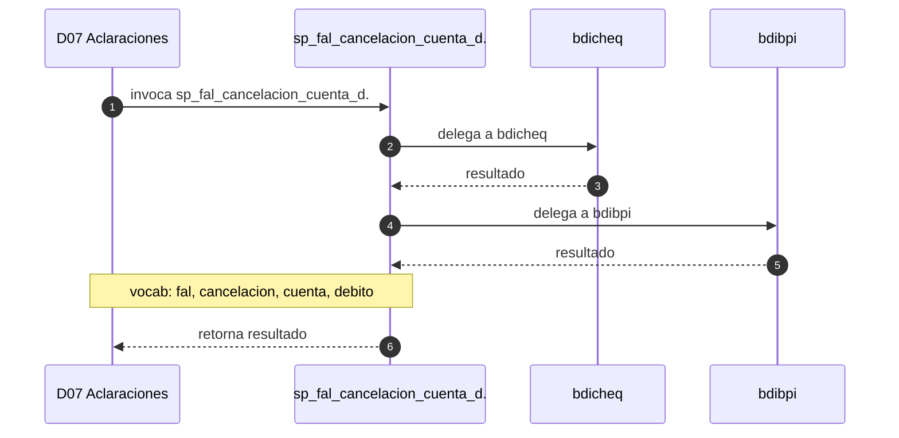

# SP Profile: `sp_fal_cancelacion_cuenta_debito`

> **Base de datos**: `bdiaclaracion` · Dominio D07 — Aclaraciones
> **Tipo de artefacto**: Perfil funcional · Gemelo Cognitivo — Capa 4: Intencion
> **Ultima actualizacion**: 2026-08-03
> **Estado**: ACTIVO · 40 callers en produccion

---

## Historia Funcional

El SP `sp_fal_cancelacion_cuenta_debito` implementa la logica de cancela cuenta (débito) en el dominio Aclaraciones (base de datos `bdiaclaracion`). Comprende 11,516 lineas de codigo, 3 tablas consultadas. Es invocado por 40 callers en el sistema, lo que lo convierte en un componente de alta dependencia. Delega logica a: `bdicheq`, `bdibpi`.

---

## Relaciones en la KB

| Tipo de relacion | Documento |
|-----------------|-----------|
| Cross-reference de reglas y vocabulario | [../cross-reference/sp-rules-vocab-map.md](../cross-reference/sp-rules-vocab-map.md) |
| Dependencias del dominio D07 | [../D07-bdiaclaracion/07-dependencies.md](../D07-bdiaclaracion/07-dependencies.md) |
| Reglas globales del sistema | [../rules/business-rules-bcop.md](../rules/business-rules-bcop.md) |
| Vocabulario del sistema | [../vocabulary/vocabulary-knowledge-base-bcop.md](../vocabulary/vocabulary-knowledge-base-bcop.md) |
| Vista HTML interactiva | [../../portal/sp-detail/sp-detail-sp_fal_cancelacion_cuenta_debito.html](../../portal/sp-detail/sp-detail-sp_fal_cancelacion_cuenta_debito.html) |

---

## Metricas del Gemelo Cognitivo

| Metrica | Valor |
|---------|-------|
| Fan-in (callers) | **40** |
| Fan-out (callees) | **20** |
| Callees principales | `bdicheq`, `bdibpi` |
| LOC | **11,516** |
| Tablas consultadas | 3 |
| Reglas de negocio activas | **0** |
| Autores historicos | 0 |

---

## Flujo de Decision

---

## Diagrama de Secuencia con Reglas y Vocabulario

---

## Reglas de Negocio Activas

_No se detectaron reglas de negocio para este proceso._

---

## Vocabulario Clave

| Termino | Categoria | Nivel | Significado |
|---------|-----------|-------|-------------|
| `fal` | ENTIDAD | ALTA | fal — fallo/disputa (prefijo sp_fal_* — aclaraciones bancarias — bdiaclaracion) |
| `cancelacion` | ACCION | ALTA | cancela |
| `cuenta` | ENTIDAD | ALTA | cuenta |
| `debito` | ENTIDAD | ALTA | débito |
| `cancela` | ACCION | ALTA | cancela |

---

## Nota de Migracion

Sin restricciones regulatorias criticas identificadas en el codigo fuente. Verificar en parallel-run que el comportamiento sea equivalente al del sistema legado.

Ver registro completo de riesgos: [migration-risk-register.md](../migration-risk-register.md).
