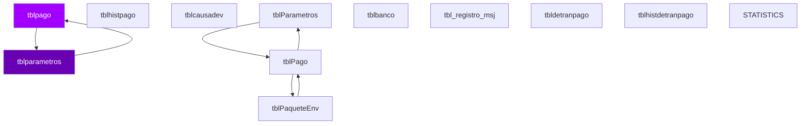

# D08 · SPEI — Modelo Entidad-Relación (Inferido)

> **Componente:** Informix · SPE-AM-001 · Etapa 1
> **Base de datos:** `bdispei` · IBM Informix IDS 14.10 / POWER-AIX
> **Wave:** Wave 2 · Riesgo: **CRÍTICO**
> **Última actualización:** 2026-07-03

---
**SME responsable:**
- Specialist — Informix SPL Analysis (análisis estático, code extraction)
- DBA — IBM Informix IDS (schema real vía syscolumns — Etapa 2) ← NUEVO
- Industry Banking + Domain Expert BanCoppel (validación funcional)
- Cybersecurity (riesgos PII, regulación CNBV/LFPDPPP)
- QA Lead — Equivalencia Funcional (estrategia de pruebas) ← NUEVO
- Cloud Architect AWS Banking (arquitectura target) ← NUEVO
> [SME-PENDING] = requiere sesión de validación antes de Etapa 2.
---

## Metodología

Tablas inferidas de análisis estático de **70 archivos SQL** (`FROM`, `INSERT INTO`, `UPDATE`, `DELETE FROM`).
Columnas inferidas de listas `INSERT INTO tbl (col1, col2, ...)`.
Relaciones inferidas del conocimiento de dominio — Informix no declara `FOREIGN KEY` formalmente.

## Diagrama ER — tablas core (Mermaid)



> Renderizable en GitHub o VSCode con extensión Mermaid Preview.

## Inventario de entidades propias de `bdispei` (muestra)

| Tabla | Tipo | PK inferida | Lectores | Escritores |
|-------|------|-------------|----------|------------|
| `tblpago` | Transaccional | `clave_rastreo` | 20 | 10 |
| `tblparametros` | Transaccional | `[SME-PENDING]` | 19 | 2 |
| `tblhistpago` | Transaccional | `clave_rastreo` | 10 | 2 |
| `tblcausadev` | Transaccional | `[SME-PENDING]` | 11 | 0 |
| `tblParametros` | Transaccional | `[SME-PENDING]` | 11 | 0 |
| `tblbanco` | Transaccional | `[SME-PENDING]` | 9 | 2 |
| `tbl_registro_msj` | Transaccional | `[SME-PENDING]` | 4 | 4 |
| `tbldetranpago` | Transaccional | `clave_rastreo` | 8 | 0 |
| `tblPago` | Transaccional | `clave_rastreo` | 1 | 5 |
| `tblhistdetranpago` | Transaccional | `clave_rastreo` | 6 | 0 |
| `tblPaqueteEnv` | Transaccional | `[SME-PENDING]` | 3 | 2 |
| `STATISTICS` | Transaccional | `[SME-PENDING]` | 0 | 5 |
| `tbltipopago` | Transaccional | `clave_rastreo` | 4 | 0 |
| `tblpagocred` | Transaccional | `clave_rastreo` | 1 | 3 |
| `abonospeihist` | Transaccional | `clave_rastreo` | 2 | 2 |
| `tblhistabono` | Transaccional | `[SME-PENDING]` | 2 | 2 |
| `tbl_coas_rec_devol` | Transaccional | `[SME-PENDING]` | 2 | 2 |
| `tbl_coas_rec_abono` | Transaccional | `[SME-PENDING]` | 2 | 2 |
| `tbl_coas_rec_abono7` | Transaccional | `[SME-PENDING]` | 2 | 2 |
| `tbl_encabezado_coas_rec` | Transaccional | `[SME-PENDING]` | 2 | 2 |
| `tbl_coas_rec_devols` | Transaccional | `[SME-PENDING]` | 2 | 2 |
| `tbl_coas_rec` | Transaccional | `[SME-PENDING]` | 2 | 2 |
| `tbl_coas_rec_abono5` | Transaccional | `[SME-PENDING]` | 2 | 2 |
| `tbl_coas_rec_abonos5` | Transaccional | `[SME-PENDING]` | 2 | 2 |
| `tbl_coas_rec_devols16` | Transaccional | `[SME-PENDING]` | 2 | 2 |
| `tbl_coas_rec_abonos7` | Transaccional | `[SME-PENDING]` | 2 | 2 |
| `tbl_coas_rec_devol16` | Transaccional | `[SME-PENDING]` | 2 | 2 |
| `tbl_coas_rec_abonos` | Transaccional | `[SME-PENDING]` | 2 | 2 |
| `abonospei` | Transaccional | `clave_rastreo` | 1 | 2 |
| `CTRLTABLAS` | Transaccional | `[SME-PENDING]` | 1 | 1 |
| `tblcdev_codret` | Transaccional | `[SME-PENDING]` | 2 | 0 |
| `tbltipocuenta` | Transaccional | `num_cta` | 2 | 0 |
| `tblTraspaso` | Transaccional | `[SME-PENDING]` | 1 | 1 |
| `sc_movdia` | Transaccional | `[SME-PENDING]` | 2 | 0 |
| `tblcomision` | Transaccional | `[SME-PENDING]` | 2 | 0 |

## Tablas externas accedidas (cross-DB)

| DB externa | Tabla | Lecturas | Escrituras | Notas |
|-----------|-------|----------|-----------|-------|
| `bdiSPEI` | `tblPago` | 0 SPs | 1 SPs | Cross-DB → API interna en target |
| `bdiadminnomina` | `` | 2 SPs | 0 SPs | Cross-DB → API interna en target |
| `bdicheq` | `sc_tarjeta` | 4 SPs | 0 SPs | Cross-DB → API interna en target |
| `bdicheq` | `sc_maechq` | 11 SPs | 0 SPs | Cross-DB → API interna en target |
| `bdicheq` | `sc_ctabloqueo` | 3 SPs | 0 SPs | Cross-DB → API interna en target |
| `bdicheq` | `sc_fechas` | 12 SPs | 0 SPs | Cross-DB → API interna en target |
| `bdicheq` | `sc_movdia` | 8 SPs | 0 SPs | Cross-DB → API interna en target |
| `bdinteg` | `si_cliente` | 1 SPs | 0 SPs | Cross-DB → API interna en target |
| `bdinteg` | `si_fechas` | 1 SPs | 0 SPs | Cross-DB → API interna en target |
| `bdinteg` | `si_empresas` | 2 SPs | 0 SPs | Cross-DB → API interna en target |
| `bdinteg` | `dual` | 2 SPs | 0 SPs | Cross-DB → API interna en target |
| `bdinteg` | `si_bancos` | 1 SPs | 0 SPs | Cross-DB → API interna en target |
| `bdispei` | `tblpago` | 5 SPs | 2 SPs | Cross-DB → API interna en target |
| `bdispei` | `` | 2 SPs | 1 SPs | Cross-DB → API interna en target |
| `bdispei` | `tblclabebloqueo` | 2 SPs | 2 SPs | Cross-DB → API interna en target |
| `bdispei` | `tblcomision_no_comision` | 2 SPs | 0 SPs | Cross-DB → API interna en target |
| `bdispei` | `tblctrlproceso` | 2 SPs | 0 SPs | Cross-DB → API interna en target |
| `bdispeua` | `bancos` | 1 SPs | 0 SPs | Cross-DB → API interna en target |
| `paginterban` | `bancos` | 1 SPs | 0 SPs | Cross-DB → API interna en target |
| `sysmaster` | `systabnames` | 6 SPs | 0 SPs | Cross-DB → API interna en target |
| `terceros` | `convenio_mn` | 1 SPs | 0 SPs | Cross-DB → API interna en target |

## Detalle de columnas — tablas con columnas inferidas

### `tblPago` — Transaccional

| Columna | Tipo Informix | Tipo PostgreSQL target | PII |
|---------|--------------|----------------------|-----|
| `chrTopologia` | [SME-PENDING] | [SME-PENDING] |  |
| `chrestatusenvio` | CHAR(4) | CHAR(4) |  |
| `cvecesifbcodest` | [SME-PENDING] | [SME-PENDING] |  |
| `cvecesifbcoord` | [SME-PENDING] | [SME-PENDING] |  |
| `dtfechacaptura` | DATE | DATE |  |
| `dtfechavalor` | DATE | DATE |  |
| `intPkPago` | [SME-PENDING] | [SME-PENDING] |  |
| `intcvecausadev` | [SME-PENDING] | [SME-PENDING] |  |
| `intcvetipopago` | [SME-PENDING] | [SME-PENDING] |  |
| `mnyImporte` | MONEY(16,2) | NUMERIC(16,2) |  |
| `sintlongcverastreo` | [SME-PENDING] | [SME-PENDING] |  |
| `txtcde` | [SME-PENDING] | [SME-PENDING] |  |
| `vchrClaveRastreo` | [SME-PENDING] | [SME-PENDING] |  |
| `vchrMotivodev` | [SME-PENDING] | [SME-PENDING] |  |
| `vchrcverastreodev` | [SME-PENDING] | [SME-PENDING] |  |

### `tblpagocred` — Transaccional

| Columna | Tipo Informix | Tipo PostgreSQL target | PII |
|---------|--------------|----------------------|-----|
| `coderr_pago` | [SME-PENDING] | [SME-PENDING] |  |
| `codret_pago` | [SME-PENDING] | [SME-PENDING] |  |
| `cta_clabe` | [SME-PENDING] | [SME-PENDING] |  |
| `ctaclabe_pago` | [SME-PENDING] | [SME-PENDING] |  |
| `cve_rastreo` | [SME-PENDING] | [SME-PENDING] |  |
| `cvebcomex_pago` | [SME-PENDING] | [SME-PENDING] |  |
| `descerr_pago` | VARCHAR(100) | VARCHAR(100) |  |
| `fecha_hora` | DATE | DATE |  |
| `monto` | MONEY(16,2) | NUMERIC(16,2) |  |
| `monto_pago` | MONEY(16,2) | NUMERIC(16,2) |  |
| `no_cte_central` | [SME-PENDING] | [SME-PENDING] |  |
| `no_cte_orion` | [SME-PENDING] | [SME-PENDING] |  |
| `nombre_cliente` | VARCHAR(100) | VARCHAR(100) | ⚠️ PII |
| `rfc_cte` | [SME-PENDING] | [SME-PENDING] | ⚠️ PII |
| `status` | [SME-PENDING] | [SME-PENDING] |  |

### `tblpasecont` — Transaccional

| Columna | Tipo Informix | Tipo PostgreSQL target | PII |
|---------|--------------|----------------------|-----|
| `ccauxiliar` | [SME-PENDING] | [SME-PENDING] |  |
| `ccmayor` | [SME-PENDING] | [SME-PENDING] |  |
| `ccsector` | [SME-PENDING] | [SME-PENDING] |  |
| `ccsssubsub` | [SME-PENDING] | [SME-PENDING] |  |
| `ccssubsub` | [SME-PENDING] | [SME-PENDING] |  |
| `ccsub` | [SME-PENDING] | [SME-PENDING] |  |
| `ccsubsub` | [SME-PENDING] | [SME-PENDING] |  |
| `chrcargoabono` | MONEY(16,2) | NUMERIC(16,2) |  |
| `chrdivisa` | [SME-PENDING] | [SME-PENDING] |  |
| `chrempresa` | [SME-PENDING] | [SME-PENDING] |  |
| `chrsucursal` | [SME-PENDING] | [SME-PENDING] |  |
| `chrtransaccion` | [SME-PENDING] | [SME-PENDING] |  |
| `costo_orig` | [SME-PENDING] | [SME-PENDING] |  |
| `intpkpasecont` | [SME-PENDING] | [SME-PENDING] |  |
| `mnymonto` | MONEY(16,2) | NUMERIC(16,2) |  |

### `tblbanco` — Transaccional

| Columna | Tipo Informix | Tipo PostgreSQL target | PII |
|---------|--------------|----------------------|-----|
| `chrbcoreceptivo` | [SME-PENDING] | [SME-PENDING] |  |
| `chredobco` | [SME-PENDING] | [SME-PENDING] |  |
| `cvecesif` | [SME-PENDING] | [SME-PENDING] |  |
| `intindice` | [SME-PENDING] | [SME-PENDING] |  |
| `vchrnombre` | VARCHAR(100) | VARCHAR(100) | ⚠️ PII |
| `vchrnombrecorto` | VARCHAR(100) | VARCHAR(100) | ⚠️ PII |

## Tablas core del dominio (conocimiento de dominio)

| Tabla | Tipo esperado | Notas |
|-------|--------------|-------|
| `spei_orden_pago` | Transaccional | Confirmar existencia y esquema con DBA |
| `spei_proceso_codi` | Log / Bitácora | Confirmar existencia y esquema con DBA |
| `spei_bitacora` | Log / Bitácora | Confirmar existencia y esquema con DBA |
| `spei_cat_banco` | Catálogo / Config | Confirmar existencia y esquema con DBA |
| `spei_horario` | Transaccional | Confirmar existencia y esquema con DBA |

## Pendientes Etapa 2

```sql
-- Ejecutar en instancia Informix `bdispei` para obtener schema real:
SELECT t.tabname, c.colname, c.coltype, c.collength, c.colno
FROM systables t JOIN syscolumns c ON t.tabid = c.tabid
WHERE t.owner = 'informix'
ORDER BY t.tabname, c.colno;
```

- [ ] Confirmar política de retención por tabla (especialmente tablas `_his`)
- [ ] Identificar todos los campos PII — datos sujetos a LFPDPPP
- [ ] Verificar si tablas `_tmp` / `_temp` se crean dinámicamente o son permanentes
- [ ] Confirmar cardinalidades reales en producción
- [ ] Validar relaciones implícitas (FK lógicas sin constraint formal)


---
*Generado por: Specialist — Informix SPL Analysis · 2026-07-03 · Evidencia: source/informix/bdispei_*.sql (análisis estático de 70 archivos SQL) · análisis estático de archivos SQL*
