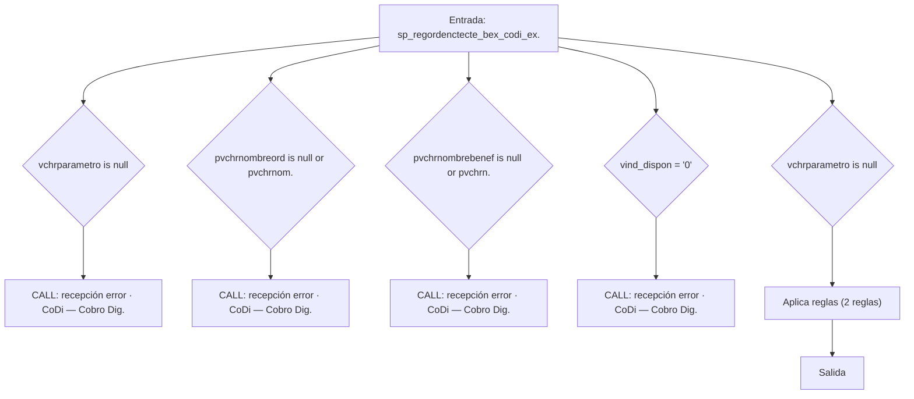
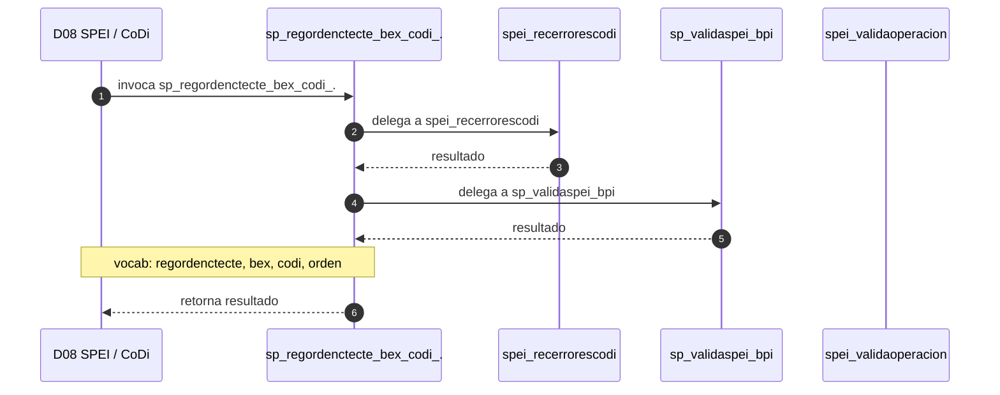

# SP Profile: `sp_regordenctecte_bex_codi_exp1`

> **Base de datos**: `bdispei` · Dominio D08 — SPEI / CoDi
> **Tipo de artefacto**: Perfil funcional · Gemelo Cognitivo — Capa 4: Intencion
> **Ultima actualizacion**: 2026-08-03
> **Estado**: ACTIVO · 0 callers en produccion

---

## Historia Funcional

El SP `sp_regordenctecte_bex_codi_exp1` implementa la logica de orden y cliente · CoDi — Cobro Digital en el dominio SPEI / CoDi (base de datos `bdispei`). Comprende 2,310 lineas de codigo, 16 tablas consultadas. Delega logica a: `spei_recerrorescodi`, `sp_validaspei_bpi`, `spei_validaoperacion`.

---

## Relaciones en la KB

| Tipo de relacion | Documento |
|-----------------|-----------|
| Cross-reference de reglas y vocabulario | [../cross-reference/sp-rules-vocab-map.md](../cross-reference/sp-rules-vocab-map.md) |
| Dependencias del dominio D08 | [../D08-bdispei/07-dependencies.md](../D08-bdispei/07-dependencies.md) |
| Reglas globales del sistema | [../rules/business-rules-bcop.md](../rules/business-rules-bcop.md) |
| Vocabulario del sistema | [../vocabulary/vocabulary-knowledge-base-bcop.md](../vocabulary/vocabulary-knowledge-base-bcop.md) |
| Vista HTML interactiva | [../../portal/sp-detail/sp-detail-sp_regordenctecte_bex_codi_exp1.html](../../portal/sp-detail/sp-detail-sp_regordenctecte_bex_codi_exp1.html) |

---

## Metricas del Gemelo Cognitivo

| Metrica | Valor |
|---------|-------|
| Fan-in (callers) | **0** |
| Fan-out (callees) | **10** |
| Callees principales | `spei_recerrorescodi`, `sp_validaspei_bpi`, `spei_validaoperacion` |
| LOC | **2,310** |
| Tablas consultadas | 16 |
| Reglas de negocio activas | **2** |
| Autores historicos | 0 |

---

## Flujo de Decision

---

## Diagrama de Secuencia con Reglas y Vocabulario

---

## Reglas de Negocio Activas

| ID | Tipo | Categoria | Linea | Codigo | Referencia |
|----|------|-----------|-------|--------|------------|
| BR-V2-6978 | FÓRMULA | CALCULO_FINANCIERO | 260 | `intBancoOrd = (vchrparametro * 1)` | — |
| BR-V2-6979 | UMBRAL | PAGOS_TRANSFERENCIAS | 1121 | `IF pmnyImporte > 300000.00 THEN` | — |

---

## Vocabulario Clave

| Termino | Categoria | Nivel | Significado |
|---------|-----------|-------|-------------|
| `regordenctecte` | ACCION | MEDIA | Regresa Orden Cuenta a Cuenta — operación de transferencia/orden entre cuentas propias del cliente (bdicheq:sp_regordenctecte, sp_regordenctecte_bex, sp_regordenctecte_web, sp_regordenctecte_pp) |
| `bex` | ENTIDAD | MEDIA | BEX — canal o plataforma de Banca Por Internet (bdibpi); gestiona sesiones, preguntas de seguridad, cuentas cap/cred (sp_*_bex, sp_ini_session_bex) |
| `codi` | REG | ALTA | CoDi — Cobro Digital (Banxico) |
| `orden` | ENTIDAD | ALTA | orden |

---

## Nota de Migracion

El nombre contiene tokens sinteticos (`?1`), lo que indica que el alcance original fue parcialmente documentado por el equipo historico.

Ver registro completo de riesgos: [migration-risk-register.md](../migration-risk-register.md).
