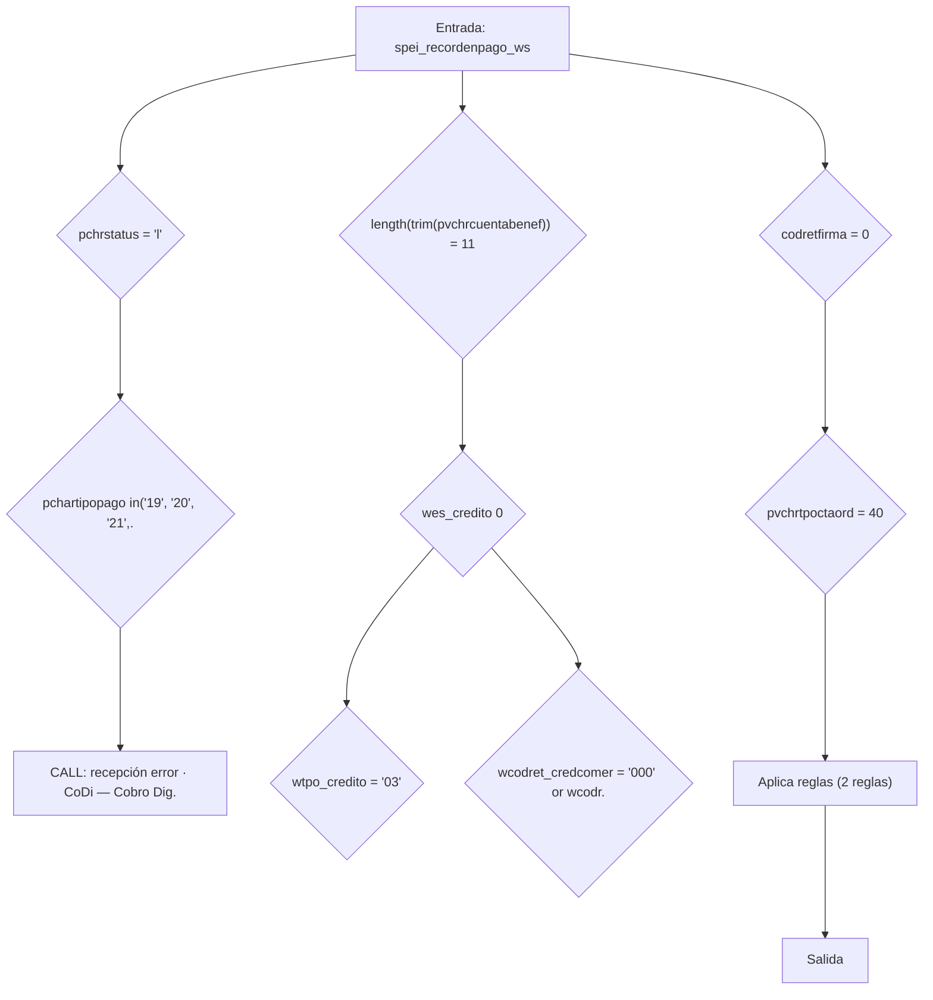
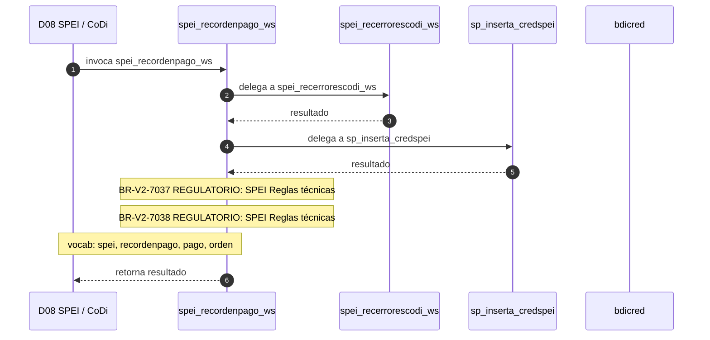

# SP Profile: `spei_recordenpago_ws`

> **Base de datos**: `bdispei` · Dominio D08 — SPEI / CoDi
> **Tipo de artefacto**: Perfil funcional · Gemelo Cognitivo — Capa 4: Intencion
> **Ultima actualizacion**: 2026-08-03
> **Estado**: ACTIVO · 0 callers en produccion

---

## Historia Funcional

El SP `spei_recordenpago_ws` implementa la logica de recibe orden de pago en el dominio SPEI / CoDi (base de datos `bdispei`). Comprende 2,295 lineas de codigo, 23 tablas consultadas. Delega logica a: `spei_recerrorescodi_ws`, `sp_inserta_credspei`, `bdicred`.

---

## Relaciones en la KB

| Tipo de relacion | Documento |
|-----------------|-----------|
| Cross-reference de reglas y vocabulario | [../cross-reference/sp-rules-vocab-map.md](../cross-reference/sp-rules-vocab-map.md) |
| Indice regulatorio | [../cross-reference/regulatory-sp-index.md](../cross-reference/regulatory-sp-index.md) |
| Dependencias del dominio D08 | [../D08-bdispei/07-dependencies.md](../D08-bdispei/07-dependencies.md) |
| Reglas globales del sistema | [../rules/business-rules-bcop.md](../rules/business-rules-bcop.md) |
| Vocabulario del sistema | [../vocabulary/vocabulary-knowledge-base-bcop.md](../vocabulary/vocabulary-knowledge-base-bcop.md) |
| Vista HTML interactiva | [../../portal/sp-detail/sp-detail-spei_recordenpago_ws.html](../../portal/sp-detail/sp-detail-spei_recordenpago_ws.html) |

---

## Metricas del Gemelo Cognitivo

| Metrica | Valor |
|---------|-------|
| Fan-in (callers) | **0** |
| Fan-out (callees) | **12** |
| Callees principales | `spei_recerrorescodi_ws`, `sp_inserta_credspei`, `bdicred` |
| LOC | **2,295** |
| Tablas consultadas | 23 |
| Reglas de negocio activas | **2** |
| Autores historicos | 0 |

---

## Flujo de Decision

---

## Diagrama de Secuencia con Reglas y Vocabulario

---

## Reglas de Negocio Activas

| ID | Tipo | Categoria | Linea | Codigo | Referencia |
|----|------|-----------|-------|--------|------------|
| BR-V2-7037 | FÓRMULA | REGULATORIO | 1133 | `vmonto_udi = pmnyimporte / vprecio_udi` | SPEI Reglas técnicas — irrevocabilidad, clave rastreo, ventana 07:00-17:30, SLA < 20 s |
| BR-V2-7038 | FÓRMULA | REGULATORIO | 1136 | `vmtopagosudi = vmtoacumcta / vprecio_udi` | SPEI Reglas técnicas — irrevocabilidad, clave rastreo, ventana 07:00-17:30, SLA < 20 s |

---

## Vocabulario Clave

| Termino | Categoria | Nivel | Significado |
|---------|-----------|-------|-------------|
| `spei` | PREFIJO | ALTA | familia SPEI (pagos interbancarios) |
| `recordenpago` | ACCION | ALTA | recibe orden de pago |
| `pago` | ENTIDAD | ALTA | pago |
| `orden` | ENTIDAD | ALTA | orden |
| `ordenpago` | ENTIDAD | ALTA | orden de pago |

---

## Nota de Migracion

Las 2 reglas con categoria REGULATORIO son las mas sensibles en la migracion y deben ser validadas por el SME de Industry Banking Accounting contra el CUB vigente.
El nombre contiene tokens sinteticos (`?_ws`), lo que indica que el alcance original fue parcialmente documentado por el equipo historico.

Ver registro completo de riesgos: [migration-risk-register.md](../migration-risk-register.md).
