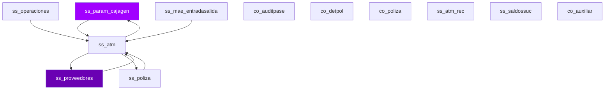

# D10 · Sucursales — Modelo Entidad-Relación (Inferido)

> **Componente:** Informix · SPE-AM-001 · Etapa 1
> **Base de datos:** `bdisuc` · IBM Informix IDS 14.10 / POWER-AIX
> **Wave:** Wave 3 · Riesgo: **ALTO**
> **Última actualización:** 2026-07-03

---
**SME responsable:**
- Specialist — Informix SPL Analysis (análisis estático, code extraction)
- DBA — IBM Informix IDS (schema real vía syscolumns — Etapa 2) ← NUEVO
- Industry Banking + Domain Expert BanCoppel (validación funcional)
- Cybersecurity (riesgos PII, regulación CNBV/LFPDPPP)
- QA Lead — Equivalencia Funcional (estrategia de pruebas) ← NUEVO
- Cloud Architect AWS Banking (arquitectura target) ← NUEVO
> [SME-PENDING] = requiere sesión de validación antes de Etapa 2.
---

## Metodología

Tablas inferidas de análisis estático de **70 archivos SQL** (`FROM`, `INSERT INTO`, `UPDATE`, `DELETE FROM`).
Columnas inferidas de listas `INSERT INTO tbl (col1, col2, ...)`.
Relaciones inferidas del conocimiento de dominio — Informix no declara `FOREIGN KEY` formalmente.

## Diagrama ER — tablas core (Mermaid)



> Renderizable en GitHub o VSCode con extensión Mermaid Preview.

## Inventario de entidades propias de `bdisuc` (muestra)

| Tabla | Tipo | PK inferida | Lectores | Escritores |
|-------|------|-------------|----------|------------|
| `ss_param_cajagen` | Catálogo / Config | `id_caja` | 15 | 9 |
| `ss_proveedores` | Transaccional | `[SME-PENDING]` | 8 | 1 |
| `ss_poliza` | Transaccional | `num_poliza` | 4 | 4 |
| `ss_operaciones` | Transaccional | `[SME-PENDING]` | 5 | 3 |
| `ss_mae_entradasalida` | Maestro | `[SME-PENDING]` | 5 | 2 |
| `ss_atm` | Transaccional | `[SME-PENDING]` | 3 | 3 |
| `co_auditpase` | Log / Bitácora | `[SME-PENDING]` | 2 | 2 |
| `co_detpol` | Transaccional | `[SME-PENDING]` | 2 | 2 |
| `co_poliza` | Transaccional | `num_poliza` | 2 | 2 |
| `ss_atm_rec` | Transaccional | `[SME-PENDING]` | 2 | 2 |
| `ss_saldossuc` | Transaccional | `[SME-PENDING]` | 0 | 4 |
| `co_auxiliar` | Transaccional | `[SME-PENDING]` | 2 | 0 |
| `co_poldet` | Transaccional | `[SME-PENDING]` | 2 | 0 |
| `ss_cajageneral` | Transaccional | `id_caja` | 1 | 1 |
| `ss_contproc` | Transaccional | `[SME-PENDING]` | 1 | 1 |
| `SS_Param_cajagen` | Catálogo / Config | `id_caja` | 2 | 0 |
| `ss_catstatus` | Transaccional | `[SME-PENDING]` | 2 | 0 |
| `syscolumns` | Transaccional | `[SME-PENDING]` | 1 | 0 |
| `systables` | Transaccional | `[SME-PENDING]` | 1 | 0 |
| `sysindexes` | Transaccional | `[SME-PENDING]` | 1 | 0 |
| `statistics` | Transaccional | `[SME-PENDING]` | 0 | 1 |
| `ss_saldossuc_arqueo` | Transaccional | `[SME-PENDING]` | 0 | 1 |
| `ss_reportecedula` | Reportería / Temporal | `[SME-PENDING]` | 1 | 0 |
| `ss_arqueo_panamericano` | Transaccional | `[SME-PENDING]` | 0 | 1 |
| `resplogifx` | Transaccional | `[SME-PENDING]` | 1 | 0 |

## Tablas externas accedidas (cross-DB)

| DB externa | Tabla | Lecturas | Escrituras | Notas |
|-----------|-------|----------|-----------|-------|
| `bdicont` | `co_detpol` | 5 SPs | 4 SPs | Cross-DB → API interna en target |
| `bdicont` | `co_poliza` | 4 SPs | 5 SPs | Cross-DB → API interna en target |
| `bdicont` | `co_poldet` | 5 SPs | 5 SPs | Cross-DB → API interna en target |
| `bdicont` | `co_poldet_20240518` | 2 SPs | 0 SPs | Cross-DB → API interna en target |
| `bdicont` | `` | 1 SPs | 1 SPs | Cross-DB → API interna en target |
| `bdinteg` | `si_regional` | 2 SPs | 0 SPs | Cross-DB → API interna en target |
| `bdinteg` | `si_sucursales` | 14 SPs | 0 SPs | Cross-DB → API interna en target |
| `bdinteg` | `si_catalog` | 2 SPs | 0 SPs | Cross-DB → API interna en target |
| `bdinteg` | `si_plazas_cajagen` | 4 SPs | 0 SPs | Cross-DB → API interna en target |
| `bdinteg` | `si_fechas` | 8 SPs | 0 SPs | Cross-DB → API interna en target |
| `bdisuc` | `ss_mae_entradasalida` | 10 SPs | 6 SPs | Cross-DB → API interna en target |
| `bdisuc` | `` | 45 SPs | 34 SPs | Cross-DB → API interna en target |
| `bdisuc` | `ss_operaciones` | 16 SPs | 1 SPs | Cross-DB → API interna en target |
| `bdisuc` | `ss_cajageneral` | 5 SPs | 0 SPs | Cross-DB → API interna en target |
| `bdisuc` | `ss_proveedores` | 17 SPs | 0 SPs | Cross-DB → API interna en target |
| `sysmaster` | `sysshmvals` | 5 SPs | 0 SPs | Cross-DB → API interna en target |
| `sysmaster` | `` | 2 SPs | 0 SPs | Cross-DB → API interna en target |

## Detalle de columnas — tablas con columnas inferidas

### `ss_cajageneral` — Transaccional

| Columna | Tipo Informix | Tipo PostgreSQL target | PII |
|---------|--------------|----------------------|-----|
| `cantidad_1` | [SME-PENDING] | [SME-PENDING] |  |
| `cantidad_10` | [SME-PENDING] | [SME-PENDING] |  |
| `cantidad_10d` | [SME-PENDING] | [SME-PENDING] |  |
| `cantidad_11` | [SME-PENDING] | [SME-PENDING] |  |
| `cantidad_11d` | [SME-PENDING] | [SME-PENDING] |  |
| `cantidad_12` | [SME-PENDING] | [SME-PENDING] |  |
| `cantidad_12d` | [SME-PENDING] | [SME-PENDING] |  |
| `cantidad_13` | [SME-PENDING] | [SME-PENDING] |  |
| `cantidad_13d` | [SME-PENDING] | [SME-PENDING] |  |
| `cantidad_14` | [SME-PENDING] | [SME-PENDING] |  |
| `cantidad_14d` | [SME-PENDING] | [SME-PENDING] |  |
| `cantidad_15` | [SME-PENDING] | [SME-PENDING] |  |
| `cantidad_15d` | [SME-PENDING] | [SME-PENDING] |  |
| `cantidad_1d` | [SME-PENDING] | [SME-PENDING] |  |
| `cantidad_2` | [SME-PENDING] | [SME-PENDING] |  |

### `ss_operaciones` — Transaccional

| Columna | Tipo Informix | Tipo PostgreSQL target | PII |
|---------|--------------|----------------------|-----|
| `cantidad_1` | [SME-PENDING] | [SME-PENDING] |  |
| `cantidad_10` | [SME-PENDING] | [SME-PENDING] |  |
| `cantidad_11` | [SME-PENDING] | [SME-PENDING] |  |
| `cantidad_12` | [SME-PENDING] | [SME-PENDING] |  |
| `cantidad_13` | [SME-PENDING] | [SME-PENDING] |  |
| `cantidad_14` | [SME-PENDING] | [SME-PENDING] |  |
| `cantidad_15` | [SME-PENDING] | [SME-PENDING] |  |
| `cantidad_2` | [SME-PENDING] | [SME-PENDING] |  |
| `cantidad_3` | [SME-PENDING] | [SME-PENDING] |  |
| `cantidad_4` | [SME-PENDING] | [SME-PENDING] |  |
| `cantidad_5` | [SME-PENDING] | [SME-PENDING] |  |
| `cantidad_6` | [SME-PENDING] | [SME-PENDING] |  |
| `cantidad_7` | [SME-PENDING] | [SME-PENDING] |  |
| `cantidad_8` | [SME-PENDING] | [SME-PENDING] |  |
| `cantidad_9` | [SME-PENDING] | [SME-PENDING] |  |

### `ss_atm_rec` — Transaccional

| Columna | Tipo Informix | Tipo PostgreSQL target | PII |
|---------|--------------|----------------------|-----|
| `cantidad_1` | [SME-PENDING] | [SME-PENDING] |  |
| `cantidad_10` | [SME-PENDING] | [SME-PENDING] |  |
| `cantidad_11` | [SME-PENDING] | [SME-PENDING] |  |
| `cantidad_12` | [SME-PENDING] | [SME-PENDING] |  |
| `cantidad_13` | [SME-PENDING] | [SME-PENDING] |  |
| `cantidad_14` | [SME-PENDING] | [SME-PENDING] |  |
| `cantidad_15` | [SME-PENDING] | [SME-PENDING] |  |
| `cantidad_2` | [SME-PENDING] | [SME-PENDING] |  |
| `cantidad_3` | [SME-PENDING] | [SME-PENDING] |  |
| `cantidad_4` | [SME-PENDING] | [SME-PENDING] |  |
| `cantidad_5` | [SME-PENDING] | [SME-PENDING] |  |
| `cantidad_6` | [SME-PENDING] | [SME-PENDING] |  |
| `cantidad_7` | [SME-PENDING] | [SME-PENDING] |  |
| `cantidad_8` | [SME-PENDING] | [SME-PENDING] |  |
| `cantidad_9` | [SME-PENDING] | [SME-PENDING] |  |

### `ss_saldossuc` — Transaccional

| Columna | Tipo Informix | Tipo PostgreSQL target | PII |
|---------|--------------|----------------------|-----|
| `cajero_principal` | [SME-PENDING] | [SME-PENDING] |  |
| `cantidad_1` | [SME-PENDING] | [SME-PENDING] |  |
| `cantidad_10` | [SME-PENDING] | [SME-PENDING] |  |
| `cantidad_11` | [SME-PENDING] | [SME-PENDING] |  |
| `cantidad_12` | [SME-PENDING] | [SME-PENDING] |  |
| `cantidad_13` | [SME-PENDING] | [SME-PENDING] |  |
| `cantidad_14` | [SME-PENDING] | [SME-PENDING] |  |
| `cantidad_15` | [SME-PENDING] | [SME-PENDING] |  |
| `cantidad_2` | [SME-PENDING] | [SME-PENDING] |  |
| `cantidad_3` | [SME-PENDING] | [SME-PENDING] |  |
| `cantidad_4` | [SME-PENDING] | [SME-PENDING] |  |
| `cantidad_5` | [SME-PENDING] | [SME-PENDING] |  |
| `cantidad_6` | [SME-PENDING] | [SME-PENDING] |  |
| `cantidad_7` | [SME-PENDING] | [SME-PENDING] |  |
| `cantidad_8` | [SME-PENDING] | [SME-PENDING] |  |

## Tablas core del dominio (conocimiento de dominio)

| Tabla | Tipo esperado | Notas |
|-------|--------------|-------|
| `suc_caja` | Transaccional | Confirmar existencia y esquema con DBA |
| `suc_bym_pieza` | Transaccional | Confirmar existencia y esquema con DBA |
| `suc_bym_inventario` | Transaccional | Confirmar existencia y esquema con DBA |
| `suc_movimiento` | Transaccional | Confirmar existencia y esquema con DBA |
| `suc_dictamen` | Transaccional | Confirmar existencia y esquema con DBA |
| `suc_catdenominacion` | Transaccional | Confirmar existencia y esquema con DBA |

## Pendientes Etapa 2

```sql
-- Ejecutar en instancia Informix `bdisuc` para obtener schema real:
SELECT t.tabname, c.colname, c.coltype, c.collength, c.colno
FROM systables t JOIN syscolumns c ON t.tabid = c.tabid
WHERE t.owner = 'informix'
ORDER BY t.tabname, c.colno;
```

- [ ] Confirmar política de retención por tabla (especialmente tablas `_his`)
- [ ] Identificar todos los campos PII — datos sujetos a LFPDPPP
- [ ] Verificar si tablas `_tmp` / `_temp` se crean dinámicamente o son permanentes
- [ ] Confirmar cardinalidades reales en producción
- [ ] Validar relaciones implícitas (FK lógicas sin constraint formal)


---
*Generado por: Specialist — Informix SPL Analysis · 2026-07-03 · Evidencia: source/informix/bdisuc_*.sql (análisis estático de 70 archivos SQL) · análisis estático de archivos SQL*
