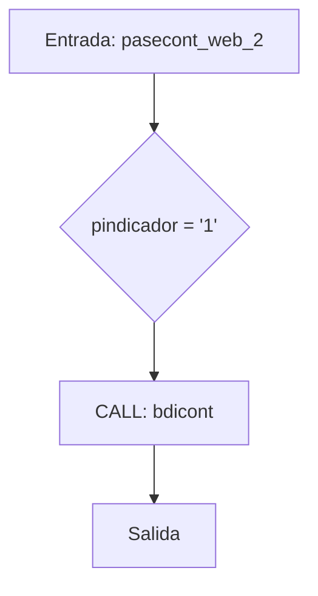
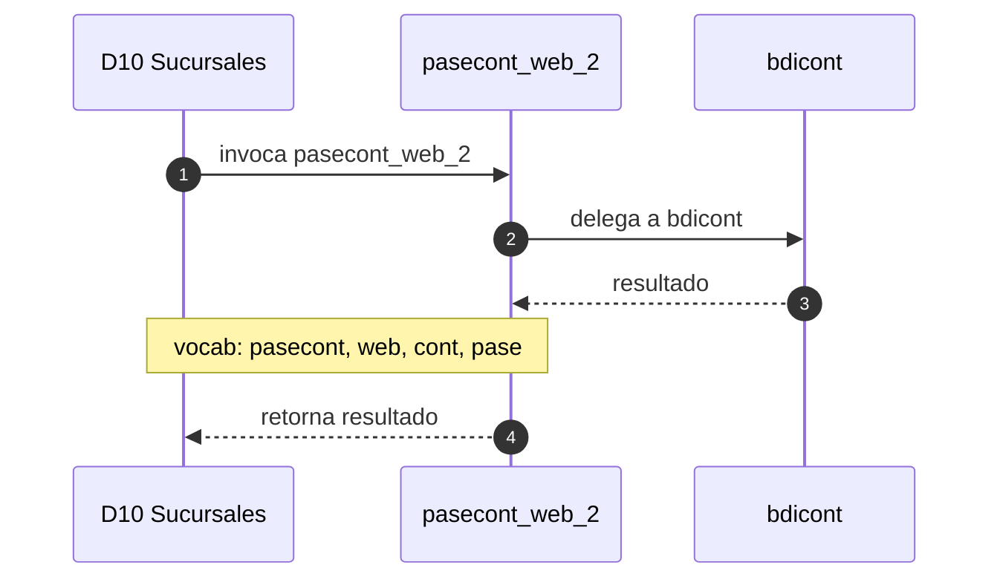

# SP Profile: `pasecont_web_2`

> **Base de datos**: `bdisuc` · Dominio D10 — Sucursales
> **Tipo de artefacto**: Perfil funcional · Gemelo Cognitivo — Capa 4: Intencion
> **Ultima actualizacion**: 2026-08-03
> **Estado**: ACTIVO · 0 callers en produccion

---

## Historia Funcional

El SP `pasecont_web_2` implementa la logica de realiza el pase contable (canal web) en el dominio Sucursales (base de datos `bdisuc`). Comprende 1,870 lineas de codigo, 7 tablas consultadas. Delega logica a: `bdicont`.

---

## Relaciones en la KB

| Tipo de relacion | Documento |
|-----------------|-----------|
| Cross-reference de reglas y vocabulario | [../cross-reference/sp-rules-vocab-map.md](../cross-reference/sp-rules-vocab-map.md) |
| Dependencias del dominio D10 | [../D10-bdisuc/07-dependencies.md](../D10-bdisuc/07-dependencies.md) |
| Reglas globales del sistema | [../rules/business-rules-bcop.md](../rules/business-rules-bcop.md) |
| Vocabulario del sistema | [../vocabulary/vocabulary-knowledge-base-bcop.md](../vocabulary/vocabulary-knowledge-base-bcop.md) |
| Vista HTML interactiva | [../../portal/sp-detail/sp-detail-pasecont_web_2.html](../../portal/sp-detail/sp-detail-pasecont_web_2.html) |

---

## Metricas del Gemelo Cognitivo

| Metrica | Valor |
|---------|-------|
| Fan-in (callers) | **0** |
| Fan-out (callees) | **2** |
| Callees principales | `bdicont` |
| LOC | **1,870** |
| Tablas consultadas | 7 |
| Reglas de negocio activas | **0** |
| Autores historicos | 0 |

---

## Flujo de Decision

---

## Diagrama de Secuencia con Reglas y Vocabulario

---

## Reglas de Negocio Activas

_No se detectaron reglas de negocio para este proceso._

---

## Vocabulario Clave

| Termino | Categoria | Nivel | Significado |
|---------|-----------|-------|-------------|
| `pasecont` | ACCION | ALTA | realiza el pase contable (registro a póliza/mayor) |
| `web` | MODIF | ALTA | canal web |
| `cont` | PREFIJO | ALTA | familia contabilidad |
| `pase` | ACCION | ALTA | pase contable (registra/traslada a póliza o mayor) |

---

## Nota de Migracion

El nombre contiene tokens sinteticos (`?_2`), lo que indica que el alcance original fue parcialmente documentado por el equipo historico.

Ver registro completo de riesgos: [migration-risk-register.md](../migration-risk-register.md).
