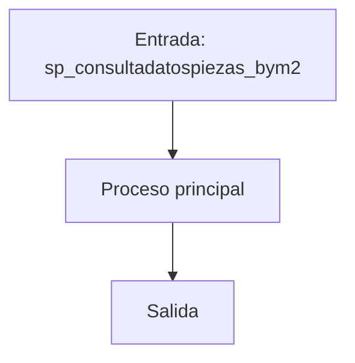
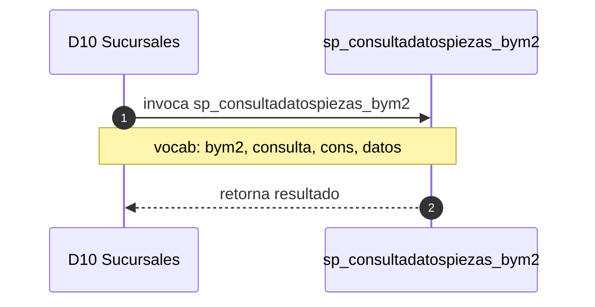

# SP Profile: `sp_consultadatospiezas_bym2`

> **Base de datos**: `bdisuc` · Dominio D10 — Sucursales
> **Tipo de artefacto**: Perfil funcional · Gemelo Cognitivo — Capa 4: Intencion
> **Ultima actualizacion**: 2026-08-03
> **Estado**: ACTIVO · 376 callers en produccion

---

## Historia Funcional

El SP `sp_consultadatospiezas_bym2` implementa la logica de consulta datos, piezas de efectivo y Billetes y Monedas en el dominio Sucursales (base de datos `bdisuc`). Comprende 2,164 lineas de codigo, 13 tablas consultadas. Es invocado por 376 callers en el sistema, lo que lo convierte en un componente de alta dependencia. 

---

## Relaciones en la KB

| Tipo de relacion | Documento |
|-----------------|-----------|
| Cross-reference de reglas y vocabulario | [../cross-reference/sp-rules-vocab-map.md](../cross-reference/sp-rules-vocab-map.md) |
| Dependencias del dominio D10 | [../D10-bdisuc/07-dependencies.md](../D10-bdisuc/07-dependencies.md) |
| Reglas globales del sistema | [../rules/business-rules-bcop.md](../rules/business-rules-bcop.md) |
| Vocabulario del sistema | [../vocabulary/vocabulary-knowledge-base-bcop.md](../vocabulary/vocabulary-knowledge-base-bcop.md) |
| Vista HTML interactiva | [../../portal/sp-detail/sp-detail-sp_consultadatospiezas_bym2.html](../../portal/sp-detail/sp-detail-sp_consultadatospiezas_bym2.html) |

---

## Metricas del Gemelo Cognitivo

| Metrica | Valor |
|---------|-------|
| Fan-in (callers) | **376** |
| Fan-out (callees) | **376** |
| Callees principales | — |
| LOC | **2,164** |
| Tablas consultadas | 13 |
| Reglas de negocio activas | **0** |
| Autores historicos | 0 |

---

## Flujo de Decision

---

## Diagrama de Secuencia con Reglas y Vocabulario

---

## Reglas de Negocio Activas

_No se detectaron reglas de negocio para este proceso._

---

## Vocabulario Clave

| Termino | Categoria | Nivel | Significado |
|---------|-----------|-------|-------------|
| `bym2` | ENTIDAD | MEDIA | Billetes y Monedas (v2) |
| `consulta` | ACCION | ALTA | consulta / lee |
| `cons` | ACCION | ALTA | consulta |
| `datos` | ENTIDAD | ALTA | datos |
| `piezas` | ENTIDAD | ALTA | piezas de efectivo (billetes y monedas) |
| `pieza` | ENTIDAD | ALTA | pieza de efectivo (billete/moneda) |

---

## Nota de Migracion

Sin restricciones regulatorias criticas identificadas en el codigo fuente. Verificar en parallel-run que el comportamiento sea equivalente al del sistema legado.

Ver registro completo de riesgos: [migration-risk-register.md](../migration-risk-register.md).
