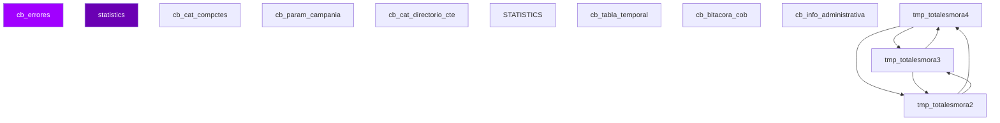

# D11 · Cobranza — Modelo Entidad-Relación (Inferido)

> **Componente:** Informix · SPE-AM-001 · Etapa 1
> **Base de datos:** `bdicobranza` · IBM Informix IDS 14.10 / POWER-AIX
> **Wave:** Wave 2 · Riesgo: **MEDIO**
> **Última actualización:** 2026-07-03

---
**SME responsable:**
- Specialist — Informix SPL Analysis (análisis estático, code extraction)
- DBA — IBM Informix IDS (schema real vía syscolumns — Etapa 2) ← NUEVO
- Industry Banking + Domain Expert BanCoppel (validación funcional)
- Cybersecurity (riesgos PII, regulación CNBV/LFPDPPP)
- QA Lead — Equivalencia Funcional (estrategia de pruebas) ← NUEVO
- Cloud Architect AWS Banking (arquitectura target) ← NUEVO
> [SME-PENDING] = requiere sesión de validación antes de Etapa 2.
---

## Metodología

Tablas inferidas de análisis estático de **70 archivos SQL** (`FROM`, `INSERT INTO`, `UPDATE`, `DELETE FROM`).
Columnas inferidas de listas `INSERT INTO tbl (col1, col2, ...)`.
Relaciones inferidas del conocimiento de dominio — Informix no declara `FOREIGN KEY` formalmente.

## Diagrama ER — tablas core (Mermaid)



> Renderizable en GitHub o VSCode con extensión Mermaid Preview.

## Inventario de entidades propias de `bdicobranza` (muestra)

| Tabla | Tipo | PK inferida | Lectores | Escritores |
|-------|------|-------------|----------|------------|
| `cb_errores` | Log / Bitácora | `[SME-PENDING]` | 13 | 0 |
| `statistics` | Transaccional | `[SME-PENDING]` | 0 | 11 |
| `cb_cat_compctes` | Catálogo / Config | `[SME-PENDING]` | 5 | 5 |
| `cb_param_campania` | Catálogo / Config | `[SME-PENDING]` | 9 | 0 |
| `cb_cat_directorio_cte` | Catálogo / Config | `[SME-PENDING]` | 9 | 0 |
| `STATISTICS` | Transaccional | `[SME-PENDING]` | 0 | 9 |
| `cb_tabla_temporal` | Reportería / Temporal | `[SME-PENDING]` | 7 | 0 |
| `cb_bitacora_cob` | Log / Bitácora | `id_log` | 1 | 4 |
| `cb_info_administrativa` | Transaccional | `[SME-PENDING]` | 1 | 3 |
| `tmp_totalesmora4` | Transaccional | `[SME-PENDING]` | 2 | 2 |
| `tmp_totalesmora3` | Transaccional | `[SME-PENDING]` | 2 | 2 |
| `tmp_totalesmora2` | Transaccional | `[SME-PENDING]` | 2 | 2 |
| `tmp_compagconvsem_mat` | Transaccional | `[SME-PENDING]` | 2 | 2 |
| `tmp_compagconvsem_vesp` | Transaccional | `[SME-PENDING]` | 2 | 2 |
| `tmp_totalesmoratel2` | Transaccional | `[SME-PENDING]` | 2 | 2 |
| `cb_bitacora` | Log / Bitácora | `id_log` | 0 | 4 |
| `systables` | Transaccional | `[SME-PENDING]` | 3 | 0 |
| `informix` | Transaccional | `[SME-PENDING]` | 1 | 2 |
| `tmp_telefonos_buro_2` | Transaccional | `[SME-PENDING]` | 3 | 0 |
| `cb_rep_resultado_sms_hist` | Histórico / Archivado | `secuencial` | 0 | 3 |
| `directorio_cte` | Transaccional | `[SME-PENDING]` | 2 | 1 |
| `sel_hist_reserva` | Histórico / Archivado | `secuencial` | 2 | 0 |
| `reestructura` | Transaccional | `[SME-PENDING]` | 1 | 1 |
| `TRIM` | Transaccional | `[SME-PENDING]` | 2 | 0 |
| `cuentasInv_res` | Transaccional | `num_cta` | 2 | 0 |
| `sms_latinia` | Transaccional | `[SME-PENDING]` | 1 | 1 |
| `tmp_compagconvsemv` | Transaccional | `[SME-PENDING]` | 2 | 0 |
| `tmp_totalesmoratel` | Transaccional | `[SME-PENDING]` | 2 | 0 |
| `cb_cat_acceso_ejecutivo` | Catálogo / Config | `[SME-PENDING]` | 2 | 0 |
| `tmp_compago` | Transaccional | `clave_rastreo` | 2 | 0 |
| `batch` | Transaccional | `[SME-PENDING]` | 1 | 1 |
| `primer_consumo` | Transaccional | `[SME-PENDING]` | 1 | 1 |
| `cb_telefonos` | Transaccional | `[SME-PENDING]` | 2 | 0 |
| `cb_archivoc_cat` | Transaccional | `[SME-PENDING]` | 2 | 0 |
| `tmp_totalesmora` | Transaccional | `[SME-PENDING]` | 2 | 0 |

## Tablas externas accedidas (cross-DB)

| DB externa | Tabla | Lecturas | Escrituras | Notas |
|-----------|-------|----------|-----------|-------|
| `BDICOBRANZA` | `CB_COMPAC` | 1 SPs | 1 SPs | Cross-DB → API interna en target |
| `BDINTEG` | `si_sucursales` | 3 SPs | 0 SPs | Cross-DB → API interna en target |
| `Bdicobranza` | `cb_param` | 1 SPs | 0 SPs | Cross-DB → API interna en target |
| `Bdicobranza` | `cb_gestion_telefonica` | 1 SPs | 1 SPs | Cross-DB → API interna en target |
| `Bdicobranza` | `` | 7 SPs | 0 SPs | Cross-DB → API interna en target |
| `Bdinteg` | `si_direcciones` | 1 SPs | 0 SPs | Cross-DB → API interna en target |
| `bdiaclaracion` | `acl_producto` | 1 SPs | 0 SPs | Cross-DB → API interna en target |
| `bdiaclaracion` | `acl_aclaracion` | 1 SPs | 0 SPs | Cross-DB → API interna en target |
| `bdicheq` | `sc_maechq` | 2 SPs | 0 SPs | Cross-DB → API interna en target |
| `bdicobranza` | `cb_param_campania` | 38 SPs | 0 SPs | Cross-DB → API interna en target |
| `bdicobranza` | `cb_rep_resultado_sms_hist` | 1 SPs | 1 SPs | Cross-DB → API interna en target |
| `bdicobranza` | `cb_info_administrativa_his` | 1 SPs | 0 SPs | Cross-DB → API interna en target |
| `bdicobranza` | `cb_compac_montomin` | 4 SPs | 0 SPs | Cross-DB → API interna en target |
| `bdicobranza` | `cb_formulario_liquidez` | 2 SPs | 0 SPs | Cross-DB → API interna en target |
| `bdicred` | `sd_cifracontroldirectorioaltasycambios` | 1 SPs | 0 SPs | Cross-DB → API interna en target |
| `bdicred` | `sd_fechas` | 19 SPs | 0 SPs | Cross-DB → API interna en target |
| `bdicred` | `sd_conceptospagomanualcrd` | 5 SPs | 0 SPs | Cross-DB → API interna en target |
| `bdicred` | `sd_totalcte_campania` | 2 SPs | 2 SPs | Cross-DB → API interna en target |
| `bdicred` | `sd_movhis` | 10 SPs | 0 SPs | Cross-DB → API interna en target |
| `bdimnsj` | `mnsjr_trx_batch` | 3 SPs | 2 SPs | Cross-DB → API interna en target |
| `bdimnsj` | `mnsjr_trx_batch_his` | 1 SPs | 0 SPs | Cross-DB → API interna en target |
| `bdinteg` | `si_actesp` | 1 SPs | 0 SPs | Cross-DB → API interna en target |
| `bdinteg` | `si_feriado` | 3 SPs | 0 SPs | Cross-DB → API interna en target |
| `bdinteg` | `si_regiones` | 1 SPs | 0 SPs | Cross-DB → API interna en target |
| `bdinteg` | `si_empresas` | 15 SPs | 0 SPs | Cross-DB → API interna en target |
| `bdinteg` | `si_fechas` | 13 SPs | 0 SPs | Cross-DB → API interna en target |
| `bdinvers` | `sv_maeinv` | 2 SPs | 0 SPs | Cross-DB → API interna en target |
| `bdisitesp` | `se_catsitesp` | 2 SPs | 0 SPs | Cross-DB → API interna en target |
| `bdisitesp` | `se_ctessitespcTE` | 1 SPs | 0 SPs | Cross-DB → API interna en target |
| `bdisitesp` | `se_situacionaccion` | 6 SPs | 0 SPs | Cross-DB → API interna en target |
| `bdisitesp` | `se_ctessitespcte` | 8 SPs | 1 SPs | Cross-DB → API interna en target |
| `bdisitesp` | `` | 10 SPs | 3 SPs | Cross-DB → API interna en target |
| `bdisolic` | `ss_solicitudes` | 1 SPs | 0 SPs | Cross-DB → API interna en target |
| `bdisolic` | `ss_detalle_scoring` | 1 SPs | 0 SPs | Cross-DB → API interna en target |
| `bdisolic` | `ss_refpersonales` | 5 SPs | 0 SPs | Cross-DB → API interna en target |
| `bdisolic` | `ss_resum_scor_fin` | 2 SPs | 0 SPs | Cross-DB → API interna en target |
| `bdisolic` | `ss_scoring_element` | 1 SPs | 0 SPs | Cross-DB → API interna en target |
| `sysmaster` | `` | 4 SPs | 0 SPs | Cross-DB → API interna en target |
| `sysmaster` | `sysshmvals` | 10 SPs | 0 SPs | Cross-DB → API interna en target |
| `sysmaster` | `systabnames` | 7 SPs | 0 SPs | Cross-DB → API interna en target |

## Detalle de columnas — tablas con columnas inferidas

### `sd_directorioaltasycambios` — Transaccional

| Columna | Tipo Informix | Tipo PostgreSQL target | PII |
|---------|--------------|----------------------|-----|
| `actividad_economica` | [SME-PENDING] | [SME-PENDING] |  |
| `actividad_gironegocio` | [SME-PENDING] | [SME-PENDING] |  |
| `andador` | [SME-PENDING] | [SME-PENDING] |  |
| `andador_trabajo` | [SME-PENDING] | [SME-PENDING] |  |
| `antig_cliente` | [SME-PENDING] | [SME-PENDING] |  |
| `antiguedad_domicilio` | [SME-PENDING] | [SME-PENDING] | ⚠️ PII |
| `antiguedad_trabajo` | [SME-PENDING] | [SME-PENDING] |  |
| `apell_casada` | [SME-PENDING] | [SME-PENDING] |  |
| `apell_materno` | [SME-PENDING] | [SME-PENDING] |  |
| `apell_paterno` | [SME-PENDING] | [SME-PENDING] |  |
| `causa_sit_esp` | [SME-PENDING] | [SME-PENDING] |  |
| `clave_movimiento` | CHAR(4) | CHAR(4) |  |
| `cod_postal` | CHAR(4) | CHAR(4) |  |
| `cod_postal_trab` | CHAR(4) | CHAR(4) |  |
| `complemento` | [SME-PENDING] | [SME-PENDING] |  |

### `cb_rep_resultado_sms_hist` — Histórico / Archivado

| Columna | Tipo Informix | Tipo PostgreSQL target | PII |
|---------|--------------|----------------------|-----|
| `apell_materno` | [SME-PENDING] | [SME-PENDING] |  |
| `apell_paterno` | [SME-PENDING] | [SME-PENDING] |  |
| `ciudad` | [SME-PENDING] | [SME-PENDING] |  |
| `costo` | [SME-PENDING] | [SME-PENDING] |  |
| `empresa` | [SME-PENDING] | [SME-PENDING] |  |
| `estado` | [SME-PENDING] | [SME-PENDING] |  |
| `estatus_resultado` | CHAR(4) | CHAR(4) |  |
| `fecha_apertura` | DATE | DATE |  |
| `fecha_cambio_estatus` | DATE | DATE |  |
| `fecha_envio` | DATE | DATE |  |
| `fecha_primer_consumo` | DATE | DATE |  |
| `linea_credito` | [SME-PENDING] | [SME-PENDING] |  |
| `monto_transaccion` | MONEY(16,2) | NUMERIC(16,2) |  |
| `mora` | [SME-PENDING] | [SME-PENDING] |  |
| `nombre1` | VARCHAR(100) | VARCHAR(100) | ⚠️ PII |

### `cb_info_administrativa_his` — Histórico / Archivado

| Columna | Tipo Informix | Tipo PostgreSQL target | PII |
|---------|--------------|----------------------|-----|
| `apell_materno` | [SME-PENDING] | [SME-PENDING] |  |
| `apell_paterno` | [SME-PENDING] | [SME-PENDING] |  |
| `causa` | [SME-PENDING] | [SME-PENDING] |  |
| `ciudad` | [SME-PENDING] | [SME-PENDING] |  |
| `cliente` | [SME-PENDING] | [SME-PENDING] |  |
| `credito` | [SME-PENDING] | [SME-PENDING] |  |
| `cuenta` | [SME-PENDING] | [SME-PENDING] |  |
| `empresa` | [SME-PENDING] | [SME-PENDING] |  |
| `estado` | [SME-PENDING] | [SME-PENDING] |  |
| `fecha_ejecucion` | DATE | DATE |  |
| `fecha_pago` | DATE | DATE |  |
| `nombre1` | VARCHAR(100) | VARCHAR(100) | ⚠️ PII |
| `nombre2` | VARCHAR(100) | VARCHAR(100) | ⚠️ PII |
| `num_campania` | INTEGER | INTEGER |  |
| `pago_min` | [SME-PENDING] | [SME-PENDING] |  |

### `cb_info_administrativa` — Transaccional

| Columna | Tipo Informix | Tipo PostgreSQL target | PII |
|---------|--------------|----------------------|-----|
| `*/ pago_venc` | [SME-PENDING] | [SME-PENDING] |  |
| `*/ t_celular` | CHAR(10) | VARCHAR(15) | ⚠️ PII |
| `/*nombre` | VARCHAR(100) | VARCHAR(100) | ⚠️ PII |
| `/*t_trabajo` | [SME-PENDING] | [SME-PENDING] |  |
| `apell_materno` | [SME-PENDING] | [SME-PENDING] |  |
| `apell_paterno` | [SME-PENDING] | [SME-PENDING] |  |
| `ciudad` | [SME-PENDING] | [SME-PENDING] |  |
| `civil` | [SME-PENDING] | [SME-PENDING] |  |
| `cliente` | [SME-PENDING] | [SME-PENDING] |  |
| `credito` | [SME-PENDING] | [SME-PENDING] |  |
| `estado` | [SME-PENDING] | [SME-PENDING] |  |
| `ext` | [SME-PENDING] | [SME-PENDING] |  |
| `fecha_ejecucion` | DATE | DATE |  |
| `nombre` | VARCHAR(100) | VARCHAR(100) | ⚠️ PII |
| `nombre1` | VARCHAR(100) | VARCHAR(100) | ⚠️ PII |

## Tablas core del dominio (conocimiento de dominio)

| Tabla | Tipo esperado | Notas |
|-------|--------------|-------|
| `cob_cuenta` | Transaccional | Confirmar existencia y esquema con DBA |
| `cob_bitacora` | Log / Bitácora | Confirmar existencia y esquema con DBA |
| `cob_acuerdo` | Transaccional | Confirmar existencia y esquema con DBA |
| `cob_cargo_mora` | Transaccional | Confirmar existencia y esquema con DBA |
| `cob_estatus` | Transaccional | Confirmar existencia y esquema con DBA |
| `cob_gestion` | Transaccional | Confirmar existencia y esquema con DBA |

## Pendientes Etapa 2

```sql
-- Ejecutar en instancia Informix `bdicobranza` para obtener schema real:
SELECT t.tabname, c.colname, c.coltype, c.collength, c.colno
FROM systables t JOIN syscolumns c ON t.tabid = c.tabid
WHERE t.owner = 'informix'
ORDER BY t.tabname, c.colno;
```

- [ ] Confirmar política de retención por tabla (especialmente tablas `_his`)
- [ ] Identificar todos los campos PII — datos sujetos a LFPDPPP
- [ ] Verificar si tablas `_tmp` / `_temp` se crean dinámicamente o son permanentes
- [ ] Confirmar cardinalidades reales en producción
- [ ] Validar relaciones implícitas (FK lógicas sin constraint formal)


---
*Generado por: Specialist — Informix SPL Analysis · 2026-07-03 · Evidencia: source/informix/bdicobranza_*.sql (análisis estático de 70 archivos SQL) · análisis estático de archivos SQL*
