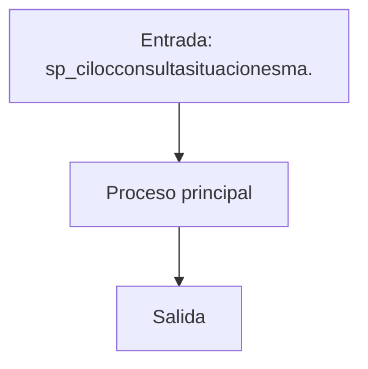
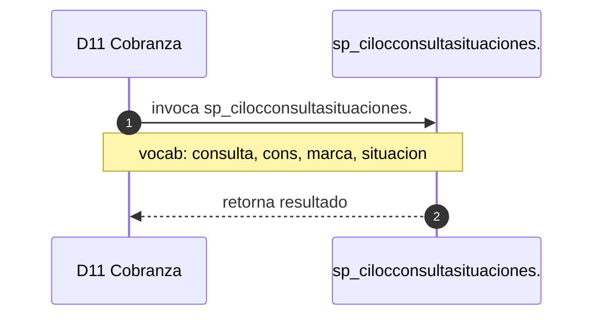

# SP Profile: `sp_cilocconsultasituacionesmarcas`

> **Base de datos**: `bdicobranza` · Dominio D11 — Cobranza
> **Tipo de artefacto**: Perfil funcional · Gemelo Cognitivo — Capa 4: Intencion
> **Ultima actualizacion**: 2026-08-03
> **Estado**: ACTIVO · 0 callers en produccion

---

## Historia Funcional

El SP `sp_cilocconsultasituacionesmarcas` implementa la logica de consulta local situaciones de cuenta y marcas de cuenta en el dominio Cobranza (base de datos `bdicobranza`). Comprende 2,007 lineas de codigo, 1 tablas consultadas. 

---

## Relaciones en la KB

| Tipo de relacion | Documento |
|-----------------|-----------|
| Cross-reference de reglas y vocabulario | [../cross-reference/sp-rules-vocab-map.md](../cross-reference/sp-rules-vocab-map.md) |
| Dependencias del dominio D11 | [../D11-bdicobranza/07-dependencies.md](../D11-bdicobranza/07-dependencies.md) |
| Reglas globales del sistema | [../rules/business-rules-bcop.md](../rules/business-rules-bcop.md) |
| Vocabulario del sistema | [../vocabulary/vocabulary-knowledge-base-bcop.md](../vocabulary/vocabulary-knowledge-base-bcop.md) |
| Vista HTML interactiva | [../../portal/sp-detail/sp-detail-sp_cilocconsultasituacionesmarcas.html](../../portal/sp-detail/sp-detail-sp_cilocconsultasituacionesmarcas.html) |

---

## Metricas del Gemelo Cognitivo

| Metrica | Valor |
|---------|-------|
| Fan-in (callers) | **0** |
| Fan-out (callees) | **6** |
| Callees principales | — |
| LOC | **2,007** |
| Tablas consultadas | 1 |
| Reglas de negocio activas | **0** |
| Autores historicos | 0 |

---

## Flujo de Decision

---

## Diagrama de Secuencia con Reglas y Vocabulario

---

## Reglas de Negocio Activas

_No se detectaron reglas de negocio para este proceso._

---

## Vocabulario Clave

| Termino | Categoria | Nivel | Significado |
|---------|-----------|-------|-------------|
| `consulta` | ACCION | ALTA | consulta / lee |
| `cons` | ACCION | ALTA | consulta |
| `marca` | ENTIDAD | ALTA | marca |
| `situacion` | ENTIDAD | ALTA | situación |
| `ciloc` | PREFIJO | MEDIA | consulta local de cobranza |
| `marcas` | ENTIDAD | ALTA | marcas de cuenta |
| `situaciones` | ENTIDAD | ALTA | situaciones de cuenta |
| `cilocconsulta` | ACCION | ALTA | consulta local (cobranza) |

---

## Nota de Migracion

Sin restricciones regulatorias criticas identificadas en el codigo fuente. Verificar en parallel-run que el comportamiento sea equivalente al del sistema legado.

Ver registro completo de riesgos: [migration-risk-register.md](../migration-risk-register.md).
