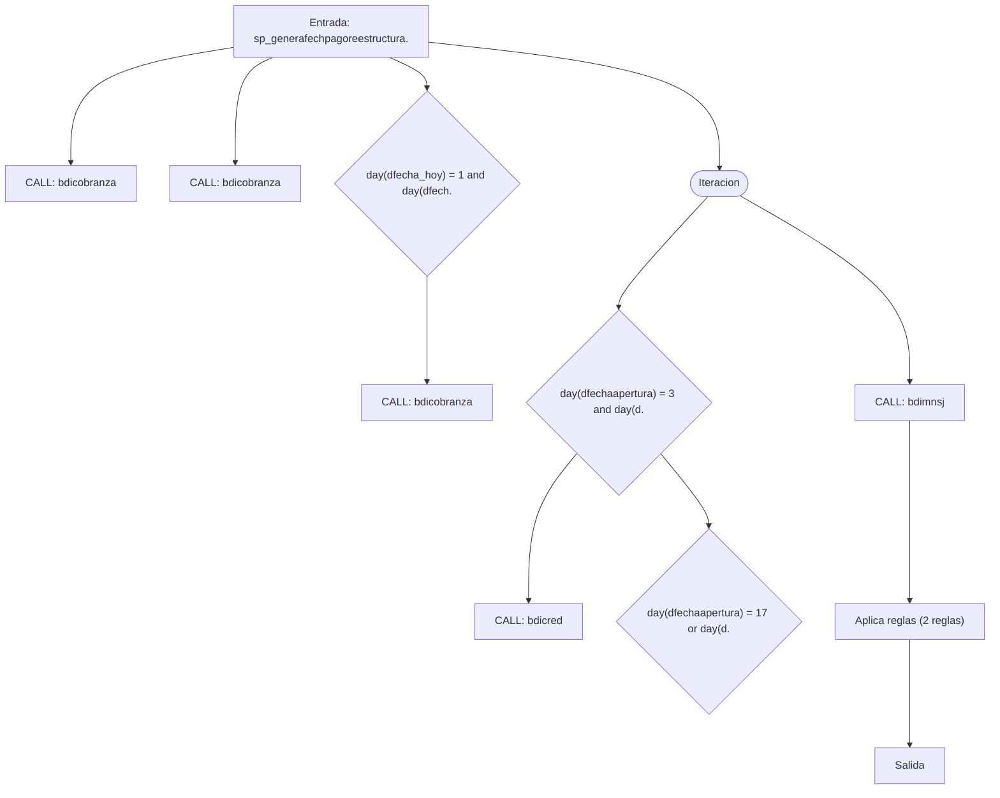
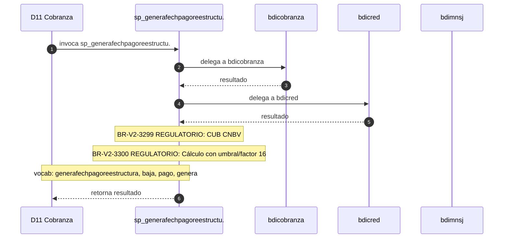

# SP Profile: `sp_generafechpagoreestructura_baja`

> **Base de datos**: `bdicobranza` · Dominio D11 — Cobranza
> **Tipo de artefacto**: Perfil funcional · Gemelo Cognitivo — Capa 4: Intencion
> **Ultima actualizacion**: 2026-08-03
> **Estado**: ACTIVO · 0 callers en produccion

---

## Historia Funcional

El SP `sp_generafechpagoreestructura_baja` implementa la logica de genera fecha de pago de reestructura (de baja) en el dominio Cobranza (base de datos `bdicobranza`). Comprende 2,585 lineas de codigo, 16 tablas consultadas. Delega logica a: `bdicobranza`, `bdicred`, `bdimnsj`.

---

## Relaciones en la KB

| Tipo de relacion | Documento |
|-----------------|-----------|
| Cross-reference de reglas y vocabulario | [../cross-reference/sp-rules-vocab-map.md](../cross-reference/sp-rules-vocab-map.md) |
| Dependencias del dominio D11 | [../D11-bdicobranza/07-dependencies.md](../D11-bdicobranza/07-dependencies.md) |
| Reglas globales del sistema | [../rules/business-rules-bcop.md](../rules/business-rules-bcop.md) |
| Vocabulario del sistema | [../vocabulary/vocabulary-knowledge-base-bcop.md](../vocabulary/vocabulary-knowledge-base-bcop.md) |
| Vista HTML interactiva | [../../portal/sp-detail/sp-detail-sp_generafechpagoreestructura_baja.html](../../portal/sp-detail/sp-detail-sp_generafechpagoreestructura_baja.html) |

---

## Metricas del Gemelo Cognitivo

| Metrica | Valor |
|---------|-------|
| Fan-in (callers) | **0** |
| Fan-out (callees) | **8** |
| Callees principales | `bdicobranza`, `bdicred`, `bdimnsj` |
| LOC | **2,585** |
| Tablas consultadas | 16 |
| Reglas de negocio activas | **2** |
| Autores historicos | 0 |

---

## Flujo de Decision

---

## Diagrama de Secuencia con Reglas y Vocabulario

---

## Reglas de Negocio Activas

| ID | Tipo | Categoria | Linea | Codigo | Referencia |
|----|------|-----------|-------|--------|------------|
| BR-V2-3299 | FÓRMULA | REGULATORIO | 258 | `vSdoTotal1 = (NVL(vSdoCap,0) + NVL(vMtoVencido,0) + NVL(vMto` | CUB CNBV — calificación cartera vencida y constitución de reservas |
| BR-V2-3300 | FÓRMULA | REGULATORIO | 259 | `vMtoVencido1 = (NVL(vMtoVencido,0) + NVL(vMtoVencTrasp,0)) +` | CUB CNBV — calificación cartera vencida y constitución de reservas |

---

## Vocabulario Clave

| Termino | Categoria | Nivel | Significado |
|---------|-----------|-------|-------------|
| `generafechpagoreestructura` | ACCION | ALTA | genera fecha de pago de reestructura |
| `baja` | MODIF | ALTA | de baja |
| `pago` | ENTIDAD | ALTA | pago |
| `genera` | ACCION | ALTA | genera / produce |
| `reestructura` | ACCION | ALTA | reestructura crédito |

---

## Nota de Migracion

Las 2 reglas con categoria REGULATORIO son las mas sensibles en la migracion y deben ser validadas por el SME de Industry Banking Accounting contra el CUB vigente.

Ver registro completo de riesgos: [migration-risk-register.md](../migration-risk-register.md).
