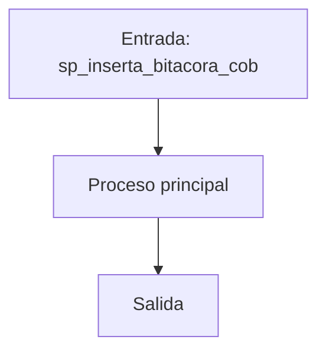
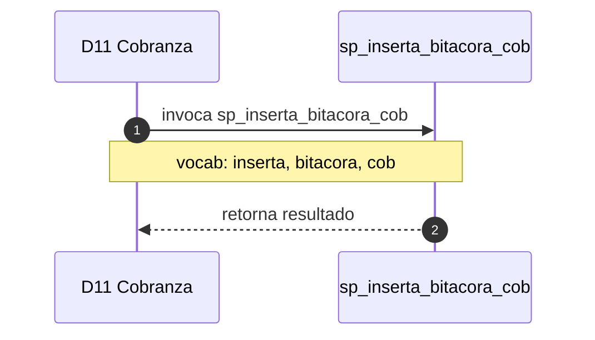

# SP Profile: `sp_inserta_bitacora_cob`

> **Base de datos**: `bdicobranza` · Dominio D11 — Cobranza
> **Tipo de artefacto**: Perfil funcional · Gemelo Cognitivo — Capa 4: Intencion
> **Ultima actualizacion**: 2026-08-03
> **Estado**: ACTIVO · 406 callers en produccion

---

## Historia Funcional

El SP `sp_inserta_bitacora_cob` implementa la logica de inserta bitácora en el dominio Cobranza (base de datos `bdicobranza`). Comprende 56 lineas de codigo, 2 tablas consultadas. Es invocado por 406 callers en el sistema, lo que lo convierte en un componente de alta dependencia. 

---

## Relaciones en la KB

| Tipo de relacion | Documento |
|-----------------|-----------|
| Cross-reference de reglas y vocabulario | [../cross-reference/sp-rules-vocab-map.md](../cross-reference/sp-rules-vocab-map.md) |
| Dependencias del dominio D11 | [../D11-bdicobranza/07-dependencies.md](../D11-bdicobranza/07-dependencies.md) |
| Reglas globales del sistema | [../rules/business-rules-bcop.md](../rules/business-rules-bcop.md) |
| Vocabulario del sistema | [../vocabulary/vocabulary-knowledge-base-bcop.md](../vocabulary/vocabulary-knowledge-base-bcop.md) |
| Vista HTML interactiva | [../../portal/sp-detail/sp-detail-sp_inserta_bitacora_cob.html](../../portal/sp-detail/sp-detail-sp_inserta_bitacora_cob.html) |

---

## Metricas del Gemelo Cognitivo

| Metrica | Valor |
|---------|-------|
| Fan-in (callers) | **406** |
| Fan-out (callees) | **197** |
| Callees principales | — |
| LOC | **56** |
| Tablas consultadas | 2 |
| Reglas de negocio activas | **0** |
| Autores historicos | 0 |

---

## Flujo de Decision

---

## Diagrama de Secuencia con Reglas y Vocabulario

---

## Reglas de Negocio Activas

_No se detectaron reglas de negocio para este proceso._

---

## Vocabulario Clave

| Termino | Categoria | Nivel | Significado |
|---------|-----------|-------|-------------|
| `inserta` | ACCION | ALTA | inserta / registra |
| `bitacora` | ENTIDAD | ALTA | bitácora |
| `cob` | ENTIDAD | ALTA | cob — cobranza (abreviación de dominio — sp_repcob_*, sp_obtienecob_* — bdicobranza) |

---

## Nota de Migracion

Sin restricciones regulatorias criticas identificadas en el codigo fuente. Verificar en parallel-run que el comportamiento sea equivalente al del sistema legado.

Ver registro completo de riesgos: [migration-risk-register.md](../migration-risk-register.md).
