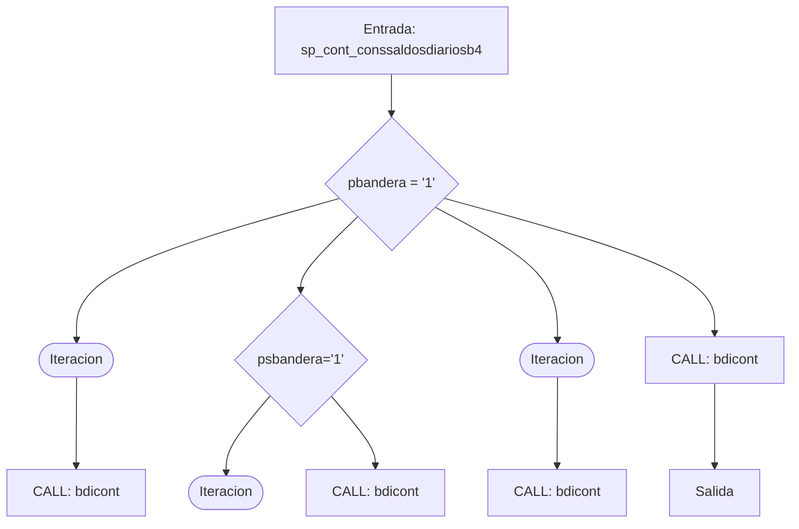
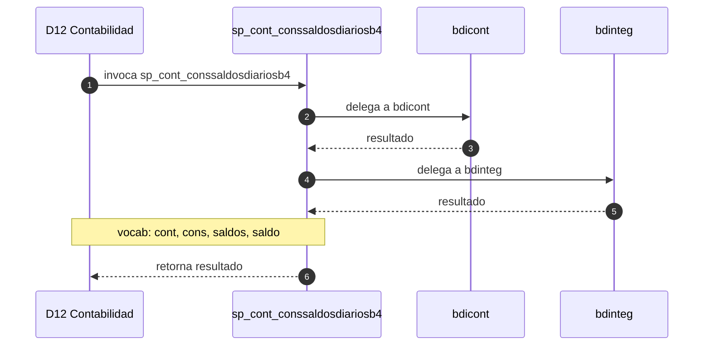

# SP Profile: `sp_cont_conssaldosdiariosb4`

> **Base de datos**: `bdicont` · Dominio D12 — Contabilidad
> **Tipo de artefacto**: Perfil funcional · Gemelo Cognitivo — Capa 4: Intencion
> **Ultima actualizacion**: 2026-08-03
> **Estado**: ACTIVO · 0 callers en produccion

---

## Historia Funcional

El SP `sp_cont_conssaldosdiariosb4` implementa la logica de consulta saldos diarios en el dominio Contabilidad (base de datos `bdicont`). Comprende 4,462 lineas de codigo, 5 tablas consultadas. Delega logica a: `bdicont`, `bdinteg`.

---

## Relaciones en la KB

| Tipo de relacion | Documento |
|-----------------|-----------|
| Cross-reference de reglas y vocabulario | [../cross-reference/sp-rules-vocab-map.md](../cross-reference/sp-rules-vocab-map.md) |
| Dependencias del dominio D12 | [../D12-bdicont/07-dependencies.md](../D12-bdicont/07-dependencies.md) |
| Reglas globales del sistema | [../rules/business-rules-bcop.md](../rules/business-rules-bcop.md) |
| Vocabulario del sistema | [../vocabulary/vocabulary-knowledge-base-bcop.md](../vocabulary/vocabulary-knowledge-base-bcop.md) |
| Vista HTML interactiva | [../../portal/sp-detail/sp-detail-sp_cont_conssaldosdiariosb4.html](../../portal/sp-detail/sp-detail-sp_cont_conssaldosdiariosb4.html) |

---

## Metricas del Gemelo Cognitivo

| Metrica | Valor |
|---------|-------|
| Fan-in (callers) | **0** |
| Fan-out (callees) | **84** |
| Callees principales | `bdicont`, `bdinteg` |
| LOC | **4,462** |
| Tablas consultadas | 5 |
| Reglas de negocio activas | **0** |
| Autores historicos | 0 |

---

## Flujo de Decision

---

## Diagrama de Secuencia con Reglas y Vocabulario

---

## Reglas de Negocio Activas

_No se detectaron reglas de negocio para este proceso._

---

## Vocabulario Clave

| Termino | Categoria | Nivel | Significado |
|---------|-----------|-------|-------------|
| `cont` | PREFIJO | ALTA | familia contabilidad |
| `cons` | ACCION | ALTA | consulta |
| `saldos` | ENTIDAD | ALTA | saldos |
| `saldo` | ENTIDAD | ALTA | saldo |
| `diario` | MODIF | ALTA | diario |
| `diarios` | MODIF | ALTA | diarios |
| `conssaldosdiarios` | ACCION | ALTA | consulta saldos diarios |

---

## Nota de Migracion

Sin restricciones regulatorias criticas identificadas en el codigo fuente. Verificar en parallel-run que el comportamiento sea equivalente al del sistema legado.

Ver registro completo de riesgos: [migration-risk-register.md](../migration-risk-register.md).
