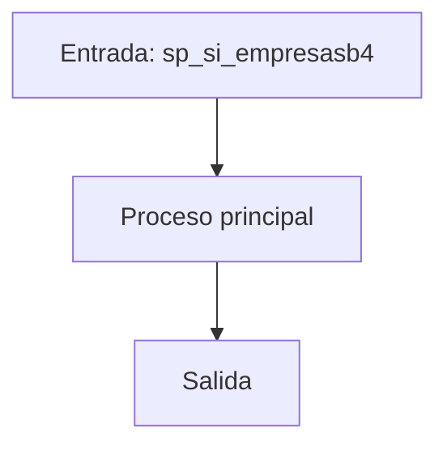
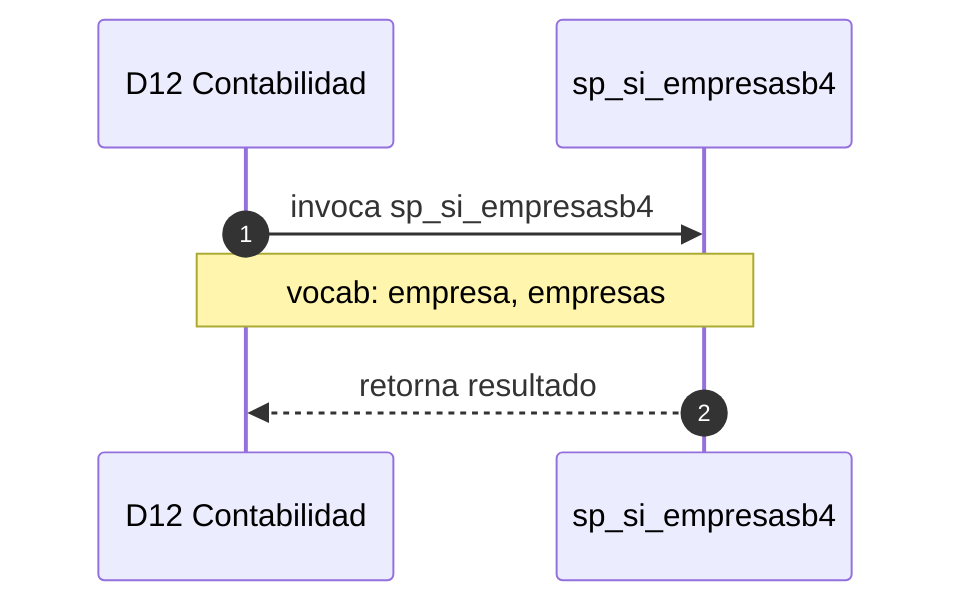

# SP Profile: `sp_si_empresasb4`

> **Base de datos**: `bdicont` · Dominio D12 — Contabilidad
> **Tipo de artefacto**: Perfil funcional · Gemelo Cognitivo — Capa 4: Intencion
> **Ultima actualizacion**: 2026-08-03
> **Estado**: ACTIVO · 1 callers en produccion

---

## Historia Funcional

El SP `sp_si_empresasb4` implementa la logica de empresas en el dominio Contabilidad (base de datos `bdicont`). Comprende 3,161 lineas de codigo, 1 tablas consultadas. Es invocado por 1 callers en el sistema, lo que lo convierte en un componente de alta dependencia. 

---

## Relaciones en la KB

| Tipo de relacion | Documento |
|-----------------|-----------|
| Cross-reference de reglas y vocabulario | [../cross-reference/sp-rules-vocab-map.md](../cross-reference/sp-rules-vocab-map.md) |
| Dependencias del dominio D12 | [../D12-bdicont/07-dependencies.md](../D12-bdicont/07-dependencies.md) |
| Reglas globales del sistema | [../rules/business-rules-bcop.md](../rules/business-rules-bcop.md) |
| Vocabulario del sistema | [../vocabulary/vocabulary-knowledge-base-bcop.md](../vocabulary/vocabulary-knowledge-base-bcop.md) |
| Vista HTML interactiva | [../../portal/sp-detail/sp-detail-sp_si_empresasb4.html](../../portal/sp-detail/sp-detail-sp_si_empresasb4.html) |

---

## Metricas del Gemelo Cognitivo

| Metrica | Valor |
|---------|-------|
| Fan-in (callers) | **1** |
| Fan-out (callees) | **55** |
| Callees principales | — |
| LOC | **3,161** |
| Tablas consultadas | 1 |
| Reglas de negocio activas | **0** |
| Autores historicos | 0 |

---

## Flujo de Decision

---

## Diagrama de Secuencia con Reglas y Vocabulario

---

## Reglas de Negocio Activas

_No se detectaron reglas de negocio para este proceso._

---

## Vocabulario Clave

| Termino | Categoria | Nivel | Significado |
|---------|-----------|-------|-------------|
| `empresa` | ENTIDAD | ALTA | empresa (entidad bancaria) |
| `empresas` | ENTIDAD | ALTA | empresas (nómina empresarial) |

---

## Nota de Migracion

El nombre contiene tokens sinteticos (`?_si_`), lo que indica que el alcance original fue parcialmente documentado por el equipo historico.

Ver registro completo de riesgos: [migration-risk-register.md](../migration-risk-register.md).
