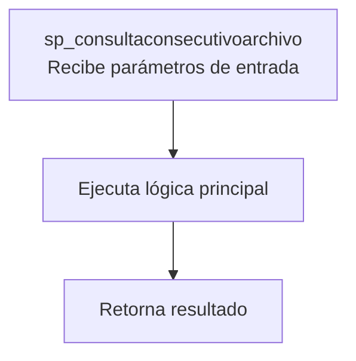
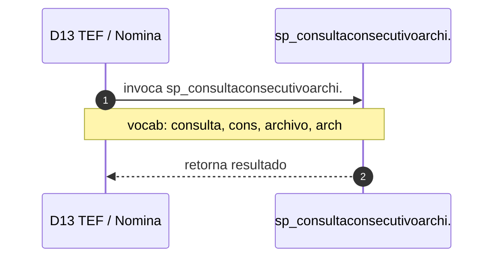

# SP Profile: `sp_consultaconsecutivoarchivo`

> **Base de datos**: `bditef` · Dominio D13 — TEF / Nomina
> **Tipo de artefacto**: Perfil funcional · Gemelo Cognitivo — Capa 4: Intencion
> **Ultima actualizacion**: 2026-08-09
> **Estado**: ACTIVO · 54 callers en produccion

---

## Historia Funcional

El SP `sp_consultaconsecutivoarchivo` implementa la logica de consulta consecutivo y archivo en el dominio TEF / Nomina (base de datos `bditef`). Comprende 7,657 lineas de codigo, 4 tablas consultadas. Es invocado por 54 callers en el sistema, lo que lo convierte en un componente de alta dependencia. 

---

## Relaciones en la KB

| Tipo de relacion | Documento |
|-----------------|-----------|
| Cross-reference de reglas y vocabulario | [../cross-reference/sp-rules-vocab-map.md](../cross-reference/sp-rules-vocab-map.md) |
| Dependencias del dominio D13 | [../D13-bditef/07-dependencies.md](../D13-bditef/07-dependencies.md) |
| Reglas globales del sistema | [../rules/business-rules-bcop.md](../rules/business-rules-bcop.md) |
| Vocabulario del sistema | [../vocabulary/vocabulary-knowledge-base-bcop.md](../vocabulary/vocabulary-knowledge-base-bcop.md) |
| Vista HTML interactiva | [../../portal/sp-detail/sp-detail-sp_consultaconsecutivoarchivo.html](../../portal/sp-detail/sp-detail-sp_consultaconsecutivoarchivo.html) |

---

## Metricas del Gemelo Cognitivo

| Metrica | Valor |
|---------|-------|
| Fan-in (callers) | **54** |
| Fan-out (callees) | **25** |
| Callees principales | — |
| LOC | **7,657** |
| Tablas consultadas | 4 |
| Reglas de negocio activas | **0** |
| Autores historicos | 0 |

---

## Flujo de Decision

---

## Diagrama de Secuencia con Reglas y Vocabulario

---

## Reglas de Negocio Activas

_No se detectaron reglas de negocio para este proceso._

---

## Vocabulario Clave

| Termino | Categoria | Nivel | Significado |
|---------|-----------|-------|-------------|
| `consulta` | ACCION | ALTA | consulta / proyecta estado de entidad; sp_consulta_saldos_general (bdicred, fi=435) devuelve 47 campos del snapshot financiero de un crédito (cap vig/trans/vdo, int, IVA, comisiones, línea disponible, bloqueos) usando DIRTY READ |
| `cons` | ACCION | ALTA | consulta |
| `archivo` | ENTIDAD | ALTA | archivo |
| `arch` | ENTIDAD | ALTA | archivo |
| `consecutivo` | ENTIDAD | ALTA | consecutivo |
| `consult` | ABREVIATURA | MEDIA | consulta |

---

## Nota de Migracion

Sin restricciones regulatorias criticas identificadas en el codigo fuente. Verificar en parallel-run que el comportamiento sea equivalente al del sistema legado.

Ver registro completo de riesgos: [migration-risk-register.md](../../knowledge-base/migration-risk-register.md).
