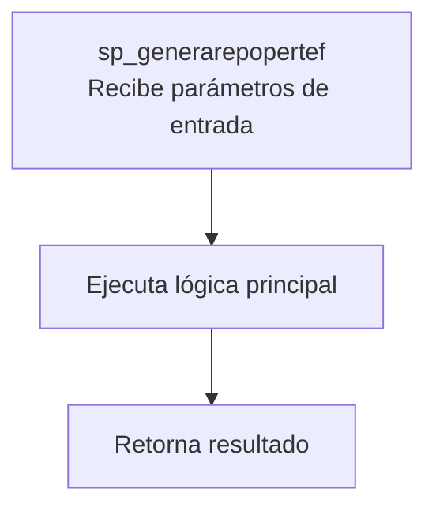
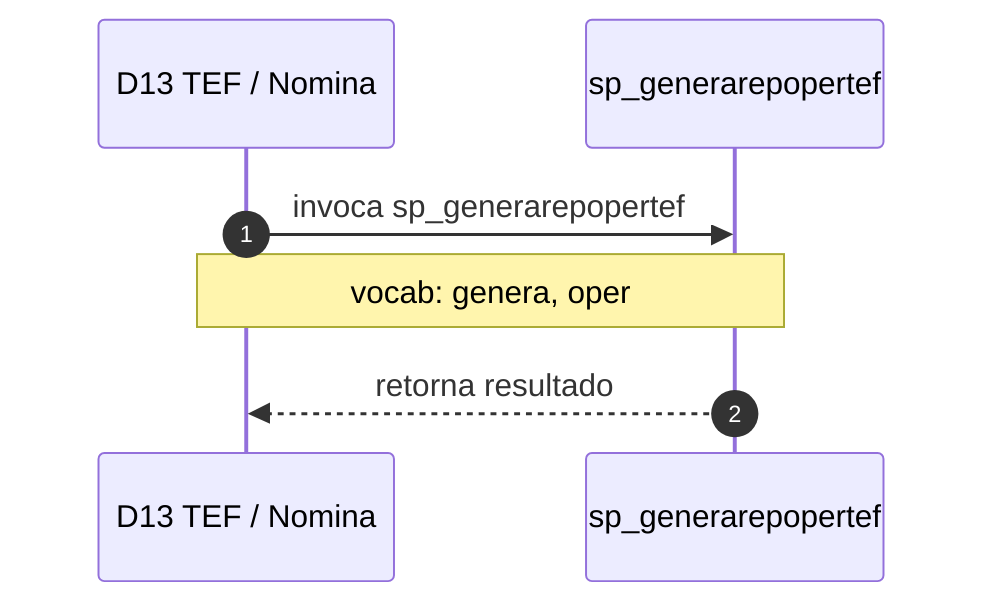

# SP Profile: `sp_generarepopertef`

> **Base de datos**: `bditef` · Dominio D13 — TEF / Nomina
> **Tipo de artefacto**: Perfil funcional · Gemelo Cognitivo — Capa 4: Intencion
> **Ultima actualizacion**: 2026-08-09
> **Estado**: ACTIVO · 0 callers en produccion

---

## Historia Funcional

El SP `sp_generarepopertef` implementa la logica de genera artefacto de salida; sp_generararchivo_rst transferencia electrónica de fondos en el dominio TEF / Nomina (base de datos `bditef`). Comprende 7,228 lineas de codigo, 4 tablas consultadas. 

---

## Relaciones en la KB

| Tipo de relacion | Documento |
|-----------------|-----------|
| Cross-reference de reglas y vocabulario | [../cross-reference/sp-rules-vocab-map.md](../cross-reference/sp-rules-vocab-map.md) |
| Dependencias del dominio D13 | [../D13-bditef/07-dependencies.md](../D13-bditef/07-dependencies.md) |
| Reglas globales del sistema | [../rules/business-rules-bcop.md](../rules/business-rules-bcop.md) |
| Vocabulario del sistema | [../vocabulary/vocabulary-knowledge-base-bcop.md](../vocabulary/vocabulary-knowledge-base-bcop.md) |
| Vista HTML interactiva | [../../portal/sp-detail/sp-detail-sp_generarepopertef.html](../../portal/sp-detail/sp-detail-sp_generarepopertef.html) |

---

## Metricas del Gemelo Cognitivo

| Metrica | Valor |
|---------|-------|
| Fan-in (callers) | **0** |
| Fan-out (callees) | **25** |
| Callees principales | — |
| LOC | **7,228** |
| Tablas consultadas | 4 |
| Reglas de negocio activas | **0** |
| Autores historicos | 0 |

---

## Flujo de Decision

---

## Diagrama de Secuencia con Reglas y Vocabulario

---

## Reglas de Negocio Activas

_No se detectaron reglas de negocio para este proceso._

---

## Vocabulario Clave

| Termino | Categoria | Nivel | Significado |
|---------|-----------|-------|-------------|
| `genera` | ACCION | ALTA | genera artefacto de salida; sp_generararchivo_rst (bdicnweb, fi=345) descarga tablas a .txt en /RESPALDOSNEW/archivosRST/ vía SYSTEM+dbaccess (patrón RST de unload); sp_generafolionomina (bdicheq, fi=253) emite folios secuenciales de nómina |
| `oper` | ABREVIATURA | MEDIA | operación |

---

## Nota de Migracion

El nombre contiene tokens sinteticos (`?ep`, `?r`), lo que indica que el alcance original fue parcialmente documentado por el equipo historico.

Ver registro completo de riesgos: [migration-risk-register.md](../../knowledge-base/migration-risk-register.md).
