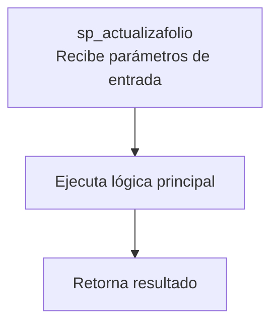
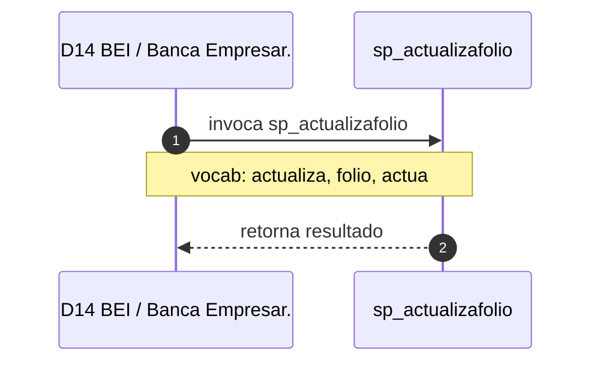

# SP Profile: `sp_actualizafolio`

> **Base de datos**: `bdibei` · Dominio D14 — BEI / Banca Empresarial
> **Tipo de artefacto**: Perfil funcional · Gemelo Cognitivo — Capa 4: Intencion
> **Ultima actualizacion**: 2026-08-09
> **Estado**: ACTIVO · 3 callers en produccion

---

## Historia Funcional

El SP `sp_actualizafolio` implementa la logica de actualiza campo de estado en registro existente; sp_dicta_actualizastatusalerta folio en el dominio BEI / Banca Empresarial (base de datos `bdibei`). Comprende 2,111 lineas de codigo, 1 tablas consultadas. Es invocado por 3 callers en el sistema, lo que lo convierte en un componente de alta dependencia. 

---

## Relaciones en la KB

| Tipo de relacion | Documento |
|-----------------|-----------|
| Cross-reference de reglas y vocabulario | [../cross-reference/sp-rules-vocab-map.md](../cross-reference/sp-rules-vocab-map.md) |
| Dependencias del dominio D14 | [../D14-bdibei/07-dependencies.md](../D14-bdibei/07-dependencies.md) |
| Reglas globales del sistema | [../rules/business-rules-bcop.md](../rules/business-rules-bcop.md) |
| Vocabulario del sistema | [../vocabulary/vocabulary-knowledge-base-bcop.md](../vocabulary/vocabulary-knowledge-base-bcop.md) |
| Vista HTML interactiva | [../../portal/sp-detail/sp-detail-sp_actualizafolio.html](../../portal/sp-detail/sp-detail-sp_actualizafolio.html) |

---

## Metricas del Gemelo Cognitivo

| Metrica | Valor |
|---------|-------|
| Fan-in (callers) | **3** |
| Fan-out (callees) | **10** |
| Callees principales | — |
| LOC | **2,111** |
| Tablas consultadas | 1 |
| Reglas de negocio activas | **0** |
| Autores historicos | 0 |

---

## Flujo de Decision

---

## Diagrama de Secuencia con Reglas y Vocabulario

---

## Reglas de Negocio Activas

_No se detectaron reglas de negocio para este proceso._

---

## Vocabulario Clave

| Termino | Categoria | Nivel | Significado |
|---------|-----------|-------|-------------|
| `actualiza` | ACCION | ALTA | actualiza campo de estado en registro existente; sp_dicta_actualizastatusalerta (bdinteg, fi=270) escribe veredicto del analista de fraudes (status_alerta + analista_fraudes) en si_bitacora_comparaciones; verifica sqlerrd2≠0 para detectar fila no afectada |
| `folio` | ENTIDAD | ALTA | folio |
| `actua` | ABREVIATURA | MEDIA | actualización |

---

## Nota de Migracion

Sin restricciones regulatorias criticas identificadas en el codigo fuente. Verificar en parallel-run que el comportamiento sea equivalente al del sistema legado.

Ver registro completo de riesgos: [migration-risk-register.md](../../knowledge-base/migration-risk-register.md).
