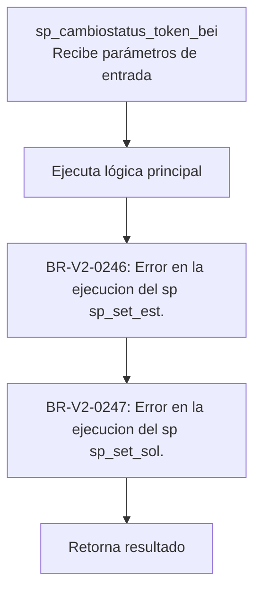
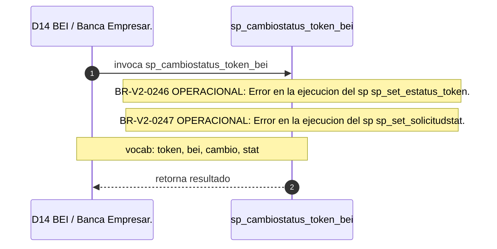

# SP Profile: `sp_cambiostatus_token_bei`

> **Base de datos**: `bdibei` · Dominio D14 — BEI / Banca Empresarial
> **Tipo de artefacto**: Perfil funcional · Gemelo Cognitivo — Capa 4: Intencion
> **Ultima actualizacion**: 2026-08-09
> **Estado**: ACTIVO · 0 callers en produccion

---

## Historia Funcional

El SP `sp_cambiostatus_token_bei` implementa la logica de cambio, token y Banca En Internet; canal digital principal de BanCoppel; base de datos bdibei con 279+ SPs de operaciones, autenticación, transferencias y mancomunidad en el dominio BEI / Banca Empresarial (base de datos `bdibei`). Comprende 2,067 lineas de codigo, 3 tablas consultadas. 

---

## Relaciones en la KB

| Tipo de relacion | Documento |
|-----------------|-----------|
| Cross-reference de reglas y vocabulario | [../cross-reference/sp-rules-vocab-map.md](../cross-reference/sp-rules-vocab-map.md) |
| Dependencias del dominio D14 | [../D14-bdibei/07-dependencies.md](../D14-bdibei/07-dependencies.md) |
| Reglas globales del sistema | [../rules/business-rules-bcop.md](../rules/business-rules-bcop.md) |
| Vocabulario del sistema | [../vocabulary/vocabulary-knowledge-base-bcop.md](../vocabulary/vocabulary-knowledge-base-bcop.md) |
| Vista HTML interactiva | [../../portal/sp-detail/sp-detail-sp_cambiostatus_token_bei.html](../../portal/sp-detail/sp-detail-sp_cambiostatus_token_bei.html) |

---

## Metricas del Gemelo Cognitivo

| Metrica | Valor |
|---------|-------|
| Fan-in (callers) | **0** |
| Fan-out (callees) | **10** |
| Callees principales | — |
| LOC | **2,067** |
| Tablas consultadas | 3 |
| Reglas de negocio activas | **2** |
| Autores historicos | 0 |

---

## Flujo de Decision

---

## Diagrama de Secuencia con Reglas y Vocabulario

---

## Reglas de Negocio Activas

| ID | Tipo | Categoria | Linea | Codigo | Referencia |
|----|------|-----------|-------|--------|------------|
| BR-V2-0246 | VALIDACIÓN | OPERACIONAL | 90 | `RAISE EXCEPTION iCodRetSp, 0, 'ERROR EN LA EJECUCION DEL SP ` | — |
| BR-V2-0247 | VALIDACIÓN | OPERACIONAL | 126 | `RAISE EXCEPTION iCodRetSp, 0, 'ERROR EN LA EJECUCION DEL SP ` | — |

---

## Vocabulario Clave

| Termino | Categoria | Nivel | Significado |
|---------|-----------|-------|-------------|
| `token` | ENTIDAD | ALTA | token (autenticación) |
| `bei` | ENTIDAD | ALTA | BEI — Banca En Internet; canal digital principal de BanCoppel; base de datos bdibei con 279+ SPs de operaciones, autenticación, transferencias y mancomunidad |
| `cambio` | ENTIDAD | ALTA | cambio (de estatus, domicilio, etc.) |
| `stat` | ABREVIATURA | MEDIA | estatus |

---

## Nota de Migracion

Sin restricciones regulatorias criticas identificadas en el codigo fuente. Verificar en parallel-run que el comportamiento sea equivalente al del sistema legado.

Ver registro completo de riesgos: [migration-risk-register.md](../../knowledge-base/migration-risk-register.md).
