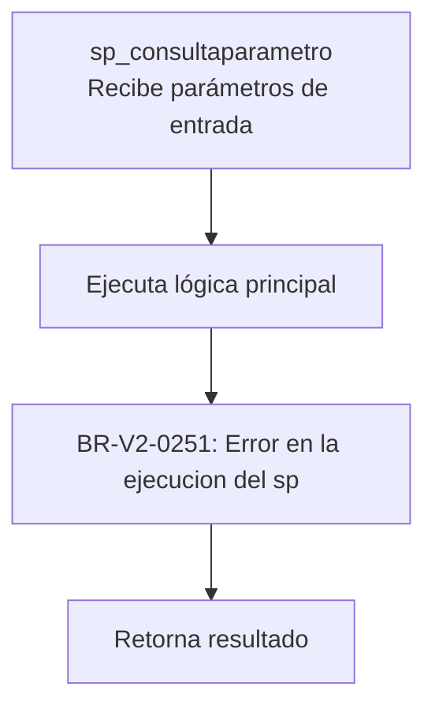
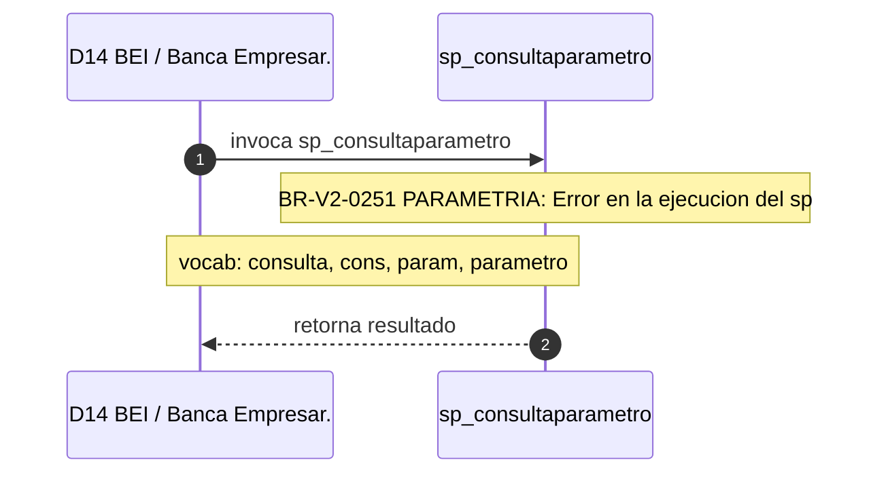

# SP Profile: `sp_consultaparametro`

> **Base de datos**: `bdibei` · Dominio D14 — BEI / Banca Empresarial
> **Tipo de artefacto**: Perfil funcional · Gemelo Cognitivo — Capa 4: Intencion
> **Ultima actualizacion**: 2026-08-09
> **Estado**: ACTIVO · 0 callers en produccion

---

## Historia Funcional

El SP `sp_consultaparametro` implementa la logica de consulta parámetro en el dominio BEI / Banca Empresarial (base de datos `bdibei`). Comprende 1,915 lineas de codigo. 

---

## Relaciones en la KB

| Tipo de relacion | Documento |
|-----------------|-----------|
| Cross-reference de reglas y vocabulario | [../cross-reference/sp-rules-vocab-map.md](../cross-reference/sp-rules-vocab-map.md) |
| Dependencias del dominio D14 | [../D14-bdibei/07-dependencies.md](../D14-bdibei/07-dependencies.md) |
| Reglas globales del sistema | [../rules/business-rules-bcop.md](../rules/business-rules-bcop.md) |
| Vocabulario del sistema | [../vocabulary/vocabulary-knowledge-base-bcop.md](../vocabulary/vocabulary-knowledge-base-bcop.md) |
| Vista HTML interactiva | [../../portal/sp-detail/sp-detail-sp_consultaparametro.html](../../portal/sp-detail/sp-detail-sp_consultaparametro.html) |

---

## Metricas del Gemelo Cognitivo

| Metrica | Valor |
|---------|-------|
| Fan-in (callers) | **0** |
| Fan-out (callees) | **8** |
| Callees principales | — |
| LOC | **1,915** |
| Tablas consultadas | 0 |
| Reglas de negocio activas | **1** |
| Autores historicos | 0 |

---

## Flujo de Decision

---

## Diagrama de Secuencia con Reglas y Vocabulario

---

## Reglas de Negocio Activas

| ID | Tipo | Categoria | Linea | Codigo | Referencia |
|----|------|-----------|-------|--------|------------|
| BR-V2-0251 | VALIDACIÓN | PARAMETRIA | 139 | `RAISE EXCEPTION iCodRetSp, 0, 'ERROR EN LA EJECUCION DEL SP ` | — |

---

## Vocabulario Clave

| Termino | Categoria | Nivel | Significado |
|---------|-----------|-------|-------------|
| `consulta` | ACCION | ALTA | consulta / proyecta estado de entidad; sp_consulta_saldos_general (bdicred, fi=435) devuelve 47 campos del snapshot financiero de un crédito (cap vig/trans/vdo, int, IVA, comisiones, línea disponible, bloqueos) usando DIRTY READ |
| `cons` | ACCION | ALTA | consulta |
| `param` | ENTIDAD | ALTA | parámetro |
| `parametro` | ENTIDAD | ALTA | parámetro |
| `consult` | ABREVIATURA | MEDIA | consulta |

---

## Nota de Migracion

Sin restricciones regulatorias criticas identificadas en el codigo fuente. Verificar en parallel-run que el comportamiento sea equivalente al del sistema legado.

Ver registro completo de riesgos: [migration-risk-register.md](../../knowledge-base/migration-risk-register.md).
