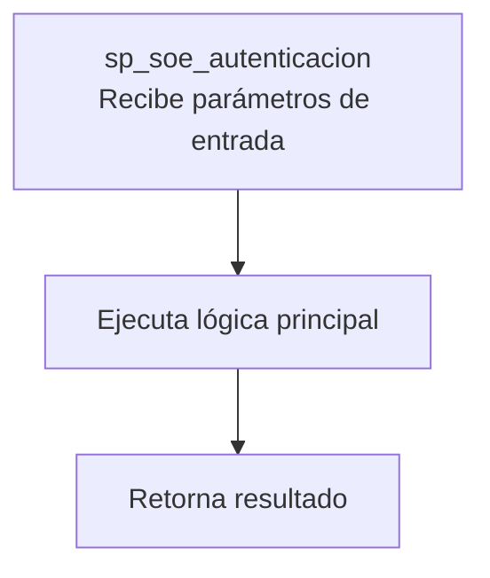
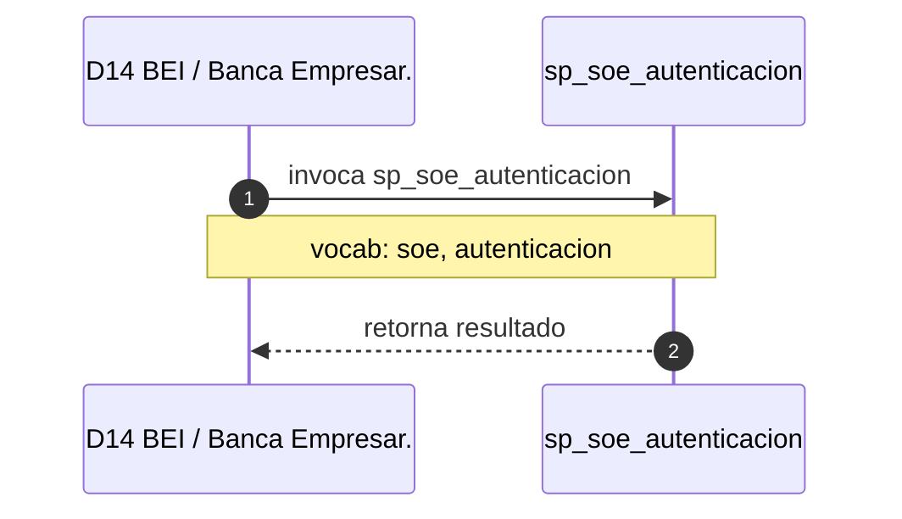

# SP Profile: `sp_soe_autenticacion`

> **Base de datos**: `bdibei` · Dominio D14 — BEI / Banca Empresarial
> **Tipo de artefacto**: Perfil funcional · Gemelo Cognitivo — Capa 4: Intencion
> **Ultima actualizacion**: 2026-08-09
> **Estado**: ACTIVO · 0 callers en produccion

---

## Historia Funcional

El SP `sp_soe_autenticacion` implementa la logica de Soporte Operativo EmpresaNet; confirmado por SME y autenticación en el dominio BEI / Banca Empresarial (base de datos `bdibei`). Comprende 709 lineas de codigo, 1 tablas consultadas. 

---

## Relaciones en la KB

| Tipo de relacion | Documento |
|-----------------|-----------|
| Cross-reference de reglas y vocabulario | [../cross-reference/sp-rules-vocab-map.md](../cross-reference/sp-rules-vocab-map.md) |
| Dependencias del dominio D14 | [../D14-bdibei/07-dependencies.md](../D14-bdibei/07-dependencies.md) |
| Reglas globales del sistema | [../rules/business-rules-bcop.md](../rules/business-rules-bcop.md) |
| Vocabulario del sistema | [../vocabulary/vocabulary-knowledge-base-bcop.md](../vocabulary/vocabulary-knowledge-base-bcop.md) |
| Vista HTML interactiva | [../../portal/sp-detail/sp-detail-sp_soe_autenticacion.html](../../portal/sp-detail/sp-detail-sp_soe_autenticacion.html) |

---

## Metricas del Gemelo Cognitivo

| Metrica | Valor |
|---------|-------|
| Fan-in (callers) | **0** |
| Fan-out (callees) | **3** |
| Callees principales | — |
| LOC | **709** |
| Tablas consultadas | 1 |
| Reglas de negocio activas | **0** |
| Autores historicos | 0 |

---

## Flujo de Decision

---

## Diagrama de Secuencia con Reglas y Vocabulario

---

## Reglas de Negocio Activas

_No se detectaron reglas de negocio para este proceso._

---

## Vocabulario Clave

| Termino | Categoria | Nivel | Significado |
|---------|-----------|-------|-------------|
| `soe` | ENTIDAD | ALTA | SOE — Soporte Operativo EmpresaNet; confirmado por SME (Jorge Isaac Díaz, 2026-07-09) |
| `autenticacion` | ENTIDAD | ALTA | autenticación |

---

## Nota de Migracion

Sin restricciones regulatorias criticas identificadas en el codigo fuente. Verificar en parallel-run que el comportamiento sea equivalente al del sistema legado.

Ver registro completo de riesgos: [migration-risk-register.md](../../knowledge-base/migration-risk-register.md).
