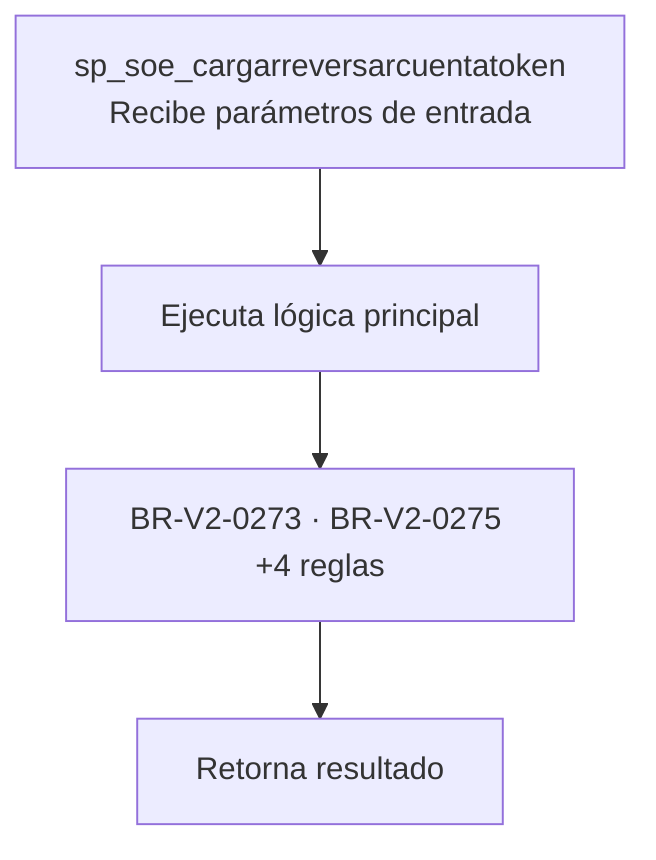
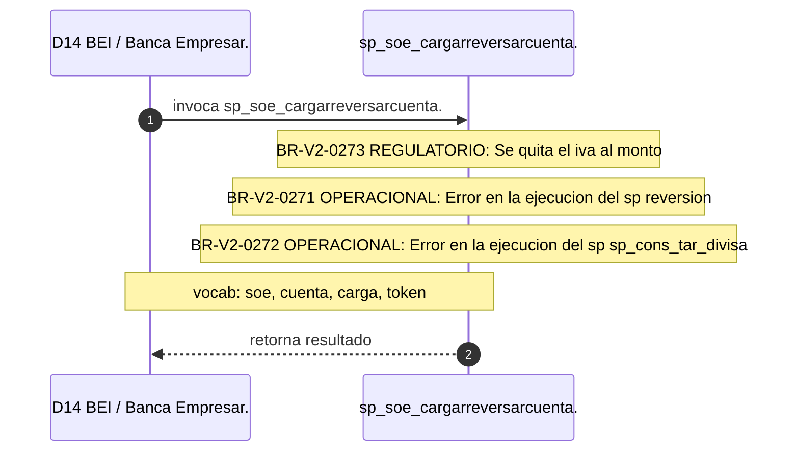

# SP Profile: `sp_soe_cargarreversarcuentatoken`

> **Base de datos**: `bdibei` · Dominio D14 — BEI / Banca Empresarial
> **Tipo de artefacto**: Perfil funcional · Gemelo Cognitivo — Capa 4: Intencion
> **Ultima actualizacion**: 2026-08-09
> **Estado**: ACTIVO · 0 callers en produccion

---

## Historia Funcional

El SP `sp_soe_cargarreversarcuentatoken` implementa la logica de carga Soporte Operativo EmpresaNet; confirmado por SME, cuenta y token en el dominio BEI / Banca Empresarial (base de datos `bdibei`). Comprende 395 lineas de codigo, 4 tablas consultadas. 

---

## Relaciones en la KB

| Tipo de relacion | Documento |
|-----------------|-----------|
| Cross-reference de reglas y vocabulario | [../cross-reference/sp-rules-vocab-map.md](../cross-reference/sp-rules-vocab-map.md) |
| Dependencias del dominio D14 | [../D14-bdibei/07-dependencies.md](../D14-bdibei/07-dependencies.md) |
| Reglas globales del sistema | [../rules/business-rules-bcop.md](../rules/business-rules-bcop.md) |
| Vocabulario del sistema | [../vocabulary/vocabulary-knowledge-base-bcop.md](../vocabulary/vocabulary-knowledge-base-bcop.md) |
| Vista HTML interactiva | [../../portal/sp-detail/sp-detail-sp_soe_cargarreversarcuentatoken.html](../../portal/sp-detail/sp-detail-sp_soe_cargarreversarcuentatoken.html) |

---

## Metricas del Gemelo Cognitivo

| Metrica | Valor |
|---------|-------|
| Fan-in (callers) | **0** |
| Fan-out (callees) | **6** |
| Callees principales | — |
| LOC | **395** |
| Tablas consultadas | 4 |
| Reglas de negocio activas | **6** |
| Autores historicos | 0 |

---

## Flujo de Decision

---

## Diagrama de Secuencia con Reglas y Vocabulario

---

## Reglas de Negocio Activas

| ID | Tipo | Categoria | Linea | Codigo | Referencia |
|----|------|-----------|-------|--------|------------|
| BR-V2-0271 | VALIDACIÓN | OPERACIONAL | 103 | `RAISE EXCEPTION iCodRetSp, 0, 'ERROR EN LA EJECUCION DEL SP ` | — |
| BR-V2-0272 | VALIDACIÓN | OPERACIONAL | 148 | `RAISE EXCEPTION iCodRetSp, 0, 'ERROR EN LA EJECUCION DEL SP ` | — |
| BR-V2-0273 | FÓRMULA | REGULATORIO | 156 | `pMonto = pMonto / (1+mIva); --Se quita el IVA al monto` | LIVA — IVA sobre comisiones (16% / 8% frontera) |
| BR-V2-0274 | VALIDACIÓN | OPERACIONAL | 171 | `RAISE EXCEPTION iCodRetSp, 0, 'ERROR EN LA EJECUCION DEL SP ` | — |
| BR-V2-0275 | FÓRMULA | CALCULO_FINANCIERO | 198 | `mIva = pMonto * mIva` | — |
| BR-V2-0276 | VALIDACIÓN | OPERACIONAL | 263 | `RAISE EXCEPTION iCodRetSp, 0, 'ERROR EN LA EJECUCION DEL SP ` | — |

---

## Vocabulario Clave

| Termino | Categoria | Nivel | Significado |
|---------|-----------|-------|-------------|
| `soe` | ENTIDAD | ALTA | SOE — Soporte Operativo EmpresaNet; confirmado por SME (Jorge Isaac Díaz, 2026-07-09) |
| `cuenta` | ENTIDAD | ALTA | cuenta |
| `carga` | ACCION | ALTA | carga / ingresa |
| `token` | ENTIDAD | ALTA | token (autenticación) |
| `reversa` | ACCION | ALTA | Reversión — anula/revierte una operación (bdibei:sp_reversa_solicitudes_bei, sp_reversa_tokenasociados_bei) |

---

## Nota de Migracion

Las 1 reglas con categoria REGULATORIO son las mas sensibles en la migracion y deben ser validadas por el SME de Industry Banking Accounting contra el CUB vigente.
El nombre contiene tokens sinteticos (`?r`, `?r`), lo que indica que el alcance original fue parcialmente documentado por el equipo historico.

Ver registro completo de riesgos: [migration-risk-register.md](../../knowledge-base/migration-risk-register.md).
