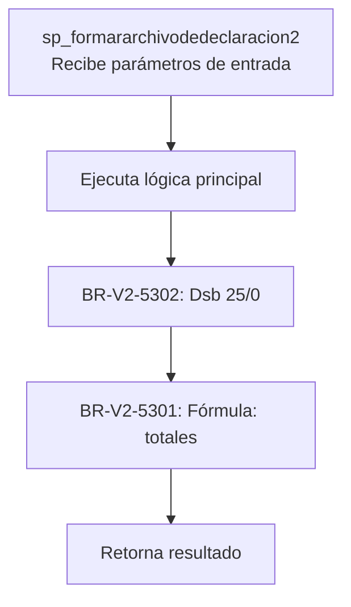
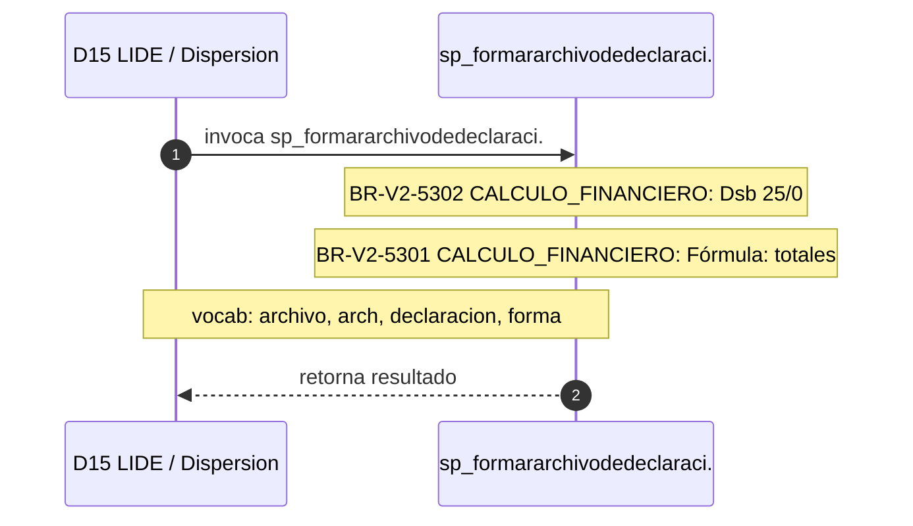

# SP Profile: `sp_formararchivodedeclaracion2`

> **Base de datos**: `bdilide` · Dominio D15 — LIDE / Dispersion
> **Tipo de artefacto**: Perfil funcional · Gemelo Cognitivo — Capa 4: Intencion
> **Ultima actualizacion**: 2026-08-09
> **Estado**: ACTIVO · 358 callers en produccion

---

## Historia Funcional

El SP `sp_formararchivodedeclaracion2` implementa la logica de construye archivo y declaración en el dominio LIDE / Dispersion (base de datos `bdilide`). Comprende 1,251 lineas de codigo, 24 tablas consultadas. Es invocado por 358 callers en el sistema, lo que lo convierte en un componente de alta dependencia. 

---

## Relaciones en la KB

| Tipo de relacion | Documento |
|-----------------|-----------|
| Cross-reference de reglas y vocabulario | [../cross-reference/sp-rules-vocab-map.md](../cross-reference/sp-rules-vocab-map.md) |
| Dependencias del dominio D15 | [../D15-bdilide/07-dependencies.md](../D15-bdilide/07-dependencies.md) |
| Reglas globales del sistema | [../rules/business-rules-bcop.md](../rules/business-rules-bcop.md) |
| Vocabulario del sistema | [../vocabulary/vocabulary-knowledge-base-bcop.md](../vocabulary/vocabulary-knowledge-base-bcop.md) |
| Vista HTML interactiva | [../../portal/sp-detail/sp-detail-sp_formararchivodedeclaracion2.html](../../portal/sp-detail/sp-detail-sp_formararchivodedeclaracion2.html) |

---

## Metricas del Gemelo Cognitivo

| Metrica | Valor |
|---------|-------|
| Fan-in (callers) | **358** |
| Fan-out (callees) | **358** |
| Callees principales | — |
| LOC | **1,251** |
| Tablas consultadas | 24 |
| Reglas de negocio activas | **2** |
| Autores historicos | 0 |

---

## Flujo de Decision

---

## Diagrama de Secuencia con Reglas y Vocabulario

---

## Reglas de Negocio Activas

| ID | Tipo | Categoria | Linea | Codigo | Referencia |
|----|------|-----------|-------|--------|------------|
| BR-V2-5301 | FÓRMULA | CALCULO_FINANCIERO | 659 | `v_cVarPrueba4 = '" importeEnterado="0'\|\|'" importeSaldoPendi` | — |
| BR-V2-5302 | FÓRMULA | CALCULO_FINANCIERO | 664 | `v_cVarPrueba4 = '" importeEnterado="'\|\| NVL(ROUND(v_mEnteroT` | — |

---

## Vocabulario Clave

| Termino | Categoria | Nivel | Significado |
|---------|-----------|-------|-------------|
| `archivo` | ENTIDAD | ALTA | archivo |
| `arch` | ENTIDAD | ALTA | archivo |
| `declaracion` | ENTIDAD | ALTA | declaración |
| `forma` | ACCION | MEDIA | construye / arma |

---

## Nota de Migracion

El nombre contiene tokens sinteticos (`?r`, `?de`, `?2`), lo que indica que el alcance original fue parcialmente documentado por el equipo historico.

Ver registro completo de riesgos: [migration-risk-register.md](../../knowledge-base/migration-risk-register.md).
