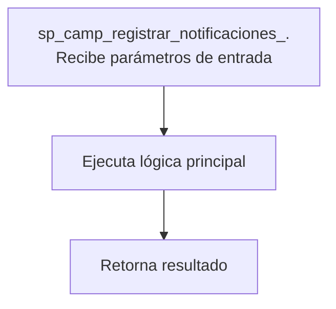
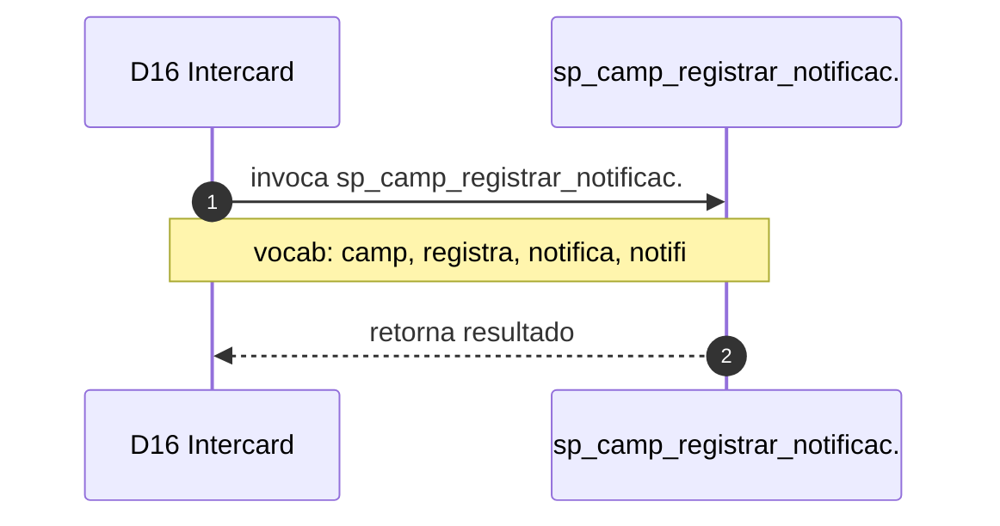

# SP Profile: `sp_camp_registrar_notificaciones_pru1`

> **Base de datos**: `intercard` · Dominio D16 — Intercard
> **Tipo de artefacto**: Perfil funcional · Gemelo Cognitivo — Capa 4: Intencion
> **Ultima actualizacion**: 2026-08-09
> **Estado**: ACTIVO · 0 callers en produccion

---

## Historia Funcional

El SP `sp_camp_registrar_notificaciones_pru1` implementa la logica de registra campaña de cobranza o crédito en el dominio Intercard (base de datos `intercard`). Comprende 909 lineas de codigo, 8 tablas consultadas. 

---

## Relaciones en la KB

| Tipo de relacion | Documento |
|-----------------|-----------|
| Cross-reference de reglas y vocabulario | [../cross-reference/sp-rules-vocab-map.md](../cross-reference/sp-rules-vocab-map.md) |
| Dependencias del dominio D16 | [../D16-intercard/07-dependencies.md](../D16-intercard/07-dependencies.md) |
| Reglas globales del sistema | [../rules/business-rules-bcop.md](../rules/business-rules-bcop.md) |
| Vocabulario del sistema | [../vocabulary/vocabulary-knowledge-base-bcop.md](../vocabulary/vocabulary-knowledge-base-bcop.md) |
| Vista HTML interactiva | [../../portal/sp-detail/sp-detail-sp_camp_registrar_notificaciones_pru1.html](../../portal/sp-detail/sp-detail-sp_camp_registrar_notificaciones_pru1.html) |

---

## Metricas del Gemelo Cognitivo

| Metrica | Valor |
|---------|-------|
| Fan-in (callers) | **0** |
| Fan-out (callees) | **3** |
| Callees principales | — |
| LOC | **909** |
| Tablas consultadas | 8 |
| Reglas de negocio activas | **0** |
| Autores historicos | 0 |

---

## Flujo de Decision

---

## Diagrama de Secuencia con Reglas y Vocabulario

---

## Reglas de Negocio Activas

_No se detectaron reglas de negocio para este proceso._

---

## Vocabulario Clave

| Termino | Categoria | Nivel | Significado |
|---------|-----------|-------|-------------|
| `camp` | ENTIDAD | ALTA | Campaña — campaña de cobranza o crédito (sp_envio_camp_ctes, sp_actvig_camp — bdicobranza + bdicred) |
| `registra` | ACCION | ALTA | registra |
| `notifica` | ACCION | ALTA | notifica |
| `notifi` | ACCION | ALTA | notifica |

---

## Nota de Migracion

El nombre contiene tokens sinteticos (`?r_`, `?ciones_pru1`), lo que indica que el alcance original fue parcialmente documentado por el equipo historico.

Ver registro completo de riesgos: [migration-risk-register.md](../../knowledge-base/migration-risk-register.md).
