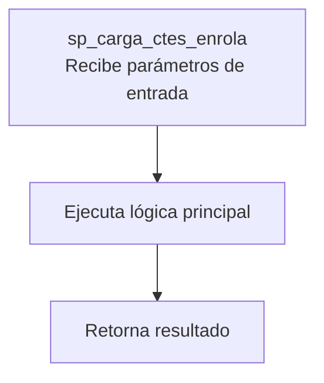
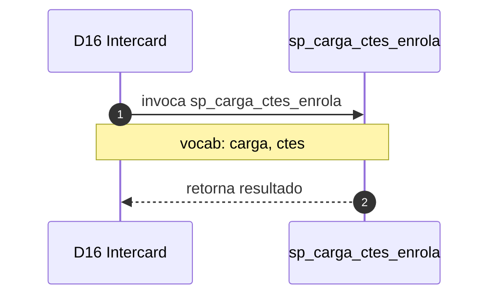

# SP Profile: `sp_carga_ctes_enrola`

> **Base de datos**: `intercard` · Dominio D16 — Intercard
> **Tipo de artefacto**: Perfil funcional · Gemelo Cognitivo — Capa 4: Intencion
> **Ultima actualizacion**: 2026-08-03
> **Estado**: ACTIVO · 0 callers en produccion

---

## Historia Funcional

El SP `sp_carga_ctes_enrola` implementa la logica de batch de carga y enrolamiento de clientes en intercard en el dominio Intercard (base de datos `intercard`). Comprende 1,778 lineas de codigo, 27 tablas consultadas. 

---

## Relaciones en la KB

| Tipo de relacion | Documento |
|-----------------|-----------|
| Cross-reference de reglas y vocabulario | [../cross-reference/sp-rules-vocab-map.md](../cross-reference/sp-rules-vocab-map.md) |
| Dependencias del dominio D16 | [../D16-intercard/07-dependencies.md](../D16-intercard/07-dependencies.md) |
| Reglas globales del sistema | [../rules/business-rules-bcop.md](../rules/business-rules-bcop.md) |
| Vocabulario del sistema | [../vocabulary/vocabulary-knowledge-base-bcop.md](../vocabulary/vocabulary-knowledge-base-bcop.md) |
| Vista HTML interactiva | [../../portal/sp-detail/sp-detail-sp_carga_ctes_enrola.html](../../portal/sp-detail/sp-detail-sp_carga_ctes_enrola.html) |

---

## Metricas del Gemelo Cognitivo

| Metrica | Valor |
|---------|-------|
| Fan-in (callers) | **0** |
| Fan-out (callees) | **3** |
| Callees principales | — |
| LOC | **1,778** |
| Tablas consultadas | 27 |
| Reglas de negocio activas | **0** |
| Autores historicos | 0 |

---

## Flujo de Decision

---

## Diagrama de Secuencia con Reglas y Vocabulario

---

## Reglas de Negocio Activas

_No se detectaron reglas de negocio para este proceso._

---

## Vocabulario Clave

| Termino | Categoria | Nivel | Significado |
|---------|-----------|-------|-------------|
| `carga` | ACCION | ALTA | carga / ingresa |
| `ctes` | ENTIDAD | ALTA | clientes |

---

## Nota de Migracion

El nombre contiene tokens sinteticos (`?_en`, `?a`), lo que indica que el alcance original fue parcialmente documentado por el equipo historico.

Ver registro completo de riesgos: [migration-risk-register.md](../migration-risk-register.md).
