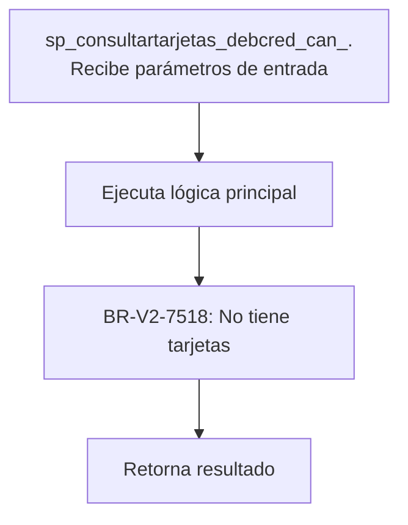
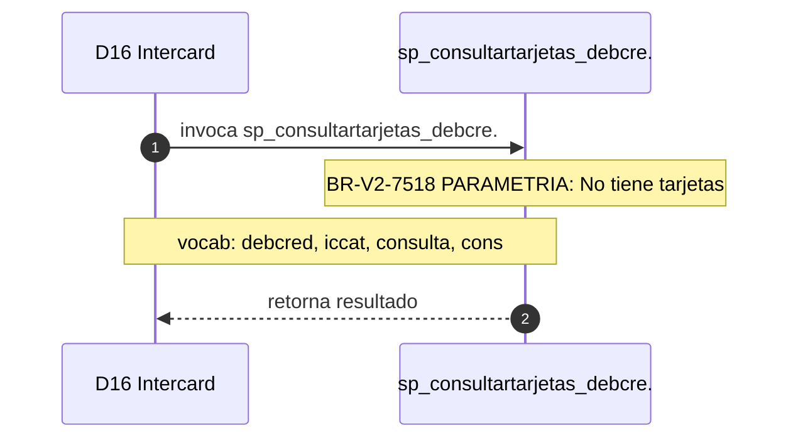

# SP Profile: `sp_consultartarjetas_debcred_can_iccat`

> **Base de datos**: `intercard` · Dominio D16 — Intercard
> **Tipo de artefacto**: Perfil funcional · Gemelo Cognitivo — Capa 4: Intencion
> **Ultima actualizacion**: 2026-08-03
> **Estado**: ACTIVO · 2 callers en produccion

---

## Historia Funcional

El SP `sp_consultartarjetas_debcred_can_iccat` implementa la logica de consulta tarjetas de débito y crédito del cliente vía canal ICCAT (BPI) en el dominio Intercard (base de datos `intercard`). Comprende 1,226 lineas de codigo, 1 tablas consultadas. Es invocado por 2 callers en el sistema, lo que lo convierte en un componente de alta dependencia. 

---

## Relaciones en la KB

| Tipo de relacion | Documento |
|-----------------|-----------|
| Cross-reference de reglas y vocabulario | [../cross-reference/sp-rules-vocab-map.md](../cross-reference/sp-rules-vocab-map.md) |
| Dependencias del dominio D16 | [../D16-intercard/07-dependencies.md](../D16-intercard/07-dependencies.md) |
| Reglas globales del sistema | [../rules/business-rules-bcop.md](../rules/business-rules-bcop.md) |
| Vocabulario del sistema | [../vocabulary/vocabulary-knowledge-base-bcop.md](../vocabulary/vocabulary-knowledge-base-bcop.md) |
| Vista HTML interactiva | [../../portal/sp-detail/sp-detail-sp_consultartarjetas_debcred_can_iccat.html](../../portal/sp-detail/sp-detail-sp_consultartarjetas_debcred_can_iccat.html) |

---

## Metricas del Gemelo Cognitivo

| Metrica | Valor |
|---------|-------|
| Fan-in (callers) | **2** |
| Fan-out (callees) | **1** |
| Callees principales | — |
| LOC | **1,226** |
| Tablas consultadas | 1 |
| Reglas de negocio activas | **1** |
| Autores historicos | 0 |

---

## Flujo de Decision

---

## Diagrama de Secuencia con Reglas y Vocabulario

---

## Reglas de Negocio Activas

| ID | Tipo | Categoria | Linea | Codigo | Referencia |
|----|------|-----------|-------|--------|------------|
| BR-V2-7518 | VALIDACIÓN | PARAMETRIA | 268 | `RETURN '000000001', 'No tiene tarjetas', cnumtarjeta, ctipot` | — |

---

## Vocabulario Clave

| Termino | Categoria | Nivel | Significado |
|---------|-----------|-------|-------------|
| `debcred` | ENTIDAD | MEDIA | débito/crédito (movimiento) |
| `iccat` | ENTIDAD | MEDIA | ICCAT — canal de atención al cliente en BPI; gestiona solicitudes de entrega y reposición de token, desbloqueo de acceso (bdibpi:sp_iccat_*, sp_*_iccat) |
| `consulta` | ACCION | ALTA | consulta / lee |
| `cons` | ACCION | ALTA | consulta |
| `consultar` | ACCION | ALTA | consultar |
| `cred` | ENTIDAD | ALTA | crédito |
| `tarjeta` | ENTIDAD | ALTA | tarjeta |
| `tarjetas` | ENTIDAD | ALTA | tarjetas (plural) |

---

## Nota de Migracion

El nombre contiene tokens sinteticos (`?_can_`), lo que indica que el alcance original fue parcialmente documentado por el equipo historico.

Ver registro completo de riesgos: [migration-risk-register.md](../migration-risk-register.md).
