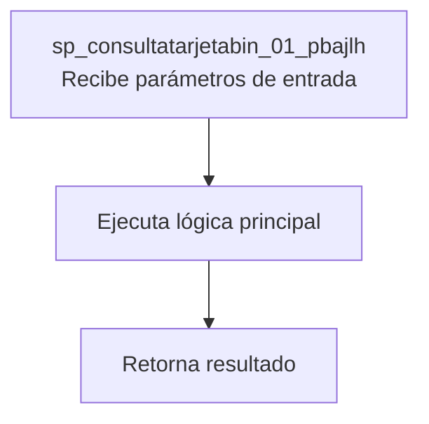
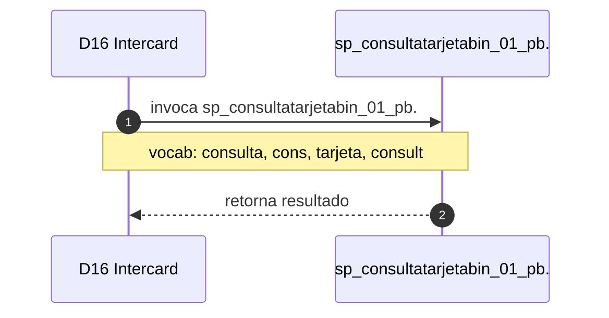

# SP Profile: `sp_consultatarjetabin_01_pbajlh`

> **Base de datos**: `intercard` · Dominio D16 — Intercard
> **Tipo de artefacto**: Perfil funcional · Gemelo Cognitivo — Capa 4: Intencion
> **Ultima actualizacion**: 2026-08-09
> **Estado**: ACTIVO · 0 callers en produccion

---

## Historia Funcional

El SP `sp_consultatarjetabin_01_pbajlh` implementa la logica de consulta tarjeta (sufijo de SPs para Pruebas; confirmado por SME) en el dominio Intercard (base de datos `intercard`). Comprende 1,261 lineas de codigo, 3 tablas consultadas. 

---

## Relaciones en la KB

| Tipo de relacion | Documento |
|-----------------|-----------|
| Cross-reference de reglas y vocabulario | [../cross-reference/sp-rules-vocab-map.md](../cross-reference/sp-rules-vocab-map.md) |
| Dependencias del dominio D16 | [../D16-intercard/07-dependencies.md](../D16-intercard/07-dependencies.md) |
| Reglas globales del sistema | [../rules/business-rules-bcop.md](../rules/business-rules-bcop.md) |
| Vocabulario del sistema | [../vocabulary/vocabulary-knowledge-base-bcop.md](../vocabulary/vocabulary-knowledge-base-bcop.md) |
| Vista HTML interactiva | [../../portal/sp-detail/sp-detail-sp_consultatarjetabin_01_pbajlh.html](../../portal/sp-detail/sp-detail-sp_consultatarjetabin_01_pbajlh.html) |

---

## Metricas del Gemelo Cognitivo

| Metrica | Valor |
|---------|-------|
| Fan-in (callers) | **0** |
| Fan-out (callees) | **3** |
| Callees principales | — |
| LOC | **1,261** |
| Tablas consultadas | 3 |
| Reglas de negocio activas | **0** |
| Autores historicos | 0 |

---

## Flujo de Decision

---

## Diagrama de Secuencia con Reglas y Vocabulario

---

## Reglas de Negocio Activas

_No se detectaron reglas de negocio para este proceso._

---

## Vocabulario Clave

| Termino | Categoria | Nivel | Significado |
|---------|-----------|-------|-------------|
| `consulta` | ACCION | ALTA | consulta / proyecta estado de entidad; sp_consulta_saldos_general (bdicred, fi=435) devuelve 47 campos del snapshot financiero de un crédito (cap vig/trans/vdo, int, IVA, comisiones, línea disponible, bloqueos) usando DIRTY READ |
| `cons` | ACCION | ALTA | consulta |
| `tarjeta` | ENTIDAD | ALTA | tarjeta |
| `consult` | ABREVIATURA | MEDIA | consulta |
| `tarj` | ABREVIATURA | MEDIA | tarjeta |

---

## Nota de Migracion

El nombre contiene tokens sinteticos (`?bin_01_`, `?jlh`), lo que indica que el alcance original fue parcialmente documentado por el equipo historico.

Ver registro completo de riesgos: [migration-risk-register.md](../../knowledge-base/migration-risk-register.md).
