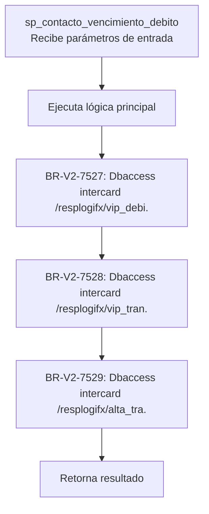
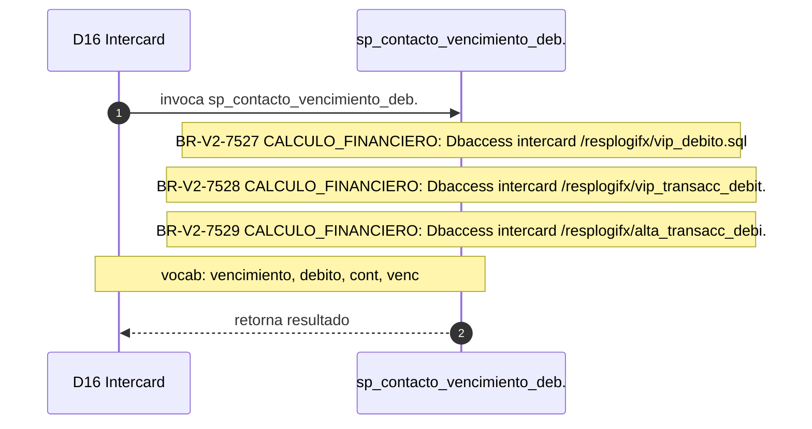

# SP Profile: `sp_contacto_vencimiento_debito`

> **Base de datos**: `intercard` · Dominio D16 — Intercard
> **Tipo de artefacto**: Perfil funcional · Gemelo Cognitivo — Capa 4: Intencion
> **Ultima actualizacion**: 2026-08-03
> **Estado**: ACTIVO · 0 callers en produccion

---

## Historia Funcional

El SP `sp_contacto_vencimiento_debito` implementa la logica de batch de contacto por vencimiento de débito — actualiza fechas y envía notificaciones en el dominio Intercard (base de datos `intercard`). Comprende 998 lineas de codigo, 40 tablas consultadas. 

---

## Relaciones en la KB

| Tipo de relacion | Documento |
|-----------------|-----------|
| Cross-reference de reglas y vocabulario | [../cross-reference/sp-rules-vocab-map.md](../cross-reference/sp-rules-vocab-map.md) |
| Indice regulatorio | [../cross-reference/regulatory-sp-index.md](../cross-reference/regulatory-sp-index.md) |
| Dependencias del dominio D16 | [../D16-intercard/07-dependencies.md](../D16-intercard/07-dependencies.md) |
| Reglas globales del sistema | [../rules/business-rules-bcop.md](../rules/business-rules-bcop.md) |
| Vocabulario del sistema | [../vocabulary/vocabulary-knowledge-base-bcop.md](../vocabulary/vocabulary-knowledge-base-bcop.md) |
| Vista HTML interactiva | [../../portal/sp-detail/sp-detail-sp_contacto_vencimiento_debito.html](../../portal/sp-detail/sp-detail-sp_contacto_vencimiento_debito.html) |

---

## Metricas del Gemelo Cognitivo

| Metrica | Valor |
|---------|-------|
| Fan-in (callers) | **0** |
| Fan-out (callees) | **2** |
| Callees principales | — |
| LOC | **998** |
| Tablas consultadas | 40 |
| Reglas de negocio activas | **3** |
| Autores historicos | 0 |

---

## Flujo de Decision

---

## Diagrama de Secuencia con Reglas y Vocabulario

---

## Reglas de Negocio Activas

| ID | Tipo | Categoria | Linea | Codigo | Referencia |
|----|------|-----------|-------|--------|------------|
| BR-V2-7527 | FÓRMULA | CALCULO_FINANCIERO | 655 | `vsql = 'dbaccess intercard /resplogifx/vip_debito.sql'` | — |
| BR-V2-7528 | FÓRMULA | CALCULO_FINANCIERO | 687 | `vsql = 'dbaccess intercard /resplogifx/vip_transacc_debito.s` | — |
| BR-V2-7529 | FÓRMULA | CALCULO_FINANCIERO | 711 | `vsql = 'dbaccess intercard /resplogifx/Alta_transacc_debito.` | — |

---

## Vocabulario Clave

| Termino | Categoria | Nivel | Significado |
|---------|-----------|-------|-------------|
| `vencimiento` | ENTIDAD | ALTA | vencimiento |
| `debito` | ENTIDAD | ALTA | débito |
| `cont` | PREFIJO | ALTA | familia contabilidad |
| `venc` | ENTIDAD | MEDIA | vencimiento |

---

## Nota de Migracion

El nombre contiene tokens sinteticos (`?o_`), lo que indica que el alcance original fue parcialmente documentado por el equipo historico.

Ver registro completo de riesgos: [migration-risk-register.md](../migration-risk-register.md).
