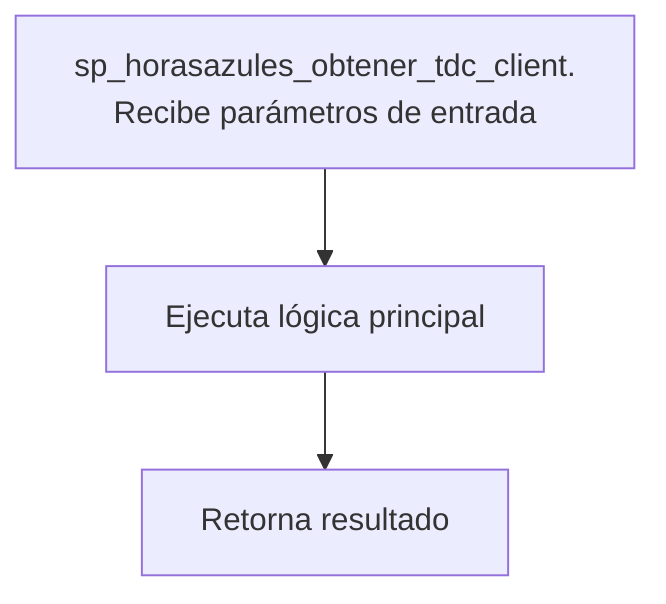
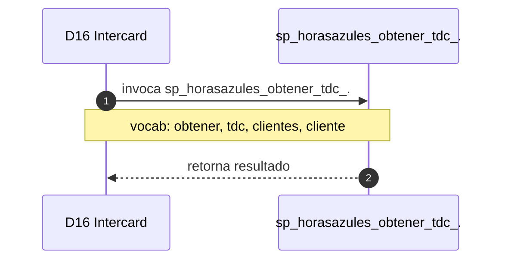

# SP Profile: `sp_horasazules_obtener_tdc_clientes_trace`

> **Base de datos**: `intercard` · Dominio D16 — Intercard
> **Tipo de artefacto**: Perfil funcional · Gemelo Cognitivo — Capa 4: Intencion
> **Ultima actualizacion**: 2026-08-09
> **Estado**: ACTIVO · 0 callers en produccion

---

## Historia Funcional

El SP `sp_horasazules_obtener_tdc_clientes_trace` implementa la logica de obtiene hora, tarjeta de crédito y clientes en el dominio Intercard (base de datos `intercard`). Comprende 1,584 lineas de codigo, 9 tablas consultadas. 

---

## Relaciones en la KB

| Tipo de relacion | Documento |
|-----------------|-----------|
| Cross-reference de reglas y vocabulario | [../cross-reference/sp-rules-vocab-map.md](../cross-reference/sp-rules-vocab-map.md) |
| Dependencias del dominio D16 | [../D16-intercard/07-dependencies.md](../D16-intercard/07-dependencies.md) |
| Reglas globales del sistema | [../rules/business-rules-bcop.md](../rules/business-rules-bcop.md) |
| Vocabulario del sistema | [../vocabulary/vocabulary-knowledge-base-bcop.md](../vocabulary/vocabulary-knowledge-base-bcop.md) |
| Vista HTML interactiva | [../../portal/sp-detail/sp-detail-sp_horasazules_obtener_tdc_clientes_trace.html](../../portal/sp-detail/sp-detail-sp_horasazules_obtener_tdc_clientes_trace.html) |

---

## Metricas del Gemelo Cognitivo

| Metrica | Valor |
|---------|-------|
| Fan-in (callers) | **0** |
| Fan-out (callees) | **3** |
| Callees principales | — |
| LOC | **1,584** |
| Tablas consultadas | 9 |
| Reglas de negocio activas | **0** |
| Autores historicos | 0 |

---

## Flujo de Decision

---

## Diagrama de Secuencia con Reglas y Vocabulario

---

## Reglas de Negocio Activas

_No se detectaron reglas de negocio para este proceso._

---

## Vocabulario Clave

| Termino | Categoria | Nivel | Significado |
|---------|-----------|-------|-------------|
| `obtener` | ACCION | ALTA | obtiene / recupera |
| `tdc` | ENTIDAD | ALTA | tarjeta de crédito (TDC) |
| `clientes` | ENTIDAD | ALTA | clientes (plural) |
| `cliente` | ENTIDAD | ALTA | cliente |
| `obten` | ACCION | ALTA | obtiene / recupera |
| `hora` | ENTIDAD | ALTA | hora |

---

## Nota de Migracion

El nombre contiene tokens sinteticos (`?sazules_`, `?_trace`), lo que indica que el alcance original fue parcialmente documentado por el equipo historico.

Ver registro completo de riesgos: [migration-risk-register.md](../../knowledge-base/migration-risk-register.md).
