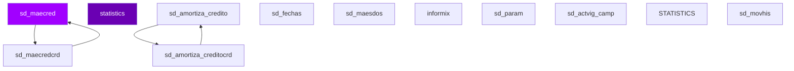

# D03 · Créditos — Modelo Entidad-Relación (Inferido)

> **Componente:** LegacyCore · SPE-AM-001 · Etapa 1
> **Base de datos:** `bdicred` · IBM Informix IDS 14.10 / POWER-AIX
> **Wave:** Wave 4 · Riesgo: **CRÍTICO**
> **Última actualización:** 2026-07-03

---
**SME responsable:**
- Specialist — Informix SPL Analysis (análisis estático, code extraction)
- DBA — IBM Informix IDS (schema real vía syscolumns — Etapa 2) ← NUEVO
- Industry Banking + Domain Expert LegacyCore (validación funcional)
- Cybersecurity (riesgos PII, regulación CNBV/LFPDPPP)
- QA Lead — Equivalencia Funcional (estrategia de pruebas) ← NUEVO
- Cloud Architect AWS Banking (arquitectura target) ← NUEVO
> [SME-PENDING] = requiere sesión de validación antes de Etapa 2.
---

## Metodología

Tablas inferidas de análisis estático de **70 archivos SQL** (`FROM`, `INSERT INTO`, `UPDATE`, `DELETE FROM`).
Columnas inferidas de listas `INSERT INTO tbl (col1, col2, ...)`.
Relaciones inferidas del conocimiento de dominio — Informix no declara `FOREIGN KEY` formalmente.

## Diagrama ER — tablas core (Mermaid)



> Renderizable en GitHub o VSCode con extensión Mermaid Preview.

## Inventario de entidades propias de `bdicred` (muestra)

| Tabla | Tipo | PK inferida | Lectores | Escritores |
|-------|------|-------------|----------|------------|
| `sd_maecred` | Maestro | `[SME-PENDING]` | 12 | 3 |
| `statistics` | Transaccional | `[SME-PENDING]` | 0 | 13 |
| `sd_amortiza_credito` | Transaccional | `[SME-PENDING]` | 5 | 5 |
| `sd_fechas` | Transaccional | `[SME-PENDING]` | 9 | 0 |
| `sd_amortiza_creditocrd` | Transaccional | `[SME-PENDING]` | 5 | 3 |
| `sd_maesdos` | Maestro | `[SME-PENDING]` | 4 | 4 |
| `sd_maecredcrd` | Maestro | `[SME-PENDING]` | 6 | 0 |
| `informix` | Transaccional | `[SME-PENDING]` | 1 | 5 |
| `sd_param` | Catálogo / Config | `[SME-PENDING]` | 6 | 0 |
| `sd_actvig_camp` | Transaccional | `[SME-PENDING]` | 3 | 3 |
| `STATISTICS` | Transaccional | `[SME-PENDING]` | 0 | 5 |
| `sd_movhis` | Transaccional | `[SME-PENDING]` | 4 | 1 |
| `sd_maesdoshist` | Maestro | `[SME-PENDING]` | 5 | 0 |
| `sd_tarjeta` | Transaccional | `num_tarjeta` | 5 | 0 |
| `sd_definicion` | Transaccional | `[SME-PENDING]` | 5 | 0 |
| `tme_consultaincrementos` | Transaccional | `[SME-PENDING]` | 2 | 2 |
| `sd_progesive_01` | Transaccional | `[SME-PENDING]` | 2 | 2 |
| `sd_maesdoscrd` | Maestro | `[SME-PENDING]` | 4 | 0 |
| `sd_hist_reserva` | Histórico / Archivado | `secuencial` | 2 | 2 |
| `sd_contproc` | Transaccional | `[SME-PENDING]` | 0 | 4 |
| `sd_sdodiario` | Transaccional | `[SME-PENDING]` | 3 | 1 |
| `sd_sdomensual` | Transaccional | `[SME-PENDING]` | 2 | 2 |
| `SD_PAGINTER` | Transaccional | `[SME-PENDING]` | 3 | 1 |
| `tmp_sd_actvig_camp` | Transaccional | `[SME-PENDING]` | 2 | 2 |
| `bdicred` | Transaccional | `[SME-PENDING]` | 4 | 0 |
| `sd_pie_edocta` | Transaccional | `[SME-PENDING]` | 2 | 1 |
| `sd_sdodiariocrd` | Transaccional | `[SME-PENDING]` | 2 | 1 |
| `sd_movdia` | Transaccional | `[SME-PENDING]` | 1 | 2 |
| `SD_MAESDOS` | Maestro | `[SME-PENDING]` | 0 | 3 |
| `SD_MAECRED` | Maestro | `[SME-PENDING]` | 2 | 1 |
| `tmp_plazsms` | Transaccional | `[SME-PENDING]` | 3 | 0 |
| `systables` | Transaccional | `[SME-PENDING]` | 2 | 0 |
| `bitacora_activacion` | Transaccional | `[SME-PENDING]` | 1 | 1 |
| `sd_info_edocta_calif` | Transaccional | `[SME-PENDING]` | 1 | 1 |
| `sd_gastos_bonificacion` | Transaccional | `[SME-PENDING]` | 1 | 1 |

## Tablas externas accedidas (cross-DB)

| DB externa | Tabla | Lecturas | Escrituras | Notas |
|-----------|-------|----------|-----------|-------|
| `BDISOLIC` | `SS_SOLICITUDES` | 1 SPs | 0 SPs | Cross-DB → API interna en target |
| `bdiburo` | `br_variables_cc_cnr` | 1 SPs | 0 SPs | Cross-DB → API interna en target |
| `bdicheq` | `` | 11 SPs | 1 SPs | Cross-DB → API interna en target |
| `bdicheq` | `sc_ctabloqueo` | 1 SPs | 1 SPs | Cross-DB → API interna en target |
| `bdicheq` | `sc_maechq` | 1 SPs | 0 SPs | Cross-DB → API interna en target |
| `bdicheq` | `sc_movhis` | 1 SPs | 0 SPs | Cross-DB → API interna en target |
| `bdicheq` | `sc_docret_sbc` | 1 SPs | 0 SPs | Cross-DB → API interna en target |
| `bdicobranza` | `` | 4 SPs | 0 SPs | Cross-DB → API interna en target |
| `bdicred` | `` | 34 SPs | 25 SPs | Cross-DB → API interna en target |
| `bdicred` | `sd_prospectos_aumlincred` | 0 SPs | 2 SPs | Cross-DB → API interna en target |
| `bdicred` | `sd_maesdos` | 6 SPs | 3 SPs | Cross-DB → API interna en target |
| `bdicred` | `sd_fechas` | 14 SPs | 0 SPs | Cross-DB → API interna en target |
| `bdicred` | `sd_maecred` | 12 SPs | 6 SPs | Cross-DB → API interna en target |
| `bdimnsj` | `mnsjr_trx_online` | 2 SPs | 0 SPs | Cross-DB → API interna en target |
| `bdimnsj` | `mnsjr_trx_online_his` | 2 SPs | 0 SPs | Cross-DB → API interna en target |
| `bdinteg` | `si_feriado` | 2 SPs | 0 SPs | Cross-DB → API interna en target |
| `bdinteg` | `` | 24 SPs | 3 SPs | Cross-DB → API interna en target |
| `bdinteg` | `si_telefonos` | 2 SPs | 0 SPs | Cross-DB → API interna en target |
| `bdinteg` | `si_fechas` | 2 SPs | 0 SPs | Cross-DB → API interna en target |
| `bdinteg` | `sx_contproc` | 9 SPs | 8 SPs | Cross-DB → API interna en target |
| `bdisitesp` | `se_ctessitespcred` | 3 SPs | 1 SPs | Cross-DB → API interna en target |
| `bdisitesp` | `se_ctessitespcred_his` | 1 SPs | 1 SPs | Cross-DB → API interna en target |
| `bdisolic` | `` | 14 SPs | 10 SPs | Cross-DB → API interna en target |
| `bdisolic` | `ss_autorizacion` | 2 SPs | 0 SPs | Cross-DB → API interna en target |
| `bdisolic` | `ss_resum_scor_fin` | 2 SPs | 0 SPs | Cross-DB → API interna en target |
| `bdisolic` | `ss_autorizacion_especial` | 1 SPs | 0 SPs | Cross-DB → API interna en target |
| `bdisolic` | `ss_solicitudes` | 4 SPs | 0 SPs | Cross-DB → API interna en target |
| `bditransfer` | `` | 1 SPs | 0 SPs | Cross-DB → API interna en target |
| `intercard` | `` | 3 SPs | 3 SPs | Cross-DB → API interna en target |
| `intercard` | `productotarjeta` | 1 SPs | 0 SPs | Cross-DB → API interna en target |
| `intercard` | `tarjetacuenta` | 0 SPs | 1 SPs | Cross-DB → API interna en target |
| `intercard` | `movimiento` | 2 SPs | 0 SPs | Cross-DB → API interna en target |
| `intercard` | `movimientohistorico` | 2 SPs | 0 SPs | Cross-DB → API interna en target |
| `lineas` | `sl_ctepro` | 1 SPs | 1 SPs | Cross-DB → API interna en target |
| `lineas` | `sl_catgrupos` | 1 SPs | 0 SPs | Cross-DB → API interna en target |
| `lineas` | `sl_ctegpo` | 0 SPs | 1 SPs | Cross-DB → API interna en target |
| `lineas` | `sl_grupos` | 0 SPs | 1 SPs | Cross-DB → API interna en target |
| `sysmaster` | `sysshmvals` | 4 SPs | 0 SPs | Cross-DB → API interna en target |
| `sysmaster` | `` | 1 SPs | 0 SPs | Cross-DB → API interna en target |
| `sysmaster` | `systabnames` | 1 SPs | 0 SPs | Cross-DB → API interna en target |

## Detalle de columnas — tablas con columnas inferidas

### `sd_insumos_calif_pp` — Transaccional

| Columna | Tipo Informix | Tipo PostgreSQL target | PII |
|---------|--------------|----------------------|-----|
| `Dias_Rem_Contractual` | [SME-PENDING] | [SME-PENDING] |  |
| `Pct_Pgo0` | [SME-PENDING] | [SME-PENDING] |  |
| `Pct_pago1` | [SME-PENDING] | [SME-PENDING] |  |
| `Pct_pago2` | [SME-PENDING] | [SME-PENDING] |  |
| `Pct_pago3` | [SME-PENDING] | [SME-PENDING] |  |
| `alto` | [SME-PENDING] | [SME-PENDING] |  |
| `ant_otr_inst` | [SME-PENDING] | [SME-PENDING] |  |
| `antecedentes_buro` | [SME-PENDING] | [SME-PENDING] |  |
| `antiguedad` | [SME-PENDING] | [SME-PENDING] |  |
| `antiguedad_cliente` | [SME-PENDING] | [SME-PENDING] |  |
| `antiguedad_inst` | [SME-PENDING] | [SME-PENDING] |  |
| `atr` | [SME-PENDING] | [SME-PENDING] |  |
| `atr1` | [SME-PENDING] | [SME-PENDING] |  |
| `atr2` | [SME-PENDING] | [SME-PENDING] |  |
| `atr3` | [SME-PENDING] | [SME-PENDING] |  |

### `sd_actvig_camp` — Transaccional

| Columna | Tipo Informix | Tipo PostgreSQL target | PII |
|---------|--------------|----------------------|-----|
| `bloqueo` | [SME-PENDING] | [SME-PENDING] |  |
| `camp` | [SME-PENDING] | [SME-PENDING] |  |
| `carga` | [SME-PENDING] | [SME-PENDING] |  |
| `desbloqueo` | [SME-PENDING] | [SME-PENDING] |  |
| `f_fin_vig` | [SME-PENDING] | [SME-PENDING] |  |
| `f_ini_vig` | [SME-PENDING] | [SME-PENDING] |  |
| `giro` | [SME-PENDING] | [SME-PENDING] |  |
| `identificador` | [SME-PENDING] | [SME-PENDING] |  |
| `montos` | MONEY(16,2) | NUMERIC(16,2) |  |
| `origen` | [SME-PENDING] | [SME-PENDING] |  |
| `plazo` | [SME-PENDING] | [SME-PENDING] |  |
| `prioridad` | [SME-PENDING] | [SME-PENDING] |  |
| `tasa` | [SME-PENDING] | [SME-PENDING] |  |
| `tipo` | [SME-PENDING] | [SME-PENDING] |  |
| `tipo_compra` | CHAR(4) | CHAR(4) |  |

### `sd_cifras_operaciones` — Transaccional

| Columna | Tipo Informix | Tipo PostgreSQL target | PII |
|---------|--------------|----------------------|-----|
| `area` | [SME-PENDING] | [SME-PENDING] |  |
| `empresa` | [SME-PENDING] | [SME-PENDING] |  |
| `fecha` | DATE | DATE |  |
| `porcentaje_at` | [SME-PENDING] | [SME-PENDING] |  |
| `porcentaje_ce` | [SME-PENDING] | [SME-PENDING] |  |
| `porcentaje_ee` | [SME-PENDING] | [SME-PENDING] |  |
| `porcentaje_en_proceso` | [SME-PENDING] | [SME-PENDING] |  |
| `porcentaje_rechazadas` | [SME-PENDING] | [SME-PENDING] |  |
| `solicitudes_analizadas` | [SME-PENDING] | [SME-PENDING] |  |
| `solicitudes_autorizadas` | [SME-PENDING] | [SME-PENDING] |  |
| `solicitudes_ce` | [SME-PENDING] | [SME-PENDING] |  |
| `solicitudes_ee` | [SME-PENDING] | [SME-PENDING] |  |
| `solicitudes_en_proceso` | [SME-PENDING] | [SME-PENDING] |  |
| `solicitudes_rechazadas` | [SME-PENDING] | [SME-PENDING] |  |

### `tme_consultaincrementos` — Transaccional

| Columna | Tipo Informix | Tipo PostgreSQL target | PII |
|---------|--------------|----------------------|-----|
| `causa` | [SME-PENDING] | [SME-PENDING] |  |
| `descripcion` | VARCHAR(100) | VARCHAR(100) |  |
| `porcentaje` | [SME-PENDING] | [SME-PENDING] |  |
| `porcentajeAuto` | [SME-PENDING] | [SME-PENDING] |  |
| `porcentajeCac` | [SME-PENDING] | [SME-PENDING] |  |
| `porcentajeCentral` | [SME-PENDING] | [SME-PENDING] |  |
| `porcentajeSucursal` | [SME-PENDING] | [SME-PENDING] |  |
| `status` | [SME-PENDING] | [SME-PENDING] |  |
| `totalRegAuto` | [SME-PENDING] | [SME-PENDING] |  |
| `totalRegCac` | [SME-PENDING] | [SME-PENDING] |  |
| `totalRegCentral` | [SME-PENDING] | [SME-PENDING] |  |
| `totalRegSucursal` | [SME-PENDING] | [SME-PENDING] |  |
| `totalRegistros` | [SME-PENDING] | [SME-PENDING] |  |

## Tablas core del dominio (conocimiento de dominio)

| Tabla | Tipo esperado | Notas |
|-------|--------------|-------|
| `sd_maecred` | Maestro | Confirmar existencia y esquema con DBA |
| `sd_movimientos` | Transaccional | Confirmar existencia y esquema con DBA |
| `sd_saldo` | Transaccional | Confirmar existencia y esquema con DBA |
| `sd_fechas` | Transaccional | Confirmar existencia y esquema con DBA |
| `sd_tarjeta` | Transaccional | Confirmar existencia y esquema con DBA |
| `sd_politica` | Transaccional | Confirmar existencia y esquema con DBA |

## Pendientes Etapa 2

```sql
-- Ejecutar en instancia Informix `bdicred` para obtener schema real:
SELECT t.tabname, c.colname, c.coltype, c.collength, c.colno
FROM systables t JOIN syscolumns c ON t.tabid = c.tabid
WHERE t.owner = 'informix'
ORDER BY t.tabname, c.colno;
```

- [ ] Confirmar política de retención por tabla (especialmente tablas `_his`)
- [ ] Identificar todos los campos PII — datos sujetos a LFPDPPP
- [ ] Verificar si tablas `_tmp` / `_temp` se crean dinámicamente o son permanentes
- [ ] Confirmar cardinalidades reales en producción
- [ ] Validar relaciones implícitas (FK lógicas sin constraint formal)


---
*Generado por: Specialist — Informix SPL Analysis · 2026-07-03 · Evidencia: source/LegacyCore/informix/bdicred_*.sql (análisis estático de 70 archivos SQL) · análisis estático de archivos SQL*
