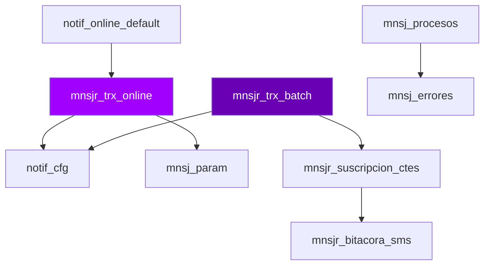

# D09 · Mensajería — Modelo Entidad-Relación

> **Componente:** LegacyCore · SPE-AM-001 · Etapa 1 → Etapa 2  
> **Base de datos:** `bdimnsj` · IBM Informix IDS 14.10 / POWER-AIX  
> **Última actualización:** 2026-07-03

---
**SME responsable:** Specialist SPL Analysis · Data Architect · DBA LegacyCore
> Tipos de columna `[SME-PENDING]` requieren `syscolumns` en instancia viva (Etapa 2).
---

## Metodología

Tablas inferidas de análisis estático de **47 archivos SQL** (`FROM`, `INSERT INTO`, `UPDATE`, `DELETE FROM`).  
Columnas inferidas de listas `INSERT INTO tbl (col1, col2, ...)`.  
Relaciones inferidas del conocimiento de dominio — Informix no declara `FOREIGN KEY` formalmente.

## Diagrama ER — tablas core (Mermaid)



> Renderizable en GitHub o VSCode con extensión Mermaid Preview.

## Inventario de entidades propias de `bdimnsj`

| Tabla | Tipo | PK inferida | Lectores | Escritores |
|-------|------|-------------|----------|-----------|
| `mnsj_bitacora_susc` | Maestro suscriptores | `num_cte` | 0 | 5 |
| `mnsj_cat_sinonimos` | Catálogo / Config | `[SME-PENDING]` | 1 | 0 |
| `mnsj_chi_notifica_resultados` | Transaccional | `[SME-PENDING]` | 1 | 0 |
| `mnsj_chi_notifica_resultados_hist` | Histórico / Archivado | `[SME-PENDING]` | 1 | 1 |
| `mnsj_errores` | Log / Bitácora | `[SME-PENDING]` | 0 | 11 |
| `mnsj_grupos_usuarios` | Transaccional | `[SME-PENDING]` | 1 | 0 |
| `mnsj_notifica_resultados` | Transaccional | `[SME-PENDING]` | 1 | 0 |
| `mnsj_notifica_resultados_hist` | Histórico / Archivado | `[SME-PENDING]` | 1 | 1 |
| `mnsj_param` | Catálogo / Config | `[SME-PENDING]` | 14 | 0 |
| `mnsj_procesos` | Control batch | `[SME-PENDING]` | 0 | 7 |
| `mnsj_susc_paso` | Maestro suscriptores | `[SME-PENDING]` | 1 | 6 |
| `mnsj_transacc_status` | Transaccional | `secuencial` | 1 | 1 |
| `mnsjr_bitacora_err` | Log / Bitácora | `id_proceso` | 0 | 2 |
| `mnsjr_bitacora_sms` | Transaccional | `[SME-PENDING]` | 2 | 2 |
| `mnsjr_bitacora_sms_hist` | Histórico / Archivado | `[SME-PENDING]` | 0 | 1 |
| `mnsjr_cat_prioridades` | Catálogo / Config | `[SME-PENDING]` | 5 | 0 |
| `mnsjr_cat_smsin` | Catálogo / Config | `[SME-PENDING]` | 1 | 0 |
| `mnsjr_cat_suscripcion` | Catálogo / Config | `[SME-PENDING]` | 5 | 0 |
| `mnsjr_reporte_sms` | Reportería / Temporal | `[SME-PENDING]` | 1 | 1 |
| `mnsjr_suscripcion_ctes` | Catálogo / Config | `[SME-PENDING]` | 6 | 1 |
| `mnsjr_trx_batch` | Transaccional | `transaction_id` | 2 | 5 |
| `mnsjr_trx_batch_his` | Histórico / Archivado | `secuencial` | 0 | 1 |
| `mnsjr_trx_online` | Transaccional | `transaction_id` | 10 | 7 |
| `mnsjr_trx_online_his` | Histórico / Archivado | `secuencial` | 0 | 1 |
| `notif_batch_default` | Transaccional | `[SME-PENDING]` | 1 | 1 |
| `notif_batch_masivos` | Transaccional | `[SME-PENDING]` | 1 | 1 |
| `notif_cfg` | Catálogo / Config | `[SME-PENDING]` | 7 | 0 |
| `notif_online_97000_98000` | Transaccional | `[SME-PENDING]` | 1 | 1 |
| `notif_online_default` | Transaccional | `[SME-PENDING]` | 1 | 1 |
| `notif_online_fon_insuf` | Transaccional | `[SME-PENDING]` | 1 | 1 |
| `notif_online_icard` | Transaccional | `[SME-PENDING]` | 1 | 1 |
| `notif_online_monitoreo` | Transaccional | `[SME-PENDING]` | 1 | 1 |
| `notif_online_oper_bancarias` | Transaccional | `[SME-PENDING]` | 1 | 1 |
| `notif_online_remesas` | Transaccional | `[SME-PENDING]` | 1 | 1 |
| `notif_online_spei` | Transaccional | `[SME-PENDING]` | 1 | 1 |
| `notif_online_tokens` | Transaccional | `[SME-PENDING]` | 1 | 1 |
| `sc_cuenta_telefono` | Transaccional | `[SME-PENDING]` | 1 | 0 |
| `sc_maechq` | Transaccional | `[SME-PENDING]` | 9 | 0 |
| `sc_tarjeta` | Transaccional | `[SME-PENDING]` | 1 | 0 |
| `sd_fechas` | Transaccional | `[SME-PENDING]` | 2 | 0 |
| `sd_maecred` | Transaccional | `[SME-PENDING]` | 9 | 0 |
| `sd_tarjeta` | Transaccional | `[SME-PENDING]` | 1 | 0 |
| `si_bitacora_huella_ine` | Transaccional | `[SME-PENDING]` | 1 | 0 |
| `si_bitsmstels` | Transaccional | `[SME-PENDING]` | 1 | 0 |
| `si_bitsmstelsms` | Transaccional | `[SME-PENDING]` | 2 | 0 |
| `si_bitsmstelsms_bpi` | Transaccional | `[SME-PENDING]` | 3 | 0 |
| `si_ciudades` | Transaccional | `[SME-PENDING]` | 1 | 0 |
| `si_cliente` | Transaccional | `[SME-PENDING]` | 15 | 0 |
| `si_correos` | Transaccional | `[SME-PENDING]` | 3 | 0 |
| `si_ctepf` | Transaccional | `[SME-PENDING]` | 1 | 0 |
| `si_estados` | Transaccional | `[SME-PENDING]` | 1 | 0 |
| `si_fechas` | Transaccional | `[SME-PENDING]` | 9 | 0 |
| `si_ptf` | Transaccional | `[SME-PENDING]` | 1 | 0 |
| `si_sucursales` | Transaccional | `[SME-PENDING]` | 1 | 0 |
| `si_telefonos_actual` | Transaccional | `[SME-PENDING]` | 11 | 0 |
| `statistics` | Transaccional | `[SME-PENDING]` | 0 | 2 |
| `syscheckpoint` | Transaccional | `[SME-PENDING]` | 1 | 0 |
| `sysshmvals` | Transaccional | `[SME-PENDING]` | 1 | 0 |
| `tarjeta` | Transaccional | `[SME-PENDING]` | 8 | 0 |
| `temp_mnsjr_bit_sms` | Transaccional | `[SME-PENDING]` | 1 | 0 |
| `tmp_sms_innovattia` | Reportería / Temporal | `[SME-PENDING]` | 1 | 1 |

## Tablas externas accedidas por `bdimnsj` (cross-DB)

| DB externa | Lecturas desde `bdimnsj` | Escrituras | Notas |
|-----------|--------------------------|-----------|-------|

> **[SME-PENDING]** En el target, cada acceso cross-DB se convierte en llamada API interna. Definir contrato con cada dominio proveedor.

## Patrón arquitectónico: tablas de staging por canal

`bdimnsj` usa tablas `notif_online_*` separadas por tipo de operación — particionamiento manual Informix:

| Tabla | Canal / Evento |
|-------|---------------|
| `notif_batch_default` | Notificaciones batch genéricas |
| `notif_batch_masivos` | Notificaciones masivas / campañas |
| `notif_cfg` | [SME-PENDING] |
| `notif_online_97000_98000` | Rango de eventos 97000-98000 [SME-PENDING] |
| `notif_online_default` | Operaciones online genéricas |
| `notif_online_fon_insuf` | Fondos insuficientes |
| `notif_online_icard` | Intercard POS/ATM |
| `notif_online_monitoreo` | Heartbeat / monitoreo |
| `notif_online_oper_bancarias` | Operaciones bancarias generales |
| `notif_online_remesas` | Remesas |
| `notif_online_spei` | Transferencias SPEI |
| `notif_online_tokens` | Tokens SMS (autenticación) |

> **Target recomendado:** reemplazar con una tabla particionada por `tipo_evento` + topics AWS SNS/EventBridge por canal.

## Detalle de columnas — tablas transaccionales prioritarias

### `mnsjr_trx_online` — Transaccional

| Columna | Tipo Informix | Tipo PostgreSQL target | PII |
|---------|--------------|----------------------|-----|
| `celular_alterno` | [SME-PENDING] | [SME-PENDING] | ⚠️ PII |
| `cliente` | [SME-PENDING] | [SME-PENDING] |  |
| `correo_alterno` | [SME-PENDING] | [SME-PENDING] | ⚠️ PII |
| `cuenta` | [SME-PENDING] | [SME-PENDING] |  |
| `estatus` | [SME-PENDING] | [SME-PENDING] |  |
| `fecha1` | [SME-PENDING] | [SME-PENDING] |  |
| `fecha2` | [SME-PENDING] | [SME-PENDING] |  |
| `fecha_hora_recuperado` | [SME-PENDING] | [SME-PENDING] |  |
| `fecha_hora_registro` | [SME-PENDING] | [SME-PENDING] |  |
| `id_mensaje` | [SME-PENDING] | [SME-PENDING] |  |
| `importe1` | [SME-PENDING] | [SME-PENDING] |  |
| `importe2` | [SME-PENDING] | [SME-PENDING] |  |
| `importe3` | [SME-PENDING] | [SME-PENDING] |  |
| `importe4` | [SME-PENDING] | [SME-PENDING] |  |
| `importe5` | [SME-PENDING] | [SME-PENDING] |  |
| `string1` | [SME-PENDING] | [SME-PENDING] |  |
| `string10` | [SME-PENDING] | [SME-PENDING] |  |
| `string2` | [SME-PENDING] | [SME-PENDING] |  |
| `string3` | [SME-PENDING] | [SME-PENDING] |  |
| `string4` | [SME-PENDING] | [SME-PENDING] |  |
| `string5` | [SME-PENDING] | [SME-PENDING] |  |
| `string6` | [SME-PENDING] | [SME-PENDING] |  |
| `string7` | [SME-PENDING] | [SME-PENDING] |  |
| `string8` | [SME-PENDING] | [SME-PENDING] |  |
| `string9` | [SME-PENDING] | [SME-PENDING] |  |
| `tarjeta` | [SME-PENDING] | [SME-PENDING] |  |
| `tipo_mensaje` | [SME-PENDING] | [SME-PENDING] |  |
| `transaction_id` | [SME-PENDING] | [SME-PENDING] |  |

### `mnsjr_trx_batch` — Transaccional

| Columna | Tipo Informix | Tipo PostgreSQL target | PII |
|---------|--------------|----------------------|-----|
| `celular_alterno` | [SME-PENDING] | [SME-PENDING] | ⚠️ PII |
| `cliente` | [SME-PENDING] | [SME-PENDING] |  |
| `correo_alterno` | [SME-PENDING] | [SME-PENDING] | ⚠️ PII |
| `cuenta` | [SME-PENDING] | [SME-PENDING] |  |
| `estatus` | [SME-PENDING] | [SME-PENDING] |  |
| `fecha1` | [SME-PENDING] | [SME-PENDING] |  |
| `fecha2` | [SME-PENDING] | [SME-PENDING] |  |
| `fecha_hora_recuperado` | [SME-PENDING] | [SME-PENDING] |  |
| `fecha_hora_registro` | [SME-PENDING] | [SME-PENDING] |  |
| `id_mensaje` | [SME-PENDING] | [SME-PENDING] |  |
| `id_plantilla` | [SME-PENDING] | [SME-PENDING] |  |
| `importe1` | [SME-PENDING] | [SME-PENDING] |  |
| `importe2` | [SME-PENDING] | [SME-PENDING] |  |
| `importe3` | [SME-PENDING] | [SME-PENDING] |  |
| `importe4` | [SME-PENDING] | [SME-PENDING] |  |
| `importe5` | [SME-PENDING] | [SME-PENDING] |  |
| `string1` | [SME-PENDING] | [SME-PENDING] |  |
| `string10` | [SME-PENDING] | [SME-PENDING] |  |
| `string2` | [SME-PENDING] | [SME-PENDING] |  |
| `string3` | [SME-PENDING] | [SME-PENDING] |  |
| `string4` | [SME-PENDING] | [SME-PENDING] |  |
| `string5` | [SME-PENDING] | [SME-PENDING] |  |
| `string6` | [SME-PENDING] | [SME-PENDING] |  |
| `string7` | [SME-PENDING] | [SME-PENDING] |  |
| `string8` | [SME-PENDING] | [SME-PENDING] |  |
| `string9` | [SME-PENDING] | [SME-PENDING] |  |
| `tarjeta` | [SME-PENDING] | [SME-PENDING] |  |
| `tipo_mensaje` | [SME-PENDING] | [SME-PENDING] |  |
| `transaction_id` | [SME-PENDING] | [SME-PENDING] |  |

### `mnsjr_bitacora_sms` — Transaccional

| Columna | Tipo Informix | Tipo PostgreSQL target | PII |
|---------|--------------|----------------------|-----|
| `cel` | [SME-PENDING] | [SME-PENDING] |  |
| `compania` | [SME-PENDING] | [SME-PENDING] |  |
| `fechasolicitud` | [SME-PENDING] | [SME-PENDING] |  |
| `numcte` | [SME-PENDING] | [SME-PENDING] |  |
| `param1` | [SME-PENDING] | [SME-PENDING] |  |
| `param2` | [SME-PENDING] | [SME-PENDING] |  |
| `param3` | [SME-PENDING] | [SME-PENDING] |  |
| `pass` | [SME-PENDING] | [SME-PENDING] |  |
| `proceso` | [SME-PENDING] | [SME-PENDING] |  |
| `respuestasolicitud` | [SME-PENDING] | [SME-PENDING] |  |
| `sucursal` | [SME-PENDING] | [SME-PENDING] |  |
| `texto_msj` | [SME-PENDING] | [SME-PENDING] |  |
| `usuario` | [SME-PENDING] | [SME-PENDING] |  |

### `mnsjr_trx_online_his` — Histórico / Archivado

| Columna | Tipo Informix | Tipo PostgreSQL target | PII |
|---------|--------------|----------------------|-----|
| `celular_alterno` | [SME-PENDING] | [SME-PENDING] | ⚠️ PII |
| `cliente` | [SME-PENDING] | [SME-PENDING] |  |
| `correo_alterno` | [SME-PENDING] | [SME-PENDING] | ⚠️ PII |
| `cuenta` | [SME-PENDING] | [SME-PENDING] |  |
| `estatus` | [SME-PENDING] | [SME-PENDING] |  |
| `fecha1` | [SME-PENDING] | [SME-PENDING] |  |
| `fecha2` | [SME-PENDING] | [SME-PENDING] |  |
| `fecha_hora_recuperado` | [SME-PENDING] | [SME-PENDING] |  |
| `fecha_hora_registro` | [SME-PENDING] | [SME-PENDING] |  |
| `id_mensaje` | [SME-PENDING] | [SME-PENDING] |  |
| `id_plantilla` | [SME-PENDING] | [SME-PENDING] |  |
| `importe1` | [SME-PENDING] | [SME-PENDING] |  |
| `importe2` | [SME-PENDING] | [SME-PENDING] |  |
| `importe3` | [SME-PENDING] | [SME-PENDING] |  |
| `importe4` | [SME-PENDING] | [SME-PENDING] |  |
| `importe5` | [SME-PENDING] | [SME-PENDING] |  |
| `prioridad` | [SME-PENDING] | [SME-PENDING] |  |
| `secuencial` | [SME-PENDING] | [SME-PENDING] |  |
| `string1` | [SME-PENDING] | [SME-PENDING] |  |
| `string10` | [SME-PENDING] | [SME-PENDING] |  |
| `string2` | [SME-PENDING] | [SME-PENDING] |  |
| `string3` | [SME-PENDING] | [SME-PENDING] |  |
| `string4` | [SME-PENDING] | [SME-PENDING] |  |
| `string5` | [SME-PENDING] | [SME-PENDING] |  |
| `string6` | [SME-PENDING] | [SME-PENDING] |  |
| `string7` | [SME-PENDING] | [SME-PENDING] |  |
| `string8` | [SME-PENDING] | [SME-PENDING] |  |
| `string9` | [SME-PENDING] | [SME-PENDING] |  |
| `tarjeta` | [SME-PENDING] | [SME-PENDING] |  |
| `tipo_mensaje` | [SME-PENDING] | [SME-PENDING] |  |

### `mnsjr_trx_batch_his` — Histórico / Archivado

| Columna | Tipo Informix | Tipo PostgreSQL target | PII |
|---------|--------------|----------------------|-----|
| `celular_alterno` | [SME-PENDING] | [SME-PENDING] | ⚠️ PII |
| `cliente` | [SME-PENDING] | [SME-PENDING] |  |
| `correo_alterno` | [SME-PENDING] | [SME-PENDING] | ⚠️ PII |
| `cuenta` | [SME-PENDING] | [SME-PENDING] |  |
| `estatus` | [SME-PENDING] | [SME-PENDING] |  |
| `fecha1` | [SME-PENDING] | [SME-PENDING] |  |
| `fecha2` | [SME-PENDING] | [SME-PENDING] |  |
| `fecha_hora_recuperado` | [SME-PENDING] | [SME-PENDING] |  |
| `fecha_hora_registro` | [SME-PENDING] | [SME-PENDING] |  |
| `id_mensaje` | [SME-PENDING] | [SME-PENDING] |  |
| `id_plantilla` | [SME-PENDING] | [SME-PENDING] |  |
| `importe1` | [SME-PENDING] | [SME-PENDING] |  |
| `importe2` | [SME-PENDING] | [SME-PENDING] |  |
| `importe3` | [SME-PENDING] | [SME-PENDING] |  |
| `importe4` | [SME-PENDING] | [SME-PENDING] |  |
| `importe5` | [SME-PENDING] | [SME-PENDING] |  |
| `prioridad` | [SME-PENDING] | [SME-PENDING] |  |
| `secuencial` | [SME-PENDING] | [SME-PENDING] |  |
| `string1` | [SME-PENDING] | [SME-PENDING] |  |
| `string10` | [SME-PENDING] | [SME-PENDING] |  |
| `string2` | [SME-PENDING] | [SME-PENDING] |  |
| `string3` | [SME-PENDING] | [SME-PENDING] |  |
| `string4` | [SME-PENDING] | [SME-PENDING] |  |
| `string5` | [SME-PENDING] | [SME-PENDING] |  |
| `string6` | [SME-PENDING] | [SME-PENDING] |  |
| `string7` | [SME-PENDING] | [SME-PENDING] |  |
| `string8` | [SME-PENDING] | [SME-PENDING] |  |
| `string9` | [SME-PENDING] | [SME-PENDING] |  |
| `tarjeta` | [SME-PENDING] | [SME-PENDING] |  |
| `tipo_mensaje` | [SME-PENDING] | [SME-PENDING] |  |

### `mnsjr_reporte_sms` — Reportería / Temporal

| Columna | Tipo Informix | Tipo PostgreSQL target | PII |
|---------|--------------|----------------------|-----|
| `aclaracion` | [SME-PENDING] | [SME-PENDING] |  |
| `anticipo` | [SME-PENDING] | [SME-PENDING] |  |
| `celular` | [SME-PENDING] | [SME-PENDING] | ⚠️ PII |
| `ciudad` | [SME-PENDING] | [SME-PENDING] |  |
| `confirma` | [SME-PENDING] | [SME-PENDING] |  |
| `diferir` | [SME-PENDING] | [SME-PENDING] |  |
| `estado` | [SME-PENDING] | [SME-PENDING] |  |
| `extravio` | [SME-PENDING] | [SME-PENDING] |  |
| `fechainsert` | [SME-PENDING] | [SME-PENDING] |  |
| `flexible_consulta` | [SME-PENDING] | [SME-PENDING] |  |
| `flexible_disponible` | [SME-PENDING] | [SME-PENDING] |  |
| `flexible_monto` | [SME-PENDING] | [SME-PENDING] |  |
| `incremento` | [SME-PENDING] | [SME-PENDING] |  |
| `inversion` | [SME-PENDING] | [SME-PENDING] |  |
| `pago` | [SME-PENDING] | [SME-PENDING] |  |
| `pagosfijos_folio` | [SME-PENDING] | [SME-PENDING] |  |
| `pagosfijos_saldo` | [SME-PENDING] | [SME-PENDING] |  |
| `prestamo_consulta` | [SME-PENDING] | [SME-PENDING] |  |
| `prestamo_disponible` | [SME-PENDING] | [SME-PENDING] |  |
| `prestamo_monto` | [SME-PENDING] | [SME-PENDING] |  |
| `robo` | [SME-PENDING] | [SME-PENDING] |  |
| `saldo` | [SME-PENDING] | [SME-PENDING] |  |
| `solicitud` | [SME-PENDING] | [SME-PENDING] |  |
| `sucursal` | [SME-PENDING] | [SME-PENDING] |  |
| `total` | [SME-PENDING] | [SME-PENDING] |  |

## Pendientes Etapa 2

```sql
-- Ejecutar en instancia Informix bdimnsj para obtener schema real:
SELECT t.tabname, c.colname, c.coltype, c.collength, c.colno
FROM systables t JOIN syscolumns c ON t.tabid = c.tabid
WHERE t.owner = 'informix'
ORDER BY t.tabname, c.colno;
```

- [ ] Confirmar política de retención por tabla (especialmente `_his`)
- [ ] Identificar todos los campos PII en `mnsjr_suscripcion_ctes` y `mnsjr_bitacora_sms`
- [ ] Verificar si `tmp_sms_innovattia` se crea/elimina dinámicamente o es tabla permanente
- [ ] Confirmar cardinalidades: ¿`mnsjr_trx_online` tiene FK implícita hacia `notif_cfg`?
- [ ] Validar si las tablas `notif_online_97000_98000` corresponden a rangos de eventos específicos

---
*Generado por: Specialist — Informix SPL Analysis · 2026-07-03 · Evidencia: análisis estático de 47 archivos SQL*
