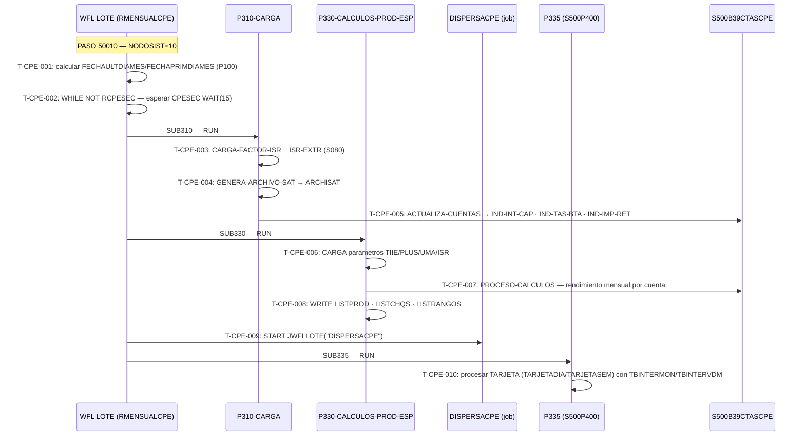

# BC-21 · Captación Productiva Especial

> Programas principales: S500/P310 (P310-CARGA) · S500/P330 (CALCULOS-PROD-ESP) · S500/P335 (S500P400)
> Orquestador: SUBROUTINE RMENSUALCPE en WFL LOTE (`S500/WFL/LOTE/26MTP002`)
> Trigger: operación "MENSUALCPE" (PASO 50010) — invocada manualmente o por scheduler; condición IF NODOSIST=10
> Bases de datos: S500BD01CAPTACION (B37GRUPOCPE · B38SUBGPOS · B39CTASCPE · B03CONTRATOS · B06HISTORICO · B00CTRLPASO · B02CONTROL · B91REINICIO)
> bian_ref: T.6.1 CPE Captación Productiva Especial

---

## Dependencias hacia otras capacidades

| Capacidad | Relación | Cap file |
|-----------|----------|----------|
| T.5.1 WFL Batch Orchestration | WFL LOTE contiene SUBROUTINE RMENSUALCPE que orquesta P310→P330→P335 | cap-wfl.md |
| 6.1.5 Interest & Fees | P310/P330 comparten catálogos S080 con P130; proceso mensual complementario al diario de P130 | cap-int.md |
| 5.1.1 Deposits | B39CTASCPE referencia cuentas en B03CONTRATOS (misma BD S500BD01CAPTACION) | cap-dep.md |
| T.4.1 CFR Regulatory Reporting | ARCHISAT generado por P310 es un reporte regulatorio fiscal (SAT) | cap-cfr.md |

---

## Inventario de tareas

| ID | Nombre | Programa | Tipo | Complejidad | Riesgo migración |
|----|--------|----------|------|-------------|------------------|
| T-CPE-001 | Recibir operación MENSUALCPE (PASO 50010): calcular FECHAULTDIAMES y FECHAPRIMDIAMES vía P100, verificar NODOSIST=10 antes de ejecutar RMENSUALCPE | WFL LOTE | BATCH | BAJA | BAJA |
| T-CPE-002 | Esperar presencia del archivo S500/FILE/S500/04/10/CPESEC/{FECHAULTDIAMES} en CAPTACION — bucle WHILE NOT RCPESEC con WAIT(15 seg) | WFL LOTE | BATCH | BAJA | MEDIA |
| T-CPE-003 | P310: cargar factores ISR (CARGA-FACTOR-ISR) e ISR extranjero (CARGA-FACTOR-ISR-EXTR) desde catálogos S080 | P310 | BATCH | MEDIA | ALTA |
| T-CPE-004 | P310: generar archivo ARCHISAT con datos del ciclo mensual CPE para declaración fiscal SAT | P310 | BATCH | MEDIA | MUY ALTA |
| T-CPE-005 | P310: actualizar registro B39CTASCPE — escribir IND-INT-CAP (interés capitalizado), IND-TAS-BTA (tasa brecha), IND-IMP-RET (ISR retenido) por contrato | P310 | BATCH | MEDIA | ALTA |
| T-CPE-006 | P330: cargar parámetros de cálculo mensual — UMA anual, saldo mínimo diario DF, comisiones, sobretasa, tablas TIIE y PLUS (81 rangos × 2 tipos de persona) | P330 | BATCH | ALTA | MUY ALTA |
| T-CPE-007 | P330: calcular rendimiento mensual por cuenta CPE — tasa bruta/neta/ponderada por región → retención ISR → actualizar B39CTASCPE → iterar PROCESO-CALCULOS hasta EOF | P330 | BATCH | MUY ALTA | CRÍTICA |
| T-CPE-008 | P330: generar reportes LISTPROD (productos), LISTCHQS (cheques/giro), LISTRANGOS (rangos de tasa) con resultados del ciclo mensual | P330 | BATCH | BAJA | MEDIA |
| T-CPE-009 | WFL LOTE: START #JWFLLOTE("DISPERSACPE") — lanza job WFL independiente para dispersar resultados CPE entre nodos | WFL LOTE | BATCH | BAJA | MEDIA |
| T-CPE-010 | P335: procesar tasas de interés CPE ligadas a tarjeta — leer archivo TARJETA (modo TARJETADIA o TARJETASEM según WS-TAR-DS), aplicar tablas TBINTERMON/TBINTERVDM | P335 | BATCH | ALTA | ALTA |

---

## Contexto funcional

Las **Cuentas de Productividad Empresarial (CPE)** son un producto de ahorro/inversión empresarial de S500 Captación con ciclo de capitalización mensual independiente del proceso diario P130. El cálculo mensual es orquestado por la subrutina WFL **RMENSUALCPE** dentro del job nocturno S500/WFL/LOTE/26MTP002.

**Secuencia de ejecución:**

1. WFL LOTE recibe la operación "MENSUALCPE" (PASO 50010), obtiene fechas del mes via P100 y verifica `NODOSIST=10` (T-CPE-001).
2. RMENSUALCPE espera en bucle el archivo de control `S500/FILE/S500/04/10/CPESEC/{FECHAULTDIAMES}` en CAPTACION (T-CPE-002) — la presencia del archivo señaliza que el cierre del mes está listo para CPE.
3. `SUB310` ejecuta **P310-CARGA**: carga factores ISR, genera ARCHISAT para SAT y actualiza los campos de capitalización en B39CTASCPE (T-CPE-003..005).
4. Si P310 completa sin abort (`OPCIONCPE ≠ "C"`), `SUB330` ejecuta **CALCULOS-PROD-ESP** (P330): carga tablas TIIE/PLUS, calcula rendimientos por región y por tipo de persona aplicando retención ISR, genera los tres reportes (T-CPE-006..008).
5. Si P330 completa sin abort, WFL LOTE lanza el job asíncrono **DISPERSACPE** (T-CPE-009) y luego `SUB335` ejecuta **P335/S500P400** para procesar las cuentas CPE ligadas a tarjeta (T-CPE-010).

**Existe también RMENSUALCPE330** (PASO 50011) — punto de reentrada desde P330 cuando P310 ya fue aplicado, utilizado en escenarios de recuperación/restart.

**Anomalía de naming en P335**: el archivo extraído `S500_SOURCE_P335.txt` tiene `PROGRAM-ID: S500P400` y comentario `CODIGO DE BATCH P400`. El WFL LOTE lo ejecuta como `RUN #P335 [T335]` (línea 7909). En Unisys MCP el PROGRAM-ID puede diferir del nombre del objeto compilado. Requiere confirmación del nombre del objeto en producción antes de transpilación.

---

## Casuísticas representativas

### Caso 1 — Mes ordinario: MENSUALCPE normal
**Condición:** PASO 50010 recibido, NODOSIST=10, archivo CPESEC presente, todos los contratos CPE activos con saldo positivo.
**Resultado:** P310 actualiza B39CTASCPE con ISR calculado; P330 calcula y capitaliza rendimientos TIIE/PLUS; DISPERSACPE dispersa resultados; P335 procesa tarjetas CPE. Todos con NORMAL COMPLETION.
**Secuencia:** T-CPE-001 → T-CPE-002 → T-CPE-003 → T-CPE-004 → T-CPE-005 → T-CPE-006 → T-CPE-007 → T-CPE-008 → T-CPE-009 → T-CPE-010

### Caso 2 — ABEND en P310: OPCIONCPE = "C"
**Condición:** P310 termina con TASKFAULT, operador elige opción "C" (cancelar).
**Resultado:** RMENSUALCPE aborta — P330, DISPERSACPE y P335 no se ejecutan. El ciclo mensual queda pendiente hasta reproceso manual con MENSUALCPE o MENSUALCPE330.
**Secuencia:** T-CPE-001 → T-CPE-002 → T-CPE-003 [ABEND] → bloqueo de T-CPE-006..010

### Caso 3 — Restart desde P330: MENSUALCPE330
**Condición:** P310 ya completó correctamente en ejecución anterior. Se recibe PASO 50011 para reiniciar desde P330.
**Resultado:** RMENSUALCPE330 ejecuta SUB330 y SUB335; omite P310. Evita doble actualización de B39CTASCPE.
**Secuencia:** T-CPE-006 → T-CPE-007 → T-CPE-008 → T-CPE-009 → T-CPE-010

---

## Diagrama de flujo

---

## Trazabilidad reglas → tareas

> Reglas de negocio: P335 pendiente de extracción formal. **P310 extraídas** — RN-S500-183..202 (rules-s500-p310.md · 2026-07-17). **P330 extraídas** — RN-S500-421..425 (rules-s500-deposits-b-interest.md · 2026-07-21).

| ID tarea | Fuente | Evidencia en código |
|----------|--------|---------------------|
| T-CPE-001 | S500_WFL_REORG_GARBAGE_S500BD04TARJETAS.txt | líneas 14903–14925: bloque PASO 50010, NODOSIST, RMENSUALCPE |
| T-CPE-002 | S500_WFL_REORG_GARBAGE_S500BD04TARJETAS.txt | líneas 7980–7988: WHILE NOT RCPESEC · WAIT(15) · FILE #ARCHCPESEC IS RESIDENT |
| T-CPE-003 | S500_SOURCE_P310.txt | líneas 119392..119420: PERFORM 140-CARGA-FACTOR-ISR · 150-CARGA-FACTOR-ISR-EXTR |
| T-CPE-004 | S500_SOURCE_P310.txt | líneas 118170..118200: PERFORM 180-GENERA-ARCHIVO-SAT |
| T-CPE-005 | S500_SOURCE_P310.txt | líneas 118200..118300: PERFORM 200-ACTUALIZA-CUENTAS · IND-INT-CAP/IND-TAS-BTA/IND-IMP-RET |
| T-CPE-006 | S500_SOURCE_P330.txt | líneas 442130..444000: CARGA-FACTOR-ISR · CARGA-UMA-ANUAL · CARGA-COMISIONES · CARGA-SOBRETASA · CARGA-TARIFAS |
| T-CPE-007 | S500_SOURCE_P330.txt | líneas 425600..425700: PERFORM 20000-PROCESO-CALCULOS UNTIL WS-EOF-BD = 1 · tablas TIIE/PLUS 81 rangos |
| T-CPE-008 | S500_SOURCE_P330.txt | archivos LISTPROD · LISTCHQS · LISTRANGOS en FILE SECTION |
| T-CPE-009 | S500_WFL_REORG_GARBAGE_S500BD04TARJETAS.txt | líneas 8003–8004: SACATIT("S500JBATCH") · START #JWFLLOTE("DISPERSACPE") |
| T-CPE-010 | S500_SOURCE_P335.txt | líneas 314540–315560: MOVE "P400" · IF WS-TAR-DS = "TARJETADIA" OR "TARJETASEM" → PROCESO |

### Reglas de negocio extraídas — P330 (T-CPE-006 · T-CPE-007 · T-CPE-008)

> Extraídas de `rules-s500-deposits-b-interest.md` (RN-S500-421..425). Agente swarm: 2026-07-21.

| ID tarea | Regla | Fuente | Enunciado breve |
|----------|-------|--------|-----------------|
| T-CPE-006 | RN-S500-422 | rules-s500-deposits-b-interest.md | Consolidación de archivos de cuenta-producto de cheques de ambas plazas (S001CTAPRODVDM + S001CTAPRODMTY), ordenados por CSI/SUC/CTA/CVETRAN como input del cálculo unificado |
| T-CPE-007 | RN-S500-421 | rules-s500-deposits-b-interest.md | Cálculo de comisiones de productos especiales de chequera con desglose importe/IVA en campos separados (CVETRAN-S500/IMPORTE-S500 y CVETRANIVA-S500/IMPORTEIVA-S500) |
| T-CPE-007 | RN-S500-423 | rules-s500-deposits-b-interest.md | Aplicación de rangos de tarifa por clave de rango mediante catálogo S080/L100 (L100-COD080-CVERANGO) para determinar la comisión aplicable por operación |
| T-CPE-007 | RN-S500-424 | rules-s500-deposits-b-interest.md | Resolución de la opción de pago (grupo WS-B37-NUM-GPO y cuenta WS-B37-CTA-PGO) desde estructura B37 para determinar a qué cuenta se carga la comisión |
| T-CPE-007 | RN-S500-425 | rules-s500-deposits-b-interest.md | Cálculo de IVA sobre comisión con tabla de cuatro decimales (WS-TABIVA PIC 9(04)V9(04)); acumulado en WS-IVA PIC 9(20)V99 para soportar volúmenes altos |
| T-CPE-008 | RN-S500-421 | rules-s500-deposits-b-interest.md | Generación de LISTCHQS — listado de comisiones de cheques/giro con desglose importe base e IVA por cuenta; downstream directo del cálculo de comisiones especiales |
| T-CPE-008 | RN-S500-423 | rules-s500-deposits-b-interest.md | Generación de LISTRANGOS — listado de rangos de tarifa aplicados por clave S080/L100; materializa el cálculo de rangos del ciclo mensual |

### Reglas de negocio extraídas — P335 · P400 (T-CPE-010)

> Extraídas de `rules-s500-payments-statements.md` (RN-S500-527..538). Agente swarm: 2026-07-21.
> P335 (S500_SOURCE_P335.txt, PROGRAM-ID S500P400) procesa validación de archivos de entrada S111/EAS y distingue flujos TARJETADIA/TARJETASEM; P400 (PROGRAM-ID P335-EDOCTA) genera el estado de cuenta CPE jerárquico. Anomalía de naming confirmada por el catálogo de reglas: el programa ejecutado como #P335 [T335] en WFL tiene PROGRAM-ID S500P400; la parte de estado de cuenta referida como P400 en el catálogo tiene PROGRAM-ID P335-EDOCTA. Ambos conviven en el archivo fuente S500_SOURCE_P335.txt o corresponden a compilaciones hermanas del mismo módulo.

| ID tarea | Regla | Fuente | Enunciado breve |
|----------|-------|--------|-----------------|
| T-CPE-010 | RN-S500-527 | P335 (S500P400) · líneas 612800–615510 | Validación de cuadre de trailer S111: registros leídos vs declarados e importe bruto acumulado |
| T-CPE-010 | RN-S500-528 | P335 (S500P400) · líneas 615532–615560 | Bypass silencioso del control de trailer en ventana de fecha 20111201–20111207 [BUG-LATENTE] |
| T-CPE-010 | RN-S500-529 | P335 (S500P400) · líneas 615600–615726 | Autorización manual de trailer descuadrado: SOEID capturado por ACCEPT — bloquea ejecución desatendida |
| T-CPE-010 | RN-S500-530 | P335 (S500P400) · líneas 538010–559360 | Validación sistema interno en header: literal "S111" para tarjetas, código 175172 para EAS diario [HARDCODE] |
| T-CPE-010 | RN-S500-531 | P335 (S500P400) · líneas 612820–131010 | Distinción flujo diario/semanal por WS-TAR-DS = "TARJETADIA" o "TARJETASEM" — literal hardcodeado [HARDCODE] |
| T-CPE-010 | RN-S500-532 | P335 (S500P400) · líneas 173738–612640 | Doble fuente estado de cuenta CPE: S111 tarjetas (ARCH-S111=1) y EAS/ECMS (ARCH-ECMS=2) enrutadas por WS-INT-CONTROL |
| T-CPE-010 | RN-S500-533 | P400 (P335-EDOCTA) · líneas 176600–180080 | Jerarquía CPE B37 grupo → B38 subgrupo → B39 cuenta: registros tipados 700000, 701110/701119, 709000 |
| T-CPE-010 | RN-S500-534 | P400 (P335-EDOCTA) · líneas 174600–175200 | Retención ISR Art. 152 LISR sobre rendimientos CPE: B39-TASA-ISR-152 y B39-ISR-RET-152 en estado de cuenta |
| T-CPE-010 | RN-S500-535 | P400 (P335-EDOCTA) · líneas 168100–168800 | IVA sobre comisiones cheques/giros: 10% zona fronteriza (B37-IVA-10) y 15% resto (B37-IVA-15) [HARDCODE] |
| T-CPE-010 | RN-S500-536 | P400 (P335-EDOCTA) · líneas 167400–179900 | Producto neto del periodo = productos menos comisiones; signo "−" explícito en el campo de despliegue si neto negativo |
| T-CPE-010 | RN-S500-537 | P400 (P335-EDOCTA) · líneas 175000–180000 | ISR retenido acumulado simultáneamente en 3 niveles: cuenta, grupo y general (cuadre contra declaración SAT) |
| T-CPE-010 | RN-S500-538 | P400 (P335-EDOCTA) · líneas 174600–174960 | Tasa ISR-500 desactivada por comentario; solo ISR-152 activa — código muerto reactivable por error [BUG-LATENTE] |

### Reglas de negocio extraídas — P310 (T-CPE-003 · T-CPE-004 · T-CPE-005)

> Extraídas de `rules-s500-p310.md` (RN-S500-183..202). Agente swarm: 2026-07-21.

| ID tarea | Regla | Fuente | Enunciado breve |
|----------|-------|--------|-----------------|
| T-CPE-003 | RN-S500-185 | rules-s500-p310.md · S500_SOURCE_P310.txt líns. 122342–122398 | CALL L700 (tarifa=254, cat=9991) → WS-ISR-0 — carga tasa ISR estándar desde catálogo S080 |
| T-CPE-003 | RN-S500-186 | rules-s500-p310.md · S500_SOURCE_P310.txt líns. 122502–122662 | CALL L700 (tarifa=259, cat=9991) → WS-ISR-EXTR-0 — ISR extranjeros (CAMBIO-2022 Stefanini MTDP-2467); división adicional /100 `[HARDCODE-SOSPECHOSO]` |
| T-CPE-004 | RN-S500-183 | rules-s500-p310.md · S500_SOURCE_P310.txt líns. 118150–118300 | IF B02-NUM-CSI=10 → PERFORM 180-GENERA-ARCHIVO-SAT ELSE STOP RUN — ejecución restringida a VDM `[HARDCODE-IMPLÍCITO]` |
| T-CPE-004 | RN-S500-184 | rules-s500-p310.md · S500_SOURCE_P310.txt líns. 133243–133254 | WS-FECHA-PROCER = B02-FECHA-LINEA retrocedido un mes — etiqueta de archivos físicos MCP y campo fecha en header SAT |
| T-CPE-004 | RN-S500-197 | rules-s500-p310.md · S500_SOURCE_P310.txt líns. 136310–136490 | WRITE ARCHISAT Header(01)/Detalle(02)/Trailer(99) CSV para SAT; SAT-IDSISTEMA="S152" `[BLOQUEA CUTOVER]` — requiere coordinación SAT antes de go-live |
| T-CPE-004 | RN-S500-199 | rules-s500-p310.md · S500_SOURCE_P310.txt líns. 134230–134290 | Ajuste bisiesto en retroceso de mes (AA MOD 4=0); no implementa excepción centenaria `[BUG-LATENTE-2100]` |
| T-CPE-005 | RN-S500-183 | rules-s500-p310.md · S500_SOURCE_P310.txt líns. 118150–118300 | IF B02-NUM-CSI=10 → PERFORM 200-ACTUALIZA-CUENTAS — mismo gate VDM controla el bloque completo de actualización B39 |
| T-CPE-005 | RN-S500-187 | rules-s500-p310.md · S500_SOURCE_P310.txt líns. 141802–142102 | B03-TIPO-PERSONA=11/12/15 → WS-ISR-EXTR-0, resto → WS-ISR-0; resultado asignado a B39-TASA-ISR-500 por cuenta |
| T-CPE-005 | RN-S500-188 | rules-s500-p310.md · S500_SOURCE_P310.txt líns. 133260–133471 | ARCHSMTY → ARCHIMTY (índice KEY=IND-NUM-CTO PIC9(12)) para lookup MTY; WAIT(40) sin límite de reintentos `[RIESGO-OPS]` |
| T-CPE-005 | RN-S500-189 | rules-s500-p310.md · S500_SOURCE_P310.txt líns. 133346–133366 | Validación integridad CPESEC — header/vacío/trailer; DMTERMINATE si cualquier check falla |
| T-CPE-005 | RN-S500-190 | rules-s500-p310.md · S500_SOURCE_P310.txt líns. 138943–139125 | Filtro elegibilidad: PRODUCTO=1/INSTRUMENTO=3 y B03-STA-BENEF≠3/8 (art.61 ISR); excluidas → STATUS=4 (CAMBIO-2022 MTDP-2466) |
| T-CPE-005 | RN-S500-191 | rules-s500-p310.md · S500_SOURCE_P310.txt líns. 141802–144713 | B39CTASCPE cuentas VDM — campos TASA/REND/ISR/BRT-500 según B37-OPCION=1/2/5; cero si otro OPCION |
| T-CPE-005 | RN-S500-192 | rules-s500-p310.md · S500_SOURCE_P310.txt líns. 144804–144880 | B39CTASCPE cuentas MTY desde ARCHIMTY (IND-*); misma lógica OPCION 1/2/5; INVALID KEY → STATUS=4 |
| T-CPE-005 | RN-S500-193 | rules-s500-p310.md · S500_SOURCE_P310.txt líns. 147502–148802 | CALL S016L422 → B39-USO-FUT-01/B39-TARI-CHQGIR; índice (04) en CVECOBRO/COBCOM `[HARDCODE-SOSPECHOSO]`; fallback cvecobro=2/importe=100 |
| T-CPE-005 | RN-S500-194 | rules-s500-p310.md · S500_SOURCE_P310.txt líns. 145210–145260 | WKS-S080-TPO-IVA=1 (zona frontera) → WS-IVA-FRONT, resto → WS-IVA-GRAL → B39-CVE-IVA; error 50% IVA si lógica no se preserva |
| T-CPE-005 | RN-S500-195 | rules-s500-p310.md · S500_SOURCE_P310.txt líns. 145300–147200 | BEGIN/END-TRANSACTIONNOAU por cada STORE de B39CTASCPE; sin audit trail DMSII; NOAU debe mapearse explícitamente en target |
| T-CPE-005 | RN-S500-196 | rules-s500-p310.md · S500_SOURCE_P310.txt líns. 137200–150500 | Acumuladores por grupo (saldo prom + rendimientos + cheques) → B37GRUPOCPE STORE al cambio de grupo; skip si WS-CTAS-X-GPO=0 |
| T-CPE-005 | RN-S500-198 | rules-s500-p310.md · S500_SOURCE_P310.txt líns. 144773–144960 | STATUS=4 por 4 causas: inelegible/art.61/B06 no encontrado/MTY sin ARCHIMTY; cuenta sí se persiste (STORE) con STATUS=4 |

---

## Vocabulario clave

| Término | Tipo | Definición |
|---------|------|------------|
| CPE | Dominio | Cuentas de Productividad Empresarial — producto de ahorro/inversión empresarial de S500 Captación con rendimiento mensual |
| RMENSUALCPE | WFL subroutine | Subrutina de WFL LOTE que orquesta el proceso mensual CPE: espera CPESEC → P310 → P330 → DISPERSACPE → P335 |
| RMENSUALCPE330 | WFL subroutine | Punto de reentrada del proceso mensual CPE desde P330 (omite P310); usado en restart |
| CPESEC | Archivo de control | S500/FILE/S500/04/10/CPESEC/{FECHAULTDIAMES} — archivo que señaliza que el cierre del mes está listo para CPE; RMENSUALCPE espera su presencia |
| NODOSIST | Variable WFL | Node ID del sistema; CPE mensual solo corre en NODOSIST=10 |
| FECHAULTDIAMES | Variable WFL | Último día del mes — calculado por P100 PARAM100="6"; usado para nombrar CPESEC y como parámetro de rango CPE |
| FECHAPRIMDIAMES | Variable WFL | Primer día del mes — calculado por P100 PARAM100="7" |
| OPCIONCPE | Variable WFL | Flag de estado del bloque RMENSUALCPE; "C" = cancelar (abortar pipeline), "V" = reintentar con versión alternativa, " " = continuar |
| B37GRUPOCPE | DMSII record | Grupos CPE — nivel superior de la jerarquía CPE (grupo → subgrupo → cuenta) |
| B38SUBGPOS | DMSII record | Subgrupos CPE |
| B39CTASCPE | DMSII record | Cuentas CPE individuales — contiene IND-INT-CAP, IND-TAS-BTA, IND-IMP-RET por contrato |
| IND-INT-CAP | Campo B39 | Interés capitalizado del ciclo mensual CPE — importe PIC 9(12)V99 |
| IND-TAS-BTA | Campo B39 | Tasa brecha aplicada PIC 9(03)V9999 |
| IND-IMP-RET | Campo B39 | ISR retenido en el ciclo PIC 9(12)V99 |
| TIIE | Tasa referencia | Tasa de Interés Interbancaria de Equilibrio (Banxico) — tabla de 81 rangos × 2 tipos de persona en P330 |
| PLUS | Tasa referencia | Tasa PLUS — tabla alternativa a TIIE para ciertos productos CPE |
| UMA | Parámetro fiscal | Unidad de Medida y Actualización (INEGI) — usada en P330 para calcular parte exenta de ISR |
| DISPERSACPE | WFL job | Job WFL CORRESOLO lanzado asincrónamente por RMENSUALCPE para dispersar resultados CPE entre nodos |
| ARCHISAT | Archivo fiscal | Reporte generado por P310 con datos del ciclo CPE para declaración al SAT (autoridad fiscal) |
| TARJETADIA | Parámetro P335 | Flujo diario de tarjetas en P335/S500P400 |
| TARJETASEM | Parámetro P335 | Flujo semanal de tarjetas en P335/S500P400 |
| S500P400 | PROGRAM-ID | Identificador interno de P335 en el código COBOL fuente — el WFL lo ejecuta como `#P335 [T335]` (línea 7909 de WFL LOTE); posible fork de P400 o anomalía de naming en extracción |

---

## Hallazgos de migración

| Hallazgo | Tarea | Criticidad | Recomendación |
|----------|-------|-----------|---------------|
| **WAIT(15) polling para archivo CPESEC**: bucle activo de espera consume CPU y es difícil de paralelizar en cloud | T-CPE-002 | 🟡 MEDIO | Reemplazar con event-driven trigger (S3 event, Pub/Sub, Kafka message) cuando el archivo esté disponible |
| **Factores ISR en catálogos S080**: tasas ISR cambian anualmente por decreto SAT; hardcoding equivale a deuda regulatoria | T-CPE-003 | 🔴 ALTO | Externalizar como configuración con versionado anual; incorporar proceso de actualización en el ciclo regulatorio |
| **Formato ARCHISAT regulado**: el layout del archivo SAT está especificado por la autoridad fiscal — cualquier cambio en el target requiere validación SAT | T-CPE-004 | 🔴 ALTO | Documentar el layout exacto del ARCHISAT como contrato de salida; no modificar sin aprobación regulatoria |
| **Tablas TIIE/PLUS 81 rangos**: aritmética packed decimal con escalas PIC 9(04)V9(04) — riesgo alto de divergencia por rounding en transpilación | T-CPE-006/007 | 🔴 CRÍTICO | Golden master tests con 100% de contratos CPE de producción; validar rounding con Banxico reference |
| **Cálculo de rendimiento mensual**: P330 es el programa con mayor riesgo — A. Pulido Vega 1989, modificado Stefanini 2022 (CPE 2022R07M); equivalencia ≥ 99.99% obligatoria | T-CPE-007 | 🔴 CRÍTICO | Parallel-run mínimo 3 meses; CFO/risk sign-off por divergencia > 0.01% |
| **Anomalía P335/S500P400**: PROGRAM-ID S500P400, comentario "CODIGO DE BATCH P400" — posible fork o archivo mal identificado en extracción | T-CPE-010 | 🟡 MEDIO | Confirmar en producción que `S500/OBJECT/P335` existe y corresponde a este fuente antes de transpilación |
| **DISPERSACPE job asíncrono**: `START #JWFLLOTE("DISPERSACPE")` lanza un job WFL independiente — no hay wait explícito de su completación antes de P335 | T-CPE-009 | 🟡 MEDIO | En el target, definir el punto de sincronización entre DISPERSACPE y P335 explícitamente |

---

## Cross-referencias

- **cap-wfl.md** (T.5.1) — SUBROUTINE RMENSUALCPE en WFL LOTE; vocabulario WFL LOTE actualizado 2026-07-21 con referencia a RMENSUALCPE y P310/P330/P335
- **cap-int.md** (6.1.5) — P130 ciclo diario de captación; CPE es el ciclo mensual complementario
- **cap-cfr.md** (T.4.1) — ARCHISAT es un reporte regulatorio análogo al pipeline CFR
- **capability-map.md** — capacidad T.6.1 registrada como nueva extensión S500

---

*cap-cpe.md · v1.0 · 2026-07-21*
*Capacidad: T.6.1 CPE — Captación Productiva Especial · Sistema: S500 · Programas: S500/P310 · S500/P330 · S500/P335*
*Orquestador: SUBROUTINE RMENSUALCPE / RMENSUALCPE330 en S500/WFL/LOTE/26MTP002*
*Fuentes: S500_SOURCE_P310.txt · S500_SOURCE_P330.txt · S500_SOURCE_P335.txt · S500_WFL_REORG_GARBAGE_S500BD04TARJETAS.txt*
