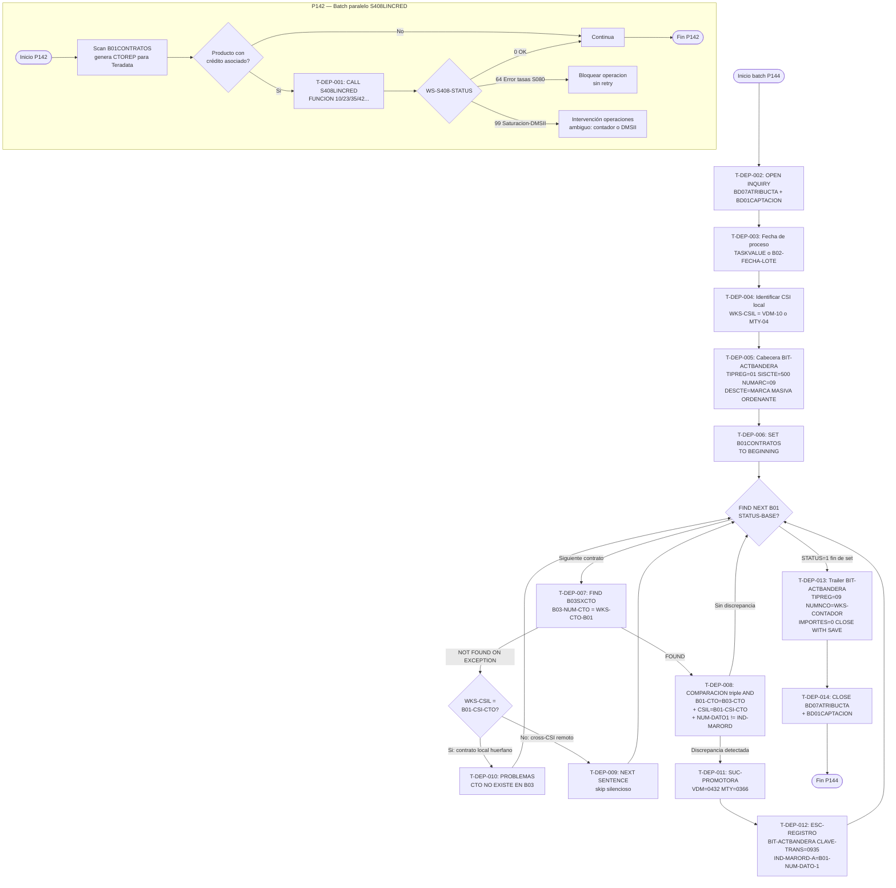

# BC-05 · Cuentas de Depósito
> bian_ref: 5.1.1 Deposits
> Sistema: S500 · Programas: P142 · P144 · P189 (Art. 61 LIC + sync inter-plaza)
> Reglas vinculadas: RN-S500-261..302 · RN-S500-361..420 · RN-S151-750..822 · RN-S151-850..915 (241 reglas · trazabilidad automática 2026-07-27)
> Jerarquía: **N1** Dominio 5 · Product Processing → **N2** Subdominio Product Catalogue → **N3** Capacidad 5.1.1 Deposits → **N4-5** Procesos/Flujo de tareas (ver Inventario de Tareas) → **N6** Reglas (ver Reglas vinculadas)
> Indexado: ✅ 2026-07-27 — correlacionado vocab↔reglas↔capacidad (build-traceability.py)
> Generado: 2026-07-16

---

## Contexto funcional

El sistema **S500 (Captación)** gestiona el ciclo de vida de contratos de depósito de Banamex sobre la plataforma **Unisys ClearPath MCP / DMSII**. La capacidad **Deposits (BIAN 5.1.1)** agrupa los procesos batch que mantienen la integridad y sincronización de los contratos de captación entre sus dos instancias de base de datos: **BD07 ATRIBUCTA** (`S500BD07ATRIBUCTA`, base de atributos del contrato) y **BD01 CAPTACION** (`S500BD01CAPTACION`, base operativa de captación). Las tablas centrales son **B01CONTRATOS** (en BD07) y **B03CONTRATOS** (en BD01); el control diario vive en **B02CONTROL** (también en BD07).

**P142** (batch diario, junio/2021) cumple dos roles en esta capacidad: (1) extrae el universo completo de contratos de `B01CONTRATOS` hacia el archivo `CTOREP` de 1200 bytes para consumo de Teradata (análisis de crédito captación CREDITOS CAN), y (2) invoca la interfaz `S408LINCRED` cuando un producto de captación tiene crédito asociado, ejecutando funciones de habilitación (`10`), deshabilitación (`20`), disposición normal (`23`), disposición forzada (`24`), pago-abono (`35`) o eliminación (`42/45/46/48`). **P144** (batch diario, junio/2021) realiza la **reconciliación masiva** entre B01 y B03: detecta contratos donde el indicador de "marca ordenante" (`B01-NUM-DATO(1)` en B01 vs `B03-IND-MARORD` en B03) difiere y genera el archivo **BIT-ACTBANDERA** con registros de activación masiva (`CLAVE-TRANS=0935`, denominados "MARCA MASIVA ORDENANTE") que un proceso receptor aplica sobre los contratos divergentes. P144 opera exclusivamente en modo de lectura (`OPEN INQUIRY` en ambas BDs), delegando todos los cambios al receptor del archivo BIT-ACTBANDERA.

El flag **BIT-ACTBANDERA** es el mecanismo central de sincronización de estado en S500: cuando P144 detecta una discrepancia entre el indicador de ordenante en B01 y B03, emite un registro de señal no monetario (`IMPORTE=0`) con valores hardcodeados (`TIPREG=02`, `SUC=0511`, `CAJA=05`, `TIPO-MOV=03`, `TIPMEDACC=00`) que el sistema receptor interpreta como instrucción de activación masiva. Los principales riesgos de migración derivan de: (1) escaneo secuencial sin filtro sobre el universo total de contratos B01 con complejidad O(n); (2) pares host cross-CSI hardcodeados replicados sin COPY book en P020, P142 y P144 simultáneamente; (3) un bug de copy-paste en el mensaje de error del cierre de BD07ATRIBUCTA que puede confundir operadores durante incidentes nocturnos al señalar la BD equivocada; (4) la interfaz S408LINCRED con código de error 99 que ambigu­amente combina saturación de autorizaciones y falla DMSII.

---

## Inventario de Tareas

| ID | Tarea | Programa / Componente | Tipo |
|----|-------|-----------------------|------|
| T-DEP-001 | Invocación S408LINCRED para operaciones de crédito-captación (habilitación, disposición, pago-abono, eliminación) | P142 / S408LINCRED · OPERCRED | control |
| T-DEP-002 | Apertura de BD07ATRIBUCTA y BD01CAPTACION en modo INQUIRY (solo lectura, sin modificación) | P144 / OPEN INQUIRY | control |
| T-DEP-003 | Override de fecha de proceso vía parámetro TASKVALUE (WKS-TSK-FECH) y proyección de siguiente hábil | P144 / S006LOCSUP · WKS-TSK-FECH | control |
| T-DEP-004 | Identificación de nodo CSI local y configuración de pares host cross-CSI (VDM=10, MTY=04) | P144 / WKS-CSIL · WKS-HOST-ORIG-XFER-XX | control |
| T-DEP-005 | Escritura de cabecera BIT-ACTBANDERA (TIPREG=01, SISCTE=500, NUMARC=09, DESCTE=MARCA MASIVA ORDENANTE) | P144 / BIT-TIT-SEC · BIT-ACTBANDERA | escritura |
| T-DEP-006 | Escaneo secuencial completo de B01CONTRATOS (SET TO BEGINNING + FIND NEXT hasta STATUS-BASE=1) | P144 / S500B01CONTRATOS · WKS-FIN-B01 | consulta |
| T-DEP-007 | Lookup de B03CONTRATOS por índice secundario B03SXCTO (búsqueda exacta por número de contrato) | P144 / B03SXCTO · WKS-CONTRATO-B01 | consulta |
| T-DEP-008 | Comparación central B01 vs B03 — triple condición AND (coincidencia + CSI local + discrepancia ordenante) | P144 / 98000000-COMPARACION · B01-NUM-DATO(1) | validación |
| T-DEP-009 | Skip silencioso de contratos cross-CSI no encontrados en B03 local (NEXT SENTENCE) | P144 / 90000001-CTO-NOEXISTE · WKS-CSIL | control |
| T-DEP-010 | Log de contratos locales huérfanos ausentes en B03 (PROBLEMAS: "CTO NO EXISTE EN B03") | P144 / F02-PROBLEMAS · 50009000-PROB-TIEMPO | escritura |
| T-DEP-011 | Determinación de SUC-PROMOTORA según CSI local (VDM=0432, MTY=0366) | P144 / WKS-SUC-PROMOTORA · WKS-CSIL | control |
| T-DEP-012 | Escritura del registro de activación BIT-ACTBANDERA (CLAVE-TRANS=0935, IND-MARORD-A dinámico) | P144 / 50009000-ESC-REGISTRO · CLAVE-TRANS-0935 | escritura |
| T-DEP-013 | Escritura de trailer BIT-ACTBANDERA y cierre WITH SAVE (NUMNCO=contador, importes en cero) | P144 / WKS-CONTADOR · CLOSE-WITH-SAVE | contable |
| T-DEP-014 | Cierre de bases de datos y liberación de recursos (BD07ATRIBUCTA, BD01CAPTACION) | P144 / 70001000-CLOSE-BD07ATRIBUCTA | control |
| T-DEP-015 | Instrumentación MAPLI para audit tracking de llamadas a librería (S038L035, TIPO-ACTI=2) | P144 / S038L035 · W77-ID-ACTXX-MAPLI | control |
| T-DEP-016 | Determinación de nodo/plaza local y configuración del archivo de intercambio por HOSTNAME (VDM=nodo 10, recibe S084 desde MTY; MTY=nodo 04, recibe S087 desde VDM) | P189 / WKS-CSIL · S084 · S087 | control |
| T-DEP-017 | Reinicialización masiva de estatus cliente en B09PMOTOR a cero antes de reaplicar movimientos del día (archivos S084/S087 solo transportan bloqueos nuevos, nunca desbloqueos; reinicializar habilita el desbloqueo implícito) | P189 / B09PMOTOR · STA-CTE | control |
| T-DEP-018 | Marcado de beneficencia STA-BENF (Artículo 61 LIC) para cuentas inactivas con fecha de último movimiento anterior a la fecha de corte Art. 61 y STA-CTE=0; apagado si cliente vuelve a tener movimiento o queda bloqueado | P189 / STA-BENF · FECHA-ULT-MOV · FECHA-CORTE-ART61 | cumplimiento |
| T-DEP-019 | Propagación condicional de fecha de último movimiento y estatus cliente a estructura histórica B06 (fecha solo sobrescribe si B09PMOTOR más reciente que B06; estatus solo copia cuando difiere del histórico) | P189 / B06 · B09PMOTOR · WKS-FEC-ULT-MOV | sincronización |
| T-DEP-020 | Rechazo early de registros con número de cliente inválido (cero o 999999999999) sin escritura ni log; previene procesamiento de registros relleno o nulos del archivo de intercambio | P189 / WKS-NUM-CLIENTE | validación |

> **Nota de cobertura P142:** El inventario de tareas de esta capacidad cubre únicamente el rol S408LINCRED de P142 (T-DEP-001 / RN-S500-134). La función primaria de P142 — extracción del universo de contratos B01CONTRATOS hacia el archivo CTOREP para Teradata (RN-S500-123..133, 135..137, 14 reglas) — no tiene tareas asignadas en esta capacidad. Esas reglas corresponden a funcionalidad de extracción analítica (candidata a un cap de tipo Reporting/Data Export) y están documentadas en `rules-catalog/rules-s500-p020-p142-p144.md`. Un ingeniero de transpilación debe leer ese archivo directamente para cubrir la lógica CTOREP de P142.

---

## Casuísticas principales

### Caso 1: Reconciliación sin discrepancias (ejecución limpia P144)

P144 se ejecuta en el batch diario con todos los contratos B01 y B03 sincronizados. Tras la apertura en modo INQUIRY (T-DEP-002) y la determinación de fecha de proceso (T-DEP-003), el escaneo secuencial de B01CONTRATOS (T-DEP-006) recorre el universo completo. Para cada contrato se realiza el lookup B03SXCTO (T-DEP-007). La comparación central (T-DEP-008) evalúa las tres condiciones AND: el contrato existe en ambas bases, el CSI coincide con el local y `B01-NUM-DATO(1)` es igual a `B03-IND-MARORD`. Sin discrepancias, no se llama a `50009000-ESC-REGISTRO`. El archivo BIT-ACTBANDERA se genera solo con cabecera (T-DEP-005) y trailer con `WKS-CONTADOR=0` (T-DEP-013), cerrado `WITH SAVE`. El archivo PROBLEMAS no recibe mensajes de error. Este es el caso operativo esperado cuando el batch anterior fue exitoso y no hay desfases entre las dos BDs.

### Caso 2: Discrepancia B01 vs B03 — generación de activación BIT-ACTBANDERA

Un contrato local tiene `B01-NUM-DATO(1)=1` (marca ordenante activa en ATRIBUCTA) pero `B03-IND-MARORD=0` (sin marca en CAPTACION). La comparación central (T-DEP-008) detecta la discrepancia y llama a `50009000-ESC-REGISTRO`. Se determina `WKS-SUC-PROMOTORA` por CSI local (T-DEP-011: VDM=0432, MTY=0366). Se escribe un registro de activación (T-DEP-012) con valores hardcodeados: `TIPREG=02`, `SUC=0511`, `CAJA=05`, `CLAVE-TRANS=0935`, `TIPO-MOV=03`, `TIPMEDACC=00`, `IMPORTE=0`, `MONEDA=0`. Los únicos campos dinámicos son `IND-MARORD-A = B01-NUM-DATO(1)` y `FEC-MARORD-A = B01-NUM-FECPROACT(1)`. El contador `WKS-CONT` se incrementa. El receptor del archivo BIT-ACTBANDERA aplica la activación masiva al contrato en BD01CAPTACION sin que P144 modifique nada directamente.

### Caso 3: Contrato local huérfano (existe en B01 pero no en B03)

El lookup B03SXCTO (T-DEP-007) lanza `ON EXCEPTION` y se invoca `90000001-CTO-NOEXISTE`. La bifurcación (T-DEP-009/T-DEP-010) evalúa si el CSI del contrato coincide con el CSI local. Si `WKS-CSIL = B01-CSI-CONTRATO` (contrato local pero ausente en BD01CAPTACION), se registra en PROBLEMAS: `"CTO NO EXISTE {NUM-CONTRATO} EN B03"` (T-DEP-010). Esta condición representa una inconsistencia entre `S500BD07ATRIBUCTA` y `S500BD01CAPTACION` que requiere intervención manual. No hay contador de huérfanos en el trailer; el diagnóstico exige parsear F02-PROBLEMAS por fecha de ejecución para cuantificar el impacto.

### Caso 4: Contrato cross-CSI no encontrado en B03 local — skip silencioso

El lookup B03SXCTO (T-DEP-007) falla para un contrato cuyo `B01-CSI-CONTRATO` difiere del CSI local (`WKS-CSIL ≠ B01-CSI-CONTRATO`). P144 ejecuta `NEXT SENTENCE` sin registrar error ni generar activación (T-DEP-009). Este comportamiento es arquitecturalmente esperado: los contratos del nodo remoto están presentes en BD07ATRIBUCTA pero no en la BD01 local; el procesamiento cross-CSI es responsabilidad del nodo opuesto. El riesgo latente: un contrato local con CSI asignado erróneamente quedaría silenciosamente ignorado, generando un falso negativo no detectable desde el archivo BIT-ACTBANDERA.

### Caso 5: Saturación S408LINCRED — errores 64 y 99 en P142

P142 invoca `S408LINCRED` con `FUNCION=23` (disposición normal). Dos errores críticos: `WS-S408-STATUS=64` indica que las tasas de S080 no pudieron cargarse y bloquea la operación (`"ERROR AL CARGAR TASAS EN LIBRERIA DEL S080"`); `WS-S408-STATUS=99` señala un error DMSII o que el contador de autorizaciones superó el millón diario. El error 99 es una restricción de capacidad del sistema DMSII que, de alcanzarse en producción, impide nuevas disposiciones de crédito-captación. El código de error es ambiguo — el mismo valor `99` cubre dos condiciones radicalmente distintas — y no hay mecanismo de recuperación automática ni alarma proactiva; requiere intervención de operaciones.

---

## Diagrama de flujo

---

## Reglas vinculadas

| Tarea | Regla | Componente fuente | Descripción |
|-------|-------|-------------------|-------------|
| T-DEP-001 | RN-S500-134 | P142 — S408LINCRED / WS-S408-STATUS / OPERCRED | Interface de disposición/pago de crédito en P142; 30+ funciones (HABILITACION=10, DISPOSICION-NORMAL=23, PAGO-ABONO=35, ELIMINACION=42/45/46/48); error 64=tasas S080 no cargadas bloquea operación; error 99=DMSII o >1M autorizaciones/día |
| T-DEP-002 | RN-S500-148 | P144 — OPEN INQUIRY / B03SXCTO / B02CONTROL | P144 abre S500BD01CAPTACION y S500BD07ATRIBUCTA en modo INQUIRY; nunca modifica datos fuente; arquitectura read-only + output file; si BD falla al abrir: DMTERMINATE |
| T-DEP-003 | RN-S500-147 | P144 — WKS-TSK-FECH / WKS-FEC-BASE / S006LOCSUP | Override de fecha de proceso vía ATTRIBUTE TASKVALUE; si WKS-TSK-FECH > 0 sustituye WKS-FEC-BASE y proyecta +1 día hábil vía S006LOCSUP (FUNCION=13); si LOCSUP falla: DMTERMINATE sin fallback |
| T-DEP-004 | RN-S500-151 | P144 — WKS-HOST-ORIG-XFER-XX / WKS-CSIL / 000-CLONA-XFER | Tabla de 8 pares host cross-CSI duplicada en P020/P142/P144 sin COPY book centralizado; 6 pares CLONE adicionales; riesgo de desincronización al agregar nuevo nodo CSI o renombrar hosts |
| T-DEP-005 | RN-S500-144 | P144 — BIT-TIT-SEC / SISCTE / NUMARC / BIT-ACTBANDERA | Cabecera BIT-ACTBANDERA: TIPREG=01, NODORI=WKS-CSIL, FECPRO=WKS-FEC-LINEA-06, SISCTE=500, NUMARC=0009, DESCTE="MARCA MASIVA ORDENANTE"; NODORI puede ser 10 (VDM) o 04 (MTY) |
| T-DEP-006 | RN-S500-146 | P144 — S500B01CONTRATOS / WKS-FIN-B01 / FIND-NEXT | Escaneo completo sin filtro: SET B01CONTRATOS TO BEGINNING + FIND NEXT hasta STATUS-BASE=1; STATUS-BASE=2-99 termina con DMTERMINATE; complejidad O(n) crece linealmente con contratos en BD07ATRIBUCTA |
| T-DEP-007 | RN-S500-150 | P144 — B03SXCTO / WKS-CONTRATO-B01 / WKS-CONTRATO-B03 | Lookup de B03CONTRATOS por índice secundario B03SXCTO (FIND AT B03-NUM-CONTRATO = WKS-CONTRATO-B01); verificación redundante B01=B03 en COMPARACION como protección ante corrupción de índice DMSII |
| T-DEP-008 | RN-S500-138 | P144 — BIT-ACTBANDERA / B03-IND-MARORD / MARCA-MASIVA-ORDENANTE | Propósito de P144: validar correspondencia B01/B03 por contrato; generar registro CLAVE-TRANS=0935 cuando indicador de ordenante difiere; P144 abre ambas BDs solo en modo INQUIRY |
| T-DEP-008 | RN-S500-139 | P144 — B01-NUM-DATO(1) / B03-IND-MARORD / WKS-CSIL / 98000000-COMPARACION | Comparación central: tres condiciones AND (WKS-CTO-B01=WKS-CTO-B03 + WKS-CSIL=B01-CSI-CONTRATO + B01-NUM-DATO(1)≠B03-IND-MARORD); solo cuando las tres se cumplen se llama 50009000-ESC-REGISTRO |
| T-DEP-009 | RN-S500-140 | P144 — WKS-CSIL / B01-CSI-CONTRATO / 90000001-CTO-NOEXISTE | Skip silencioso cuando contrato de B01 no existe en B03 y CSI-CONTRATO ≠ CSI local; contratos cross-CSI son responsabilidad del nodo opuesto; riesgo: contrato local con CSI erróneo queda oculto |
| T-DEP-010 | RN-S500-141 | P144 — WKS-CONTRATO-B01 / F02-PROBLEMAS / 50009000-PROB-TIEMPO | Log en PROBLEMAS: "CTO NO EXISTE {NUM-CONTRATO} EN B03" cuando contrato local (CSI coincide) no existe en BD01CAPTACION; no hay contador de huérfanos en trailer; diagnóstico requiere parsear F02-PROBLEMAS |
| T-DEP-011 | RN-S500-143 | P144 — WKS-SUC-PROMOTORA / WKS-CSIL / BIT-ACTBANDERA | SUC-PROMOTORA según CSI: si WKS-CSIL=10 (VDM) → 0432; si WKS-CSIL=04 (MTY) → 0366; hardcodeado, requiere recompilación si se añade tercer nodo CSI; no hay lógica paramétrica |
| T-DEP-012 | RN-S500-142 | P144 — CLAVE-TRANS-0935 / IND-MARORD-A / FEC-MARORD-A / TIPMEDACC | Registro de activación: TIPREG=02, SUC=0511, CAJA=05, CLAVE-TRANS=0935, TIPO-MOV=03, TIPMEDACC=00, IMPORTE=0, MONEDA=0, REFERENCIA=0; dinámicos: IND-MARORD-A=B01-NUM-DATO(1), FEC-MARORD-A=B01-NUM-FECPROACT(1) |
| T-DEP-013 | RN-S500-145 | P144 — WKS-CONTADOR / NUMNCO / CLOSE-WITH-SAVE | Trailer: TIPREG=09, NUMNCO=WKS-CONTADOR; NUMABO/IMPABO/NUMCAR/IMPCAR=0 (sin valor monetario); CLOSE BIT-ACTBANDERA WITH SAVE; si WKS-CONTADOR=0 el receptor debe aceptar header+trailer como ejecución válida |
| T-DEP-014 | RN-S500-149 | P144 — 70001000-CLOSE-BD07ATRIBUCTA / WS-0101-TEXT-MSG | BUG copy-paste: mensaje en CLOSE-BD07ATRIBUCTA dice "ERROR AL ABRIR LA BD CAPTACION" en lugar de "ERROR AL ABRIR LA BD ATRIBUCTA"; operadores pueden investigar BD equivocada durante incidentes; impacto operativo, no funcional |
| T-DEP-015 | RN-S500-152 | P144 — S038L035 / W77-ID-ACTXX-MAPLI / W77-ID-ERR-LIB-MAPLI | MAPLI audit tracking: 70000900-INICALL/FINCALL-LIB instrumenta llamadas a librería (TIPO-ACTI=2); W77-ID-ERR-LIB-MAPLI=1 suprime errores subsecuentes de S038L035 para evitar tormenta de errores de auditoría |
| T-DEP-016 | RN-S500-367 | P189 — WKS-CSIL / S084 / S087 | Modelo activo-activo inter-plaza: VDM (HOSTNAME=nodo 10) recibe S084 (movimientos desde MTY); MTY (nodo 04) recibe S087 (movimientos desde VDM); objetivo: empatar BD01CAPTACION en ambas plazas; HOSTNAME hardcodeado como criterio de routing |
| T-DEP-017 | RN-S500-368 | P189 — B09PMOTOR / STA-CTE | Reinicialización a cero de estatus cliente en B09PMOTOR antes de aplicar movimientos del día; archivos S084/S087 solo transportan bloqueos (nuevas marcas), nunca desbloqueos; el desbloqueo es efecto secundario de la reinicialización + reaplicación solo de bloqueos vigentes del día |
| T-DEP-018 | RN-S500-369 | P189 — STA-BENF / FECHA-ULT-MOV / STA-CTE / FECHA-CORTE-ART61 | Marca STA-BENF (Art. 61 LIC — CNBV): activa si FECHA-ULT-MOV < FECHA-CORTE-ART61 y STA-CTE=0 (desbloqueado); desactiva si cliente registra movimiento posterior o queda bloqueado; error en migración → traspaso indebido a Beneficencia Pública (impacto regulatorio CNBV) |
| T-DEP-019 | RN-S500-370 | P189 — B06 / B09PMOTOR / WKS-FEC-ULT-MOV / STA-CLIENTE | Sync B06 histórico: fecha último movimiento actualiza solo si B09PMOTOR más reciente que B06 (invariante: nunca retrocede); estatus cliente se copia solo cuando difiere; evita sobrescritura de historial consolidado con datos más antiguos de plaza secundaria |
| T-DEP-020 | RN-S500-371 | P189 — WKS-NUM-CLIENTE | Rechazo early: cliente = 0 o = 999999999999 (valor relleno DMSII) → skip sin escritura ni log; registros rechazados no incrementan contadores; volumen alto de inválidos puede enmascarar problema upstream sin alerta |

---

## Hallazgos de migración

| # | Hallazgo | Impacto | Recomendación |
|---|---------|---------|---------------|
| H-DEP-01 | **BUG copy-paste en CLOSE-BD07ATRIBUCTA** (RN-S500-149): el mensaje de error dice "BD CAPTACION" en lugar de "BD ATRIBUCTA". Durante un incidente nocturno, los operadores pueden invertir 20-40 min investigando la base equivocada, elevando el MTTR. El programa termina correctamente con DMTERMINATE pero el diagnóstico del error es engañoso. | Operacional — MTTR elevado en incidentes | Corregir el literal `WS-0101-TEXT-MSG` en `70001000-CLOSE-BD07ATRIBUCTA`. En la arquitectura target, reemplazar mensajes hardcodeados por códigos de error estructurados con referencia explícita al componente fallido. |
| H-DEP-02 | **Escaneo secuencial sin filtro sobre B01CONTRATOS** (RN-S500-146): P144 recorre el universo completo de contratos en cada ejecución diaria sin filtro por fecha, estado activo/inactivo ni producto. Con crecimiento de portafolio, el tiempo de procesamiento crece O(n) sin cota superior garantizada. | Rendimiento — escalabilidad comprometida en ventanas batch nocturnas | En la arquitectura target, reemplazar escaneo secuencial por consulta indexada filtrada por fecha de modificación o por marca de "pendiente de reconciliar". Evaluar timestamps de modificación en DMSII para procesamiento incremental. |
| H-DEP-03 | **Pares host cross-CSI duplicados en P020, P142 y P144** sin COPY book centralizado (RN-S500-151). Un cambio de topología (nuevo nodo CSI, renombrado de host, fallo de un nodo) requiere actualizar tres programas en ventana coordinada. Un desfase entre versiones genera divergencia silenciosa en el routing de contratos. | Mantenibilidad — riesgo de desincronización en cambios de topología de red | Centralizar la tabla de pares en un COPY book único o en un registro de configuración de B02. En la arquitectura target, reemplazar por service discovery o variable de entorno de configuración de nodo/región. |
| H-DEP-04 | **Error S408=99 ambiguo en P142** (RN-S500-134): el mismo código de retorno agrupa dos condiciones radicalmente distintas (agotamiento del contador de autorizaciones >1M/día vs error DMSII). No hay mecanismo de retry automático ni alarma proactiva. La operación de crédito-captación queda bloqueada sin diagnóstico diferenciado. | Disponibilidad — pérdida silenciosa de operaciones de disposición/pago | Diferenciar códigos de error S408: separar saturación de contador de errores DMSII. Instrumentar alertas diferenciadas. En la arquitectura target, usar correlación de ID de autorización con retry idempotente y circuit breaker por tipo de error. |
| H-DEP-05 | **Skip silencioso de contratos cross-CSI** (RN-S500-140): si un contrato local tiene asignado erróneamente un CSI remoto, P144 lo ignora sin registrar error. La inconsistencia de datos queda invisible hasta que un proceso downstream la detecte. No hay contador de skips cross-CSI en el trailer BIT-ACTBANDERA. | Integridad de datos — falsos negativos no auditables | Añadir contador de skips cross-CSI en el trailer BIT-ACTBANDERA (campo adicional en NUMNCO). En la arquitectura target, implementar validación de CSI en el proceso de apertura de contrato para prevenir la condición en origen. |
| H-DEP-06 | **SUC-PROMOTORA y campos de proceso hardcodeados** (RN-S500-143, RN-S500-142): los valores `0511`, `0432`, `0366` para sucursal y caja son constantes en el código fuente. La adición de un tercer nodo CSI, reubicación de sucursal virtual o expansión geográfica requieren recompilación y despliegue coordinado. | Mantenibilidad — extensibilidad limitada a dos nodos CSI | Parametrizar SUC-PROMOTORA, SUC-PROCESO y CAJA en tabla de configuración indexada por CSI (puede ser registro B02 o catálogo S080). En la arquitectura target, estos valores deben ser atributos configurables del servicio de nodo/región. |

---

## Ampliación — P189

### Contexto funcional

**P189** (COBOL, 4,436 LOC, dominio CAPTACION) es el componente de sincronización inter-plaza del sistema S500. Opera bajo el modelo activo-activo de las dos instancias regionales de Banamex (Valle de México y Monterrey): recibe los movimientos de la plaza contraria a través de los archivos S084 (desde MTY hacia VDM) o S087 (desde VDM hacia MTY), los aplica sobre la base local B09PMOTOR y propaga el estado consolidado a la estructura histórica B06. Además implementa el cumplimiento del Artículo 61 de la Ley de Instituciones de Crédito, marcando las cuentas inactivas elegibles para traspaso a la Cuenta Global de Beneficencia Pública (journey F-06, vinculado con P130 y P186 en el lado del dispatcher).

La lógica de desbloqueo de P189 es implícita: no existe instrucción explícita de desbloqueo en el código. El desbloqueo es el efecto secundario de reinicializar B09PMOTOR a cero antes de reaplicar solo los bloqueos vigentes del día. Esta es la invariante de diseño más crítica para la transpilación: cualquier arquitectura target que use eventos explícitos de bloqueo/desbloqueo debe generar desbloqueos activamente para replicar este comportamiento.

### Reglas vinculadas

| ID | Descripción | Componente | Criticidad migración |
|----|-------------|------------|----------------------|
| RN-S500-367 | Sincronización activo-activo VDM↔MTY vía S084/S087 por HOSTNAME | P189 · S084 · S087 · WKS-CSIL | Alta |
| RN-S500-368 | Reinicialización B09PMOTOR a cero (desbloqueo implícito, no explícito) | P189 · B09PMOTOR · STA-CTE | Alta |
| RN-S500-369 | Marca STA-BENF Art. 61 LIC por inactividad — CNBV | P189 · STA-BENF · FECHA-CORTE-ART61 | CRÍTICA |
| RN-S500-370 | Propagación condicional B06 histórico (fecha nunca retrocede) | P189 · B06 · B09PMOTOR | Media |
| RN-S500-371 | Rechazo early de clientes inválidos (0 o 999999999999) | P189 · WKS-NUM-CLIENTE | Baja |

### Hallazgos de migración P189

| # | Hallazgo | Impacto | Recomendación |
|---|---------|---------|---------------|
| DEP-P189-H01 | **CRÍTICO — STA-BENF Art. 61 LIC sin fecha de corte parametrizada** (RN-S500-369): la fecha de corte que activa la marca de beneficencia es un parámetro operacional embebido en la lógica COBOL. Si el servicio target no replica exactamente el mismo criterio de comparación (FECHA-ULT-MOV vs FECHA-CORTE-ART61), puede generar traspasos indebidos a Beneficencia Pública o dejar cuentas elegibles sin marcar. Ambos escenarios tienen impacto regulatorio ante CNBV. | Regulatorio — CNBV Art. 61 LIC · impacto financiero directo sobre saldos de clientes | Documentar FECHA-CORTE-ART61 como parámetro de configuración explícito en el servicio target con validación de fuente autoritativa (no hardcodeado). Incluir en test de equivalencia funcional obligatorio con cobertura de casos límite (día exacto del corte, día anterior, día posterior). |
| DEP-P189-H02 | **ALTO — Desbloqueo implícito vía reinicialización B09PMOTOR** (RN-S500-368): no existe instrucción explícita de desbloqueo en P189. El desbloqueo es consecuencia de reinicializar a cero y reaplicar solo bloqueos del día. En una arquitectura target con eventos explícitos de bloqueo/desbloqueo, si los desbloqueos no se generan activamente, los clientes que dejaron de tener bloqueos quedarán bloqueados indefinidamente. | Integridad de datos — bloqueos que deberían liberarse permanecen activos | En el target, diseñar la transición como: (1) desbloquear todo al inicio del batch o (2) comparar estado anterior vs nuevo y emitir desbloqueo explícito cuando un bloqueo desaparece. Documentar como invariante de negocio en el ADR de diseño del servicio target. |
| DEP-P189-H03 | **ALTO — HOSTNAME hardcodeado como criterio de routing inter-plaza** (RN-S500-367): el nodo VDM (10) o MTY (04) se determina por el HOSTNAME del servidor batch Unisys. En cloud-native, el concepto de HOSTNAME de servidor físico desaparece. Sin reemplazo explícito, el routing entre regiones queda sin mecanismo. | Disponibilidad — routing inter-plaza cae si no se migra el mecanismo | Migrar el criterio de routing a variable de entorno de región/zona (p. ej., `REGION=VDM\|MTY`) o a parámetro de configuración del pipeline. Documentar en ADR de arquitectura target el reemplazo de HOSTNAME por abstracción de región. |
| DEP-P189-H04 | **MEDIO — Invariante temporal B06 "fecha nunca retrocede" solo en código** (RN-S500-370): la regla de que la fecha de último movimiento nunca retrocede está implementada como una comparación en COBOL sin restricción en la capa de persistencia. En el target, si la capa de datos no impone esta restricción, una actualización concurrente o una reentrega de evento puede sobrescribir la fecha con un valor más antiguo. | Integridad de datos — historial corrupto produce reportes incorrectos de inactividad (afecta Art. 61) | Implementar la restricción de "fecha nunca retrocede" en la capa de persistencia (check constraint, o lógica de merge idempotente en el repositorio). Incluir caso de prueba explícito: intentar actualizar con fecha anterior a la existente y verificar rechazo. |

---

*cap-dep.md · v1.1 · 2026-07-22*
*BIAN 5.1.1 · Deposit Account · Product Processing*
*Reglas: 21 · Tareas: 20 · [Ampliación P189 — 2026-07-22 · Validado Mario SME S500]*
