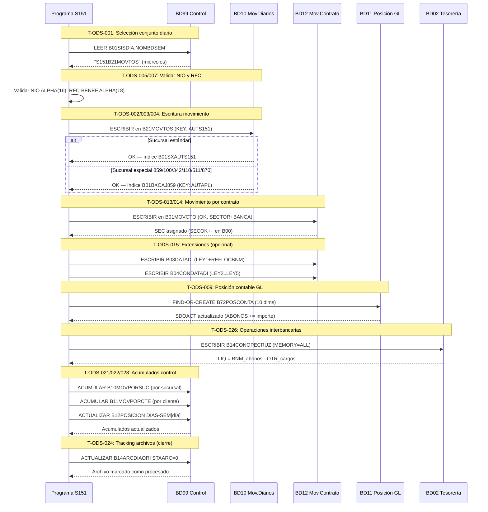

# BC-15 · Almacén Operacional DMSII
> Dominio: 9 · Insights & Information · Capacidad: 9.1.1
> Cobertura: S500+S151 · Bases de datos: BD10 · BD11 · BD12 · BD13 · BD99 · BD02
> Reglas vinculadas: RN-S500-893 · RN-S500-903 · RN-S151-491..525 · RN-S151-561..570 · RN-S151-625..689 · RN-S151-1150..1160 (123 reglas · trazabilidad automática 2026-07-27)
> Jerarquía: **N1** Dominio 9 · Insights & Information → **N2** Subdominio (General) → **N3** Capacidad 9.1.1 Operational Data Stores → **N4-5** Procesos/Flujo de tareas (ver Inventario de Tareas) → **N6** Reglas (ver Reglas vinculadas)
> Indexado: ✅ 2026-07-27 — correlacionado vocab↔reglas↔capacidad (build-traceability.py)
> bian_ref: 9.1.1 Operational Data Stores

---

## Contexto funcional

El **Operational Data Store (ODS)** del sistema S151 es el modelo de datos en producción sobre la plataforma **Unisys ClearPath MCP** con motor **DMSII** (Data Management System II). No es un repositorio analítico ni un data warehouse: es el almacén transaccional vivo donde cada movimiento contable, saldo, posición GL, instrucción de domiciliación y control operativo existe en tiempo real.

El ODS S151 está compuesto por **seis bases de datos DMSII** con roles y cardinalidades distintos:

| BD | Nombre funcional | DATA SETs principales | Cardinalidad máxima | Rol |
|----|------------------|-----------------------|---------------------|-----|
| **BD10** | Movimientos Diarios | BxMOVTOS (x5 días) + IMPADI + CSISUCCAJ | 52.5 M/conjunto × 5 días | Registro transaccional en tiempo real |
| **BD11** | Saldos y Posición GL | B70POSICION · B72POSCONTA · B20SDOMENCON · B80EDOCTA | Hasta 12 M saldos mensuales | Posición contable y estados de cuenta |
| **BD12** | Movimientos por Contrato | Tripartita OK(25M) · INFO(5M) · ERROR(5M) + 6 extensiones | 35 M registros totales | Movimientos a nivel de contrato cliente |
| **BD13** | BIFIN / Protección / Domiciliación | B07PROTCOB · B10DOMI · B04CTLCITIDIR · B08TDMIGCAP | 150 M (PROTCOB + DOMI) | Domiciliación, protección de cobro, envíos externos |
| **BD99** | Control del Sistema | B10MOVPORSUC · B11MOVPORCTE · B12POSICION · B14/B15ARCDIA | Hasta 10 M registros | Acumulados operativos y control de archivos |
| **BD02** | Saldos Tesorería (ADSALDO) | B03SDOCTE · B14CONOPECRUZ · B15MOVOPECRUZ · B08GLOSAR | 100 K (interbancarios en ALL) | Tesorería, operaciones cruzadas e interbancarias, SAR |

**Integración regulatoria directa:** CNBV (R04C, R27C, CUB Anexo 33), Banxico (SPEI/NIO, domiciliación, operaciones interbancarias), SAT (RFC-ORD, RFC-BENEF, NOM-BENEF Anexo 20), CONSAR (flujos SAR).

**Interdependencia cross-sistema confirmada:**
- BD11.B70POSICION reside físicamente en el pack `S067REMESAS` (sistema de Remesas).
- BD13.B10DOMI tiene campo cruzado `AUTD-AUT702` hacia el sistema S702 (domiciliación externa).
- BD13.B04CTLCITIDIR alimenta la plataforma CitiDirect (cash management externo).

**Advertencia operativa crítica:** Las sucursales 859/100/342/110/511/870 usan `KEY=AUTAPL` en lugar de `KEY=AUTS151` en todos los conjuntos de BD10. Cualquier consulta de cajero que asuma AUTS151 como clave universal producirá NOT FOUND silencioso para estas seis sucursales.

---

## Inventario de Tareas

### BD10 — Movimientos Diarios

| ID | Tipo | Descripción | Reglas fuente |
|----|------|-------------|---------------|
| **T-ODS-001** | `control` | Selección del conjunto diario activo de BD10: leer `BD99.B01SISDIA.NOMBDSEM` y enrutar a B01/B11/B21/B31/B41MOVTOS según día hábil. El sábado reutiliza el conjunto indicado por NOMBDSEM. | RN-S151-491, RN-S151-492 |
| **T-ODS-002** | `consulta` | Lookup de movimiento individual por AUTS151 NUMBER(08) vía índice `B01SXAUTS151`. Único y O(1). Si PROCESO ≥ 15, el registro no está en los subsets activos; se requiere acceso directo por AUTS151. | RN-S151-493, RN-S151-494 |
| **T-ODS-003** | `consulta` | Consulta de movimientos de cajero estándar (SUCINI > 0, PROCESO < 15) vía subset `B01BXMOVCAJ` con clave (SUCINI, CAJINI, AUTS151) y BUFFERS=2500+100/usuario. Excluye movimientos electrónicos (SUCINI=0). | RN-S151-494, RN-S151-495 |
| **T-ODS-004** | `consulta` | Consulta de movimientos en sucursales especiales (859, 100, 342, 110, 511, 870) vía subset `B01BXCAJ859` con clave (SUCINI, CAJINI, **AUTAPL**). Bifurcación obligatoria respecto a T-ODS-003. Aplica en los 5 conjuntos diarios. | RN-S151-496 |
| **T-ODS-005** | `validación` | Validación de tipo y formato del campo NIO: ALPHA(16) para operaciones SPEI asignadas por Banxico; CECOBAN NUMBER(08) para compensación interbancaria. NIO vacío (espacios) es válido en operaciones no-SPEI. | RN-S151-497 |
| **T-ODS-006** | `contable` | Cuadre de caja por turno: acumulación en `B03CSISUCCAJ` (clave MDE) y `B04CSISUCCAJ` (clave MDA) con dimensiones (SUCINI, CAJINI, MONEDA, BANCOS, SECREN). Reconciliar total_B03 + total_B04 = SUM(BxMOVTOS caja/turno). | RN-S151-499 |
| **T-ODS-007** | `validación` | Validación de campos SAT Anexo 20: RFC-ORD ALPHA(13), RFC-BENEF ALPHA(18), NOM-BENEF ALPHA(120). La asimetría de longitud RFC-ORD(13) ≠ RFC-BENEF(18) es intencional y obligatoria. Campos en blanco son válidos para operaciones no sujetas a Anexo 20. | RN-S151-500 |
| **T-ODS-008** | `consulta` | Consulta de importes adicionales del movimiento vía `S151B02IMPADI` (MEMORY RESIDENT=COARSE, 6M registros). Relación hija 0..1 con BxMOVTOS: NOT FOUND es el caso normal (movimiento sin importes adicionales). | RN-S151-498 |

### BD11 — Saldos y Posición GL

| ID | Tipo | Descripción | Reglas fuente |
|----|------|-------------|---------------|
| **T-ODS-009** | `contable` | Actualización de posición contable GL en `B72POSCONTA` (MEMORY RESIDENT=COARSE): FIND-OR-CREATE con clave de 10 dimensiones (KEYCSI, KEYFEC, KEYBCO, KEYMON, KEYFID, KEYPRD, KEYINS, KEYCTA, KEYCVEC, KEYSEC). Actualizar CARGOS/ABONOS/SDOACT. Insumo directo para R04C/R27C CNBV. | RN-S151-501, RN-S151-503, RN-S151-507 |
| **T-ODS-010** | `consulta` | Consulta de saldos mensuales activos: acceder siempre al subset `B20BXSDOMENCON` (WHERE STAMOV=1, BIT VECTOR) con clave (KEYAM, KEYCON, KEYPRD, KEYMON). Consultar directamente `S151B20SDOMENCON` incluye registros históricos e introduce duplicación aparente de saldos. | RN-S151-502, RN-S151-504 |
| **T-ODS-011** | `control` | Control de generación de estado de cuenta vía `S151B80EDOCTA` (MEMORY RESIDENT=COARSE, 5M registros, clave FECCON+PRD+INS+KEYCONT). Sin registro activo en B80EDOCTA, P158 no genera el estado de cuenta — falla silenciosa para el cliente. | RN-S151-505 |
| **T-ODS-012** | `validación` | Validación de fecha de proceso: leer `B00.FEC NUMBER(08)` en formato CCAAMMDD (post-CRONOS2K). Programas que leen como NUMBER(06) truncan el siglo silenciosamente. Identificar con `*INICIA CODIGO DE RENOVACION CRONOS 2000`. | RN-S151-506 |

### BD12 — Movimientos por Contrato Tripartita

| ID | Tipo | Descripción | Reglas fuente |
|----|------|-------------|---------------|
| **T-ODS-013** | `escritura` | Escritura de movimiento por contrato en el conjunto correcto de la tripartita: OK → `S151B01MOVCTO` (25M); INFO → `S151B11MOVINFCTO` (5M); ERROR → `S151B51MOVERRCTO` (5M). Incluir SECTOR NUMBER(02) y BANCA NUMBER(02) para clasificación regulatoria. | RN-S151-508, RN-S151-509 |
| **T-ODS-014** | `consulta` | Consulta de movimiento OK por contrato y período: índice `B01SXMOVCTO` con clave (FECCON, KEYCONT, SEC) para acceso por corte; `B01SXFCHVAL` con (PRD, INS, KEYCONT, FECVAL, SEC) para acceso por fecha valor. SEC es espacio de numeración distinto a AUTS151 de BD10. | RN-S151-510 |
| **T-ODS-015** | `consulta` | Ensamblaje de leyenda completa de movimiento OK: (1) registro principal B01MOVCTO, (2) FIND B02IMPADI → importes adicionales, (3) FIND B03DATADI → LEY1 + REFLOCBNM, (4) FIND B04CONDATADI → LEY2..LEY5. Las extensiones INFO y ERROR usan sus propias tablas (B12/B13/B14 y B52/B53/B54). | RN-S151-511, RN-S151-512 |
| **T-ODS-016** | `control` | Trazabilidad y auditoría de secuencias: leer/actualizar contadores `SECOK`, `SECINF`, `SECERR` en B00 global de BD12. Gaps en secuencia indican movimientos eliminados. Contadores NUMBER(08): techo de 99,999,999 por período. | RN-S151-513 |

### BD13 — BIFIN / Protección de Cobro / Domiciliación

| ID | Tipo | Descripción | Reglas fuente |
|----|------|-------------|---------------|
| **T-ODS-017** | `consulta` | Consulta de instrucción de protección de cobro en `S151B07PROTCOB` (150M registros) por clave `B07-AUT-PC NUMBER(12)`. AUT-PC ≠ AUTS151: son espacios de numeración distintos con diferente longitud. No mezclar en lookups. | RN-S151-514 |
| **T-ODS-018** | `control` | Gestión del ciclo de vida de protección de cobro: STATUS 0(pendiente) → 1(enviado) → 2(confirmado); rama de reversa: 3(enviado_rev) → 4(reversa_conf); 5(elim_no_env). Acceder a procesables vía subset `B07SXAUTPROC` (WHERE STATUS IN (0,1,2)). Incluye tarjetas migradas B08TDMIGCAP con STATUS ALPHA(02): 'AC'/'CA'. | RN-S151-515, RN-S151-518 |
| **T-ODS-019** | `control` | Control de instrucciones de domiciliación en `S151B10DOMI` (EXTENDED=TRUE, 150M registros): fecha en formato juliano `AUTD-FECJUL NUMBER(07)` y cross-reference S702 vía `AUTD-AUT702`. Lookup cruzado por `B10SXFAUTAP702`. | RN-S151-516 |
| **T-ODS-020** | `control` | Control de envíos a CitiDirect en `S151B04CTLCITIDIR` (16M registros): gestionar ESTATUS y REINTENTOS NUMBER(03). Si REINTENTOS > umbral → alerta de intervención manual. NIO ALPHA(16) para mensajes SPEI incluidos. | RN-S151-517 |

### BD99 — Control del Sistema

| ID | Tipo | Descripción | Reglas fuente |
|----|------|-------------|---------------|
| **T-ODS-021** | `contable` | Acumulación de movimientos por sucursal en `S151B10MOVPORSUC` (8M, MEMORY=COARSE, BLOCKSIZE=4, REBLOCKFACTOR=5): clave de 9 dimensiones incluyendo SECTOR regulatorio CNBV. Optimizado para scan secuencial masivo en cierre. | RN-S151-519 |
| **T-ODS-022** | `contable` | Acumulación de movimientos por cliente en `S151B11MOVPORCTE` (10M, MEMORY=COARSE, BLOCKSIZE=7, REBLOCKFACTOR=5). Mayor granularidad (10M clientes > 8M sucursales). Insumo para análisis de concentración de cartera CNBV. | RN-S151-520 |
| **T-ODS-023** | `contable` | Actualización de posición semanal en `S151B12POSICION` (MEMORY=COARSE): clave (SISTEMA, PRODUCTO, MONEDA, INSTRUMENTO, CUENTA, SECTOR) con `DIAS-SEM OCCURS 5 TIMES` (CARGO/ABONO por día hábil). Mini-histórico de 5 días en un solo registro. | RN-S151-521 |
| **T-ODS-024** | `control` | Tracking de archivos de procesamiento diario: subsets BIT VECTOR WHERE STAARC=1 en `B14ARCDIAORI` (archivos de entrada) y `B15ARCDIADES` (archivos de salida). STAARC quedado en 1 tras proceso exitoso indica falla de actualización y riesgo de reproceso con duplicados. | RN-S151-522 |

### BD02 — Saldos Tesorería (ADSALDO)

| ID | Tipo | Descripción | Reglas fuente |
|----|------|-------------|---------------|
| **T-ODS-025** | `consulta` | Consulta de saldos de tesorería por cliente en `S151B03SDOCTE` (500K registros): clave compuesta (MONEDA, SUCURSAL, SISTEMA, NUMERO1, NUMERO2, INST). Clave lógica de cliente = LPAD(NUMERO1,10,'0') \|\| LPAD(NUMERO2,10,'0') — requiere validación semántica con negocio. | RN-S151-523 |
| **T-ODS-026** | `contable` | Conciliación de operaciones interbancarias en tiempo real: escribir en `B14CONOPECRUZ` (100K, **MEMORY RESIDENT=ALL**) con clave (BCO_ORI, BCO_DES, HORA, FECHA_MQ). LIQ = BNM_abonos − OTR_cargos. DIFGLO ≠ 0 al cierre → reporte a Banxico. AUTS151 en B14 permite trazabilidad cross-BD hacia BD10. | RN-S151-524 |
| **T-ODS-027** | `consulta` | Consulta y actualización de saldos SAR en `S151B08GLOSAR`: desglose por organismo (IMSS, ISSSTE, INFONAVIT, FOVISSSTE, PEMEX) y por tipo de aportación (obligatoria, voluntaria, inflación, intereses, recargos). saldo_act = saldo_ant + obligatoria + voluntaria + inflación + intereses − recargos. | RN-S151-525 |

---

## Casuísticas

### CS-ODS-01 — Happy Path: Ciclo completo de movimiento SPEI

**Descripción:** Un cliente realiza una transferencia SPEI el miércoles. El S151 registra el movimiento en todos los DATA SETs relevantes y actualiza la posición GL y los acumulados de control.

**Precondiciones:**
- BD99.B01SISDIA.NOMBDSEM = "S151B21MOVTOS" (miércoles).
- Sucursal estándar (no especial): SUCINI = 412.
- Operación SPEI: NIO = "MX2026071600001234" (ALPHA 18 chars, dentro de ALPHA(16) — validar longitud).
- RFC-ORD = "EME850101AB3" (13 chars), RFC-BENEF = "GOME801212AB3X01" (18 chars con homoclave extendida).

**Flujo exitoso:**
1. **T-ODS-001**: Leer NOMBDSEM → enrutar a `S151B21MOVTOS` (conjunto del miércoles).
2. **T-ODS-005**: Validar NIO como ALPHA(16), CECOBAN como NUMBER(08).
3. **T-ODS-007**: Validar RFC-ORD ALPHA(13) y RFC-BENEF ALPHA(18). NOM-BENEF ALPHA(120) capturado.
4. **T-ODS-002**: El movimiento se escribe en BD10 con AUTS151 nuevo. PROCESO = 0 (activo).
5. **T-ODS-026**: Escribir en BD02.B14CONOPECRUZ con BCO_ORI=Banamex, BCO_DES=banco_destino. LIQ calculado.
6. **T-ODS-013**: Escribir el movimiento en BD12 conjunto OK con SECTOR=04 (banca múltiple), BANCA=01. SEC asignado por SECOK++.
7. **T-ODS-009**: FIND-OR-CREATE en BD11.B72POSCONTA con las 10 dimensiones. ABONOS += importe.
8. **T-ODS-021/022**: Acumular en BD99.B10MOVPORSUC y B11MOVPORCTE.

**Resultado esperado:** Movimiento visible en B21BXMOVCTO (subset activo BD10), B01MOVCTO (BD12 OK), B72POSCONTA actualizado, acumulados BD99 actualizados. DIFGLO en BD02 = 0.

---

### CS-ODS-02 — Error Path: Búsqueda por AUTS151 en sucursal especial 859

**Descripción:** Un operador busca movimientos del cajero 03 de la sucursal 859 usando el índice estándar de BD10. El resultado es NOT FOUND aunque los registros existen.

**Precondiciones:**
- Sucursal 859 (sucursal especial con KEY=AUTAPL).
- Búsqueda incorrecta: `FIND B01BXMOVCAJ WHERE (SUCINI=859, CAJINI=03, AUTS151=:x)`.

**Flujo de error:**
1. **T-ODS-003** (incorrecto): El programa usa `B01BXMOVCAJ` con clave (SUCINI, CAJINI, AUTS151). Como la sucursal 859 no indexa por AUTS151 en este subset, el resultado es NOT FOUND.
2. **Sin manejo de error:** El programa interpreta NOT FOUND como "no hay movimientos para ese cajero" — falso negativo silencioso.
3. **Diagnóstico correcto:** SUCINI=859 está en la lista especial (859, 100, 342, 110, 511, 870). Debe usarse **T-ODS-004**: `FIND B01BXCAJ859 WHERE (SUCINI=859, CAJINI=03, AUTAPL=:aut_aplicacion)`.
4. **Bifurcación correcta:** El programa determina AUTAPL del movimiento (diferente al AUTS151 aunque ambos son NUMBER(08)) y accede por `B01BXCAJ859`.

**Resultado esperado tras corrección:** Movimientos del cajero 859/03 encontrados correctamente por AUTAPL. AUTS151 no es una clave válida para recuperar cajeros de sucursales especiales.

**Impacto regulatorio:** Sin esta bifurcación, los movimientos de 6 sucursales quedan sin trazabilidad CNBV — pérdida de registros auditables de cajero.

---

### CS-ODS-03 — Edge Case: Saturación de conjunto diario BD10 en día de quincena

**Descripción:** En un viernes de quincena, el volumen de movimientos se acerca al límite de 52,500,000 registros del conjunto `S151B41MOVTOS`. DMSII no expande dinámicamente la POPULATION.

**Precondiciones:**
- Día: viernes de quincena (pico estacional).
- Conjunto activo: S151B41MOVTOS (POPULATION IS 52500000).
- COUNT(registros actuales) = 44,625,000 (85% del límite — umbral de alerta).

**Flujo del edge case:**
1. **T-ODS-001**: Selección normal de S151B41MOVTOS (viernes).
2. **Monitoreo activo:** Sistema detecta COUNT ≥ 44,625,000 (85%) → alerta operativa disparada.
3. **No existe mecanismo automático** de expansión en DMSII. Si COUNT alcanza 52,500,000 → ERROR overflow del DATA SET en la siguiente escritura.
4. **Acción operativa:** Evaluar archivado prematuro de movimientos con PROCESO ≥ 15 para liberar espacio. Si no hay margen → reorganización parcial fuera de línea (requiere ventana de mantenimiento no planificada).
5. **Sin acción:** La siguiente escritura en BD10 falla con error de overflow. Los programas S151 no tienen failover automático — el procesamiento del día se detiene.

**Resultado esperado con monitoreo:** Alerta temprana permite tomar acción antes del overflow. Sin monitoreo, el overflow ocurre en producción durante el pico de quincena.

**Configuración recomendada:** Alerta a 85% (44.6M registros). Reorganización preventiva antes de quincenas y fin de mes.

---

## Diagrama

---

## Reglas vinculadas

| Tarea | Regla | Componente fuente | Descripción |
|-------|-------|-------------------|-------------|
| T-ODS-001 | RN-S151-491 | DASDL_S151BD10MOVDIA151.txt | 5 conjuntos diarios independientes; selector por NOMBDSEM en BD99 |
| T-ODS-001 | RN-S151-492 | DASDL_S151BD10MOVDIA151.txt | Cardinalidad 52.5M por conjunto; overflow sin reorganización si se supera |
| T-ODS-002 | RN-S151-493 | DASDL_S151BD10MOVDIA151.txt | Lookup O(1) por AUTS151 vía B01SXAUTS151; redirigir a AUTAPL para sucursales especiales |
| T-ODS-002 | RN-S151-494 | DASDL_S151BD10MOVDIA151.txt | Filtro PROCESO<15 delimita movimientos activos en subsets; ≥15 requiere acceso directo |
| T-ODS-003 | RN-S151-495 | DASDL_S151BD10MOVDIA151.txt | B01BXMOVCAJ: SUCINI>0 + PROCESO<15; BUFFERS=2500+100/usuario para cajeros concurrentes |
| T-ODS-004 | RN-S151-496 | DASDL_S151BD10MOVDIA151.txt | [CRÍTICO] Sucursales 859/100/342/110/511/870: KEY=AUTAPL en BxxBXCAJ859 (5 conjuntos) |
| T-ODS-005 | RN-S151-497 | DASDL_S151BD10MOVDIA151.txt | NIO ALPHA(16) ≠ numérico; CECOBAN NUMBER(08); NIO vacío válido en no-SPEI |
| T-ODS-006 | RN-S151-499 | DASDL_S151BD10MOVDIA151.txt | Cuadre de caja: B03/B04CSISUCCAJ con MONEDA+BANCOS+MDE/MDA+SECREN |
| T-ODS-007 | RN-S151-500 | DASDL_S151BD10MOVDIA151.txt | RFC-ORD(13) ≠ RFC-BENEF(18): asimetría SAT intencional; NOM-BENEF ALPHA(120) |
| T-ODS-008 | RN-S151-498 | DASDL_S151BD10MOVDIA151.txt | IMPADI MEMORY=COARSE; relación 0..1 con BxMOVTOS; NOT FOUND es caso normal |
| T-ODS-009 | RN-S151-501 | DASDL_S151BD11SDOS151.txt | B72POSCONTA: clave 10 dimensiones GL; KEYCVEC(6)+KEYSEC(2); insumo R04C/R27C CNBV |
| T-ODS-009 | RN-S151-503 | DASDL_S151BD11SDOS151.txt | B70POSICION + B72POSCONTA MEMORY=COARSE para SLA de cierre contable |
| T-ODS-009 | RN-S151-507 | DASDL_S151BD11SDOS151.txt | B70POSICION en PACKNAME=S067REMESAS: dependencia física cross-sistema con S067 |
| T-ODS-010 | RN-S151-502 | DASDL_S151BD11SDOS151.txt | STAMOV=1 BIT VECTOR en B20BXSDOMENCON; consultar base directa produce duplicación aparente |
| T-ODS-010 | RN-S151-504 | DASDL_S151BD11SDOS151.txt | B21SDMENCON1: KEYIND consecutivo + OCCURS 12 para hasta 12 períodos de saldo |
| T-ODS-011 | RN-S151-505 | DASDL_S151BD11SDOS151.txt | B80EDOCTA (5M, COARSE): NOT FOUND → P158 omite estado de cuenta — falla silenciosa cliente |
| T-ODS-012 | RN-S151-506 | DASDL_S151BD11SDOS151.txt | FEC NUMBER(08) post-CRONOS2K: leer como (06) trunca el siglo silenciosamente |
| T-ODS-013 | RN-S151-508 | DASDL_S151BD12MC001S151.txt | [CRÍTICO] Tripartita OK(25M)/INFO(5M)/ERROR(5M): físicamente independientes, SLOs distintos |
| T-ODS-013 | RN-S151-509 | DASDL_S151BD12MC001S151.txt | SECTOR NUMBER(02) + BANCA NUMBER(02): campos regulatorios obligatorios en R04C/R27C |
| T-ODS-013 | RN-S151-512 | DASDL_S151BD12MC001S151.txt | INFO y ERROR tienen extensiones propias (B12/B13/B14 y B52/B53/B54, 2.5M c/u) |
| T-ODS-014 | RN-S151-510 | DASDL_S151BD12MC001S151.txt | Índices B01SXMOVCTO (FECCON+KEYCONT+SEC) y B01SXFCHVAL (FECVAL); SEC ≠ AUTS151 |
| T-ODS-015 | RN-S151-511 | DASDL_S151BD12MC001S151.txt | Leyenda completa OK: B01MOVCTO + B02IMPADI + B03DATADI(LEY1+REFLOCBNM) + B04CONDATADI(LEY2-5) |
| T-ODS-016 | RN-S151-513 | DASDL_S151BD12MC001S151.txt | SECOK/SECINF/SECERR NUMBER(08) en B00: techo 99.999.999; gaps de SEC = movimientos eliminados |
| T-ODS-017 | RN-S151-514 | DASDL_S151BD13BIFIN.txt | [CRÍTICO] AUT-PC NUMBER(12) ≠ AUTS151 NUMBER(08): FK entre B07PROTCOB y BD10 no es directa |
| T-ODS-018 | RN-S151-515 | DASDL_S151BD13BIFIN.txt | STATUS 6 valores: 0-2 procesables (B07SXAUTPROC), 3-4 reversa, 5 eliminado sin enviar |
| T-ODS-018 | RN-S151-518 | DASDL_S151BD13BIFIN.txt | B08TDMIGCAP (100M): STATUS ALPHA(02) 'AC'/'CA' — tipo distinto al STATUS NUMBER de B07PROTCOB |
| T-ODS-019 | RN-S151-516 | DASDL_S151BD13BIFIN.txt | B10DOMI EXTENDED=TRUE (150M): AUTD-FECJUL juliana; AUTD-AUT702 cross-ref S702 |
| T-ODS-020 | RN-S151-517 | DASDL_S151BD13BIFIN.txt | B04CTLCITIDIR (16M): REINTENTOS NUMBER(03); NIO ALPHA(16) en mensajes SPEI a CitiDirect |
| T-ODS-021 | RN-S151-519 | DASDL_S151BD99CONTROL.txt | B10MOVPORSUC (8M): BLOCKSIZE=4, REBLOCKFACTOR=5; clave 9 dims incluyendo SECTOR CNBV |
| T-ODS-022 | RN-S151-520 | DASDL_S151BD99CONTROL.txt | B11MOVPORCTE (10M): BLOCKSIZE=7, REBLOCKFACTOR=5; mayor granularidad que por sucursal |
| T-ODS-023 | RN-S151-521 | DASDL_S151BD99CONTROL.txt | B12POSICION: DIAS-SEM OCCURS 5 (CARGO/ABONO por día hábil); rollup semanal→mensual explícito |
| T-ODS-024 | RN-S151-522 | DASDL_S151BD99CONTROL.txt | B14ARCDIAORI/B15ARCDIADES: BIT VECTOR WHERE STAARC=1; falla de actualización → reproceso con duplicados |
| T-ODS-025 | RN-S151-523 | DASDL_S151BD02ADSALDO.txt | [SOSPECHOSO] B03SDOCTE NUMERO1(10)+NUMERO2(10): clave cliente 20 dígitos requiere validación negocio |
| T-ODS-026 | RN-S151-524 | DASDL_S151BD02ADSALDO.txt | B14CONOPECRUZ/B15MOVOPECRUZ MEMORY=ALL (100K); DIFGLO≠0 al cierre → reporte Banxico |
| T-ODS-027 | RN-S151-525 | DASDL_S151BD02ADSALDO.txt | B08GLOSAR: saldos SAR por IMSS/ISSSTE/INFONAVIT/FOVISSSTE/PEMEX con 7 subcampos de tipo |

---

## Hallazgos de migración

| Riesgo | Tarea | Severidad | Acción |
|--------|-------|-----------|--------|
| **AUTAPL vs AUTS151:** Sucursales 859/100/342/110/511/870 indexan por AUTAPL(08), no AUTS151(08). Ambos tienen 8 dígitos pero espacios de numeración distintos — confusión silenciosa posible. Sin bifurcación, movimientos de 6 sucursales quedan sin clave de recuperación correcta. | T-ODS-004 | 🔴 CRÍTICO | Bifurcar clave en modelo relacional: `IF sucursal IN (859,100,342,110,511,870) THEN key=autapl ELSE key=auts151`. Implementar como columna discriminante o función de índice parcial. Validar con catálogo CNBV de trazabilidad por sucursal. |
| **AUT-PC(12) ≠ AUTS151(08):** La FK entre BD13.B07PROTCOB y BD10 no puede establecerse directamente como AUT-PC = AUTS151. Son identificadores de sistemas distintos. 150M registros de protección de cobro afectados. | T-ODS-017 | 🔴 CRÍTICO | Crear tabla de equivalencia `protcob_mov_xref(aut_pc NUMBER(12), auts151 NUMBER(08))` o campo de cruce explícito. Validar con equipo de negocio si existe relación documentada. |
| **Tripartita BD12:** Colapsar OK/INFO/ERROR en una sola tabla unificada sin discriminante pierde SLOs diferenciados y la semántica de estados. Las 9 tablas (3 principales + 6 extensiones) tienen relaciones de FK por tipo. | T-ODS-013 | 🔴 CRÍTICO | Implementar tres tablas físicas separadas con índices propios o tabla única con columna `tipo_resultado VARCHAR(5) CHECK IN ('OK','INFO','ERROR')` y partial indexes por tipo. Modelar 6 tablas de extensión con FK tipada. |
| **NIO ALPHA(16) mapeado a tipo numérico:** NIO es alfanumérico, no numérico puro. Mapearlo a BIGINT o NUMBER produce error silencioso en operaciones SPEI con caracteres no dígitos. | T-ODS-005 | 🟠 ALTO | Mapear `NIO → VARCHAR(16)` en sistema destino. Nunca a tipo numérico. Validar que registros históricos no tengan NIO con caracteres no-dígito antes del cutover. |
| **RFC-BENEF(18) vs RFC-ORD(13):** Asumir longitud uniforme de 13 para RFC produce truncamiento silencioso de RFC-BENEF. Error de identificación de beneficiario reportable al SAT. | T-ODS-007 | 🟠 ALTO | `RFC_ORD → VARCHAR(13)`, `RFC_BENEF → VARCHAR(18)`. No crear columna RFC genérica unificada en modelo destino. Verificar históricos con RFC-BENEF de 13 chars (personas morales) vs 18 (extendidos). |
| **OCCURS en BD11 y BD99:** B21SDMENCON1 tiene OCCURS 12 (saldos por período); B12POSICION tiene OCCURS 5 (DIAS-SEM). Estas estructuras no existen en SQL estándar. | T-ODS-010, T-ODS-023 | 🟠 ALTO | Para OCCURS 12 → explotar en 12 filas con columna `indice_periodo` o 12 pares de columnas. Para OCCURS 5 → explotar en 5 filas con columna `dia_habil (1-5)`. Evaluar impacto en performance con volumetría real antes de decidir. |
| **B70POSICION en PACKNAME=S067REMESAS:** S151 no puede migrar B70POSICION de forma independiente sin coordinación con el equipo de S067. Caída del pack S067 hace inaccesible B70POSICION aunque S151 esté en línea. | T-ODS-009 | 🟠 ALTO | Reasignar PACKNAME a pack propio de S151 (`PACKNAME = S151POSICION`) antes del cutover. Coordinar ventana de mantenimiento con equipo S067. Incluir dependencia en plan de migración y plan de contingencia. |
| **STATUS ALPHA(02) vs STATUS NUMBER(02):** B08TDMIGCAP usa 'AC'/'CA' (alfanumérico); B07PROTCOB usa 0..5 (numérico). No son intercambiables. Unificar en una columna STATUS genérica produce comparaciones inválidas. | T-ODS-018 | 🟡 MEDIO | Mantener tipos distintos: `status_protcob SMALLINT CHECK IN (0,1,2,3,4,5)` vs `status_tarjeta VARCHAR(2) CHECK IN ('AC','CA')`. No fusionar en una sola columna STATUS transversal. Comparaciones ALPHA son case-sensitive. |
| **FEC 6 vs 8 dígitos (CRONOS2K):** Programas que leen B00.FEC como NUMBER(06) truncan el siglo: "2026" → "26" interpretado como 1926 en lógica de fechas. | T-ODS-012 | 🟡 MEDIO | Auditar todos los programas que referencian FEC buscando `*INICIA CODIGO DE RENOVACION CRONOS 2000`. En sistema destino: DATE nativo o columna YYYYMMDD INTEGER(8). Nunca INTEGER(6) para fechas post-2000. |
| **SECOK/SECINF/SECERR NUMBER(08):** Techo de 99,999,999. Si un período procesa más de 100M movimientos, desbordamiento silencioso de los contadores de secuencia. | T-ODS-016 | 🟡 MEDIO | En sistema destino, usar BIGINT (hasta 9.2 × 10^18) para contadores de secuencia. Implementar alerta a 80% del techo (79.9M) en el sistema legacy mientras dure la coexistencia. |
| **BIT VECTOR DMSII:** Las directivas BIT VECTOR de DMSII no tienen equivalente directo en SQL. Los subsets con WHERE STAMOV=1 y WHERE STAARC=1 requieren modelado explícito. | T-ODS-010, T-ODS-024 | 🟡 MEDIO | Reemplazar con partial index: `CREATE INDEX idx_saldos_activos ON sdomencon(keyam, keycon) WHERE stamov = 1`. Validar cardinalidad antes del cutover para sizing correcto del índice. |
| **NUMERO1+NUMERO2 (clave 20 dígitos en B03SDOCTE):** La partición artificial en dos NUMBER(10) sugiere una clave lógica de 20 dígitos no estándar en bancos mexicanos. El significado de cada mitad no está en el DASDL. | T-ODS-025 | 🟡 MEDIO | Validar con equipo de negocio: ¿es número de cuenta extendido, identificador compuesto sucursal+cuenta, o herencia de sistema anterior? Definir antes de mapear. Usar `LPAD(numero1,10,'0') || LPAD(numero2,10,'0')` como clave transitoria. |
| **Fecha juliana en B10DOMI (AUTD-FECJUL NUMBER(07)):** Sin conocer la fecha base del sistema, la fecha juliana es ininterpretable. La constante no está en el DASDL. | T-ODS-019 | 🟡 MEDIO | Documentar la fecha base del sistema S151 (preguntar al equipo de operaciones). Crear función de conversión juliana→gregoriana documentada antes del cutover. Incluir en el glosario de migración. |
| **MEMORY RESIDENT=ALL en B14/B15OPECRUZ:** 100K registros caben en RAM actualmente. Si el portafolio interbancario crece, puede no caber en ALL y requerir cambio a COARSE. | T-ODS-026 | 🟢 BAJO | Monitorear crecimiento de B14CONOPECRUZ. En sistema destino, evaluar si tabla de 100K cabe completamente en buffer pool. Si no, implementar caché de aplicación para operaciones interbancarias críticas. |
| **Overflow BD10 en picos estacionales:** 52.5M/conjunto es el techo absoluto sin expansión dinámica. Quincenas y fin de mes pueden acercarse al límite. | T-ODS-001 | 🟢 BAJO | Implementar monitoreo con alerta a 85% (44.6M registros). Planificar archivado de movimientos PROCESO≥15 antes de quincenas. En sistema destino: tablas particionadas por día sin techo fijo. |

---

*cap-ods.md · v1.0 · 2026-07-16*
*Capacidad: 9.1.1 Operational Data Stores · Sistema: S500+S151 · DASDL BD10·BD11·BD12·BD13·BD99·BD02*
*Cross-referencia: RN-S151-491..525 · rules-s151-dasdl.md · capability-map.md*

---

## Ampliación — L030 Biblioteca Maestra S151LIB030 (RN-S151-526..550)

> L030 (PROGRAM-ID: S151LIB030, 19,253 LOC, COBOL) es la biblioteca COBOL de plataforma cargada por TODOS los programas S151 mediante `CANCEL`. No es transpilable directamente: usa CHANGE ATTRIBUTE TITLE/LIBACCESS/FUNCTIONNAME, OPEN/CLOSE INQUIRY sobre DMSII, y el patrón `CANCEL` de Unisys MCP para carga/descarga dinámica de librerías — ninguno de estos mecanismos tiene equivalente en Java/cloud. L030 DEBE reimplementarse como 4–6 microservicios de plataforma. Contiene: catálogo CVETRAN (hasta 10,000 entradas) + 2,000 leyendas cargados en memoria al inicio, jerarquía CSI de 7 niveles con límites hardcoded, ventana deslizante de 10 semi-días para saldos, y manejo de 21 tipos de error DMSII.

### Inventario de Tareas adicionales

| ID | Nombre | Programa | Tipo | Complejidad | Riesgo migración |
|----|--------|----------|------|-------------|------------------|
| T-ODS-028 | Redefinir L030 como plataforma de 6 microservicios: sistema-fechas-service, catalogo-transacciones-service, control-batch-service, consulta-movimientos-service, estructura-organizacional-service, cliente-enrichment-service | L030 | PLATAFORMA | ALTA | CRÍTICO — punto de fallo único; todos los programas S151 dependen de L030 en runtime |
| T-ODS-029 | Implementar sistema-fechas-service: reemplazar THECALENDAR (FUNCION=13 = próximo día hábil, FUNCION=18 = validar día hábil), CRONOS-2000 parche Y2K, cálculo de fecha de semana para BASESEMANAL | L030 | PLATAFORMA | ALTA | CRÍTICO — calendario bancario Banxico Circular 14/2017; sin equivalente cloud nativo |
| T-ODS-030 | Implementar catalogo-transacciones-service: carga inicial de CVETRAN (≤10,000 entradas) + leyendas (≤2,000 entradas) en caché de memoria al startup; exponer API de lookup por código de transacción | L030 | PLATAFORMA | MEDIA | ALTO — si CVETRAN supera 10K en producción, el hardcoded OCCURS falla silenciosamente |
| T-ODS-031 | Implementar control-batch-service: gestionar ventana deslizante de 10 semi-días para saldos, control de PROCESO/FECHAS, contadores de secuencia SECOK/SECINF/SECERR como estado de sesión batch | L030 | PLATAFORMA | ALTA | ALTO — ventana de 10 semi-días es hardcoded; el tamaño de ventana debe configurarse externamente |
| T-ODS-032 | Implementar consulta-movimientos-service: reemplazar OPEN INQUIRY BASESEMANAL con nombre dinámico (BD varía por día de semana) — en target: connection routing a tabla particionada por semana | L030 | PLATAFORMA | ALTA | ALTO — naming dinámico de DMSII no tiene equivalente directo; el router de conexión debe conocer el esquema de naming |
| T-ODS-033 | Implementar estructura-organizacional-service: jerarquía CSI 7 niveles (Comité→Área→División→Dirección→Regional→Operación→Sucursal) con catálogo en BD; reemplazar tabla hardcoded de L030 | L030 | PLATAFORMA | MEDIA | ALTO — jerarquía hardcoded en código COBOL; cualquier reorganización bancaria post-separación Citi requiere recompilación |
| T-ODS-034 | Implementar cliente-enrichment-service: enriquecimiento de movimientos con datos de cliente (RFC, CURP, segmento); extraer lógica de L030 que llama a programas de consulta de perfil | L030 | PLATAFORMA | MEDIA | MEDIO — dependencias de L030 hacia otros programas S151 deben mapearse antes del diseño |
| T-ODS-035 | Migrar **todos** los patrones CANCEL de Unisys MCP en S151: no solo `CANCEL L030/S151LIB030` sino también `CANCEL CTLVER` / `CANCEL SOPORTECOMS` / `CANCEL LIB-CONTROL` encontrados en P670 (líneas 1039-1041, RN-S151-598) y P610 (RN-S151-465); rediseñar cada variante como inicialización de contexto vía dependency injection en target (Spring @Bean / CDI) | L030 | PLATAFORMA | ALTA | CRÍTICO — CANCEL no es transpilable; requiere rediseño arquitectónico completo; auditar todos los programas S151 para inventario completo de patrones CANCEL antes de diseñar el target |
| T-ODS-036 | Migrar CHANGE ATTRIBUTE TITLE/LIBACCESS/FUNCTIONNAME: reemplazar capacidad de modificación dinámica de atributos de archivo Unisys por configuración externalizada (ConfigMap o tabla de parámetros) | L030 | PLATAFORMA | ALTA | CRÍTICO — CHANGE ATTRIBUTE modifica metadatos de archivos en tiempo de ejecución; no existe en sistemas POSIX/cloud |
| T-ODS-037 | Migrar OPEN/CLOSE INQUIRY de L030: reemplazar apertura read-only de DMSII por pool de conexiones de solo lectura con routing por nombre de BD; cerrar con DMTERMINATE → close de transacción | L030 | PLATAFORMA | ALTA | ALTO — OPEN INQUIRY es modo de acceso DMSII específico; semántica de aislamiento difiere del MVCC en PostgreSQL/Oracle |
| T-ODS-038 | Mapear los 21 tipos de error DMSII de L030 a códigos de error canónicos del sistema target: NOTFOUND (EOF), DEADLOCK, DUPLICADO, DMSII-UNAVAIL, etc. — implementar traducciones de error en cada microservicio | L030 | PLATAFORMA | MEDIA | ALTO — si un error DMSII no está mapeado, propaga como excepción no controlada; los 21 tipos deben estar todos cubiertos |
| T-ODS-039 | Externalizar tabla CSI hardcoded (7 niveles, topes de sucursales por nivel) a catálogo en BD: tabla `csi_jerarquia` con tipo, código_csi, código_padre, estado_activo | L030 | PLATAFORMA | MEDIA | ALTO — restructuración post-separación Citi puede requerir nuevos CSIs; cambio en código COBOL requería compilación |
| T-ODS-040 | Externalizar ventana deslizante de 10 semi-días a parámetro configurable en tabla de parámetros del sistema (SYSPARAMS); exponer via API de configuración del control-batch-service | L030 | PLATAFORMA | BAJA | MEDIO — valor hardcoded aumenta el riesgo de diferencias silenciosas si el negocio cambia el período de retención |
| T-ODS-041 | Validar límite OCCURS 10K de CVETRAN contra datos reales de producción: extraer COUNT de CVETRAN en DMSII y comparar con techo del OCCURS; planificar migración si está cerca del límite | L030 | PLATAFORMA | BAJA | ALTO — si CVETRAN tiene >10,000 entradas en producción, la carga se trunca silenciosamente y los tipos de transacción faltantes producen rechazos |
| T-ODS-042 | Migrar leyendas (≤2,000) a tabla multiidioma si el negocio requiere ES/EN; en caso contrario, cargar como tabla `leyendas_transaccion(codigo, descripcion)` en BD con refresh diario | L030 | PLATAFORMA | BAJA | BAJO |
| T-ODS-043 | Documentar mapa de equivalencias CVETRAN legacy → códigos de transacción en sistema target (enum o catálogo ISO 20022 si aplica SAR/SPEI) | L030 | PLATAFORMA | MEDIA | MEDIO — sin este mapa, los reportes regulatorios SAR y Banxico pueden clasificar movimientos incorrectamente |
| T-ODS-044 | Migrar modo CONSULTA-INQUIETA (read-write) vs CONSULTA-QUIETA (read-only) de L030: implementar como nivel de aislamiento de transacción en target (READ COMMITTED vs REPEATABLE READ) | L030 | PLATAFORMA | MEDIA | MEDIO — semántica de INQUIETA permite ver cambios no commiteados en DMSII; en SQL estándar esto sería READ UNCOMMITTED — auditar si se usa realmente |
| T-ODS-045 | Migrar gestión de secuencias L030 (batch counters OK/INF/ERR) a secuencias nativas de BD o tabla de estado de ejecución batch con lock optimista | L030 | PLATAFORMA | BAJA | BAJO |
| T-ODS-046 | Implementar circuit breaker para reemplazar CANCEL+error de L030: si un microservicio de plataforma falla al inicializar, propagar fallo al programa batch padre y abortar limpiamente (no silencioso) | L030 | PLATAFORMA | MEDIA | ALTO — CANCEL sin manejo de error propaga fallo silencioso; en target, un microservicio caído debe notificarse explícitamente |
| T-ODS-047 | Migrar filtros de CSI activo/inactivo: leer ESTADO_CSI desde catálogo en BD; eliminar comparaciones contra constantes hardcoded en L030 (ej. IF CSI=0 NEXT SENTENCE) | L030 | PLATAFORMA | BAJA | MEDIO |
| T-ODS-048 | Diseñar API de status de sistemas S151 dependientes para reemplazar CHANGE ATTRIBUTE STATUS de L030: GET /sistemas/{id}/status → {activo, enMantto, fechaHoraUltimoArriba} | L030 | PLATAFORMA | MEDIA | ALTO — status de sistemas es consultado por P103 y otros; si la API no está disponible, P103 no puede calcular la fecha de proceso |
| T-ODS-049 | Documentar interfaz de entrada de L030 (parámetros WFL posicionales: fecha, CSI, modo, sistema-origen, etc.) y definir API contract formal (OpenAPI 3.0) para cada microservicio target | L030 | PLATAFORMA | MEDIA | ALTO — sin API contract documentado, cada programa S151 que llama a L030 debe ser analizado individualmente para migración |
| T-ODS-050 | Definir estrategia de coexistencia L030: durante el período transitorio, el microservicio puede actuar como proxy hacia DMSII para programas no-migrados — implementar adapter con client Unisys DMSII SDK | L030 | PLATAFORMA | ALTA | ALTO — migración big-bang de L030 no es viable; se necesita proxy/facade para coexistencia |
| T-ODS-051 | Migrar manejo de DMTERMINATE de L030: en target, equivalente es close de UnitOfWork / commit o rollback de transacción según resultado del batch | L030 | PLATAFORMA | BAJA | MEDIO |
| T-ODS-052 | Validar equivalencia comportamental L030 legacy vs 6 microservicios target con datos reales de producción: 100% de casos de CVETRAN, CSI, fechas, y secuencias deben producir resultados idénticos | L030 | PLATAFORMA | ALTA | CRÍTICO — sin validación de equivalencia, los programas S151 que consumen L030 pueden producir saldos incorrectos sin detectarse |

### Reglas de negocio vinculadas

| ID regla | Enunciado breve | Programa | Criticidad |
|----------|----------------|----------|-----------|
| RN-S151-526 | L030 (S151LIB030, 19,253 LOC) es la biblioteca central de plataforma: NOT transpilable; debe reimplementarse como 4–6 microservicios | L030 | CRÍTICA |
| RN-S151-527 | Patrón CANCEL: todos los programas S151 cargan L030 con `CANCEL S151LIB030` — mecanismo propietario Unisys MCP para carga/descarga dinámica de librerías, sin equivalente JVM/cloud | L030 | CRÍTICA |
| RN-S151-528 | CHANGE ATTRIBUTE TITLE: modifica el título de archivo DMSII en runtime — permite routing dinámico de BD (ej. BASESEMANAL → BD de la semana actual); sin equivalente POSIX | L030 | CRÍTICA |
| RN-S151-529 | CHANGE ATTRIBUTE LIBACCESS/FUNCTIONNAME: modifica metadatos de librería en runtime — patrón de extensión dinámica de L030 propio de Unisys MCP | L030 | CRÍTICA |
| RN-S151-530 | OPEN INQUIRY BASESEMANAL: apertura de BD DMSII en modo read-only con nombre dinámico (varía por día de semana); routing a BD correcta es responsabilidad de L030 | L030 | ALTA |
| RN-S151-531 | CLOSE INQUIRY + DMTERMINATE: cierre de sesión DMSII; equivalente a commit/rollback + close de conexión en sistema target | L030 | ALTA |
| RN-S151-532 | Catálogo CVETRAN: hasta 10,000 tipos de transacción cargados en tabla OCCURS al startup de L030; lookup por código; si supera 10K la carga se trunca silenciosamente | L030 | ALTA |
| RN-S151-533 | Leyendas de transacción: hasta 2,000 descripciones cargadas en tabla OCCURS paralela a CVETRAN; usadas para generar reportes y mensajes de error | L030 | MEDIA |
| RN-S151-534 | Jerarquía CSI de 7 niveles hardcoded: Comité→Área→División→Dirección→Regional→Operación→Sucursal; límites de sucursales por nivel son constantes en código COBOL | L030 | ALTA |
| RN-S151-535 | Ventana deslizante de 10 semi-días: L030 gestiona un buffer de 10 semi-días de saldos para cálculo de variaciones — valor hardcoded en código | L030 | ALTA |
| RN-S151-536 | 21 tipos de error DMSII: L030 interpreta todos los códigos de retorno DMSII y los clasifica en NOTFOUND (EOF normal), DUPLICADO, DEADLOCK, DMSII-UNAVAIL y 17 errores adicionales | L030 | ALTA |
| RN-S151-537 | Contadores de secuencia batch: L030 gestiona SECOK (registros OK), SECINF (informativos), SECERR (errores) como estado de sesión — NUMBER(08), techo 99,999,999 | L030 | MEDIA |
| RN-S151-538 | Modo CONSULTA-INQUIETA vs CONSULTA-QUIETA: L030 abre DMSII en modo de aislamiento distinto según el modo solicitado por el programa llamador | L030 | MEDIA |
| RN-S151-539 | Parámetros WFL posicionales: L030 recibe 9+ parámetros posicionales desde el WFL invocador; no hay nombre de parámetro, solo posición — frágil ante reordenamientos | L030 | ALTA |
| RN-S151-540 | Proxy de status de sistemas: L030 consulta CHANGE ATTRIBUTE STATUS para determinar si sistemas S084/S087/S408/S500/S701 están activos antes de continuar | L030 | ALTA |
| RN-S151-541 | Calendario bancario Banxico: L030/sistema-fechas-service debe conocer el calendario de días inhábiles publicado en Circular 14/2017; actualización anual obligatoria | L030 | CRÍTICA |
| RN-S151-542 | CRONOS-2000 en L030: L030 aplica el parche Y2K propio de Banamex para interpretar fechas de 6 dígitos como AAAAMMDD de 8; verificar que aplica consistentemente | L030 | ALTA |
| RN-S151-543 | Cálculo de BASESEMANAL: el nombre del BD de movimientos varía por día de la semana (lunes=BD01, etc.); L030 calcula el nombre en runtime según fecha de proceso | L030 | ALTA |
| RN-S151-544 | Circuit breaker implícito: si CANCEL de L030 falla, el programa S151 llamador recibe SET MYSELF(STATUS) TO -1 y aborta — sin retry, sin logging estructurado | L030 | ALTA |
| RN-S151-545 | Coexistencia transitoria: durante migración, L030 debe operar como facade/proxy hacia DMSII para programas no migrados mientras los microservicios target maduran | L030 | ALTA |
| RN-S151-546 | Filtro CSI activo: L030 excluye CSIs con estado=0 de todos los cálculos; la lista de CSIs activos está hardcoded como constantes COBOL | L030 | ALTA |
| RN-S151-547 | Enrichment de cliente: L030 enriquece movimientos con datos de perfil de cliente llamando a sub-programas de S151; las dependencias exactas deben mapearse | L030 | MEDIA |
| RN-S151-548 | Secuencias de BD en target: los contadores SECOK/SECINF/SECERR de L030 deben migrarse a SEQUENCE o tabla de estado de ejecución en BD target con lock para concurrencia | L030 | MEDIA |
| RN-S151-549 | Validación de equivalencia obligatoria: cada microservicio que reemplaza un módulo de L030 debe tener suite de pruebas de equivalencia con datos DMSII exportados como fixture | L030 | CRÍTICA |
| RN-S151-550 | Actualización anual: sistema-fechas-service requiere proceso gobernado de actualización del calendario bancario Banxico cada enero — sin proceso definido, el servicio queda con días inhábiles obsoletos | L030 | CRÍTICA |

### Hallazgos de migración L030

| # | Hallazgo | Tipo | Impacto | Recomendación |
|---|---------|------|---------|---------------|
| ODS-L030-H01 | Patrón CANCEL + CHANGE ATTRIBUTE: mecanismos propietarios Unisys MCP (carga dinámica de librerías y modificación de atributos en runtime) — sin equivalente en JVM, .NET ni cloud | Portabilidad | CRÍTICO | No transpilir L030. Diseñar los 6 microservicios de plataforma como primer milestone de la migración S151; todos los demás programas dependen de que L030-target esté estable primero |
| ODS-L030-H02 | CVETRAN 10,000 entradas cargadas en OCCURS al startup: el techo es hardcoded; si producción supera 10K tipos de transacción, la carga se trunca sin error visible | Corrección | ALTO | Medir COUNT(CVETRAN) en DMSII de producción antes de la migración; en catalogo-transacciones-service, usar List<Cvetran> sin límite fijo; implementar alerta si el catálogo supera 9,500 entradas |
| ODS-L030-H03 | Jerarquía CSI de 7 niveles con límites hardcoded: cualquier reorganización bancaria post-separación Citi requiere recompilación de L030 | Extensibilidad | ALTO | Externalizar jerarquía a tabla `csi_jerarquia` en BD target antes del cutover; verificar estructura actual con equipo de operaciones Banamex para capturar CSIs post-separación ya activos |

---

## Ampliación — P606 Lectura de Archivos de Movimientos LEE-ARCHMOVYDES (RN-S151-561..570)

> P606 (PROGRAM-ID: LEE-ARCHMOVYDES, 2,675 LOC, COBOL) lee y decodifica registros físicos de 990 bytes (estructura 450+540 bytes) desde el archivo de movimientos diarios. El riesgo principal de migración es FILXAPL: un grupo de 15+ REDEFINES polimórficos que interpreta el mismo bloque de bytes como distintas estructuras según el sistema origen del movimiento. El transpilador automático no puede inferir el tipo correcto en tiempo de compilación — requiere análisis dinámico con datos reales de todos los sistemas origen activos.

### Inventario de Tareas adicionales

| ID | Nombre | Programa | Tipo | Complejidad | Riesgo migración |
|----|--------|----------|------|-------------|------------------|
| T-ODS-053 | Diseñar modelo de datos para registro de 990 bytes: 450 bytes de cabecera (identificación, fechas, importes) + 540 bytes de cuerpo (FILXAPL polimórfico por sistema origen) — mapear a entidad Java/Kotlin con herencia | P606 | BATCH | ALTA | CRÍTICO — si el layout de 990 bytes no está correctamente documentado para todos los sistemas origen, los campos se interpretan erróneamente |
| T-ODS-054 | Deserializar 15+ REDEFINES polimórficos de FILXAPL: crear discriminador por sistema origen (SIST-ORIGEN o equivalente) y clases de layout específicas por sistema (LayoutSistema01, LayoutSistema02, etc.) | P606 | BATCH | ALTA | CRÍTICO — REDEFINES polimórficos son el riesgo #1 de transpilación P606; sin cobertura de todos los sistemas origen con datos reales, el discriminador es incompleto |
| T-ODS-055 | Implementar filtro de catálogo 523: leer catálogo de tipos de movimiento con código ≥ 523 que habilitan el procesamiento de registros en LEE-ARCHMOVYDES; integrar con catalogo-transacciones-service | P606 | BATCH | MEDIA | ALTO — si catálogo 523 tiene entradas faltantes, movimientos válidos son descartados silenciosamente |
| T-ODS-056 | Migrar OCCURS 5 (slots de asientos por movimiento): en target implementar como List<AsientoContable> con tamaño dinámico; validar que ningún movimiento real usa más de 5 slots | P606 | BATCH | MEDIA | MEDIO — si en producción existen movimientos con >5 asientos, los slots extra se pierden silenciosamente |
| T-ODS-057 | Migrar triple fecha por movimiento: fecha de proceso (FECPRO), fecha valor (FECVAL), fecha operación (FECOPER) — mapear a 3 columnas DATE distintas en tabla target; verificar semántica de cada fecha con equipo de negocio | P606 | BATCH | BAJA | MEDIO — confusión entre las 3 fechas produce errores en reportes regulatorios de antigüedad de saldos |
| T-ODS-058 | Clasificar movimientos por tipo de libro: LIBRO-CONTABLE (contabilidad estándar) vs INTERCOMPANY (entre entidades del grupo) vs FILIAL (sucursal virtual) — implementar como enum + routing a tabla target correspondiente | P606 | BATCH | MEDIA | ALTO — mezclar INTERCOMPANY con LIBRO-CONTABLE produce errores de consolidación contable; la clasificación debe ser explícita en el modelo target |
| T-ODS-059 | Implementar triple pista de auditoría AUT: AUT-AUTORIZACION (quién autorizó), AUT-RECHAZO (quién rechazó y razón), AUT-OVERRIDE (quién hizo override y justificación) — mapear a tabla `auditoria_movimiento` en target | P606 | BATCH | MEDIA | ALTO — las 3 huellas de auditoría son requerimiento regulatorio CNBV; si se pierde alguna durante la migración, el banco puede tener observaciones de auditoría |
| T-ODS-060 | Enriquecer movimientos con datos S087 GATN/GATR: leer catálogo de garantías (GATN=tipo de garantía neta, GATR=garantía real) y asociar al movimiento; integrar con consulta-movimientos-service o estructura-organizacional-service | P606 | BATCH | MEDIA | MEDIO — datos de garantía afectan el cálculo de provisiones CNBV; si el enriquecimiento falla, el riesgo crediticio se subreporta |
| T-ODS-061 | Documentar los 9 parámetros posicionales de entrada de P606 (fecha, sistema, CSI, modo de proceso, filtros 1..5) como API contract OpenAPI 3.0; validar rango de valores en entrada | P606 | BATCH | BAJA | MEDIO — parámetros posicionales WFL son frágiles; la inversión de dos parámetros produce resultados incorrectos sin error visible |
| T-ODS-062 | Validar equivalencia de P606 target vs legacy con datos reales: procesar 100% de los sistemas origen activos (obtener lista de SIST-ORIGEN distintos en producción), comparar registro a registro la salida de decodificación | P606 | BATCH | ALTA | CRÍTICO — si algún layout de REDEFINES no está cubierto, los movimientos de ese sistema origen se corrompen; la validación es el único mecanismo de detección |

### Reglas de negocio vinculadas

| ID regla | Enunciado breve | Programa | Criticidad |
|----------|----------------|----------|-----------|
| RN-S151-561 | Registro físico de 990 bytes con estructura binaria 450+540: 450 bytes de cabecera estándar + 540 bytes de cuerpo polimórfico FILXAPL por sistema origen | P606 | CRÍTICA |
| RN-S151-562 | OCCURS 5: hasta 5 slots de asientos contables por registro de movimiento — si un movimiento genera más de 5 asientos, los excedentes no se procesan sin error | P606 | ALTA |
| RN-S151-563 | Triple fecha: FECPRO (fecha de proceso batch), FECVAL (fecha valor bancaria), FECOPER (fecha de la operación original) — semántica distinta para SLA y conciliación | P606 | ALTA |
| RN-S151-564 | FILXAPL 15+ REDEFINES polimórficos: el mismo bloque de 540 bytes se interpreta como layouts distintos según SIST-ORIGEN del movimiento — no inferible en tiempo de compilación por transpilador automático | P606 | CRÍTICA |
| RN-S151-565 | Filtro catálogo 523: sólo se procesan movimientos cuyo tipo de transacción tiene código habilitado en catálogo ≥523; movimientos fuera del catálogo son descartados silenciosamente | P606 | ALTA |
| RN-S151-566 | LIBRO-CONTABLE: clasificación principal de movimiento — determina la tabla contable en la que se registra el asiento; valor por defecto para movimientos ordinarios | P606 | ALTA |
| RN-S151-567 | INTERCOMPANY / FILIAL: clasificaciones alternativas que cambian el routing contable del movimiento hacia entidades del grupo o sucursales virtuales; exigen validación cruzada de saldos consolidados | P606 | ALTA |
| RN-S151-568 | Triple pista de auditoría AUT: tres campos de auditoría obligatorios (autorización, rechazo, override) por movimiento — requerimiento CNBV; deben persistirse intactos en target | P606 | CRÍTICA |
| RN-S151-569 | S087 GATN/GATR: catálogo de garantías leído por P606 para enriquecer movimientos crediticios — afecta cálculo de provisiones CNBV Circular B-6 | P606 | ALTA |
| RN-S151-570 | 9 parámetros posicionales WFL: P606 recibe 9 parámetros de filtrado en posición fija desde el WFL orquestador — sin nombres, sin validación de tipos en COBOL | P606 | ALTA |

### Hallazgos de migración P606

| # | Hallazgo | Tipo | Impacto | Recomendación |
|---|---------|------|---------|---------------|
| ODS-P606-H01 | FILXAPL 15+ REDEFINES polimórficos: el discriminador de layout depende de SIST-ORIGEN cuyo catálogo completo no está en el DASDL — el transpilador automático no puede resolver el tipo correcto para cada sistema origen | Transpilación | CRÍTICO | Obtener lista de todos los SIST-ORIGEN distintos en producción (query DMSII); para cada uno, capturar una muestra de registros reales y verificar manualmente qué layout de REDEFINES aplica; documentar como `discriminator-map-filxapl.json` antes de escribir el deserializador target |
| ODS-P606-H02 | Triple pista de auditoría AUT: 3 campos de auditoría por movimiento son requerimiento CNBV — si el modelo target los coloca en tabla separada, la clave foránea debe ser NOT NULL y el proceso de migración debe garantizar 100% de cobertura | Regulatorio | ALTO | Incluir AUT-AUTORIZACION, AUT-RECHAZO, AUT-OVERRIDE en el esquema target como columnas NOT NULL en la tabla principal de movimientos (no en tabla separada) para evitar joins en reportes de auditoría |

---

*cap-ods.md · v1.1 · 2026-07-16 · Ampliación L030 (RN-S151-526..550) + P606 (RN-S151-561..570)*
*Capacidad: 9.1.1 Operational Data Stores · Sistema: S500+S151 · DASDL BD10·BD11·BD12·BD13·BD99·BD02*
*Programas biblioteca: L030 (S151LIB030, 19,253 LOC) · P606 (LEE-ARCHMOVYDES, 2,675 LOC)*
*Reglas: RN-S151-491..525 · RN-S151-526..550 · RN-S151-561..570 · 60 reglas · 62 tareas*
*Cross-referencia: rules-s151-dasdl.md · rules-s151-l030.md · rules-s151-p602-p606-p620-p630.md · vocab-s151.md · capability-map.md*
