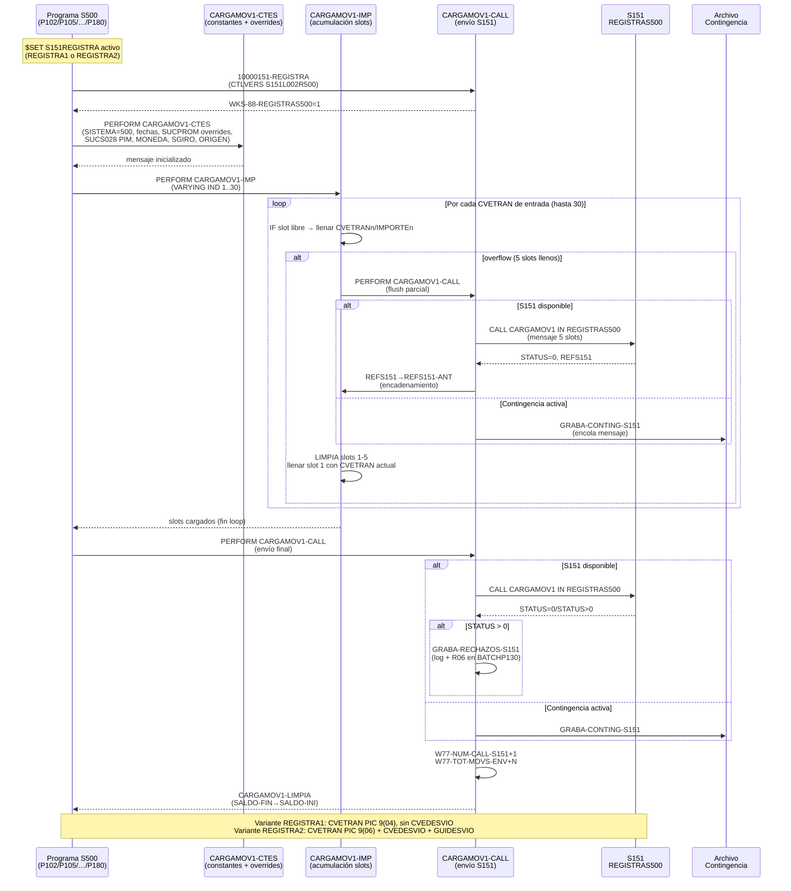

# BC-12 · Reconciliación Operacional
> Dominio: 6 · Common Services · Capacidad: **6.7.2 Operational Reconciliation**
> Cobertura: S500+S151 · Mecanismo: **S151REGISTRA** (flag de compilación condicional)
> Variantes: REGISTRA1 (CVETRAN 4 dígitos) · REGISTRA2 (CVETRAN 6 dígitos + CVEDESVIO)
> Reglas vinculadas: RN-S500-721..765 · RN-S151-181..185 · RN-S151-617..624 · RN-S151-720..732 · RN-S151-735..749 (86 reglas · trazabilidad automática 2026-07-27)
> Jerarquía: **N1** Dominio 6 · Common Services → **N2** Subdominio Reconciliations → **N3** Capacidad 6.7.2 Operational Reconciliation → **N4-5** Procesos/Flujo de tareas (ver Inventario de Tareas) → **N6** Reglas (ver Reglas vinculadas)
> Indexado: ✅ 2026-07-27 — correlacionado vocab↔reglas↔capacidad (build-traceability.py)
> Programas activadores: 15 unidades de compilación S500 (P102/P105/P107/P110/P120/P127/P130/P131/P142/P144/P168/P178/P180 + 2 includes canónicos) · S500/P186 (Cuenta Global + Tarjetas · RN-S500-725..729 · validado Mario SME S500 · 2026-07-22)
> bian_ref: 6.7.2 Operational Reconciliation

---

## Contexto funcional

`S151REGISTRA` **no es un archivo fuente independiente**: es un flag de compilación condicional de Unisys ClearPath MCP COBOL. Cuando un programa S500 declara `$SET S151REGISTRA`, el preprocessor activa los bloques delimitados por `$SET OMIT = NOT S151REGISTRA` / `$POP OMIT` en dos includes canónicos compartidos por todos los programas S500:

- **`S500_INC_WOR_CAN.txt`** — define la estructura `WS-S151-0101-MOVIMIENTOS` (~230 campos) y los contadores de monitoreo de llamadas.
- **`S500_INC_PRO_CAN.txt`** — implementa los 6 párrafos COBOL de la interfaz CARGAMOV1: `20000151-CARGAMOV1`, `20000151-CARGAMOV1-CALL`, `20000151-CARGAMOV1-IMP`, `20000151-CARGAMOV1-CTES`, `20000151-CARGAMOV1-INI`, `20000151-CARGAMOV1-LIMPIA`.

La librería objeto S151 a la que se conecta es: `(S151)S151/OBJECT/L002/REGISTRAS500`, entrypoint `CARGAMOV1 IN REGISTRAS500`.

**Función de negocio:** toda la contabilidad de cargos y abonos de captación S500 pasa por este mecanismo. Cada movimiento que impacta el saldo de una cuenta genera uno o más registros contables en el GL S151 mediante la función REGMOV (función 1 de CARGAMOV1). La capacidad ORC garantiza que S500 y S151 mantengan consistencia transaccional: todo movimiento aplicado en S500 tiene un asiento correspondiente en S151, y todo rechazo o contingencia queda registrado para reproceso.

**Diferenciador crítico — dos variantes de compilación:**

| Variante | Flag | CVETRAN | IMPORTE | Campos adicionales |
|----------|------|---------|---------|-------------------|
| REGISTRA1 | `$SET S151REGISTRA1` | `PIC 9(04) COMP` | `PIC 9(14)V99 COMP` | — |
| REGISTRA2 | `$SET S151REGISTRA2` | `PIC 9(06) COMP` | `PIC 9(16)V99 COMP` | CVEDESVIO + GUIDESVIO |

Los programas compilados con REGISTRA1 no pueden enviar CVETRANs > 9999 a S151 — si S151 amplía el catálogo de conceptos a 6 dígitos, todos los programas REGISTRA1 requieren recompilación. Esta diferencia estructural en el mensaje es el **riesgo de equivalencia máximo** de la capacidad ORC.

---

## Inventario de Tareas

| ID | Tarea | Programa / Componente | Tipo |
|----|-------|-----------------------|------|
| T-ORC-001 | Validar versión de librería REGISTRAS500 (CTLVERS S151L002R500) — marcar `WKS-88-REGISTRAS500=1` | `S500_INC_PRO_CAN.txt` — `10000151-REGISTRA` | control |
| T-ORC-002 | Inicializar constantes del mensaje S151: SISTEMA=500, fechas, CUENTA, SALDO-INI, IND-EDOCTA, IND-DATOS-ADIC | `S500_INC_PRO_CAN.txt` — `20000151-CARGAMOV1-CTES` | control |
| T-ORC-003 | Aplicar overrides de SUCPROM por CVETRAN (4159/4160→342; 4449→859; 2136/2137/2138→SUCTRAN) | `S500_INC_PRO_CAN.txt` — `20000151-CARGAMOV1-CTES` | contable |
| T-ORC-004 | Aplicar overrides de SUCS028/CAJS028 por perfil PIM y CVETRAN (3002/4001/3018/4016/3027/3047/1153) | `S500_INC_PRO_CAN.txt` — `20000151-CARGAMOV1-CTES` | contable |
| T-ORC-005 | Asignar código de moneda (MONEDA=1 para pesos MXN) por CVETRAN específico | `S500_INC_PRO_CAN.txt` — `20000151-CARGAMOV1-CTES` | contable |
| T-ORC-006 | Clasificar sobregiro (SGIRO=0/1/2) y tipo de proceso (TIPO-PROC=1/10/20) | `S500_INC_WOR_CAN.txt` + programa llamador | validación |
| T-ORC-007 | Clasificar origen de operación (ORIGEN=1 local / 2 foráneo-enviado / 3 foráneo-recibido) | `S500_INC_WOR_CAN.txt` + programa llamador | validación |
| T-ORC-008 | Acumular CVETRANs de entrada en slots 1..5 del mensaje (loop hasta 30 entradas, WS-S151-IND) | `S500_INC_PRO_CAN.txt` — `20000151-CARGAMOV1-IMP` | contable |
| T-ORC-009 | Propagar leyenda de clave principal a claves adicionales de corresponsales (CVETRAN 1119/1120/2200) | `S500_INC_PRO_CAN.txt` — `20000151-CLAVES-CORRESP` | escritura |
| T-ORC-010 | Auto-flush al overflow: enviar mensaje parcial (slots 1-5 llenos) y encadenar con REFS151-ANT | `S500_INC_PRO_CAN.txt` — `20000151-CARGAMOV1-IMP` rama ELSE | contable |
| T-ORC-011 | Llamar `CARGAMOV1 IN REGISTRAS500` con el mensaje acumulado (modo LINEA online) | `S500_INC_PRO_CAN.txt` — `20000151-CARGAMOV1-CALL` | escritura |
| T-ORC-012 | Modo contingencia: encolar mensaje en archivo cuando `WS-88-EN-CONTINGENCIA-S151=TRUE` | `S500_INC_PRO_CAN.txt` — `00000000-GRABA-CONTING-S151` | control |
| T-ORC-013 | Manejar rechazo STATUS > 0: grabar log de rechazos; en modo BATCHP130 escribir al R06 | `S500_INC_PRO_CAN.txt` — post-CALL + `60613000-ESC-MENSAJES` | control |
| T-ORC-014 | Limpiar slots de CVETRANs y actualizar SALDO-FIN → SALDO-INI del siguiente ciclo | `S500_INC_PRO_CAN.txt` — `20000151-CARGAMOV1-LIMPIA` | control |
| T-ORC-015 | Actualizar contadores de monitoreo (W77-NUM-CALL-S151, W77-TOT-MOVS-ENV, W77-NUM-MOVS-ENV) | `S500_INC_PRO_CAN.txt` — `20000151-CARGAMOV1-CALL` + `CARGAMOV1-IMP` | control |

---

## Casuísticas

### CS-ORC-01: REGISTRA1 — programa compilado con CVETRAN 4 dígitos (happy path)
**Tipo:** happy-path · variante de compilación estándar
**Flag de compilación:** `$SET S151REGISTRA1`
**Condición de entrada:** Programa S500 activa S151REGISTRA1; el movimiento genera 1 CVETRAN de 4 dígitos (≤9999); S151 disponible; sin contingencia
**Resultado:** 1 asiento en S151 con CVETRAN de 4 dígitos, IMPORTE en PIC 9(14)V99; STATUS=0 retornado; contadores incrementados
**Secuencia:**
```
T-ORC-001 (valida versión librería)
→ T-ORC-002 (carga constantes CTES)
→ T-ORC-003 (evalúa overrides SUCPROM — no aplica para este CVETRAN)
→ T-ORC-004 (evalúa overrides SUCS028 — no aplica)
→ T-ORC-005 (asigna MONEDA según CVETRAN)
→ T-ORC-006 (clasifica SGIRO)
→ T-ORC-007 (clasifica ORIGEN)
→ T-ORC-008 (llena slot CVETRAN1; WS-S151-IND=1; siguiente entrada=0 → WS-S151-SW=1)
→ T-ORC-011 (CALL CARGAMOV1 IN REGISTRAS500 → STATUS=0)
→ T-ORC-015 (W77-NUM-CALL-S151+1; W77-TOT-MOVS-ENV+1)
→ T-ORC-014 (limpia slots; SALDO-FIN→SALDO-INI)
```
**Diferencia REGISTRA1:** CVETRAN1 es `PIC 9(04) COMP` — catálogo S151 limitado a 4 dígitos; sin CVEDESVIO/GUIDESVIO

---

### CS-ORC-02: REGISTRA2 — programa compilado con CVETRAN 6 dígitos + CVEDESVIO (happy path ampliado)
**Tipo:** happy-path · variante de compilación extendida
**Flag de compilación:** `$SET S151REGISTRA2`
**Condición de entrada:** Programa S500 activa S151REGISTRA2; movimiento genera CVETRAN de 6 dígitos (puede ser >9999); S151 disponible; la operación tiene clave de desvío contable (CVEDESVIO > 0)
**Resultado:** 1 asiento en S151 con CVETRAN de 6 dígitos, IMPORTE en PIC 9(16)V99, CVEDESVIO y GUIDESVIO popolados; STATUS=0; asiento contable con mayor precisión de importe y catálogo ampliado
**Secuencia:**
```
T-ORC-001 (valida versión librería)
→ T-ORC-002 (carga constantes CTES — estructura Format2 activada)
→ T-ORC-003 → T-ORC-004 → T-ORC-005 → T-ORC-006 → T-ORC-007
→ T-ORC-008 (llena slot CVETRAN1 de 6 dígitos + CVEDESVIO1 + GUIDESVIO1)
→ T-ORC-011 (CALL CARGAMOV1 → STATUS=0)
→ T-ORC-015 → T-ORC-014
```
**Diferencia REGISTRA2:** CVETRAN1 es `PIC 9(06) COMP` — soporta catálogo extendido; IMPORTE `PIC 9(16)V99` para mayor capacidad; CVEDESVIO/GUIDESVIO adicionales (solo Format2)

---

### CS-ORC-03: Flag S151REGISTRA ausente — programa no registra a S151
**Tipo:** exclusión de capacidad
**Flag de compilación:** sin `$SET S151REGISTRA`
**Condición de entrada:** Programa S500 no declara el flag; los bloques `$SET OMIT = NOT S151REGISTRA` permanecen inactivos; `WS-S151-0101-MOVIMIENTOS` no existe en Working Storage de ese programa
**Resultado:** El programa S500 ejecuta sin interfaz S151. No se generan asientos GL para los movimientos de este programa. No hay errores de compilación — el código condicional simplemente no se incluye.
**Implicación de migración:** En el target modernizado, si un programa equivalente omite la integración al GL, los movimientos quedan sin asiento — brecha contable sin señal de error. El inventario de los 15 programas activadores es la lista exhaustiva que debe replicarse.

---

### CS-ORC-04: Modo contingencia S151 — S151 no disponible (online)
**Tipo:** error-recovery
**Condición de entrada:** Modo LINEA (transaccional online); `WS-88-EN-CONTINGENCIA-S151=TRUE` (S151 no responde); movimiento válido acumulado en mensaje
**Resultado:** El mensaje NO se envía a S151; se encola en archivo de contingencia (`00000000-GRABA-CONTING-S151`); el movimiento queda aplicado en S500 sin asiento GL — brecha contable temporal. El reproceso es **manual y operativo**, no automático.
**Secuencia:**
```
T-ORC-008 (acumula CVETRAN en mensaje)
→ T-ORC-011 intento de CALL bloqueado por WS-88-EN-CONTINGENCIA-S151=TRUE
→ T-ORC-012 (graba en archivo de contingencia — sin llamar CARGAMOV1)
[Fuera de scope de S500: operaciones reprocesa el archivo antes del cierre contable del día]
```
**Restricción:** El modo contingencia solo existe en la ruta LINEA. El batch no tiene contingencia S151 documentada.

---

### CS-ORC-05: Auto-flush por overflow — movimiento con más de 5 CVETRANs
**Tipo:** happy-path (caso de volumen)
**Condición de entrada:** Un movimiento S500 genera N CVETRANs donde N > 5 (ejemplo: cargo con comisión, IVA, intereses, penalización y fondo = 5; más un cargo adicional = 6)
**Resultado:** Se generan 2 mensajes enlazados a S151 (asientos S151-A y S151-B), ligados por `WS-S151-0101-REFS151-ANT`. S151 sabe que ambos pertenecen al mismo movimiento de negocio por el campo de encadenamiento.
**Secuencia:**
```
T-ORC-008 (llena slots 1..5 — overflow detectado en slot 6)
→ T-ORC-010 (auto-flush: CALL CARGAMOV1 con slots 1-5 → STATUS=0 → S151 retorna REFS151)
  → copiar REFS151 a REFS151-ANT (encadenamiento)
  → T-ORC-014 (limpia slots 1-5)
  → llenar CVETRAN1 con el CVETRAN6 que no cupó
→ T-ORC-015 (contadores: +1 llamada, +5 CVETRANs)
→ [continúa con el loop para CVETRANs 7..N]
→ T-ORC-011 (CALL CARGAMOV1 con slots restantes, REFS151-ANT popolado)
→ T-ORC-015 → T-ORC-014
```
**Riesgo crítico:** Si el target no implementa el campo REFS151-ANT y el mecanismo de encadenamiento, los 2 asientos GL quedan "huérfanos" — S151 no puede asociarlos al mismo movimiento S500. Esto produce discrepancias en la conciliación y reportes CNBV.

---

## Diagrama



---

## Reglas vinculadas

| Tarea | Regla | Componente fuente | Descripción |
|-------|-------|-------------------|-------------|
| T-ORC-001 | RN-S500-153 | `S500_INC_PRO_CAN.txt` — `10000151-REGISTRA` | Validación de versión de librería S151 (CTLVERS S151L002R500); continúa aunque CVEERROR≠0 |
| T-ORC-002 | RN-S500-154 | `S500_INC_WOR_CAN.txt` | Contrato de interfaz CARGAMOV1 — 8 funciones: REGMOV(1), ELIMOV(2), INICIO(11), FIN(12), ELIPASO(21), ELIAUT(22), BLO50(31), BLO01(32) |
| T-ORC-002 | RN-S500-155 | `S500_INC_WOR_CAN.txt` — líneas 4312–4629+ | Dos formatos del mensaje: REGISTRA1 (CVETRAN 4 dígitos) vs REGISTRA2 (CVETRAN 6 dígitos + CVEDESVIO) |
| T-ORC-002 | RN-S500-161 | `S500_INC_PRO_CAN.txt` — `CARGAMOV1-CTES` línea 3300 | IND-DATOS-ADIC siempre = 1 (hardcode de performance; genera trabajo extra en S151) |
| T-ORC-002 | RN-S500-160 | `S500_INC_PRO_CAN.txt` — `CARGAMOV1-CTES` líneas 3288–3292 | IND-EDOCTA: instrumento 6 de producto 500 excluye estado de cuenta (IND-EDOCTA=0); resto = 1 |
| T-ORC-003 | RN-S500-162 | `S500_INC_PRO_CAN.txt` — `CARGAMOV1-CTES` líneas 3388–3389 | SUCPROM override CVETRANs 4159/4160 → 342 (discrepancia: comentario dice 350, código mueve 342) |
| T-ORC-003 | RN-S500-163 | `S500_INC_PRO_CAN.txt` — `CARGAMOV1-CTES` líneas 3399–3408 | SUCPROM/SUCTRAN/SUCS028 override CVETRAN 4449/ACNOMINAPORTA → suc859, caj40 (SPEI, CUT 2018) |
| T-ORC-003 | RN-S500-164 | `S500_INC_PRO_CAN.txt` — `CARGAMOV1-CTES` líneas 3395–3396 | SUCPROM override CVETRANs 2136/2137/2138 → SUCTRAN (P&L a sucursal operadora, no promotora) |
| T-ORC-004 | RN-S500-165 | `S500_INC_PRO_CAN.txt` — `CARGAMOV1-CTES` líneas 3413–3444 | SUCS028/CAJS028 hardcode por perfil PIM: CVETRANs 3002/4001/3018/4016; PIM→caj94, no-PIM→caj79; NODORI=10→suc907, resto→suc904 |
| T-ORC-004 | RN-S500-166 | `S500_INC_PRO_CAN.txt` — `CARGAMOV1-CTES` líneas 3446–3451 | SUCS028 hardcode CVETRAN 3027: cajero 55; NODORI=10→907, resto→904 |
| T-ORC-004 | RN-S500-167 | `S500_INC_PRO_CAN.txt` — `CARGAMOV1-CTES` líneas 3453–3467 | SUCS028 hardcode CVETRANs 3047 (caj92, suc342) y 1153+BIN554492 (caj60, suc7532) |
| T-ORC-005 | RN-S500-168 | `S500_INC_PRO_CAN.txt` — `CARGAMOV1-CTES` líneas 3481–3495 | MONEDA=1 (MXN) para CVETRANs 13/14 + WS-CVE-DDISPNOEFECMN/RNEGAFILMN/RDISPEFECAJMN/RDISPEFEREDMN |
| T-ORC-006 | RN-S500-169 | `S500_INC_WOR_CAN.txt` — campo 88 | SGIRO: 0=no sobregiro, 1=línea vigente, 2=línea vencida (impacto IFRS 9 en provisiones) |
| T-ORC-007 | RN-S500-170 | `S500_INC_WOR_CAN.txt` — campos 88 ORIGEN | ORIGEN: 1=local, 2=foráneo enviado, 3=foráneo recibido (diferenciador para conciliación interbancaria) |
| T-ORC-008 | RN-S500-156 | `S500_INC_PRO_CAN.txt` — `CARGAMOV1-IMP` líneas 4152–4253 | Acumulación de hasta 5 CVETRANs por mensaje (loop 30 entradas; slots 1→2→3→4→5) |
| T-ORC-009 | RN-S500-171 | `S500_INC_PRO_CAN.txt` — `CLAVES-CORRESP` líneas 4260–4267 | Propagación de LEYENDA/INDLEY de clave principal a claves adicionales de corresponsales (CVETRAN 1119/1120/2200 → 1121/2200/2201) |
| T-ORC-010 | RN-S500-157 | `S500_INC_PRO_CAN.txt` — `CARGAMOV1-IMP` rama ELSE líneas 4237–4252 | Auto-flush al overflow: CALL parcial (slots 1-5); REFS151→REFS151-ANT; llenar slot 1 con CVETRAN desbordado |
| T-ORC-011 | RN-S500-158 | `S500_INC_PRO_CAN.txt` — `CARGAMOV1-CALL` líneas 3832–3852 | Modo contingencia S151: si WS-88-EN-CONTINGENCIA-S151=TRUE, encolar en archivo; solo en modo LINEA |
| T-ORC-013 | RN-S500-159 | `S500_INC_PRO_CAN.txt` — post-CALL líneas 3857–3891 | Manejo de rechazos STATUS > 0: log de rechazos; en BATCHP130 también escribe al R06 (5 CVETRANs e importes) |
| T-ORC-015 | RN-S500-172 | `S500_INC_WOR_CAN.txt` líneas 4242–4248 + `CARGAMOV1-CALL` | Contadores de monitoreo: W77-NUM-CALL-S151 (6 dígitos), W77-TOT-MOVS-ENV (8 dígitos), W77-NUM-MOVS-ENV (2 dígitos) |

---

## Hallazgos de migración

| Riesgo | Tarea | Regla | Severidad | Acción requerida |
|--------|-------|-------|-----------|-----------------|
| **Incompatibilidad de formato REGISTRA1 vs REGISTRA2**: CVETRAN de 4 vs 6 dígitos y IMPORTE de tamaño diferente. Si el target unifica en un solo formato, los programas que aún usan REGISTRA1 recibirían respuestas incorrectas de S151. | T-ORC-008, T-ORC-010, T-ORC-011 | RN-S500-155 | 🔴 CRÍTICO | Inventariar cuál de los 15 programas usa REGISTRA1 vs REGISTRA2. El target debe soportar ambas variantes o forzar migración total a REGISTRA2 con validación de todos los CVETRANs afectados |
| **Encadenamiento de asientos por overflow (REFS151-ANT)**: si el target no implementa este campo, movimientos con > 5 CVETRANs generan asientos GL huérfanos — discrepancia de reconciliación auditable por CNBV. | T-ORC-010 | RN-S500-157 | 🔴 CRÍTICO | Implementar campo de encadenamiento equivalente a REFS151-ANT en el GL target; validar con casos de movimientos que históricamente generaron overflow |
| **Discrepancia SUCPROM 342 vs 350**: el comentario en el código dice "sucursal 350" pero el valor hardcodeado es "342". Puede ser un bug latente que afecta la imputación de P&L en el GL. | T-ORC-003 | RN-S500-162 | 🟠 ALTO | Validar con SME de operaciones y catálogo B17 cuál es el valor correcto; si es bug, corregirlo en el target (no replicar el bug) |
| **Modo contingencia sin reproceso automático**: los mensajes encolados en archivo de contingencia requieren reproceso **manual** antes del cierre contable del día. Sin mecanismo automático, un operador olvidado genera brecha contable. | T-ORC-012 | RN-S500-158 | 🟠 ALTO | El target debe incluir un proceso automático de reproceso de contingencia con ventana de tiempo definida y alerting; no replicar el mecanismo manual |
| **Validación de versión de librería continúa en error**: si CTLVERS falla (CVEERROR≠0), el programa no termina — puede operar con una versión incompatible de S151. | T-ORC-001 | RN-S500-153 | 🟠 ALTO | En el target, un desajuste de versión de interfaz GL debe ser error fatal — el programa debe terminar con código de error si la versión no es compatible |
| **Rechazo de S151 no revierte S500**: un movimiento rechazado por S151 queda aplicado en S500 sin asiento GL — brecha contable que solo se detecta en el log de rechazos (no en S500). | T-ORC-013 | RN-S500-159 | 🟠 ALTO | El target debe implementar compensación transaccional: si el GL rechaza, el movimiento en captación debe revertirse automáticamente o quedar en estado "pendiente de reconciliación" con alerting |
| **Campo CVEDESVIO solo en REGISTRA2**: los programas compilados con REGISTRA1 no envían CVEDESVIO a S151. Si la regulación exige este campo para todos los movimientos, los programas REGISTRA1 están incompletos. | T-ORC-008 | RN-S500-155 | 🟠 ALTO | Confirmar con el equipo GL de Banamex si todos los asientos deben llevar CVEDESVIO en el sistema target; si sí, migrar todos los programas a REGISTRA2 |
| **Perfiles PIM hardcoded (10+ flags 88)**: cada nuevo perfil PIM requiere agregar un nuevo flag 88 en el include y recompilar los 15 programas. La lógica PIM no es parametrizable en el sistema actual. | T-ORC-004 | RN-S500-165 | 🟡 MEDIO | En el target, los perfiles PIM deben ser parametrizables desde catálogo (no compilación); verificar con el equipo de captación premium la lista completa de perfiles actuales |
| **SUCPROM override SPEI hardcoded (suc859, caj40)**: si Banamex reorganiza sus puntos de acceso SPEI o modifica los códigos de sucursal/cajero, requiere recompilación. | T-ORC-003 | RN-S500-163 | 🟡 MEDIO | Externalizar como parámetro de configuración en el target; coordinar con el equipo de pagos SPEI (impacto CUT 2018) |
| **ORIGEN no propagado correctamente puede generar movimientos foráneos registrados como locales**: si el programa llamador no setea ORIGEN antes de invocar CARGAMOV1, el campo queda en 0 — sin clasificación. | T-ORC-007 | RN-S500-170 | 🟡 MEDIO | En el target, ORIGEN debe ser campo obligatorio con validación antes del envío al GL; error si ORIGEN=0 en movimientos interbancarios |
| **IND-DATOS-ADIC siempre=1 genera trabajo extra en S151**: la intención original era optimización de performance, pero el efecto es el contrario — S151 siempre procesa el bloque de datos adicionales aunque esté vacío. | T-ORC-002 | RN-S500-161 | 🟢 BAJO | En el target, parametrizar este indicador correctamente según si el mensaje lleva datos adicionales reales; no replicar el hardcode |
| **Límite W77-NUM-MOVS-ENV PIC 9(02)**: se desborda si un solo movimiento genera más de 99 CVETRANs (prácticamente imposible con el límite de 30 entradas y 5 salidas). | T-ORC-015 | RN-S500-172 | 🟢 BAJO | En el target, usar tipo de dato más amplio (int32) para todos los contadores; monitorear volumetría en producción |

---

---

## Nota: ORC no es job WFL — opera vía COPY books COBOL

[CORRECCIÓN 2026-07-21 · evidencia: auditoría WFL LOTE `S500_WFL_REORG_GARBAGE_S500BD04TARJETAS.txt`]

La capacidad ORC (S500/INC) **no se invoca como `RUN` desde WFL LOTE**. Opera como mecanismo de inclusión COBOL: los archivos `S500/INC/PRO/...` y `S500/INC/WOR/...` son COPY books compilados dentro de P010, P015, P020, P100, P102 y otros programas online. La llamada `CALL CARGAMOV1 IN REGISTRAS500` ocurre en tiempo de ejecución de esos programas, no desde el orquestador WFL.

Lo que WFL LOTE sí hace cuando un paso batch falla es invocar la subrutina `AVISOINC`, que mapea `IDFALLAPASO` a un mensaje de texto para la consola de operaciones. La sentencia `S500INCIDENTEBT` (parámetro de notificación P101) aparece únicamente en líneas comentadas (`%` / `%%`) del WFL LOTE y no se ejecuta activamente.

El campo "fuente" de T-WFL-015 en cap-wfl.md fue corregido de `S500_WFL_LOTE.txt` a `S500_WFL_REORG_GARBAGE_S500BD04TARJETAS.txt`, y su descripción actualizada para reflejar el rol real de `AVISOINC`.

*cap-orc.md · v1.1 · 2026-07-21*
*Capacidad: 6.7.2 Operational Reconciliation · Sistema: S500+S151 · S151REGISTRA (15 programas)*
*Cross-referencia: RN-S500-153..172 · rules-s500-s151registra-p103fraude.md · capability-map.md*

---

## Ampliación — P021 Cierre S500 (RN-S151-181..185) — ⚠️ ALGOL

> ⚠️ ALGOL ClearPath MCP — NO transpilable; requiere reescritura completa.
> Envía HI (Halt/Initialize) a pasos 9, 12 y 2 de S500 en doble ciclo (antes y después de WAIT 5 min).
> Invocado desde WFL_LOTE paso 54 vía SUB021. Dependencias de runtime: CTLVERS (DAME_TIT) + S151L001 (B05PROCESOS + DCKEYIN).

### Inventario de Tareas adicionales

| ID | Nombre | Programa | Tipo | Complejidad | Riesgo migración |
|----|--------|----------|------|-------------|------------------|
| T-ORC-016 | Cargar librerías ALGOL runtime: CTLVERS + S151L001 en tiempo de ejecución | P021 | BATCH | BAJA (lógica) / MUY ALTA (lenguaje) | CRÍTICA |
| T-ORC-017 | Ejecutar primer ciclo APLICA_HI — pasos 9, 12, 2 de S500 vía B05PROCESOS + DCKEYIN | P021 | BATCH | BAJA (lógica) / MUY ALTA (lenguaje) | CRÍTICA |
| T-ORC-018 | WAIT(300) — sleep incondicional 5 minutos entre ciclos sin verificación de estado S500 | P021 | BATCH | BAJA | ALTA |
| T-ORC-019 | Ejecutar segundo ciclo APLICA_HI — pasos 9, 12, 2 sin validación de éxito del ciclo anterior | P021 | BATCH | BAJA (lógica) / MUY ALTA (lenguaje) | CRÍTICA |

### Reglas de negocio vinculadas

| ID regla | Enunciado breve | Programa | Criticidad |
|----------|----------------|----------|-----------|
| RN-S151-181 | P021 es ALGOL — no transpilable; reescritura completa obligatoria; ningún transpiler COBOL→Java lo procesa | P021 | CRÍTICA |
| RN-S151-182 | Control de cierre S500: envía HI a pasos 9, 12 y 2 en orden exacto vía B05PROCESOS (obtiene Mix ID) + DCKEYIN | P021 | ALTA |
| RN-S151-183 | WAIT(300): sleep hardcodeado 5 minutos — ciego, sin polling ni verificación de respuesta de S500 | P021 | ALTA |
| RN-S151-184 | Doble ciclo APLICA_HI sin validación de éxito intermedio — S500 puede quedar en estado indeterminado si el primer ciclo falla parcialmente | P021 | ALTA |
| RN-S151-185 | Dependencias ALGOL de runtime: CTLVERS (función DAME_TIT) + S151L001 (función B05PROCESOS, 3.1K LOC) — sin equivalente cloud | P021 | CRÍTICA |

### Hallazgos de migración P021

| # | Hallazgo | Tipo | Impacto | Recomendación |
|---|---------|------|---------|---------------|
| ORC-P021-H01 | ALGOL puro — no transpilable; lógica funcional simple (~100 LOC) pero lenguaje totalmente incompatible con tooling de transpilación | Lenguaje legacy | CRITICAL | Reescribir como job step en orquestador moderno (Airflow, Temporal o Step Functions); la lógica equivalente es un loop de señalización con retry |
| ORC-P021-H02 | DCKEYIN es primitiva MCP de consola de operador — sin equivalente cloud ni en Linux | Vendor lock-in | CRITICAL | Reemplazar por API de control de procesos del orquestador target; documentar el protocolo de señalización HI hacia S500 modernizado |
| ORC-P021-H03 | S151L001 (B05PROCESOS, 3.1K LOC ALGOL) debe analizarse como componente independiente antes de migrar P021 — gestiona el estado de todos los pasos de S500 | Dependencia técnica | CRITICAL | Inventariar todas las funciones de S151L001; crear equivalentes como servicio de estado de proceso (Redis, BD de estado o motor de orquestación) |
| ORC-P021-H04 | WAIT(300) hardcodeado — sleep incondicional de 5 minutos viola arquitectura reactiva cloud y bloquea threads | Hardcode | HIGH | Reemplazar por espera activa (poll de estado de S500) con timeout configurable; parametrizar el valor 300 como variable de entorno |
| ORC-P021-H05 | Pasos S500 (9, 12, 2) hardcodeados — si S500 cambia su estructura de pasos, P021 falla silenciosamente sin error | Hardcode | HIGH | Externalizar números de paso como parámetro de configuración; documentar dependencia de secuencia (9 antes de 12 antes de 2) con el equipo S500 |

---

## Ampliación — P602+P620+P630 Control de Estado y Directorio (RN-S151-551..560, RN-S151-571..590)

> P602: semáforo de habilitación de procesamiento vía LIBCTL/B04SISTEM (gate F01+F37).
> P620: alta/baja del directorio interno de archivos batch (operación atómica sobre archivo plano).
> P630: consulta/actualización de fecha de header en archivos de movimientos por sistema (MOV/DES/CB2/CTD).

### Inventario de Tareas adicionales

| ID | Nombre | Programa | Tipo | Complejidad | Riesgo migración |
|----|--------|----------|------|-------------|------------------|
| T-ORC-020 | Resolver LIBCTL dinámicamente vía CTLVERS (S151L001CTL); fallback hardcodeado ON CMEMP si falla | P602 | BATCH/CONTROL | MEDIA | ALTA |
| T-ORC-021 | Gate F01+F37: consultar B04SISTEM y actualizar ESTATUS con PARAM-SISTEMA/PARAM-ESTATUS recibidos del WFL | P602 | BATCH/CONTROL | MEDIA | ALTA |
| T-ORC-022 | Alta/Baja de directorio S151 (OPCION A/B, validación profundidad >2 slashes, tope retención 4 días, deduplicación DIR+PACK+CSI) | P620 | BATCH/CONTROL | MEDIA | MEDIA |
| T-ORC-023 | Consulta (FILE="CON") o Actualización de fecha header (REWRITE "HD") en archivos MOV/DES/CB2/CTD del sistema indicado | P630 | BATCH/CONTROL | MEDIA | ALTA |

### Reglas de negocio vinculadas

| ID regla | Enunciado breve | Programa | Criticidad |
|----------|----------------|----------|-----------|
| RN-S151-551 | Gate de dos fases: F01 (consulta) requerida antes de F37 (cambio) en B04SISTEM — ambos errores son no-fatales | P602 | ALTA |
| RN-S151-552 | Resolución dinámica de LIBCTL vía CTLVERS (S151L001CTL) — CHANGE ATTRIBUTE TITLE dinámico | P602 | ALTA |
| RN-S151-553 | Fallback hardcodeado: "(S151)S151/OBJECT/L001/CONTROL  ON CMEMP" — dos espacios entre "L001" y "ON" | P602 | MEDIA |
| RN-S151-554 | PARAM-SISTEMA (9(03)) y PARAM-ESTATUS (9(02)) como interfaz externa de control del ciclo de vida — sin validación interna | P602 | ALTA |
| RN-S151-555 | Error en consulta/actualización B04 es no-fatal: solo log vía LIB-DISP; estado de B04SISTEM puede quedar desfasado | P602 | ALTA |
| RN-S151-558 | ESTATUS en B04SISTEM como semáforo de habilitación: 2=en proceso, 3=cierre iniciado, 4=cierre completo (relevante CNBV) | P602 | ALTA |
| RN-S151-560 | S151L001CTL es la librería de control central con fan-in alto: P602, P610, P630, P655 — punto único de falla del sistema | P602 | CRÍTICA |
| RN-S151-571 | Alta/Baja exclusivos OPCION A/B; error de parámetro termina con STOP RUN pero sin STATUS=-1 — invisible al JCL | P620 | MEDIA |
| RN-S151-573 | Retención máx 4 días hardcodeada en PARAM-DIA — truncado si excede; no parametrizable sin recompilación | P620 | MEDIA |
| RN-S151-574 | Prevención de duplicados: inserción rechazada si DIR+PACK+CSI ya existe en el directorio | P620 | MEDIA |
| RN-S151-577 | Operación atómica: lectura → copia TEMP (SAVE) → reemplazo original (PURGE+RENAME); sin rollback si falla a mitad | P620 | ALTA |
| RN-S151-581 | Bifurcación FILE="CON" (consulta de fechas) vs actualización de header por tipo (MOV/DES/CB2/CTD) | P630 | ALTA |
| RN-S151-583 | Conversión fecha 6→8 dígitos: ADD 20000000 — asume siglo XXI; sin soporte para fechas pre-2000 | P630 | ALTA |
| RN-S151-584 | Header del archivo de movimiento identificado por "HD" en primeros 2 bytes del registro de 450 bytes | P630 | ALTA |
| RN-S151-586 | B01SISDIA F1 como fuente de verdad de pack y fecha; fallo en P630 → STATUS=-1 (fatal, a diferencia de P602) | P630 | ALTA |
| RN-S151-587 | CLOSE WITH SAVE/RELEASE/PURGE — semántica de persistencia MCP sin equivalente directo en Java; riesgo de transpilación incorrecta | P630 | CRÍTICA |
| RN-S151-590 | WKS-SISTEMA=500 hardcodeado para activar archivos CB2/CTD (exclusivos S500) — patrón distribuido en múltiples programas P600 | P630 | MEDIA |

### Hallazgos de migración P602+P620+P630

| # | Hallazgo | Tipo | Impacto | Recomendación |
|---|---------|------|---------|---------------|
| ORC-P602-H01 | CHANGE ATTRIBUTE TITLE/BYFUNCTION — mecanismo MCP de resolución dinámica de librerías sin equivalente Java | Vendor lock-in | HIGH | Reemplazar con lookup de configuración en servicio de catálogo (ConfigMap, Consul, AppConfig); la ruta física de LIBCTL se convierte en URL de servicio |
| ORC-P602-H02 | Errores de B04SISTEM son no-fatales — el semáforo de estado puede quedar inconsistente sin ninguna alerta al caller | Control de estado | HIGH | En el target, los errores de escritura en el semáforo de estado deben ser fatales con alerting P1; el estado inconsistente de B04 es observable por CNBV |
| ORC-P602-H03 | S151L001CTL como hub central con fan-in en P602, P610, P630, P655 — punto único de falla del ecosistema de control | Arquitectura | CRITICAL | Diseñar el servicio equivalente como microservicio de administración de estado con HA (active-active); no replicar el monolito ALGOL |
| ORC-P620-H01 | Directorio de archivos en archivo plano secuencial sin concurrencia — operación de copia total para cada alta/baja | Persistencia | HIGH | Migrar a tabla relacional con PK(DIR, PACK, CSI), índice único y manejo de concurrencia ACID; eliminar el patrón de copia-y-reemplazo |
| ORC-P620-H02 | Retención máx 4 días hardcodeada — inflexible para fines de semana largos (3 días) y políticas regulatorias de retención extendida | Hardcode | MEDIUM | Parametrizar en configuración; validar con equipo de operaciones si la política de 4 días aplica en todos los contextos |
| ORC-P630-H01 | CLOSE WITH SAVE/RELEASE/PURGE — sin equivalente directo en Java; transpilación incorrecta produce archivos sin persistencia o sin borrado | Vendor lock-in | CRITICAL | Mapear explícitamente en el equivalence test: SAVE→COMMIT/flush, RELEASE→no-op (modo lectura), PURGE→DELETE física; documentar como ADR de equivalencia |
| ORC-P630-H02 | REWRITE de header es no-fatal (INVALID KEY solo muestra texto) — fecha del archivo puede quedar incorrecta sin señal al proceso caller | Control calidad | HIGH | En el target, actualizar metadata de lote debe ser transaccional y fatal si falla; agregar alerting con el título del archivo afectado |
| ORC-P630-H03 | CB2/CTD exclusivos S500 con código 500 hardcodeado en múltiples programas P600 — patrón distribuido, mantenimiento rígido | Hardcode | MEDIUM | Externalizar en catálogo de tipos de archivo por sistema; centralizar la regla en una sola configuración en el target |

---

## Ampliación — P655+P670+P680+P690 Ciclo de Jornada y Archivo (RN-S151-591..632)

> P655: semáforo inicio/fin jornada (FUNCION=2→ESTATUS=2 / FUNCION=3→ESTATUS=3) vía secuencia CONSISDIA→CONSISMEN→B04→MANTB04.
> P670: backup de archivos de movimientos (CLOSE WITH SAVE, rotación a nuevo archivo cada 16M líneas, CRONOS2K).
> P680: volcado de S151BD99CONTROL (6 datasets B01→B09) — único punto de restauración de emergencia; contiene BUG activo en línea 537.
> P690: cierre definitivo de movimientos FUNCION=99→FUNCION=11+STATUS=1, con AUT-S151 base-0 y FECCONT desde B01SISDIA.

### Inventario de Tareas adicionales

| ID | Nombre | Programa | Tipo | Complejidad | Riesgo migración |
|----|--------|----------|------|-------------|------------------|
| T-ORC-024 | P655 FUNCION=2: apertura de jornada — CONSISDIA→CONSISMEN→B04SISTEM(F1)→MANTB04SISTEM(F37) escribiendo ESTATUS=2 | P655 | BATCH | ALTA | ALTA |
| T-ORC-025 | P655 FUNCION=3: cierre de jornada — misma secuencia escribiendo ESTATUS=3 en B04SISTEM | P655 | BATCH | ALTA | ALTA |
| T-ORC-026 | P670: backup/archive de archivos de movimientos con CLOSE WITH SAVE, rotación automática a sufijo secuencial a las 16M líneas y CRONOS2K | P670 | BATCH | ALTA | ALTA |
| T-ORC-027 | P680: volcado S151BD99CONTROL — 6 datasets en transacción BEGIN NO-AUDIT/END AUDIT DMSII; patrón LOCK/CREATE/STORE/FREE | P680 | BATCH | ALTA | CRÍTICA |
| T-ORC-028 | P690: cierre definitivo — recorre FUNCION=99, asigna AUT-S151 base-0, estampa FECCONT+SISTEMA, escribe FUNCION=11+STATUS=1 atómicamente | P690 | BATCH | ALTA | ALTA |

### Reglas de negocio vinculadas

| ID regla | Enunciado breve | Programa | Criticidad |
|----------|----------------|----------|-----------|
| RN-S151-591 | 7 parámetros de entrada P655: W77-FUNCION, W77-SISTEMA, W77-NOMPACMOV, W77-NOMDES, W77-NOMERR, W77-NOMSAL, W77-NOMBDSAL | P655 | ALTA |
| RN-S151-592 | Solo FUNCION=2 o 3 activa escritura en B04SISTEM; otros valores → no-op silencioso sin error al caller | P655 | ALTA |
| RN-S151-593 | Identidad función→estatus: W77-FUNCION IS el valor escrito directamente en B04-ESTATUS (sin tabla de conversión) | P655 | ALTA |
| RN-S151-594 | Secuencia obligatoria: CONSISDIA→CONSISMEN→B04SISTEM(F1 consulta)→MANTB04SISTEM(F37 cambio); romperla invalida coherencia | P655 | CRÍTICA |
| RN-S151-599 | FUNCION=2→ESTATUS=2 (habilita procesamiento batch); FUNCION=3→ESTATUS=3 (bloquea nuevas operaciones, fin de jornada) | P655 | ALTA |
| RN-S151-600 | B04SISTEM(F1 consulta) requerida antes de MANTB04SISTEM(F37); error en F1 es no-fatal — P655 continúa hacia escritura | P655 | ALTA |
| RN-S151-601 | OPCION1="INICI"+OPCION2="BACK" abre nuevo archivo backup; OPCION2="PAGE" salta página; ELSE avanza N líneas | P670 | ALTA |
| RN-S151-603 | CLOSE MOVIMIENTOS WITH SAVE por cada sección — múltiples archivos físicos producidos por ejecución de P670 | P670 | ALTA |
| RN-S151-604 | Rotación: al superar 16,000,000 líneas, abre nuevo archivo con sufijo WKS-CONT secuencial y resetea contador | P670 | ALTA |
| RN-S151-607 | CRONOS2K: A2K-BASE-YEAR=50 — AA<50→siglo=20 (XXI); AA≥50→siglo=19 (XX); en 2050 los backups se fechan incorrectamente | P670 | ALTA |
| RN-S151-617 | Volcado en orden B01→B02→B03→B04→B05→B09 — orden crítico; restaurar fuera de secuencia produce inconsistencias | P680 | CRÍTICA |
| RN-S151-619 | Transacción DMSII: BEGIN NO-AUDIT / END AUDIT S151B99REINICTL — sin rollback automático si el proceso aborta dentro del bloque | P680 | CRÍTICA |
| RN-S151-620 | Patrón LOCK/CREATE/STORE/FREE por registro en DMSII — LOCK sin timeout configurable, riesgo de espera indefinida | P680 | ALTA |
| RN-S151-621 | BUG-PRODUCCION línea 537: MOVE A03-R00-SECERRHI TO B03-SIS-SECINFHI (campo incorrecto) — corrompe backup de B03SISMEN silenciosamente en cada ejecución | P680 | CRÍTICA |
| RN-S151-623 | Loop B03SISMEN limitado a 5 ciclos (hardcode) aunque la BD declara hasta 99 — backup incompleto si hay más de 5 ciclos activos | P680 | ALTA |
| RN-S151-624 | P680 es el único punto de restauración de emergencia de S151BD99CONTROL — sin alternativa ni replicación | P680 | CRÍTICA |
| RN-S151-625 | Transición FUNCION=99 (pendiente) → FUNCION=11+STATUS=1 (cerrado) — solo registros con FUNCION=99 son tocados | P690 | ALTA |
| RN-S151-626 | Límite de procesamiento por día de semana: WKS-B01-NIVARCMOV(WKS-DIASEM) — dinámico desde B01SISDIA, varía por día | P690 | ALTA |
| RN-S151-628 | AUT-S151 = WKS-CONTADOR - 1 (numeración base-0) — primer AUT-S151 del día es 0; cambiar a base-1 rompe trazabilidad histórica | P690 | ALTA |
| RN-S151-629 | FECCONT ← WKS-B01-FECCON — fecha contable oficial del movimiento propagada desde B01SISDIA, no es la fecha física de proceso | P690 | ALTA |
| RN-S151-632 | Ruta MOVS{NNN}/{FECCON} ON {PACK} resuelta desde CONSISDIA — fallo en CONSISDIA → STATUS=-1, archivo queda con FUNCION=99 sin cerrar | P690 | ALTA |

### Hallazgos de migración P655+P670+P680+P690

| # | Hallazgo | Tipo | Impacto | Recomendación |
|---|---------|------|---------|---------------|
| ORC-P655-H01 | CONSISDIA+CONSISMEN como prerequisito del semáforo de jornada — si falla la resolución del pack, el semáforo B04 no se actualiza | Dependencia técnica | HIGH | En el target, el semáforo de inicio/fin de jornada debe desacoplarse de la resolución de packs; usar eventos del orquestador (start_of_day / end_of_day) en lugar de dependencia de LIBCTL |
| ORC-P655-H02 | Error en B04SISTEM(F1 consulta) es no-fatal en P655 — continúa hacia escritura aunque la consulta previa haya fallado | Control de estado | HIGH | En el target, la consulta previa debe ser obligatoria y fatal antes de actualizar el semáforo; escritura ciega sin lectura previa genera estados inconsistentes |
| ORC-P670-H01 | CLOSE WITH SAVE — operación Unisys MCP de persistencia de archivos físicos; sin equivalente directo en Linux/cloud | Vendor lock-in | HIGH | Reemplazar con escritura a object storage (S3/GCS/Azure Blob) con registro de metadata en tabla de auditoría; eliminar la semántica MCP de "archivo que se persiste al cerrar" |
| ORC-P670-H02 | CRONOS2K activo (A2K-BASE-YEAR=50) — en el año 2050 los backups de movimientos generados por P670 se fecharán con siglo=19 (año 1950) | Bug latente | HIGH | Migrar a java.time.LocalDate en el target; eliminar completamente el copybook CRONOS2K y su lógica de pivote de siglo |
| ORC-P670-H03 | Límite de 16M líneas por archivo hardcodeado — concepto de "archivo partido" innecesario en cloud object storage | Hardcode | MEDIUM | Eliminar la partición en el target; usar object storage sin límite de tamaño con naming por fecha/batch-id |
| ORC-P680-H01 | BUG ACTIVO en producción (RN-S151-621, línea 537): SECERRHI copiado en SECINFHI — backup de B03SISMEN incorrecto en cada ejecución diaria | Bug activo | CRITICAL | No replicar el bug en el target; corregir el campo destino a B03-SIS-SECERRHI; escalar urgentemente al equipo de producción Banamex para evaluación de impacto en datos históricos |
| ORC-P680-H02 | P680 es el único punto de restauración de S151BD99CONTROL — sin replicación, sin snapshot alternativo, sin HA | Resiliencia | CRITICAL | En el target, usar BD relacional con replicación activa-pasiva y snapshots automáticos (RDS Multi-AZ / Cloud SQL HA); P680 se vuelve obsoleto por diseño |
| ORC-P680-H03 | LOCK DMSII sin timeout — deadlock potencial si otro proceso retiene el bloqueo de un registro de BD de control | Concurrencia | HIGH | En el target, todo acceso a estado compartido debe tener timeout configurable (optimistic locking o SELECT FOR UPDATE con timeout) y retry con back-off exponencial |
| ORC-P680-H04 | Transacción NO-AUDIT durante el volcado — si el proceso aborta a mitad, no hay audit trail del estado parcial en el log DMSII | Auditoría | HIGH | En el target, cada snapshot de BD de control debe registrarse con begin/commit en tabla de auditoría con timestamp; nunca usar modo NO-AUDIT en operaciones de control |
| ORC-P690-H01 | AUT-S151 base-0 (WKS-CONTADOR - 1) — convención base-0 debe replicarse exactamente; cambiar a base-1 rompe trazabilidad de movimientos históricos | Trazabilidad | HIGH | Documentar como ADR de equivalencia; validar con SME que AUT-S151=0 es válido para el primer movimiento del día antes de migrar |
| ORC-P690-H02 | Loop UNTIL FECCON = FECARCMOV(W77-IND) sin límite de iteraciones — riesgo de loop infinito si FECCON no está en el array | Bug latente | HIGH | En el target, reemplazar el lookup lineal por una query SQL con NOT NULL check y límite de filas; agregar control de timeout y log de error si la fecha no se encuentra |
| ORC-P690-H03 | Estado final requiere FUNCION=11 Y STATUS=1 — un movimiento con FUNCION=11 pero STATUS distinto de 1 queda en estado inconsistente sin alerta | Integridad | HIGH | En el target, escribir ambos campos en una sola operación atómica (UPDATE tabla SET funcion=11, status=1 WHERE id=?); validar coherencia con constraint de BD |

---

## Ampliación — P186 Cuenta Global + Tarjetas (RN-S500-725..729)

> P186: COBOL · 10,800 LOC · Dominio CONTROL · Batch nocturno
> Mapeo validado: Mario (SME S500) · 2026-07-22
> Antes mapeado tentativamente a INT (confianza BAJA pre-reglas); confirmado ORC por Mario

### Contexto funcional P186

**P186** (COBOL, 10,800 LOC, dominio CONTROL) es el ejecutor de la etapa de dispersión del journey Art. 61 LIC (F-06). Actúa como puente **bidireccional** entre S500 y el sistema externo S274: recibe el archivo consolidado de traspasos a Cuenta Global (`I01-TRP-CTAGLB`, 140 chars), lo expande a `E02-DISP-S274` (240 chars) con campos de ruteo y control que S274 exige, y sincroniza el retorno de S274 actualizando `BD04TARJETAS` y `BD01CAPTACION`. Adicionalmente calcula tarifas de tarjeta con versionamiento IVA/UDIS cruzando `BD04TARJETAS` × `BD01CAPTACION` bajo catálogos `S100VERSIONES`, `S080TARIFAS`, `S080IVA` y `S080L700UDIS`.

La cifra de control **R01-CIFCTRL** es el gate regulatorio CNBV Art. 61: valida que el número de traspasos recibidos coincide con el número de dispersiones generadas. Una divergencia es un incidente auditable inmediato.

### Inventario de Tareas adicionales

| ID | Tarea | Programa | Tipo | Criticidad BIAN | Criticidad migración |
|----|-------|----------|------|-----------------|----------------------|
| T-ORC-029 | Calcular tarifas de tarjeta con versionamiento IVA y UDIS cruzando BD04TARJETAS × BD01CAPTACION (S100VERSIONES · S080TARIFAS · S080IVA · S080L700UDIS) | P186 | BATCH | ALTA | ALTA |
| T-ORC-030 | Recibir traspasos a Cuenta Global desde otros sistemas (I01-TRP-CTAGLB · 140 caracteres) | P186 | BATCH | ALTA | CRÍTICA |
| T-ORC-031 | Generar archivo de dispersión E02-DISP-S274 (240 caracteres) hacia sistema S274 para materializar traspasos a Cuenta Global / Cuenta de Beneficencia | P186 | BATCH | ALTA | CRÍTICA |
| T-ORC-032 | Dispersar reactivaciones a Cuenta Global por vía separada hacia S274 | P186 | BATCH | ALTA | ALTA |
| T-ORC-033 | Mantener trazabilidad de reconciliación: bitácora I06-ARCH-INCIDENTE · ligas ARCH-HLIG · cifra de control R01-CIFCTRL (recibidos vs dispersados) | P186 | BATCH | ALTA | CRÍTICA |
| T-ORC-034 | Reprocesar dispersos reactivos vía archivo S274 — actualizar BD04TARJETAS y BD01CAPTACION (puente bidireccional de retorno) | P186 | BATCH | MEDIA | ALTA |

### Reglas de negocio vinculadas

| ID regla | Enunciado breve | Criticidad |
|----------|----------------|------------|
| RN-S500-725 | Cálculo de tarifas de tarjeta con IVA y UDIS — catálogos versionados S100/S080 cruzando BD04TARJETAS × BD01CAPTACION | ALTA |
| RN-S500-726 | Recepción I01-TRP-CTAGLB (140 chars) y generación E02-DISP-S274 (240 chars) — dispersión Cuenta Global / Beneficencia hacia S274 | CRÍTICA |
| RN-S500-727 | Dispersión separada de reactivaciones a Cuenta Global — flujo paralelo al traspaso inicial | ALTA |
| RN-S500-728 | Trazabilidad: I06-ARCH-INCIDENTE + ARCH-HLIG (ligas de correspondencia) + R01-CIFCTRL (recibidos vs dispersados) | ALTA |
| RN-S500-729 | Reproceso bidireccional: recibe retorno de S274 y actualiza BD04TARJETAS + BD01CAPTACION; clave W77-KEY-I01 = último registro leído − 1 | MEDIA |

### Hallazgos de migración P186

| # | Hallazgo | Tipo | Impacto | Recomendación |
|---|---------|------|---------|---------------|
| ORC-P186-H01 | `E02-DISP-S274` es contrato de interfaz fijo de 240 chars — layout documentado solo en COBOL de P186; S274 rompe si cambia cualquier campo | Interfaz | CRÍTICO | Documentar layout campo a campo antes del cutover; versionarlo en ADR de integración con S274; contract test automatizado en CI/CD |
| ORC-P186-H02 | R01-CIFCTRL es gate regulatorio CNBV Art. 61 — si diverge entre recibidos y dispersados es incidente auditable inmediato | Regulatorio | CRÍTICO | Implementar reconciliación automática R01-CIFCTRL en el target con alerta inmediata; incluir como gate bloqueante en runbook nocturno |
| ORC-P186-H03 | P186 cruza BD04TARJETAS y BD01CAPTACION — en modernización corresponden a dos bounded contexts; si migran en waves distintas P186 queda partido entre ellos | Arquitectura | ALTO | Incluir en Wave Map como programa cross-BC; migrar junto con el wave dominante (Art. 61 → DEP) o implementar ACL transitoria |
| ORC-P186-H04 | UDIS requiere conversión de valores indexados a inflación vía S080L700UDIS — catálogo puede cambiar diariamente; en modernización no puede ser archivo DMSII estático | Equivalencia | ALTO | Golden-master debe cubrir escenarios con variación de índice UDIS; mock de S080L700UDIS debe simular variaciones de valor |
| ORC-P186-H05 | Flujo bidireccional S274 → S500 actualiza BD04 + BD01 — en parallel-run puede generar inconsistencias si S274 no distingue origen (legado vs nuevo) | Parallel-run | ALTO | Diseñar routing en S274 para distinguir peticiones legado vs modernizado durante coexistencia; definir en ADR antes de Wave 1 |

---

*cap-orc.md · v1.2 · 2026-07-22 · Ampliación P186 (RN-S500-725..729) — Cuenta Global Art. 61 LIC + tariffing IVA/UDIS · Mapeo INT → ORC · Validado Mario SME S500*
*cap-orc.md · v1.1 · 2026-07-16*
*Ampliación: P021 (RN-S151-181..185) + P602+P620+P630 (RN-S151-551..560, 571..590) + P655+P670+P680+P690 (RN-S151-591..632)*
*Tareas T-ORC-016..034 · 19 tareas adicionales · Hallazgos: 5 (P021) + 8 (P602+P620+P630) + 12 (P655+P670+P680+P690) + 5 (P186)*
*Cross-referencia: rules-s151-p021-p120.md · rules-s151-p602-p606-p620-p630.md · rules-s151-p655-p670-p671-p680-p690.md · rules-s500-reconciliation.md*
