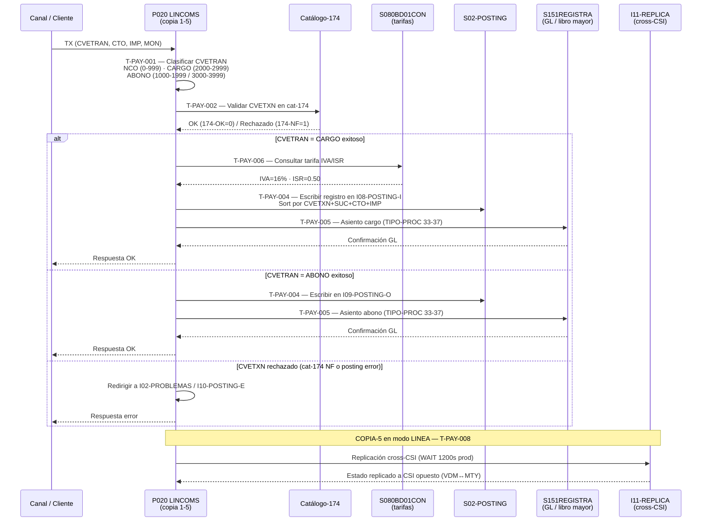

# BC-06 · Pagos e Interbancario
> Dominio: 6 · Common Services · Capacidad: 6.1.3
> Cobertura: S500 · Programa principal: P020 (LINCOMS) · Contexto: P142 (Teradata) · P144 (Conciliación B01/B03)
> Reglas vinculadas: RN-S500-108..152 · RN-S500-501..526 · RN-S151-970..979 · RN-S151-1010..1039 · RN-S151-1050..1059 · RN-S151-1080..1099 · RN-S151-1108..1115 (149 reglas · trazabilidad automática 2026-07-27)
> Jerarquía: **N1** Dominio 6 · Common Services → **N2** Subdominio Core Services → **N3** Capacidad 6.1.3 Payments → **N4-5** Procesos/Flujo de tareas (ver Inventario de Tareas) → **N6** Reglas (ver Reglas vinculadas)
> Indexado: ✅ 2026-07-27 — correlacionado vocab↔reglas↔capacidad (build-traceability.py)
> bian_ref: 6.1.3 Payments

---

## Contexto funcional

El sistema S500 gestiona la captación bancaria de Banamex sobre la plataforma **Unisys ClearPath MCP**. El programa **P020 (LINCOMS)** actúa como **gateway COMS secundario** de procesamiento online de cargos y abonos; su contraparte primaria es P010. P020 opera como servidor COMS multi-copia (5 copias concurrentes), cada una con identidad propia, tabla de failover y tipo de proceso distinto para el libro mayor **S151**.

El flujo central de pagos core cubre:
1. **Recepción** de la transacción del canal (CVETRAN + cuenta + monto) vía COMS.
2. **Clasificación contable** del CVETRAN en rangos CARGO / ABONO / NCO (no-contable).
3. **Validación** contra el catálogo dinámico 174.
4. **Posting** al archivo S02 (ordenado) y asiento en el libro mayor S151 (REGISTRAS500).
5. **Cálculo fiscal** de IVA (16 % / 11 % frontera) e ISR (factor 0.50) sobre comisiones.
6. **TEF** (Transferencias Electrónicas de Fondos): asignación, reasignación y replicación cross-CSI vía I11-REPLICA hacia Monterrey (CSI-F=04) o Valle de México (CSI-L=10).
7. **Controles operativos**: apagado diferenciado por copia, toggle S151 en caliente, cierre de día contable con recarga de librerías.
8. **Eventos especiales**: decomiso EPP (CNBV/PLD) y bloque DIVESTITURE Citi→Banamex.

P142 (batch diario) extrae atributos de contrato hacia Teradata (CREDITOS CAN); P144 (batch diario) concilia el indicador de ordenante entre BD07 ATRIBUCTA y BD01 CAPTACION. Ambos son **contexto downstream** de la capacidad PAY; no ejecutan cargos ni abonos directos pero comparten la topología host cross-CSI y las tasas ISR/IVA hardcodeadas.

**Plataforma:** Unisys ClearPath MCP · COBOL · DMSII · COMS (servidor de mensajes)
**Geografía:** Valle de México (VDM, CSI-L=10) · Monterrey (MTY, CSI-F=04)
**Regulación aplicable:** CNBV (reporting, EPP) · Banxico (SPEI/TEF HA) · SAT (IVA, ISR Art. 93 LISR)

---

## Procesos de negocio (L4)

| ID L4 | Proceso | Sistema | Tareas L5 |
|-------|---------|---------|-----------|
| **6.1.3.1** | Autorización de pago | S500 | T-PAY-001, T-PAY-002 |
| **6.1.3.2** | Contabilización GL | S500+S151 | T-PAY-003, T-PAY-004, T-PAY-005 |
| **6.1.3.3** | Cálculo fiscal IVA/ISR | S500 | T-PAY-006 |
| **6.1.3.4** | Pagos interbancarios SPEI/TEF | S500+S151 | T-PAY-007, T-PAY-008 |
| **6.1.3.5** | Controles operativos | S500 | T-PAY-009, T-PAY-010, T-PAY-011 |
| **6.1.3.6** | Cumplimiento regulatorio | S500 | T-PAY-012, T-PAY-013 |
| **6.1.3.7** | Validación CLABE | gap | — |
| **6.1.3.8** | Gestión de disputas | gap | — |

---

## Inventario de Tareas (L5)

| ID L5 | Proceso L4 | Nombre | Tipo | Programa | Reglas vinculadas |
|-------|-----------|--------|------|----------|-------------------|
| T-PAY-001 | 6.1.3.1 | Clasificación de CVETRAN en rangos NCO / CARGO / ABONO | validación | P020 | RN-S500-115 |
| T-PAY-002 | 6.1.3.1 | Validación contra catálogo 174 (CVETXN autorizado) | validación | P020 | RN-S500-116 |
| T-PAY-003 | 6.1.3.2 | Enrutamiento de copias COMS y asignación de TIPO-PROC S151 | control | P020 | RN-S500-108, RN-S500-109 |
| T-PAY-004 | 6.1.3.2 | Ordenamiento y generación del archivo posting S02 | contable | P020 | RN-S500-117 |
| T-PAY-005 | 6.1.3.2 | Asiento en libro mayor S151 (REGISTRAS500) | escritura | P020 | RN-S500-108, RN-S500-114 |
| T-PAY-006 | 6.1.3.3 | Cálculo de IVA e ISR sobre comisiones y rendimientos | contable | P020 | RN-S500-122 |
| T-PAY-007 | 6.1.3.4 | Procesamiento TEF — asignación y reasignación de cuentas | escritura | P020 | RN-S500-110, RN-S500-121 |
| T-PAY-008 | 6.1.3.4 | Replicación cross-CSI del estado TEF (I11-REPLICA) | control | P020 | RN-S500-111, RN-S500-112 |
| T-PAY-009 | 6.1.3.5 | Control de apagado diferenciado del gateway COMS | control | P020 | RN-S500-113 |
| T-PAY-010 | 6.1.3.5 | Toggle en caliente de integración S151 (TASKVALUE=3027) | control | P020 | RN-S500-114 |
| T-PAY-011 | 6.1.3.5 | Cierre de día contable — cancelación y recarga de librerías | contable | P020 | RN-S500-119 |
| T-PAY-012 | 6.1.3.6 | Decomiso EPP — bloque judicial (TASKVALUE=3019) | escritura | P020 | RN-S500-118 |
| T-PAY-013 | 6.1.3.6 | Proceso DIVESTITURE Citi→Banamex (TASKVALUE=3016) | control | P020 | RN-S500-120 |

---

## Casuísticas

### CS-PAY-01 — Cargo exitoso

**Precondiciones:** Canal online envía transacción con CVETRAN en rango 2000-2999, cuenta válida y saldo suficiente.

1. P020 recibe el mensaje vía COMS en una de sus 5 copias.
2. **T-PAY-001**: `WKS-CVETXN-CAR` se activa (CVETRAN 2000 THRU 2999).
3. **T-PAY-002**: P020 busca CVETXN en `WKS-CAT174-CVETXN`; `WKS-CVETXN-174-OK=0` → autorizado.
4. **T-PAY-004**: Registro se escribe en `I08-POSTING-I`; se ordena en `S02-POSTING-T` por clave `CVETXN + SUC + CTO + IMP`.
5. **T-PAY-005**: Si la transacción incluye comisión, se aplica IVA (`WS-IVA-GRAL=16`) e ISR (`WS-ISR-0=0.50`).
6. **T-PAY-005**: Se envía asiento de cargo a `S151REGISTRA` con `WS-S151-TIPO-PROC = 33-37` (según copia activa).

**Resultado:** Cargo debitado, asiento en S151 confirmado, registro en I08-POSTING-I.

---

### CS-PAY-02 — Transacción rechazada (CVETXN no en catálogo 174 o posting fallido)

**Precondiciones:** Canal envía transacción cuyo CVETXN no existe en catálogo 174, o el posting S02 retorna error.

1. **T-PAY-002**: `WKS-CVETXN-174-NF=1` → CVETXN no autorizado.
2. P020 desvía la transacción a `I02-PROBLEMAS` sin generar asiento en S151.
3. Alternativa: Si el posting falla, el registro va a `I10-POSTING-E` con `POSTERR-DET-CVETXN` para identificar el CVETXN fallido.
4. No se produce débito ni crédito contable. El canal recibe respuesta de error por COMS.

**Resultado:** Transacción registrada en PROBLEMAS / POSTING-E; sin movimiento en saldos ni GL.

---

### CS-PAY-03 — Proceso DIVESTITURE (flag activo durante separación Citi→Banamex)

**Precondiciones:** Operador ejecuta TASKVALUE=3016 durante la ventana de separación corporativa.

1. **T-PAY-013**: P020 detecta `TASKVALUE=3016` en su sección DECLARATIVES (interrupt handler).
2. Se ejecuta el procedimiento `0000-HIS-WFL23`, que lanza el job stream `WFL23` en el mainframe.
3. `WFL23` ejecuta la migración de datos de separación Citi→Banamex sin necesidad de reiniciar el servidor COMS.
4. El bloque está delimitado por comentarios `*INI DIVESTITURE / *FIN DIVESTITURE`, permitiendo extraerlo cuando el proceso de separación concluya.

**Resultado:** Job stream de separación lanzado en caliente; transacciones de canal siguen fluyendo normalmente en paralelo.

---

## Diagrama

---

## Reglas vinculadas

| Tarea | Regla | Componente fuente | Descripción |
|-------|-------|-------------------|-------------|
| T-PAY-001 | RN-S500-115 | P020 — WKS-CVETXN-NCO/ABO/CAR | Clasificación CVETRAN en rangos NCO (0-999), ABONO (1000-1999, 3000-3999), CARGO (2000-2999); valores 534=ELIM y 575=ELIM-DEVOL dentro de NCO |
| T-PAY-002 | RN-S500-116 | P020 — WKS-CAT174-CVETXN | Validación de CVETXN en catálogo 174 dinámico; WKS-CVETXN-174-NF=1 indica transacción no autorizada; catálogo recargable en caliente |
| T-PAY-003 | RN-S500-108 | P020 — WS-S151-TIPO-PROC | Asignación de tipo-proceso S151 por copia: copia 1→33, 2→34, 3→35, 4→36, 5→37; permite que S151 diferencie el origen del movimiento |
| T-PAY-003 | RN-S500-109 | P020 — WKS-SIGUIENTE | Tabla fija de failover de copias: 1→03, 2→01, 3→04, 4→02, 5→02; copias 4 y 5 comparten el mismo siguiente (02) |
| T-PAY-004 | RN-S500-117 | P020 — S02-KEY-CVETXN | Clave compuesta de ordenamiento del archivo posting S02: CVETXN(4)+SUC+CTO+IMP+PROD+INST+MON; rechazos van a I10-POSTING-E |
| T-PAY-005 | RN-S500-108 | P020 — REGISTRAS500 | Posting al GL S151 con TIPO-PROC diferenciado por copia; si S151 desactivado, el TIPO-PROC se asigna pero no se usa |
| T-PAY-005 | RN-S500-114 | P020 — WS-UTILIZA-S151-VA | Toggle en caliente de S151 vía TASKVALUE=3027 (solo PBA/LINEA); CANCEL "REGISTRAS500" para desactivar, LIB-S151L002R500 para reactivar |
| T-PAY-006 | RN-S500-122 | P020 — WS-IVA-GRAL, WS-ISR-0 | IVA general 16%, IVA fronterizo 11%, ISR factor 0.50 (2017: 0.58), exención ISR USD 8668; hardcodeado en P020 + P010 + P142 + P144 sin parámetro centralizado |
| T-PAY-007 | RN-S500-110 | P020 — WS-SOLO-VDM | Si hostname MTY: WS-SOLO-VDM=1; procesamiento TEF solo en copias 1/2/3 (VDM); MTY opera en modo consulta-online únicamente |
| T-PAY-007 | RN-S500-121 | P020 — WS-88-ASIGNA-TEF | TEF CVETRANs: 759=RSG-TEF-RDA, 760=ASG-TEF-RDA, 761=ASG-TEF-SUC, 762=RSG-TEF-BCANET; 759-760 masivos, 761-762 simples |
| T-PAY-008 | RN-S500-111 | P020 — WKS-HOST-ORIG/DEST-XFER | 8 pares host cross-CSI hardcodeados para replicación TEF (VDM↔MTY) + 6 pares clonados; topología Banxico SPEI HA |
| T-PAY-008 | RN-S500-112 | P020 — 50201400-I11-REPLICA | Solo COPIA-5 en modo LINEA genera I11-REPLICA; en producción espera 1200 segundos (WAIT 1200) para que P010 complete su ciclo antes de replicar |
| T-PAY-009 | RN-S500-113 | P020 — SMCOMS-DISABLE | TASKVALUE=3004 apaga cualquier copia; TASKVALUE=3104 apaga solo COPIA-1; WS-COMS-RESULT=1 como confirmación |
| T-PAY-010 | RN-S500-114 | P020 — WS-UTILIZA-S151-VA | Ver T-PAY-005; mismo mecanismo toggle |
| T-PAY-011 | RN-S500-119 | P020 — CAMBIA-DIA-CONTABLE | Cancela 7 librerías dinámicas + espera 5s + recarga; COPIA-3 cancela además S500L050DYR; si S151 activo: también cancela REGISTRAS500 al cierre |
| T-PAY-012 | RN-S500-118 | P020 — DECOMISO-S111 | TASKVALUE=3019 → 00000000-3019-DECOMISO-S111; CVETXN=534 (ELIM) y 575 (ELIM-DEVOL) vinculados a reversión; proyecto P0126372 (Automate EPP Control Figures) |
| T-PAY-013 | RN-S500-120 | P020 — WFL23 | TASKVALUE=3016 → 0000-HIS-WFL23; bloque delimitado *INI/*FIN DIVESTITURE en DECLARATIVES; extraíble sin reiniciar servidor |

---

## Hallazgos de migración

| # | Riesgo | Tarea(s) | Severidad | Acción recomendada |
|---|--------|----------|-----------|-------------------|
| H-PAY-01 | **IVA/ISR hardcodeados en 4 programas** (P010, P020, P142, P144) sin parámetro centralizado. Un cambio de SAT requiere coordinar compilación y despliegue simultáneo de todos. Existe evidencia de un ciclo incompleto (valor 0.60 comentado). | T-PAY-006 | 🟠 Alta | Externalizar tasas a tabla de parámetros (cat-S080 o tabla administrada). Crear contrato único SAT-RATE leído en runtime. Eliminar duplicación cross-programa. |
| H-PAY-02 | **Rangos CVETRAN NCO/ABONO/CARGO hardcodeados** (0-999, 1000-1999, 2000-2999, 3000-3999). El rango 3000-3999 como ABONO no aparece en WKS-CVETXN-ABO del posting (excepción sin validar). | T-PAY-001 | 🟠 Alta | Mapear catálogo de CVETRAN a tabla parametrizable. Verificar con SME si 3000-3999 es ABONO en todos los flujos o solo en S151; resolver la excepción antes de transpilación. |
| H-PAY-03 | **Tabla de failover de copias COMS hardcodeada** (WKS-SIGUIENTE: 1→03, 2→01, 3→04, 4/5→02). Copias 4 y 5 convergen al mismo siguiente, lo que concentra el riesgo de failover. | T-PAY-003 | 🟡 Media | Externalizar a fichero de configuración. Evaluar si la arquitectura cloud-target requiere el mismo modelo de multi-copia o si se reemplaza por load balancer. |
| H-PAY-04 | **Pares host cross-CSI duplicados en P020, P142 y P144** sin COPY book compartido. Un cambio de topología de red (nuevo nodo CSI) requiere actualizar 3 programas por separado en ventana coordinada. | T-PAY-008 | 🟠 Alta | Centralizar la tabla de pares en un único COPY book o micro-servicio de configuración de topología. En la arquitectura target, reemplazar con service discovery. |
| H-PAY-05 | **COPIA-5 espera 1200 segundos** (20 min) antes de replicar I11 en producción; en PBA es inmediato. Comportamiento environment-specific sin parámetro configurable. | T-PAY-008 | 🟡 Media | Parametrizar el tiempo de espera (WAIT N) como variable de entorno o registro de control B02. Documentar el fundamento del umbral de 20 minutos con el equipo de operaciones. |
| H-PAY-06 | **Restricción MTY basada en hostname** (WS-DH-HOSTNAME-MTY). La lógica de routing geográfico está atada a los nombres de host de producción Unisys; no aplica en PBA/SIT/UAT, lo que puede generar divergencias de comportamiento entre entornos. | T-PAY-007 | 🟠 Alta | Reemplazar detección de hostname por variable de entorno o configuración explícita CSI. Asegurar paridad comportamental entre entornos en la arquitectura target. |
| H-PAY-07 | **Bloque DIVESTITURE (TASKVALUE=3016)** — código con fecha de vida conocida. Una vez completada la separación Citi→Banamex, el bloque debe extraerse. Los delimitadores `*INI/*FIN DIVESTITURE` facilitan la identificación. | T-PAY-013 | 🟢 Baja | Confirmar estado del proceso de separación con el equipo legal/regulatorio. Si completado: eliminar el bloque y el procedimiento 0000-HIS-WFL23 antes de transpilación para no arrastrar deuda técnica. |
| H-PAY-08 | **Catálogo 174 no recargado por TASKVALUE=3040** (que recarga cat-1789). Cat-174 es componente separado con mecanismo de recarga propio no documentado en las reglas leídas. | T-PAY-002 | 🟡 Media | Identificar el TASKVALUE o procedimiento de recarga de cat-174 en el código fuente completo. Asegurar que el equivalente cloud mantenga el mismo SLA de recarga. |

---

## Capacidad adicional: T.1.3 Payment Schemes — SPEI / CLABE (merge)

> BIAN: T.1.3 · Payment Schemes (SPEI/CLABE) · incorporado en cap-pay.md por integración con P020 core de pagos
> Sistemas: S500+S151 · Programas: P020 (LINCOMS) · S151REGISTRA · P010 (S151) · Librerías: L091 y L093 (MQ SPEI — sin regla documentada en catálogo, pendiente análisis de código fuente)
> Regulación: SPEI (Banxico, Circular 14/2017); CLABE (Circular 22/2010 Banxico); NIO (Número de Identificación de Operación asignado por Banxico por instrucción SPEI)

### Contexto funcional

**SPEI** (Sistema de Pagos Electrónicos Interbancarios) es la infraestructura de pagos en tiempo real de Banxico que permite transferencias entre cualquier banco mexicano. Opera 24×7, con liquidación en tiempo real, y es obligatorio para transferencias interbancarias desde 2004. S500 participa como banco emisor/receptor en la red SPEI vía el sistema de archivos TEF y las librerías L091 y L093.

**CLABE** (Clave Bancaria Estandarizada) es el identificador de 18 dígitos requerido en toda transferencia SPEI. Sus 18 posiciones codifican: banco (3 dígitos), ciudad (3), cuenta (11), dígito verificador (1). La fórmula del dígito verificador usa ponderadores [3, 7, 1] aplicados módulo 10. La regulación base es la Circular 22/2010 de Banxico. No se encontraron reglas de validación CLABE explícitas en el código fuente de P020 ni S151REGISTRA — su presencia en el sistema debe confirmarse con SME (ver H-T13-02).

**NIO** (Número de Identificación de Operación) es el identificador único de 16 caracteres asignado por Banxico a cada instrucción SPEI. Funciona como trazador cross-banco de la operación: el banco emisor lo recibe en la respuesta SPEI y lo conserva en los registros del movimiento. En S151, el campo `A00-R01-S050-NIO` almacena el NIO SPEI y se expone en las pantallas de consulta P11/P12/P14/P18 de P010.

**CVETRAN 4449** es la clave de transacción S500 que identifica pagos SPEI interbancarios (pago electrónico interbancario). El campo `WS-CVE-ACNOMINAPORTA-PG` es la clave dinámica equivalente para nómina portable interbancaria (portabilidad de nómina vía SPEI, regulada por Banxico desde 2010). Ambos CVETRANs activan el override a sucursal 859 (punto de acceso SPEI de Banamex) con cajero 40 en S151REGISTRA.

**Librerías L091 y L093** son las librerías Unisys ClearPath MCP propietarias que actúan como conectores MQ hacia el switch SPEI de Banxico. Son los adaptadores de protocolo entre el stack COBOL/DMSII/COMS y la red SPEI. No tienen reglas de negocio documentadas en el catálogo actual; representan el punto de integración más crítico para la migración del canal de pagos interbancarios.

### Reglas vinculadas — T.1.3 Payment Schemes SPEI/CLABE

| Tarea referenciada | Regla | Componente fuente | Descripción |
|--------------------|-------|-------------------|-------------|
| T-PAY-007 | RN-S500-110 | P020 — WS-SOLO-VDM / WS-DH-HOSTNAME-MTY | Si hostname es MTY: activa WS-SOLO-VDM=1; archivos TEF/SPEI (I03-TEF-VDM) solo procesados en instancia Valle de México (copias 1/2/3). Monterrey opera en modo consulta-online exclusivamente. Regulador: Banxico (SPEI HA — alta disponibilidad geográfica). |
| T-PAY-008 | RN-S500-111 | P020 — WKS-HOST-ORIG/DEST-XFER-XX / I11-REPLICA | Tabla hardcodeada de 8 pares de host (+ 6 pares clonados con prefijo C) para replicación cross-CSI del estado TEF entre VDM (CSI-L=10) y MTY (CSI-F=04). Cumple requisito de alta disponibilidad SPEI de Banxico. COPIA-5 modo LINEA espera 1200 s en producción antes de replicar. Regulador: Banxico (SPEI HA). |
| T-PAY-007 | RN-S500-121 | P020 — WS-88-ASIGNA-TEF / I03-TEF-VDM / S151REGISTRA | CVETRANs de asignación/reasignación de cuentas para instrucciones SPEI/TEF: 759=RSG-TEF-RDA (reasignación masiva), 760=ASG-TEF-RDA (asignación masiva), 761=ASG-TEF-SUC (asignación sucursal), 762=RSG-TEF-BCANET (reasignación vía BancaNet). Canal determina el CVETRAN aplicable. Regulador: Banxico (SPEI). |
| (S151REGISTRA) | RN-S500-163 | S151REGISTRA — WS-S151-0101-SUCPROM / SUCTRAN / SUCS028 | CVETRAN 4449 = pago SPEI interbancario; WS-CVE-ACNOMINAPORTA-PG = nómina portable SPEI. Ambos activan override: sucursal 859 (punto de acceso SPEI Banamex) + cajero 40 en los campos CAJOPER/CAJTRAN/CAJS028. Solo aplica en modo LINEA. Fuente: rules-s500-s151registra-p103fraude.md. |
| (S151 consulta) | RN-S151-263 | P010 S151 — WKS-ENT-P12/14/18NIO / WKS-SAL-P11NIO | Campo NIO (X(16)) agregado 2006-07-28 en pantallas P12, P14 y P18 de P010. `A00-R01-S050-NIO` = NIO SPEI asignado por Banxico; `A00-BIT264-AUT-NIO` = NIO en bitácora 264. Asimetría: entrada X(01) vs salida X(16) — semántica exacta pendiente HITL. Fuente: rules-s151-p010.md. |

### Hallazgos de migración — T.1.3

| # | Riesgo | Componente | Severidad | Acción recomendada |
|---|--------|------------|-----------|-------------------|
| H-T13-01 | **L091 y L093 sin reglas documentadas** — las librerías MQ conectoras al switch SPEI de Banxico son librerías propietarias Unisys sin equivalente directo en plataformas modernas y sin reglas en el catálogo actual. Son el único canal de conectividad SPEI del sistema. | L091 y L093 | 🔴 Crítica | Priorizar análisis de código fuente de L091 y L093 antes de diseñar la arquitectura target. El reemplazo candidato es un cliente Kafka o el SDK REST SPEI de Banxico (API para participantes). Requiere verificación con Banxico del protocolo target y certificación como participante digital. |
| H-T13-02 | **CLABE sin validación explícita en código S500** — no se encontraron reglas de validación de CLABE (18 dígitos, dígito verificador con ponderadores [3,7,1] mod 10) en el catálogo de P020, S151REGISTRA ni P010. La validación puede estar delegada al switch SPEI o a un sistema upstream no catalogado. | P020 / S151REGISTRA | 🟠 Alta | Confirmar con SME si la validación de CLABE ocurre en L091 y L093 o en el switch SPEI. Si no existe en el stack MCP: implementar validación explícita en el microservicio de pagos target (librerías CLABE estándar disponibles en Java, Node, Python). |
| H-T13-03 | **NIO con asimetría de tamaño en interfaz** — WKS-ENT-P12/14/18NIO es X(01) en entrada vs WKS-SAL-P12REFNIO X(16) en salida. El NIO de Banxico es de 16 chars. La asimetría sugiere que el campo de entrada puede ser un flag/indicador de filtro, no el NIO completo. | P010 S151 | 🟡 Media | Validar con SME si el campo de entrada X(01) es un selector de filtro o un truncamiento. En el target, el NIO debe modelarse como campo obligatorio de 16 chars en el schema de movimientos SPEI. Confianza media hasta HITL. |
| H-T13-04 | **CVETRAN 4449 y sucursal 859 hardcodeados** — el routing de pagos SPEI interbancarios a sucursal 859 (cajero 40) está hardcodeado en S151REGISTRA. Un cambio de estructura organizacional o nuevo punto SPEI requiere recompilación y coordinación con S151. | S151REGISTRA | 🟡 Media | Externalizar el mapeo CVETRAN→sucursal/cajero a tabla de parámetros. En el target, la lógica de enrutamiento de pagos SPEI debe ser configurable sin redeployment, idealmente como regla en un motor de pagos o tabla administrada. |
| H-T13-05 | **Topología SPEI HA duplicada en 3 programas** — la tabla de 8 pares host para replicación TEF/SPEI está duplicada en P020, P142 y P144 sin COPY book compartido (ver también H-PAY-04). Un cambio de nodo SPEI requiere actualizar los tres programas en ventana coordinada. | P020 / P142 / P144 | 🟠 Alta | Centralizar en COPY book único o servicio de configuración. En el target, reemplazar con service discovery o ConfigMap de topología SPEI administrable en caliente. Referencia cruzada: H-PAY-04. |

---

*cap-pay.md · v1.2 · 2026-07-19*
*Capacidad: 6.1.3 Payments + T.1.3 Payment Schemes SPEI/CLABE · Sistema: S500+S151 · Programas: P020 LINCOMS · P142 · P144 · S151REGISTRA · P010*
*Cross-referencia: RN-S500-108..152 · RN-S500-163 · RN-S151-263 · rules-s500-p020-p142-p144.md · rules-s500-s151registra-p103fraude.md · rules-s151-p010.md · capability-map.md*
