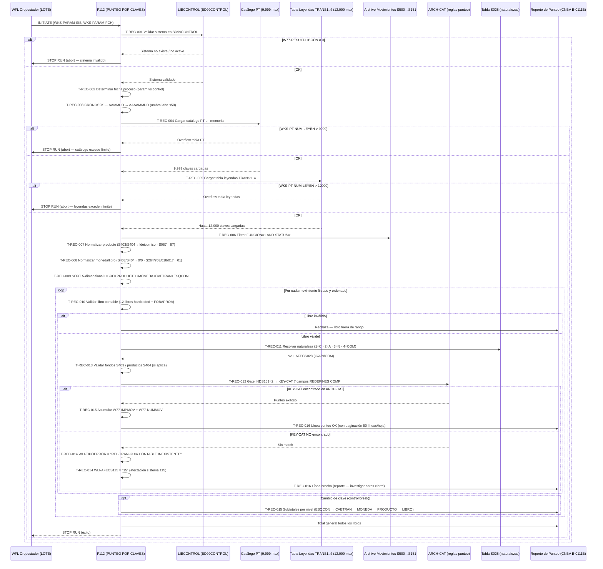

# BC-11 · Reconciliación Financiera
> Dominio: 6 · Common Services · Subdominio: Reconciliation
> Capacidad: **6.7.1 Financial Reconciliation**
> Cobertura: S151 · Programa principal: P112 (PUNTEO POR CLAVES DE TRANSACCION)
> Reglas vinculadas: RN-S500-653..657 · RN-S151-001..020 · RN-S151-391..400 · RN-S151-421..450 · RN-S151-710..718 (74 reglas · trazabilidad automática 2026-07-27)
> Jerarquía: **N1** Dominio 6 · Common Services → **N2** Subdominio Reconciliations → **N3** Capacidad 6.7.1 Financial Reconciliation → **N4-5** Procesos/Flujo de tareas (ver Inventario de Tareas) → **N6** Reglas (ver Reglas vinculadas)
> Indexado: ✅ 2026-07-27 — correlacionado vocab↔reglas↔capacidad (build-traceability.py)
> Contexto: P112 reconcilia diariamente los movimientos S500 (Captación/Cargos y Abonos) contra S151 (GL — Movimientos Contables). Su salida determina si cada movimiento tiene guía contable equivalente en el otro sistema. Las brechas de reconciliación son reportables al regulador (CNBV B-0111B).
> bian_ref: 6.7.1 Financial Reconciliation

---

## Inventario de Tareas

| ID | Tarea | Programa | Componente fuente | Tipo |
|----|-------|----------|-------------------|------|
| T-REC-001 | Validar que el sistema existe y está activo en BD99CONTROL vía LIBCONTROL | P112 | COBOL_P112.txt | validación |
| T-REC-002 | Determinar fecha de proceso: parámetro WKS-PARAM-FCH prevalece sobre base de control | P112 | COBOL_P112.txt | control |
| T-REC-003 | Convertir fecha a 8 dígitos (AAAAMMDD) desde 6 dígitos (AAMMDD) vía parche CRONOS2K (umbral año ≤50 = siglo XXI) | P112 | COBOL_P112.txt | control |
| T-REC-004 | Cargar catálogo paramétrico PT en memoria: máx 9,999 claves (WKS-PT-CGENTRA, NATS028, INDS151, INDBITA) | P112 | COBOL_P112.txt | control |
| T-REC-005 | Cargar tabla de leyendas TRANS1..4 en memoria: máx 12,000 claves distribuidas en 4 segmentos de 3,000 | P112 | COBOL_P112.txt | control |
| T-REC-006 | Filtrar archivo de entrada: solo FUNCION=1 (alta) AND STATUS=1 (pendiente punteo) | P112 | COBOL_P112.txt | validación |
| T-REC-007 | Normalizar campo de producto: S403/S404→número de fideicomiso (A00-R01-FIDEICO); S087→código 87 hardcoded | P112 | COBOL_P112.txt | validación |
| T-REC-008 | Normalizar moneda y libro para lookup: S403/S404→CAT-MON=0·CAT-LIBRO=0; S264/S703/S018/S017→CAT-MON=01 (MXN) | P112 | COBOL_P112.txt | validación |
| T-REC-009 | Ordenar movimientos filtrados por clave 5-dimensional LIBRO+PRODUCTO+MONEDA+CVETRAN+ESQCON (16 posiciones) | P112 | COBOL_P112.txt | control |
| T-REC-010 | Validar libro contable del movimiento contra tabla interna de 12 libros hardcoded (incluye FOBAPROA) | P112 | COBOL_P112.txt | validación |
| T-REC-011 | Resolver naturaleza contable del movimiento consultando tabla S028: 1=CARGO · 2=ABONO · 3=NEUTRO · 4=COMPENSACION | P112 | COBOL_P112.txt | contable |
| T-REC-012 | Gate de equivalencia INDS151=2: construir KEY-CAT 7 campos (REDEFINES COMP) y buscar en ARCH-CAT | P112 | COBOL_P112.txt | contable |
| T-REC-013 | Validar fondos S403 (FIRA/FONATUR/BANCOMEXT/NAFIN) y 9 productos S404 hardcoded | P112 | COBOL_P112.txt | validación |
| T-REC-014 | Reportar brecha: emitir "REL-TRAN-GUIA CONTABLE INEXISTENTE" en WLI-TIPOERROR → WLI-AFECS115=15 | P112 | COBOL_P112.txt | contable |
| T-REC-015 | Acumular totales en control break 5 niveles (LIBRO › PRODUCTO › MONEDA › CVETRAN › ESQCON) con W77-IMPMOV + W77-NUMMOV | P112 | COBOL_P112.txt | contable |
| T-REC-016 | Paginar reporte: 50 líneas/hoja, encabezado con fecha + número de hoja + "....CONTINUA" al pie | P112 | COBOL_P112.txt | escritura |

---

## Casuísticas

### CS-REC-01: Punteo exitoso — movimiento con guía contable en ARCH-CAT (happy path)
**Tipo:** happy-path
**Condición de entrada:** Movimiento con FUNCION=1, STATUS=1, libro válido (01-12), INDS151=2; KEY-CAT (sistema+cvetran+esqcon+moneda+libro+cia+guia) localizado en ARCH-CAT
**Resultado:** Movimiento punteado exitosamente; naturaleza S028 resuelta (CARGO/ABONO); acumulado en totales del grupo de clave; línea de punteo impresa en reporte sin error
**Secuencia:**
```
T-REC-001 (sistema válido) → T-REC-002 → T-REC-003
  → T-REC-004 (PT cargado OK) → T-REC-005 (leyendas OK)
  → T-REC-006 (registro pasa filtro) → T-REC-007 (producto normalizado)
  → T-REC-008 (moneda/libro OK) → T-REC-009 (sort)
  → [ciclo por cada registro]
    → T-REC-010 (libro válido 01-12) → T-REC-011 (naturaleza CARGO/ABONO)
    → T-REC-012 (KEY-CAT → match ARCH-CAT → punteo exitoso)
    → T-REC-015 (acumula W77-IMPMOV + W77-NUMMOV)
    → T-REC-016 (línea reporte)
  → [control break al cambio de clave]
    → T-REC-015 (imprime subtotales por nivel)
```

### CS-REC-02: Brecha de reconciliación — guía contable inexistente en ARCH-CAT
**Tipo:** error-negocio (reportable CNBV)
**Condición de entrada:** Movimiento con FUNCION=1, STATUS=1, INDS151=2; KEY-CAT construido con los 7 campos pero NO localizado en ARCH-CAT
**Resultado:** Brecha registrada: WLI-TIPOERROR = "REL-TRAN-GUIA CONTABLE INEXISTENTE" (35 caracteres exactos), WLI-AFECS115 = "15"; línea de error impresa en reporte; WKS-CONTADOR-BRECHAS incrementado; movimiento no punteado; debe investigarse antes del cierre contable
**Secuencia:**
```
T-REC-010 → T-REC-011 → T-REC-012 (KEY-CAT → NO match en ARCH-CAT)
  → T-REC-014 (emite REL-TRAN-GUIA CONTABLE INEXISTENTE + AFECS115=15)
  → T-REC-016 (imprime línea de error en reporte)
```

### CS-REC-03: Movimiento fiduciario S403 (FIRA/FONATUR/BANCOMEXT/NAFIN)
**Tipo:** happy-path (ruta diferenciada regulatoria)
**Condición de entrada:** A00-R01-IND-CONTA = "S403"; número de fideicomiso válido dentro del fondo (FIRA, FONATUR, BANCOMEXT o NAFIN)
**Resultado:** Producto sustituido por número de fideicomiso en WKS-RS-NUM-PRODUCTO; CAT-MON forzado a 0 (genérico); CAT-LIBRO forzado a 0 (genérico); todos los movimientos del mismo fideicomiso agrupados bajo la misma clave de punteo; segmentación regulatoria CNBV preservada
**Secuencia:**
```
T-REC-006 (pasa filtro) → T-REC-007 (S403 → WKS-RS-NUM-PRODUCTO = A00-R01-FIDEICO)
  → T-REC-008 (S403 → CAT-MON=0 · CAT-LIBRO=0)
  → T-REC-013 (valida fondo FIRA/FONATUR/BANCOMEXT/NAFIN)
  → T-REC-012 (KEY-CAT con producto=fideicomiso, moneda=0, libro=0 → ARCH-CAT)
```

### CS-REC-04: Overflow catálogo PT — abort antes de procesar cualquier movimiento
**Tipo:** error-sistema (crítico)
**Condición de entrada:** El catálogo paramétrico tiene más de 9,999 registros en la ejecución actual
**Resultado:** P112 aborta durante la fase de carga del catálogo PT (T-REC-004) antes de filtrar o puntear ningún movimiento; toda la reconciliación del día falla; el reporte queda vacío; operaciones requieren investigación y reproceso manual
**Secuencia:**
```
T-REC-001 (OK) → T-REC-002 → T-REC-003
  → T-REC-004 (WKS-PT-NUM-LEYEN > 9,999)
    → DISPLAY "ERROR: OVERFLOW CATALOGO PT - LIMITE 9999"
    → STOP RUN (abort total — ningún movimiento procesado)
```

### CS-REC-05: Movimiento S264/SPEI con moneda distinta a MXN — brecha silenciosa
**Tipo:** edge-case (riesgo regulatorio)
**Condición de entrada:** WKS-PARAM-SIS = 264 (SPEI/compensación); movimiento con moneda USD u otra divisa extranjera
**Resultado:** CAT-MON forzado a 01 (MXN) en T-REC-008; KEY-CAT generado con moneda=01 no existe en ARCH-CAT (porque el movimiento es en USD); brecha reportada como "REL-TRAN-GUIA CONTABLE INEXISTENTE" sin indicar que la causa es la restricción de moneda; el equipo contable no identifica la causa raíz en el reporte
**Secuencia:**
```
T-REC-007 (S264 normaliza producto) → T-REC-008 (S264 → CAT-MON=01, forzado a MXN)
  → T-REC-012 (KEY-CAT con moneda=01 → NO match → brecha)
  → T-REC-014 (REL-TRAN-GUIA CONTABLE INEXISTENTE — causa real invisible)
```

### CS-REC-06: Sistema no existente en BD99CONTROL — abort en inicialización
**Tipo:** error-sistema
**Condición de entrada:** WKS-PARAM-SIS recibido del JCL no existe o no está activo en BD99CONTROL; W77-RESULT-LIBCON ≠ 0
**Resultado:** P112 aborta en T-REC-001 antes de cargar catálogos o procesar registros; mensaje "ERROR: SISTEMA NO EXISTE EN BASE DE CONTROL" impreso; sin timeout documentado — si BD99CONTROL no responde, el proceso puede quedar colgado indefinidamente
**Secuencia:**
```
T-REC-001 (CALL LIBCONTROL → W77-RESULT-LIBCON ≠ 0)
  → DISPLAY "ERROR: SISTEMA NO EXISTE EN BASE DE CONTROL"
  → STOP RUN (abort total en inicialización)
```

---

## Diagrama



---

## Reglas vinculadas a tareas

| Tarea | Regla | Componente fuente | Descripción | Tags |
|-------|-------|-------------------|-------------|------|
| T-REC-001 | RN-S151-001 | COBOL_P112.txt | Validación de sistema en BD99CONTROL antes de iniciar | — |
| T-REC-002 | RN-S151-002 | COBOL_P112.txt | Fecha proceso: parámetro prevalece sobre base de control | — |
| T-REC-003 | RN-S151-019 | COBOL_P112.txt | CRONOS2K — conversión año 2 dígitos a 4 (umbral 50) | `[HARDCODE-SOSPECHOSO]` |
| T-REC-004 | RN-S151-013 | COBOL_P112.txt | Límite 9,999 claves en catálogo PT — overflow aborta todo | `[HARDCODE-SOSPECHOSO]` |
| T-REC-005 | RN-S151-012 | COBOL_P112.txt | Límite 12,000 claves en tablas TRANS1..4 — overflow aborta todo | `[HARDCODE-SOSPECHOSO]` |
| T-REC-006 | RN-S151-003 | COBOL_P112.txt | Filtro doble FUNCION=1 AND STATUS=1 — silencioso para otros valores | — |
| T-REC-007 | RN-S151-005 | COBOL_P112.txt | S403/S404 fideicomiso como producto (segmentación CNBV) | `[REGLA-CNBV]` |
| T-REC-007 | RN-S151-006 | COBOL_P112.txt | S087 producto hardcoded=87 sin leer A00-R01-PRODUCTO | `[HARDCODE-SOSPECHOSO]` |
| T-REC-008 | RN-S151-010 | COBOL_P112.txt | Normalización MON=0 · LIBRO=0 para S403/S404 antes de ARCH-CAT | — |
| T-REC-008 | RN-S151-011 | COBOL_P112.txt | S264/S703/S018/S017 solo moneda base MXN (CAT-MON=01) | — |
| T-REC-009 | RN-S151-004 | COBOL_P112.txt | Sort 5-dimensional: LIBRO+PRODUCTO+MONEDA+CVETRAN+ESQCON | — |
| T-REC-010 | RN-S151-015 | COBOL_P112.txt | 12 libros contables hardcoded (incl. FOBAPROA residual 1994-1995) | `[HARDCODE-SOSPECHOSO]` `[REGLA-CNBV]` |
| T-REC-011 | RN-S151-007 | COBOL_P112.txt | Naturaleza S028: 1=CARGO · 2=ABONO · 3=NEUTRO · 4=COMPENSACION | — |
| T-REC-012 | RN-S151-008 | COBOL_P112.txt | Gate equivalencia: INDS151=2 + match ARCH-CAT → punteo | `[RIESGO-EQUIVALENCIA]` |
| T-REC-012 | RN-S151-009 | COBOL_P112.txt | Clave ARCH-CAT: 7 campos REDEFINES COMP (frágil ante cambios layout) | — |
| T-REC-013 | RN-S151-016 | COBOL_P112.txt | S403: fondos válidos hardcoded FIRA/FONATUR/BANCOMEXT/NAFIN | `[HARDCODE-SOSPECHOSO]` |
| T-REC-013 | RN-S151-017 | COBOL_P112.txt | S404: 9 tipos de producto hardcoded — descarte silencioso si hay 10° | `[HARDCODE-SOSPECHOSO]` |
| T-REC-014 | RN-S151-020 | COBOL_P112.txt | "REL-TRAN-GUIA CONTABLE INEXISTENTE" — diagnóstico brecha (texto exacto 35 chars) | `[RIESGO-EQUIVALENCIA]` |
| T-REC-015 | RN-S151-014 | COBOL_P112.txt | 5 niveles de control break — totales jerárquicos del reporte | — |
| T-REC-016 | RN-S151-018 | COBOL_P112.txt | Paginación 50 líneas/hoja + encabezado + literal "....CONTINUA" | — |

---

## Hallazgos de migración críticos

| Riesgo | Tarea | Severidad | Acción requerida |
|--------|-------|-----------|-----------------|
| Gate de equivalencia ARCH-CAT: cualquier cambio en guía contable rompe reconciliación | T-REC-012 | 🟠 CRÍTICO | Externalizar ARCH-CAT a base de datos configurable; implementar versionado de guías contables; pruebas de equivalencia 100% de combinaciones antes de go-live |
| Clave KEY-CAT con REDEFINES COMP — frágil ante cambios de layout | T-REC-012 | 🟠 CRÍTICO | Reescribir acceso como consulta parametrizada con 7 columnas explícitas; nunca usar REDEFINES en arquitectura target |
| Overflow catálogo PT (9,999) / tabla leyendas (12,000) aborta reconciliación total | T-REC-004, T-REC-005 | 🟠 CRÍTICO | Eliminar límites hardcoded; usar estructuras dinámicas (List/Map) en target; monitorear crecimiento del catálogo |
| Texto "REL-TRAN-GUIA CONTABLE INEXISTENTE" exacto de 35 chars — parsers downstream dependen de él | T-REC-014 | 🟠 CRÍTICO | Documentar y versionar el texto exacto como contrato de interfaz; implementar código de error estructurado en target |
| 12 libros hardcoded incl. FOBAPROA — nuevo libro regulatorio CNBV requiere recompilación | T-REC-010 | 🟡 ALTO | Mover catálogo de libros a tabla configurable en base de datos; gestionar via configuración sin recompilación |
| S087 producto=87 hardcoded — nuevos productos ignorados silenciosamente | T-REC-007 | 🟡 ALTO | Reemplazar por lectura real de A00-R01-PRODUCTO; validar con equipo S087 |
| CRONOS2K — datos con año > 50 interpretados como siglo XIX (bomba de tiempo 2051) | T-REC-003 | 🟡 ALTO | Eliminar lógica CRONOS2K; usar tipo DATE nativo del target con 4 dígitos de año |
| Filtro FUNCION=1/STATUS=1 silencioso — STATUS=0 nunca procesado sin traza | T-REC-006 | 🟡 MEDIO | Agregar contadores de registros descartados por filtro; loggear causas de exclusión |
| S264/S703/S018/S017 restringidos a MXN — brecha silenciosa por moneda sin diagnóstico de causa | T-REC-008 | 🟡 MEDIO | Emitir código de error específico "RESTRICCION-MONEDA-BASE" en lugar de caer en la brecha genérica |
| S403 fondos y S404 productos hardcoded — nuevos fondos/productos descartados silenciosamente | T-REC-013 | 🟡 MEDIO | Externalizar listas de fondos y productos a catálogos configurables |

---

## Dependencias de datos del sistema

```
P112 LEE:
  ← Movimientos de S500 (Captación) con estatus y función — entrada primaria
  ← BD99CONTROL (LIBCONTROL) — control de proceso batch
  ← ARCH-CAT — reglas de punteo (7 campos por clave)
  ← Tabla S028 — catálogo de naturalezas contables
  ← WFL JCL — WKS-PARAM-SIS (sistema) y WKS-PARAM-FCH (fecha)

P112 ESCRIBE:
  → Reporte de punteo (CNBV B-0111B) — brechas + totales por 5 dimensiones
  → Sistema 115 (WLI-AFECS115=15) — notificación de brechas de reconciliación

P112 en la secuencia WFL_LOTE.txt:
  P109 (GL posting engine) → P112 (punteo/reconciliación) → P111 (siguiente paso)
```

---

## Trazabilidad completa (ejemplo RN-S151-008)

```
Regla: RN-S151-008 — Gate equivalencia S500↔S151 via INDS151=2 y guía contable
  → Tarea: T-REC-012 — Gate de equivalencia INDS151=2 → lookup ARCH-CAT por KEY-CAT
    → Programa: P112 (PUNTEO POR CLAVES DE TRANSACCION)
      → Componente fuente: COBOL_P112.txt (~3,326 LOC)
        → Párrafo: BUSCA-EN-ARCH-CAT
          → Casuísticas: CS-REC-01 (punteo exitoso) / CS-REC-02 (brecha)
            → Diagrama: rama "KEY-CAT encontrado / NO encontrado en ARCH-CAT"
              → Riesgo de migración: 🟠 CRÍTICO — "Gate de equivalencia ARCH-CAT"
```

---

---

## Ampliación — P151 Transformador IBM-Citibank ALR/AHR/OCM (RN-S151-331..360)

> P151 (COBOL 17,370 LOC, Ing. Javier Mercado Flores) transforma movimientos S151 del día en tres archivos de interfaz IBM-Citibank: ALR (Account Ledger), AHR (Account History) y OCM (Order Collection Message). Es el gemelo de P150 pero en dirección S151→IBM en lugar de S151→Citi. Riesgo de separación Citi #4 (BRCH-NBR=485 hardcoded en todos los registros ALR/AHR/OCM).

| ID | Tarea | Programa | Tipo | Complejidad | Prioridad |
|----|-------|----------|------|-------------|-----------|
| T-REC-P151-001 | Inicializar: resolver W77-SISTEMA-PARAMETRO (500=captación, 701=pagos); sistema ≠ 500/701 termina sin generar archivos | P151 | control | BAJA | ALTA |
| T-REC-P151-002 | Cargar catálogos S151 dos veces (12000-CARGA-CATALOGOS): sistema 500 y sistema 408 como alias de captación | P151 | control | MEDIA | ALTA |
| T-REC-P151-003 | Buscar clave SBC: 15000-BUSCA-CVE-SBC — localiza la Sucursal de Bancos Centrales en catálogos cargados | P151 | consulta | BAJA | MEDIA |
| T-REC-P151-004 | Procesar y sortear movimientos: 20000-PROCESA-MOVIMIENTOS (lee BD10 → sort input MOVIMIENTOSCTD); 35000-SORTEA-MOVTOS-HORA (sort secundario por hora) | P151 | control | ALTA | ALTA |
| T-REC-P151-005 | Selección de movimientos: 30000-SELECCION-MOVIMIENTOS → llena ARCH-CITICTD (SMOVTOS-CITICTD) con IND-CD e IND-BN (añadidos por ISILOA); LEYENDA truncada a 40 bytes (vs 5×35 del registro principal — movimientos con LEY2..5 las pierden) | P151 | validación | ALTA | ALTA |
| T-REC-P151-006 | Determinar enrutamiento por RMC-IND-SIS: 1→ALR; 1 o 2→AHR; (1 AND INDCITI=2 AND IND-CD=2/3 OR IND-BN=1 AND CTACON IN 11/61)→OCM; IND-SIS=0 excluye silenciosamente | P151 | control | ALTA | CRÍTICA |
| T-REC-P151-007 | Distribuir por región (41300-ARCHIVO-ALR/AHR): ARCH-ALR-VDM / ARCH-ALR-MTY / ARCH-ALR-UNI según RMC-SUBNODO o WKS-NODO; subnodo sin mapping → movimiento perdido sin traza | P151 | control | MEDIA | ALTA |
| T-REC-P151-008 | Activar variantes BNE si W88-HOSTNAME verdadero (mod ISILOA): genera ARCH-ALR-BNE / ARCH-AHR-BNE / ARCH-OCM-BNE paralelos con IND-CD e IND-BN como discriminantes | P151 | control | BAJA | ALTA |
| T-REC-P151-009 | Generar registro ALR (41000-GRABA-ARCHIVOS-CITI): BRCH-NBR=485 hardcoded; CURRENT-NO=W77-CONTADOR-ALR (NO AUTS151 — línea original comentada); BLOCK CONTAINS 100 RECORDS | P151 | escritura | BAJA | CRÍTICA |
| T-REC-P151-010 | Determinar naturaleza ALR (41210-VALIDA-NATURALEZA-ALR): ALRINT-DR-CR-IND='D' o 'C'; ALRINT-TXN-AMT=valor absoluto — formato DR/CR distinto al '+'/'-' del OCM y al campo separado del AHR | P151 | contable | MEDIA | ALTA |
| T-REC-P151-011 | Validar campos SAT Anexo 20 en AHR (100-27937-VALIDA-SAT + 100-27938-VAL-DFTPY): NOM-ORD X(120), RFC-ORD X(20), BCO-ORD X(20), CVE-RASTREO X(30); PRIME-DELIMITER='X' fijo | P151 | validación | ALTA | ALTA |
| T-REC-P151-012 | Generar AHR con campos SPEI extendidos: AHRST-REVRS-IND (SPACE=normal, ≠SPACE=reversa); FEC-DEV / HORA-DEV / CAUSA-DEV X(120); SELLO-DIGIT X(400); RFC requiere padding X(20) vs fuente X(13)/X(18) | P151 | escritura | ALTA | CRÍTICA |
| T-REC-P151-013 | Generar OCM (41000-GENERA-OCM): TRANS-ID = "BM" + FECOPER_juliana + W77-CONTADOR-OCM; COUNTRY-CODE=485; MESSAGE-TYPE='B'; TRANS-TYPE='A'; solo cheque #1 poblado (CHEQUES 2..10 en ZEROS) | P151 | escritura | MEDIA | ALTA |
| T-REC-P151-014 | Imprimir signo OCM: OCMIN-PAY-ORI-SIGN = '+' si IMPORTE ≥ 0, '-' si IMPORTE < 0 — tercer formato de signo incompatible con ALR ('D'/'C') y AHR (campo separado) | P151 | contable | BAJA | MEDIA |
| T-REC-P151-015 | Transmitir a IBM via FTP: CALL WFL P940 al finalizar generación de archivos del día | P151 | escritura | BAJA | CRÍTICA |
| T-REC-P151-016 | Cerrar archivos: CLOSE ARCH-ALR-BNE WITH SAVE (solo si W88-HOSTNAME); actualizar MOVSCIG (bitácora Citi) y PUNTEO (ARCH-SAL); cerrar archivos VDM/MTY/UNI de los tres tipos | P151 | control | BAJA | ALTA |

### Reglas vinculadas P151

| Regla | Descripción | Programa | Confianza |
|-------|-------------|----------|-----------|
| RN-S151-331 | Flujo P151: 7 fases (W77-SISTEMA-PARAMETRO → catálogos → SBC → PROCESA → SELECCIÓN → SORT → GENERA) | P151 | ALTA |
| RN-S151-332 | RMC-IND-SIS=1→ALR; 1/2→AHR; triple condición (IND-SIS=1+INDCITI=2+CTACON 11/61)→OCM; 0=excluido | P151 | ALTA |
| RN-S151-333 | Distribución regional hardcoded: VDM/MTY/UNI por SUBNODO — sin mapping silencioso | P151 | ALTA |
| RN-S151-334 | Variantes BNE (mod ISILOA): W88-HOSTNAME activa archivos BNE paralelos; CLOSE WITH SAVE | P151 | ALTA |
| RN-S151-335 | ALRINT-REC: BRCH-NBR=485 hardcoded; KEY-GRP 83 bytes; BLOCK 100 RECORDS | P151 | ALTA |
| RN-S151-336 | CURRENT-NO = W77-CONTADOR-ALR (NO AUTS151 — comentado); secuencia relativa por ejecución | P151 | ALTA |
| RN-S151-337 | Tres formatos de signo: ALR='D'/'C'; AHR=campo separado; OCM='+'/'-' — inconsistencia inter-archivo | P151 | ALTA |
| RN-S151-338 | AHR SAT Anexo 20: RFC X(20), NOM X(120), CVE-RASTREO X(30), SELLO-DIGIT X(400), devoluciones SPEI | P151 | ALTA |
| RN-S151-339 | Validación SAT antes de WRITE AHR: 100-27937-VALIDA-SAT + 100-27938-VAL-DFTPY; PRIME-DELIMITER='X' | P151 | ALTA |
| RN-S151-340 | REVRS-IND: SPACE=normal; ≠SPACE→FEC-DEV/HORA-DEV/CAUSA-DEV activos; inicializado a SPACE explícito | P151 | ALTA |
| RN-S151-341 | OCM TRANS-ID: "BM"+FECOPER_juliana+W77-CONTADOR-OCM; COUNTRY-CODE=485; MESSAGE-TYPE='B'; TRANS-TYPE='A' | P151 | ALTA |
| RN-S151-342 | OCM: solo cheque #1 poblado; CHEQUES 2..10 en ZEROS; PAY-AGENT-CODE=485; PAY-TITLE-STA=11 | P151 | ALTA |
| RN-S151-343 | Sort input SMOVTOS-CITICTD: RMC-LEYENDA REDEFINES 35+5; IND-CD e IND-BN (ISILOA); LEYENDA truncada | P151 | ALTA |
| RN-S151-344 | Flujo sistema 500: doble carga catálogos (500+408); 6 pasos ordenados incluyendo sort por hora | P151 | ALTA |

### Hallazgos de migración P151

| Riesgo | Tarea | Severidad | Acción requerida |
|--------|-------|-----------|-----------------|
| BRCH-NBR=485 hardcoded en todos los registros ALR/AHR/OCM — punto de separación Citi #4 | T-REC-P151-009 | 🔴 DEFECTO-PROD | Parametrizar BRCH-NBR desde configuración del target; validar con IBM-Citibank cuál es el BRCH-NBR post-separación |
| CURRENT-NO = W77-CONTADOR-ALR (no AUTS151) — reconciliación IBM no corresponde al ID bancario real | T-REC-P151-009 | 🟠 CRÍTICO | Reemplazar por AUTS151 como identificador universal; documentar cambio como contrato de interfaz |
| Tres formatos de signo incompatibles (ALR=D/C, AHR=campo separado, OCM=+/-) — error en reconciliación inter-archivo | T-REC-P151-010/014 | 🟠 CRÍTICO | Estandarizar a un solo formato de signo en la API del target; adapter pattern por receptor |
| IND-SIS=0 excluye movimientos silenciosamente — pérdida de datos sin traza | T-REC-P151-006 | 🟠 CRÍTICO | Agregar contador de exclusiones y log de causa; nunca silencioso en target |
| SUBNODO sin mapping a región → movimiento perdido sin error — análogo a brecha P112 | T-REC-P151-007 | 🟠 CRÍTICO | Externalizar tabla de regiones a catálogo configurable; emitir error estructurado para subnodos no mapeados |
| LEYENDA truncada en sort Citi (40 bytes vs 5×35 del registro principal) — pérdida de metadatos | T-REC-P151-005 | 🟡 ALTO | Ampliar estructura SMOVTOS-CITICTD para preservar las 5 leyendas en target |
| Doble carga catálogos (500+408) — 408 como alias oculto de captación; sin documentación de por qué | T-REC-P151-002 | 🟡 ALTO | Documentar y parametrizar la relación 500↔408; verificar si el alias persiste en target |
| FTP a IBM via WFL P940 — acoplamiento de infraestructura hardcoded a protocolo FTP | T-REC-P151-015 | 🟡 ALTO | Reemplazar por API/sftp parametrizado; P940 se retira en target; implementar retry y alerting |

---

*cap-rec.md · v1.1 · 2026-07-20 · Ampliación P151 IBM-Citi ALR/AHR/OCM (QC DOC phase)*
*Capacidad: 6.7.1 Financial Reconciliation · Sistema: S151 · Programa: P112 (PUNTEO POR CLAVES DE TRANSACCION)*
*Cross-referencia: RN-S151-001..020 · rules-catalog/rules-s151-p112.md · capability-map.md · kb-capa3-capacidades.md*

---

## Ampliación — P178 Verificación de Saldos (RN-S151-391..400)

> P178 verifica saldos DMSII (B70SXPOSICION) contra archivos de sistema origen (S500, S555, S084, S408); polling P025 STABDSAL como gate de cierre; corrección automática con política "origen siempre gana"; envío de archivo SDOS a S500/S555 vía INTELAR.

### Inventario de Tareas adicionales

| ID | Nombre | Programa | Tipo | Complejidad | Riesgo migración |
|----|--------|----------|------|-------------|------------------|
| T-REC-017 | Esperar gate P025 STABDSAL: CALL CONSISMEN en LIB-CONTROL; loop WAIT(900) mientras STABDSAL < 3; STABDSAL=99 aborta; STABDSAL>4 AND ≠5 detecta doble ejecución | P178 | BATCH | MEDIA | 🟠 ALTO |
| T-REC-018 | Filtrar archivo A01-SDOENT: solo tipo-registro=81 (saldos); para S500/S555 además PRD=1 AND INS=3 hardcoded; otros tipos (80/82/99/00) leídos pero no procesados | P178 | BATCH | BAJA | 🟡 MEDIO |
| T-REC-019 | Cargar conceptos de saldo válidos por sistema (1520000-CARGA-REL-SALDOS): S084→13 conceptos {2,313,301,302,303,306,308,309,311,314,315,316,317}; S408→8 conceptos {320..328}; resto solo concepto 2 (Saldo Actual) | P178 | BATCH | MEDIA | 🟡 MEDIO |
| T-REC-020 | Auto-crear contrato faltante en B20BXSDOMENCON (220100-REG-INEXISTENTES): contratos presentes en S500/S555 pero ausentes en S151; vía 329000-PROCESA-BIT; registrar totales WKS-NUMCTO-S151/SNNN/NUMDIF-SNNN en R01-REPMES | P178 | BATCH | MEDIA | 🟡 MEDIO |
| T-REC-021 | Comparar saldo B70 vs. WKS-TAB-IMP con tolerancia CERO (200034-COMPARA-SDOS): NOT = en packed decimal S9(13)V99 COMP; cualquier diferencia de centavo activa W77-DIFERENCIAS=1 → STORE posterior | P178 | BATCH | ALTA | 🔴 CRÍTICO |
| T-REC-022 | Aplicar corrección automática GL (200011-PROCESO-POSICIONNEXT): sistema origen siempre gana; B70-SDO-SD(d) = WKS-TAB-IMP si difiere; STORE si W77-DIFERENCIAS≠0; FREE si W77-DIFERENCIAS=0; política explícita de reconciliación | P178 | BATCH | ALTA | 🔴 CRÍTICO |
| T-REC-023 | Calcular índice buffer circular B71 saldos diarios (200050-IMPRIME-B71): WKS-IND = (B71-SDO-KEYIND × 12) − 2 + W77-P; iterar W77-P de 1 a 11; imprimir leyenda WKS-SDOS-LEY(WKS-IND) si CNTMOV > 0 | P178 | BATCH | MEDIA | 🟡 MEDIO |
| T-REC-024 | Validar límites tabla 3D WKS-TAB-IMP (25 productos × 15 instrumentos × 19 monedas): ignorar silenciosamente cualquier registro con índice fuera de rango — sin log, sin contador de descartados | P178 | BATCH | MEDIA | 🟠 ALTO |
| T-REC-025 | Patrón LOCK→proceso→STORE/FREE sobre B70SXPOSICION: LOCK NEXT por KEYCSI+KEYFEC; comparar 9 saldos (W77-D 1..9); STORE si algún saldo difiere; FREE si todos iguales; optimiza escrituras DMSII | P178 | BATCH | MEDIA | 🟡 MEDIO |
| T-REC-026 | Generar archivo SDOS CSV (53 bytes/registro: fecha,producto,instrumento,moneda,sdoant,sdoact) y enviar a S500/S555 vía INTELARSND IN ADMONXFERS; nombre dinámico: S151/FILE/INTS/15104S09/{CSI}/{V|M}ST2{MMDD}/TXT | P178 | BATCH | ALTA | 🔴 CRÍTICO |

### Reglas de negocio vinculadas

| ID regla | Enunciado breve | Programa | Criticidad |
|----------|----------------|----------|-----------|
| RN-S151-391 | Gate P025 STABDSAL: polling WAIT(900); STABDSAL=99 aborta; STABDSAL>4 AND ≠5 detecta doble ejecución; sin límite de retries | P178 | 🟠 ALTO |
| RN-S151-392 | Filtro tipo-81 + PRD=1 INS=3 para S500/S555; registros tipo ≠81 o PRD/INS incorrectos ignorados silenciosamente sin contador | P178 | 🟡 MEDIO |
| RN-S151-393 | Conceptos de saldo hardcoded por sistema (1520000-CARGA-REL-SALDOS): S084→13, S408→8, otros→solo concepto 2; dependencia bidireccional con catálogo 185 | P178 | 🟡 MEDIO |
| RN-S151-394 | Auto-creación contrato faltante en B20BXSDOMENCON: solo S500/S555; LOCK/STORE DMSII sin transacción explícita; alta silenciosa sin alerta de volumen anormal | P178 | 🟡 MEDIO |
| RN-S151-395 | Tolerancia CERO packed decimal S9(13)V99: NOT = activa STORE; ULP de punto flotante en transpilación genera actualizaciones espurias en GL | P178 | 🔴 CRÍTICO |
| RN-S151-396 | Origen siempre gana (política explícita): W77-DIFERENCIAS=1 → STORE B70 con valor del sistema origen; sin audit trail de valor anterior/nuevo en código AS-IS | P178 | 🔴 CRÍTICO |
| RN-S151-397 | Buffer B71 índice = (KEYIND×12)−2+W77-P; KEYIND=0 produce índice negativo → SUBSCRIPT-RANGE; CNTMOV=0 oculta saldos sin contador | P178 | 🟡 MEDIO |
| RN-S151-398 | Límite tabla 25×15×19: productos/instrumentos/monedas fuera de rango ignorados silenciosamente — diferencias GL no detectadas ni reportadas | P178 | 🟠 ALTO |
| RN-S151-399 | LOCK→STORE/FREE condicional: FREE si todos los 9 saldos iguales; STORE si cualquiera difiere; W77-EOF-MOVTOSEM≠0 deja registro bloqueado sin resolver | P178 | 🟡 MEDIO |
| RN-S151-400 | INTELAR (INTELARSND IN ADMONXFERS): protocolo propietario Unisys; error loguea pero no aborta → S500/S555 sin archivo de saldos; sin retry automático | P178 | 🔴 CRÍTICO |

### Hallazgos de migración P178

| Riesgo | Tarea | Severidad | Acción requerida |
|--------|-------|-----------|-----------------|
| Aritmética packed decimal COMP (S9(13)V99): cualquier ULP de punto flotante en transpilación genera STORE erróneo en GL — conciliación contable comprometida | T-REC-021 | 🔴 CRÍTICO | Transpiler DEBE usar BigDecimal con ROUND_HALF_UP; golden-master ≥ 99.99% en aritmética de saldos; bloquea cutover hasta validación completa |
| Corrección automática GL sin audit trail: B70 sobreescrito con valor de origen sin log de valor anterior, nuevo, timestamp ni sistema origen | T-REC-022 | 🔴 CRÍTICO | Implementar audit trail explícito (valor-anterior, valor-nuevo, sistema origen, timestamp) en cada corrección; documentar política "origen gana" como regla de negocio versionada |
| INTELAR no existe en arquitecturas cloud/Java: sin equivalente, S500/S555 no reciben confirmación de saldos y pueden generar alarmas de cuadre | T-REC-026 | 🔴 CRÍTICO | Reemplazar por S3 presigned PUT / MQ / REST; mantener naming convention exacto del archivo; bloquea cutover hasta implementar y validar con S500/S555 |
| Tabla 3D 25×15×19: si catálogos de S500/S084 superan estos límites, diferencias GL son ignoradas silenciosamente sin ninguna alerta | T-REC-024 | 🟠 ALTO | Verificar en producción actual si algún catálogo excede los límites; implementar como Map en target con alarma explícita al descartar registro fuera de rango |
| Polling WAIT(900) sin límite de retries: si P025 falla permanentemente, P178 entra en bucle infinito de espera sin alarma | T-REC-017 | 🟠 ALTO | Reimplementar con Thread.sleep(900_000) + máximo configurable de retries + alarma P1 inmediata si STABDSAL=99 o timeout superado |

---

*cap-rec.md · v1.1 · 2026-07-16 · Ampliación P178 (RN-S151-391..400)*
*Capacidad: 6.7.1 Financial Reconciliation · Sistema: S151 · Programas: P112 + P178*
*Cross-referencia: RN-S151-001..020 · RN-S151-391..400 · rules-catalog/rules-s151-p112.md · rules-catalog/rules-s151-p178-p138.md · capability-map.md*